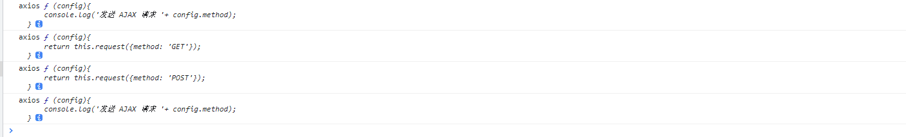

Axios的详细使用方法在https://www.axios-http.cn/

这里介绍一下Axios的使用方法，然后通过这些方法来写Axios源码
Axios可以使用在node和浏览器
> 这里以浏览器为例
默认axios都是经过安装且已经引入过的
# 初步使用
**安装**
```js
npm install axios
```
**引入**
```js
// node 
const axios = require('axios');
// 浏览器
import axios from 'axios'

```

**使用**
## get请求
```js
// 方法一
// 向给定ID的用户发起请求
axios.get('/user?ID=12345')
  .then(function (response) {
    // 处理成功情况
    console.log(response);
  })
  .catch(function (error) {
    // 处理错误情况
    console.log(error);
  })
  .then(function () {
    // 总是会执行
  });

// 上述请求也可以按以下方式完成（可选）
axios.get('/user', {
    params: {
      ID: 12345
    }
  })
  .then(function (response) {
    console.log(response);
  })
  .catch(function (error) {
    console.log(error);
  })
  .then(function () {
    // 总是会执行
  });  

// 支持async/await用法
async function getUser() {
  try {
    const response = await axios.get('/user?ID=12345');
    console.log(response);
  } catch (error) {
    console.error(error);
  }
}
// 方法二 
axios({
  method: 'GET',
  url: 'http://localhost:3000/posts/2',
}).then(response => {
    console.log(response);
});

// 方法三
axios.request({[config]})
```

## Post请求
```js
// 单个请求
axios.post('/user', {
    firstName: 'Fred',
    lastName: 'Flintstone'
  })
  .then(function (response) {
    console.log(response);
  })
  .catch(function (error) {
    console.log(error);
  });

// 多个请求
function getUserAccount() {
  return axios.get('/user/12345');
}

function getUserPermissions() {
  return axios.get('/user/12345/permissions');
}

Promise.all([getUserAccount(), getUserPermissions()])
  .then(function (results) {
    const acct = results[0];
    const perm = results[1];
  });

// 方法二
//发送 AJAX 请求
axios({
    //请求类型
    method: 'POST',
    //URL
    url: 'http://localhost:3000/posts',
    //设置请求体
    data: {
        title: "今天天气不错, 还挺风和日丽的",
        author: "张三"
    }
}).then(response => {
    console.log(response);
});
```
delete，put，的方式和上面的相似

## 请求方式
1. 通过API的方式来发起请求
其中url是必选的，config是可选的，不填则为默认，默认为什么值，可通过上面的链接查看
```js
axios.request(config)
axios.get(url[, config])
axios.delete(url[, config])
axios.head(url[, config])
axios.options(url[, config])
axios.post(url[, data[, config]])
axios.put(url[, data[, config]])
axios.patch(url[, data[, config]])
```
2. 通过实例的方式来发起请求
创建实例
```js
axios.create([config])
```
```js
const instance = axios.create({
  baseURL: 'https://some-domain.com/api/',
  timeout: 1000,
  headers: {'X-Custom-Header': 'foobar'}
});
instance.get('/getJoke').then(response => {
    console.log(response.data)
})

```
调用方法，
```js
axios#request(config)
axios#get(url[, config])
axios#delete(url[, config])
axios#head(url[, config])
axios#options(url[, config])
axios#post(url[, data[, config]])
axios#put(url[, data[, config]])
axios#patch(url[, data[, config]])
axios#getUri([config])
```
## 拦截器
### 请求拦截器
在请求被发送之前的调用
```js
// 添加请求拦截器
axios.interceptors.request.use(function (config) {
    // 在发送请求之前做些什么
    return config;
  }, function (error) {
    // 对请求错误做些什么
    return Promise.reject(error);
  });

```
如果我们添加多个请求拦截器，则请求拦截器的顺序是从下往上的
```js
// 添加请求拦截器
axios.interceptors.request.use(function (config) {
    console.log('请求拦截--------1')
    return config;
  }, function (error) {
    return Promise.reject(error);
  });
axios.interceptors.request.use(function (config) {
    console.log('请求拦截--------2')
    return config;
  }, function (error) {
    return Promise.reject(error);
  });
```
在请求时的输出顺序为：

请求拦截--------2
请求拦截--------1

### 响应拦截器
在请求被响应到，then或catch捕获前的调用
```js
// 添加响应拦截器
axios.interceptors.response.use(function (response) {
    // 2xx 范围内的状态码都会触发该函数。
    // 对响应数据做点什么
    return response;
  }, function (error) {
    // 超出 2xx 范围的状态码都会触发该函数。
    // 对响应错误做点什么
    return Promise.reject(error);
  });
```

如果添加多个响应拦截器，则响应拦截器的顺序是从上往下的

```js
axios.interceptors.response.use(function (response) {
    console.log('响应拦截--------1');
    return response.data;
}, function (error) {
    return Promise.reject(error);
});

axios.interceptors.response.use(function (response) {
    console.log('响应拦截--------2')
    return response;
}, function (error) {
    return Promise.reject(error);
});
```

请求完之后的输出顺序为
响应拦截--------1
响应拦截--------

## 取消请求响应
从 v0.22.0 开始，Axios 支持以 fetch API 方式—— AbortController 取消请求：
```js
const controller = new AbortController();
// 发起请求
axios.get('/foo/bar', {
   signal: controller.signal
}).then(function(response) {
   //...
});
// 取消请求
controller.abort()
```

# 源码开始

源码通过使用构造函数来创建一个Axios
1. 简单的调用
```js
// 创建构造方法
function Axios(config) {
// 用一个变量接收配置 
  this.config = config
}
// 创建构造方法的实例，以便调用
Axios.prototype.request = function(config) {
  // 发起AJAX请求
}

// GET和POST都最终请求request方法
Axios.prototype.get = function() {
  return this.request({method: 'GET'})
}
Axios.prototype.post = function() {
  return this.request({method: 'GET'})
}

// 这里要返回一个构造函数的实例 用来调用构造函数的方法

const instance = new Axios(config)

instance.get({})
instance.post({})
instance.request({})

// 但这样做并不满足axios的多种使用方式，比如以下的第一种和第2种


// 第1种使用方式：axios(option)
axios({
  url,
  method,
  headers,
})

// 第2种使用方式：axios(url[, option])
axios(url, {
  method,
  headers,
})
// 第3种使用方式（对于get、delete等方法）：axios[method](url[, option])

axios.get(url, {
  headers,
})
// 第4种使用方式（对于post、put等方法）：axios[method](url[, data[, option]])

axios.post(url, data, {
  headers,
})
// 第5种使用方式：axios.request(option)

axios.request({
  url,
  method,
  headers,
})

// 还包括axios的拦截器，取消请求等操作
```
通过查看源码，创建一个多种使用方式的createInstance方法，来兼容更多的API

以上代码就变更为下面的代码

```js
 function Axios(config){
      //初始化
      this.config = config;//为了创建 default 默认属性
      this.intercepters = {
          request: {},
          response: {}
      }
  }
  //原型添加相关的方法
  Axios.prototype.request = function(config){
      console.log('发送 AJAX 请求 '+ config.method);
  }
  Axios.prototype.get = function(config){
      return this.request({method: 'GET'});
  }
  Axios.prototype.post = function(config){
      return this.request({method: 'POST'});
  }

  //声明函数，返回配置好的Axios实例
  function createInstance(config){
      //实例化一个对象  我们可以context.get()  context.post()，但是不能context()这也来请求
      let context = new Axios(config);
      //创建请求函数  这样我们就可以将request作用域挂到context，他返回的是一个函数，可以进行调用，相当于调用了request  可以 instance({}) ,
      let instance = Axios.prototype.request.bind(context);

      // 我们需要一个兼容调用axios({})的，也要兼容axios.get({})的， 返回的instance此时并不能通过axios.get()来使用

      // 我们知道函数也是一个对象。所以我们可以把Axios原型上的方法放到这个instance上面，当作一个方法；


      //将 Axios.prototype 对象中的方法添加到instance函数对象中
      Object.keys(Axios.prototype).forEach(key => {
          instance[key] = Axios.prototype[key].bind(context);
      });

      // 此时instance方法，就可以兼容axios() axios.get()了

      //为 instance 函数对象添加属性 config 与 interceptors
      Object.keys(context).forEach(key => {
          instance[key] = context[key];
      });
      return instance;
  }

  let axios = createInstance();

  // 打印axios可以看到

  //发送请求
  // axios({method:'POST'});
  axios.get({});
  axios.post({});
```
```js
console.log('axios', axios);
console.log('axios', axios.get);
console.log('axios', axios.post);
console.log('axios', axios.request);
```


以上就完成了axios的基本使用，下面要做的就是调用XMLHttpRequest方法了


上面的调用，最终都指向了request方法

所以主要的处理也是在request方法中

源码里面是将不同的处理放到单独的文件里面来处理更复杂的事情，这里写到一个js文件里面，来完成一个mini版的axios

在原生使用请求时，通过XMLHttpRequest来发起请求的，axios将XMLHttpRequest更好的封装了以下，对于封装XMLHttpRequest，我们要知道以下
- 支持 Promise API
- 拦截请求和响应
- 转换请求和响应数据
- 取消请求
- 自动转换JSON数据
- 客户端支持防御XSRF

1. 是支持Promise，那我们请求完，返回的就是一个Promise了
2. 参数：我们在request里面的传参是很随意的，这里要处理传参的格式，最终将默认的配置和用户传的参数进行合并
3. 方法：方法不是必选的，所以我们不时，有默认的方法，传，则覆盖默认的方法
4. 发送请求前的拦截 （原理）
5. 接收响应时的拦截（原理）

源码将一些内容已经写的很清楚了，这里只是解释一下相关内容，这些内容就不再写在里面了

mergeConfig方法，这个方法是将用户传入的配置和默认的配置进行合并，
这里的做法是自定义了一个forEach方法，来处理合并的的参数，初始化了config，导入默认的配置，最终将默认的和自定义的合并到config里面在返回出来

我们在写方法名时，发现大写小写都可以，那是因为源代码里面最后都处理为小写

为什么在处理请求拦截器的时候，拦截顺序时从下到上，而响应顺序时从上到下的


```js
Axios.prototype.request = function(config) {

}
```
