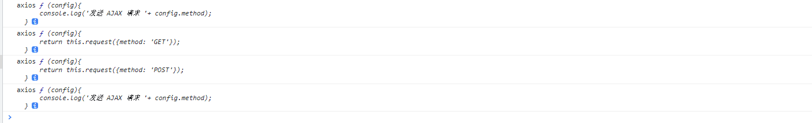

::: slot doclist
[[toc]]
:::

Axios的详细使用方法在https://www.axios-http.cn/

这里介绍一下Axios的使用方法，然后通过这些方法来写Axios源码
Axios可以使用在node和浏览器

> 这里以浏览器为例
默认axios都是经过安装且已经引入过的
# 初步使用
**安装**

```js
npm install axios
```
**引入**
```js
// node 
const axios = require('axios');
// 浏览器
import axios from 'axios'

```

**使用**
## get请求
```js
// 方法一
// 向给定ID的用户发起请求
axios.get('/user?ID=12345')
  .then(function (response) {
    // 处理成功情况
    console.log(response);
  })
  .catch(function (error) {
    // 处理错误情况
    console.log(error);
  })
  .then(function () {
    // 总是会执行
  });

// 上述请求也可以按以下方式完成（可选）
axios.get('/user', {
    params: {
      ID: 12345
    }
  })
  .then(function (response) {
    console.log(response);
  })
  .catch(function (error) {
    console.log(error);
  })
  .then(function () {
    // 总是会执行
  });  

// 支持async/await用法
async function getUser() {
  try {
    const response = await axios.get('/user?ID=12345');
    console.log(response);
  } catch (error) {
    console.error(error);
  }
}
// 方法二 
axios({
  method: 'GET',
  url: 'http://localhost:3000/posts/2',
}).then(response => {
    console.log(response);
});

// 方法三
axios.request({[config]})
```

## Post请求
```js
// 单个请求
axios.post('/user', {
    firstName: 'Fred',
    lastName: 'Flintstone'
  })
  .then(function (response) {
    console.log(response);
  })
  .catch(function (error) {
    console.log(error);
  });

// 多个请求
function getUserAccount() {
  return axios.get('/user/12345');
}

function getUserPermissions() {
  return axios.get('/user/12345/permissions');
}

Promise.all([getUserAccount(), getUserPermissions()])
  .then(function (results) {
    const acct = results[0];
    const perm = results[1];
  });

// 方法二
//发送 AJAX 请求
axios({
    //请求类型
    method: 'POST',
    //URL
    url: 'http://localhost:3000/posts',
    //设置请求体
    data: {
        title: "今天天气不错, 还挺风和日丽的",
        author: "张三"
    }
}).then(response => {
    console.log(response);
});
```
delete，put的方式和上面的相似

## 请求方式
1. 通过API的方式来发起请求
其中url是必选的，config是可选的，不填则为默认，默认为什么值，可通过上面的链接查看
```js
axios(config): 通用/最本质的发任意类型请求的方式
axios(url[, config]): 可以只指定url发get请求
axios.request(config)
axios.get(url[, config])
axios.delete(url[, config])
axios.head(url[, config])
axios.options(url[, config])
axios.post(url[, data[, config]])
axios.put(url[, data[, config]])
axios.patch(url[, data[, config]])

axios.defaults.xxx: 请求的默认全局配置
axios.interceptors.request.use(): 添加请求拦截器
axios.interceptors.response.use(): 添加响应拦截器
```
2. 通过实例的方式来发起请求
创建实例
```js
axios.create([config])
```
```js
const instance = axios.create({
  baseURL: 'https://some-domain.com/api/',
  timeout: 1000,
  headers: {'X-Custom-Header': 'foobar'}
});
instance.get('/getJoke').then(response => {
    console.log(response.data)
})

```
调用方法，
```js
axios#request(config)
axios#get(url[, config])
axios#delete(url[, config])
axios#head(url[, config])
axios#options(url[, config])
axios#post(url[, data[, config]])
axios#put(url[, data[, config]])
axios#patch(url[, data[, config]])
axios#getUri([config])

axios#all(promises) 用于批量执行多个异步请求
axios#spread() 用来指定接收所有成功数据的回调函数的方法
```


## 拦截器

调用axios()并不是立即发送ajax请求, 而是需要经历一个较长的流程

### 请求拦截器
在请求被发送之前的调用
```js
// 添加请求拦截器
axios.interceptors.request.use(function (config) {
    // 在发送请求之前做些什么
    return config;
  }, function (error) {
    // 对请求错误做些什么
    return Promise.reject(error);
  });

```
如果我们添加多个请求拦截器，则请求拦截器的顺序是从下往上的
```js
// 添加请求拦截器
axios.interceptors.request.use(function (config) {
    console.log('请求拦截--------1')
    return config;
  }, function (error) {
    return Promise.reject(error);
  });
axios.interceptors.request.use(function (config) {
    console.log('请求拦截--------2')
    return config;
  }, function (error) {
    return Promise.reject(error);
  });
```
在请求时的输出顺序为：

请求拦截--------2
请求拦截--------1


### 响应拦截器
在请求被响应到，then或catch捕获前的调用
```js
// 添加响应拦截器
axios.interceptors.response.use(function (response) {
    // 2xx 范围内的状态码都会触发该函数。
    // 对响应数据做点什么
    return response;
  }, function (error) {
    // 超出 2xx 范围的状态码都会触发该函数。
    // 对响应错误做点什么
    return Promise.reject(error);
  });
```

如果添加多个响应拦截器，则响应拦截器的顺序是从上往下的

```js
axios.interceptors.response.use(function (response) {
    console.log('响应拦截--------1');
    return response.data;
}, function (error) {
    return Promise.reject(error);
});

axios.interceptors.response.use(function (response) {
    console.log('响应拦截--------2')
    return response;
}, function (error) {
    return Promise.reject(error);
});
```

请求完之后的输出顺序为
响应拦截--------1
响应拦截--------2

**总结**

请求拦截器2 => 请求拦截器1 => 发ajax请求 => 响应拦截器1 => 响应拦截器2 => 请求的回调

此流程是通过promise串连起来的, 请求拦截器传递的是config, 响应拦截器传递的是response错误流程控制与错误处理

## 取消请求响应
从 v0.22.0 开始，Axios 支持以 fetch API 方式—— AbortController 取消请求：
```js
const controller = new AbortController();
// 发起请求
axios.get('/foo/bar', {
   signal: controller.signal
}).then(function(response) {
   //...
});
// 取消请求
controller.abort()
```


# 源码开始

源码通过使用构造函数来创建一个Axios
1. 简单的调用
```js
// 创建构造方法
function Axios(config) {
// 用一个变量接收配置 
  this.config = config
}
// 创建构造方法的实例，以便调用
Axios.prototype.request = function(config) {
  // 发起AJAX请求
}

// GET和POST都最终请求request方法
Axios.prototype.get = function() {
  return this.request({method: 'GET'})
}
Axios.prototype.post = function() {
  return this.request({method: 'GET'})
}

// 这里要返回一个构造函数的实例 用来调用构造函数的方法

const instance = new Axios(config)

instance.get({})
instance.post({})
instance.request({})

// 但这样做并不满足axios的多种使用方式，比如以下的第一种和第2种


// 第1种使用方式：axios(option)
axios({
  url,
  method,
  headers,
})

// 第2种使用方式：axios(url[, option])
axios(url, {
  method,
  headers,
})
// 第3种使用方式（对于get、delete等方法）：axios[method](url[, option])

axios.get(url, {
  headers,
})
// 第4种使用方式（对于post、put等方法）：axios[method](url[, data[, option]])

axios.post(url, data, {
  headers,
})
// 第5种使用方式：axios.request(option)

axios.request({
  url,
  method,
  headers,
})

// 还包括axios的拦截器，取消请求等操作
```
通过查看源码，创建一个多种使用方式的createInstance方法，来兼容更多的API

以上代码就变更为下面的代码

```js
 function Axios(config){
      //初始化
      this.config = config;//为了创建 default 默认属性
      this.intercepters = {
          request: {},
          response: {}
      }
  }
  //原型添加相关的方法
  Axios.prototype.request = function(config){
      console.log('发送 AJAX 请求 '+ config.method);
  }
  Axios.prototype.get = function(config){
      return this.request({method: 'GET'});
  }
  Axios.prototype.post = function(config){
      return this.request({method: 'POST'});
  }

  //声明函数，返回配置好的Axios实例
  function createInstance(config){
      //实例化一个对象  我们可以context.get()  context.post()，但是不能context()这也来请求
      let context = new Axios(config);
      //创建请求函数  这样我们就可以将request作用域挂到context，他返回的是一个函数，可以进行调用，相当于调用了request  可以 instance({}) ,
      let instance = Axios.prototype.request.bind(context);

      // 我们需要一个兼容调用axios({})的，也要兼容axios.get({})的， 返回的instance此时并不能通过axios.get()来使用

      // 我们知道函数也是一个对象。所以我们可以把Axios原型上的方法放到这个instance上面，当作一个方法；

      //将 Axios.prototype 对象中的方法添加到instance函数对象中
      Object.keys(Axios.prototype).forEach(key => {
          instance[key] = Axios.prototype[key].bind(context);
      });

      // 此时instance方法，就可以兼容axios() axios.get()了

      //为 instance 函数对象添加属性 config 与 interceptors
      Object.keys(context).forEach(key => {
          instance[key] = context[key];
      });
      return instance;
  }

  let axios = createInstance();

  // 打印axios可以看到

  //发送请求
  // axios({method:'POST'});
  axios.get({});
  axios.post({});
```
```js
console.log('axios', axios);
console.log('axios', axios.get);
console.log('axios', axios.post);
console.log('axios', axios.request);
```


以上就完成了axios的基本使用，下面要做的就是调用XMLHttpRequest方法了


上面的调用，最终都指向了request方法

所以主要的处理也是在request方法中

源码里面是将不同的处理放到单独的文件里面来处理更复杂的事情，这里写到一个js文件里面，来完成一个mini版的axios

在原生使用请求时，通过XMLHttpRequest来发起请求的，axios将XMLHttpRequest更好的封装了以下，对于封装XMLHttpRequest，我们要知道以下
- 支持 Promise API
- 拦截请求和响应
- 转换请求和响应数据
- 取消请求
- 自动转换JSON数据
- 客户端支持防御XSRF

1. 是支持Promise，那我们请求完，返回的就是一个Promise了
2. 参数：我们在request里面的传参是很随意的，这里要处理传参的格式，最终将默认的配置和用户传的参数进行合并
3. 方法：方法不是必选的，所以我们不时，有默认的方法，传，则覆盖默认的方法
4. 发送请求前的拦截 （原理）
5. 接收响应时的拦截（原理）

源码将一些内容已经写的很清楚了，这里只是解释一下相关内容，这些内容就不再写在里面了

mergeConfig方法，这个方法是将用户传入的配置和默认的配置进行合并，这里的做法是自定义了一个forEach方法，来处理合并的的参数，初始化了config，导入默认的配置，最终将默认的和自定义的合并到config里面在返回出来

我们在写方法名时，发现大写小写都可以，那是因为源代码里面最后都处理为小写
```js
  if (config.method) {
      config.method = config.method.toLowerCase();
  } else if (this.defaults.method) {
      config.method = this.defaults.method.toLowerCase();
  } else {
      config.method = 'get';
  }
```

请求拦截是怎么实现的

在源码里面，

为什么在处理请求拦截器的时候，拦截顺序时从下到上，而响应顺序时从上到下的


```js
// Hook up interceptors middleware
  // 创建拦截器中间件  第一个参数用来发送请求, 第二个为 undefined 用来补位
  var chain = [dispatchRequest, undefined];
  // 创建一个成功的 promise 且成功的值为合并后的请求配置
  var promise = Promise.resolve(config);//  promise 成功的Promise
  // 遍历实例对象的请求拦截器,
  this.interceptors.request.forEach(function unshiftRequestInterceptors (interceptor) {
      //将请求拦截器压入数组的最前面
      chain.unshift(interceptor.fulfilled, interceptor.rejected);
  });

  this.interceptors.response.forEach(function pushResponseInterceptors (interceptor) {
      //将相应拦截器压入数组的最尾部
      chain.push(interceptor.fulfilled, interceptor.rejected);
  });

  //如果链条长度不为 0
  while (chain.length) {
      //依次取出 chain 的回调函数, 并执行
      
      promise = promise.then(chain.shift(), chain.shift());
  }
```
可以看到，请求拦截器在执行前就被执行过了。响应拦截器在请求之后才被执行

下面自己实现一下
```js
Axios.prototype.request = function(config) {
  //1. 发送请求
  //创建一个 promise 对象
  let promise = Promise.resolve(config);
  //声明一个数组
  let chains = [dispatchRequest, undefined];// undefined 占位
  //调用 then 方法指定回调
  let result = promise.then(chains[0], chains[1]);
  //返回 promise 的结果
  return result;
}

```

dispatchRequest是我们发送请求的方法，
```js
//2. dispatchRequest 函数
function dispatchRequest(config){
    //调用适配器发送请求
    return xhrAdapter(config).then(response => {
        //响应的结果进行转换处理
        //....
        return response;
    }, error => {
        throw error;
    });
}

```

xhrAdapter方法是真正调用去请求的方法
```js
//3. adapter 适配器
function xhrAdapter(config){
    console.log('xhrAdapter 函数执行');
    return new Promise((resolve, reject) => {
        //发送 AJAX 请求
        let xhr = new XMLHttpRequest();
        //初始化
        xhr.open(config.method, config.url);
        //发送
        xhr.send();
        //绑定事件
        xhr.onreadystatechange = function(){
            if(xhr.readyState === 4){
                //判断成功的条件
                if(xhr.status >= 200 && xhr.status < 300){
                    //成功的状态
                    resolve({
                        //配置对象
                        config: config,
                        //响应体
                        data: xhr.response,
                        //响应头
                        headers: xhr.getAllResponseHeaders(), //字符串  parseHeaders
                        // xhr 请求对象
                        request: xhr,
                        //响应状态码
                        status: xhr.status,
                        //响应状态字符串
                        statusText: xhr.statusText
                    });
                }else{
                    //失败的状态
                    reject(new Error('请求失败 失败的状态码为' + xhr.status));
                }
            }
        }
    });
}
```
上面的代码就是真正的创建了一个axios的请求

## 拦截器

对于拦截器，Axios源码中使用一个InterceptorManager的构造函数来管理拦截器，这个构造函数原型上有3个方法：use、eject、forEach。
我们使用的use是来添加拦截器的规则，每次添加的是成功和失败

在Axios中定义拦截器

```js
function Axios(config){
    this.config = config;
    this.interceptors = {
        request: new InterceptorManager(),
        response: new InterceptorManager(),
    }
}
```
在request执行的时候添加拦截器
```js
Axios.prototype.request = function(config){
  //创建一个 promise 对象
  let promise = Promise.resolve(config);
  const chains = [dispatchRequest, undefined];
  //请求拦截器 将请求拦截器的回调 压入到 chains 的前面  request.handles = []
  this.interceptors.request.handlers.forEach(item => {
      chains.unshift(item.fulfilled, item.rejected);
  });
  //响应拦截器
  this.interceptors.response.handlers.forEach(item => {
      chains.push(item.fulfilled, item.rejected);
  });

  // 添加了拦截器后的chain数组：
  // [
  //   requestFulfilledFn, requestRejectedFn, ..., 
  //   dispatchRequest, undefined,
  //   responseFulfilledFn, responseRejectedFn, ....,
  // ]

  //遍历
  while(chains.length > 0){
    // 从chain数组里按序取出两项，并分别作为promise.then方法的第一个和第二个参数
      promise = promise.then(chains.shift(), chains.shift());
  }
}

 //拦截器管理器构造函数
function InterceptorManager(){
    this.handlers = [];
}
InterceptorManager.prototype.use = function(fulfilled, rejected){
    this.handlers.push({
        fulfilled,
        rejected
    })
}

// 最后将拦截器interceptors添加到axios函数对象身上
let context = new Axios({});
//创建axios函数
let axios = Axios.prototype.request.bind(context);
//将 context 属性 config interceptors 添加至 axios 函数对象身上
Object.keys(context).forEach(key => {
    axios[key] = context[key];
});
```

## 取消请求
取消功能的核心是通过CancelToken内的this.promise = new Promise(resolve => resolvePromise = resolve)，得到实例属性promise，此时该promise的状态为pending
通过这个属性，在/lib/adapters/xhr.js文件中继续给这个promise实例添加.then方法
在这个方法里面在去钓鱼abort方法来取消请求


在CancelToken外界，通过executor参数拿到对cancel方法的控制权，
这样当执行cancel方法时就可以改变实例的promise属性的状态为rejected，
从而执行request.abort()方法达到取消请求的目的。
```js
 //xhrAdapter
function xhrAdapter(config){
    //发送 AJAX 请求
    return new Promise((resolve, reject) => {
        //实例化对象
        const xhr = new XMLHttpRequest();
        //初始化
        xhr.open(config.method, config.url);
        //发送
        xhr.send();
        //处理结果
        xhr.onreadystatechange = function(){
            if(xhr.readyState === 4){
                //判断结果
                if(xhr.status >= 200 && xhr.status < 300){
                    //设置为成功的状态
                    resolve({
                        status: xhr.status,
                        statusText: xhr.statusText
                    });
                }else{
                    reject(new Error('请求失败'));
                }
            }
        }
        //取消请求的处理
        if(config.cancelToken){
            //对 cancelToken 对象身上的 promise 对象指定成功的回调
            config.cancelToken.promise.then(value => {
                xhr.abort();
                //将整体结果设置为失败
                reject(new Error('请求已经被取消'))
            });
        }
    })
}

//CancelToken 构造函数
function CancelToken(executor){
    //声明一个变量
    var resolvePromise;
    //为实例对象添加属性
    this.promise = new Promise((resolve) => {
        //将 resolve 赋值给 resolvePromise
        resolvePromise = resolve
    });
    //调用 executor 函数
    executor(function(){
        //执行 resolvePromise 函数
        resolvePromise();
    });
}

//声明全局变量
let cancel = null;

```

在发起请求的时候，我们要将cacelToken传给axios，
```js
// 全局定义一个cancel标志位
requestMethod() {
  //检测上一次的请求是否已经完成
  if(cancel !== null){
      //取消上一次的请求
      cancel();
  }

  //创建 cancelToken 的值
  let cancelToken = new CancelToken(function(c){
      cancel = c;
  });

  axios({
      method: 'GET',
      url: 'http://localhost:3000/posts',
      cancelToken: cancelToken
  }).then(response => {
      console.log(response);
      //将 cancel 的值初始化
      cancel = null;
  })
}

// 当我们取消请求的时候
// 直接调用cancel方法即可

cancel()
```

以上就是大概的说明了axios的多种请求方式的创建，拦截器的实现，取消请求的实现

里面还有很多内容需要写，等后面在写

## 总结

### 1. axios为什么能有多种发请求的方法?

    axios函数对应的是Axios.prototype.request方法通过bind(Axiox的实例)产生的函数
    axios有Axios原型上的所有发特定类型请求的方法: get()/post()/put()/delete()
    axios有Axios的实例上的所有属性: defaults/interceptors
    后面又添加了create()/CancelToken()/all()

### 2. axios.create()返回的对象与axios的区别?

    相同: 
        都是一个能发任意请求的函数: request(config)
        都有发特定请求的各种方法: get()/post()/put()/delete()
        都有默认配置和拦截器的属性: defaults/interceptors
    不同:
        默认匹配的值很可能不一样
        instance没有axios后面添加的一引起方法: create()/CancelToken()/all()

### 3. axios运行的整体流程

```
  1). 整体流程: request(config)  ===> dispatchRequest(config) ===> xhrAdapter(config)
  2). request(config): 将请求拦截器 / dispatchRequest() / 响应拦截器 通过promise链串连起来, 返回promise
  3). dispatchRequest(config): 转换请求数据 ===> 调用xhrAdapter()发请求 ===> 请求返回后转换响应数据. 返回promise
  4). xhrAdapter(config): 创建XHR对象, 根据config进行相应设置, 发送特定请求, 并接收响应数据, 返回promise 
```


### 4. Axios.prototype.request()都做了什么?

### 5. dispatchrequest()都做了什么?

### 6. xhrAdapter()做了什么?

    整体流程: request(config)  ===> dispatchRequest(config) ===> xhrAdapter(config)
    request(config): 将请求拦截器 / dispatchRequest() / 响应拦截器 通过promise链串连起来, 返回promise
    dispatchRequest(config): 转换请求数据 ===> 调用xhrAdapter()发请求 ===> 请求返回后转换响应数据. 返回promise
    xhrAdapter(config): 创建XHR对象, 根据config进行相应设置, 发送特定请求, 并接收响应数据, 返回promise 

### 7. axios的请求/响应拦截器是什么?

    请求拦截器: 在真正发请求前, 可以对请求进行检查或配置进行特定处理的函数, 包括成功/失败的函数, 传递的必须是config
    响应拦截器: 在请求返回后, 可以对响应数据进行特定处理的函数, 包括成功/失败的函数, 传递的默认是response

### 8. axios的请求/响应数据转换器是什么?

    请求转换器: 对请求头和请求体数据进行特定处理的函数
        setContentTypeIfUnset(headers, 'application/json;charset=utf-8');
        return JSON.stringify(data)
    响应转换器: 将响应体json字符串解析为js对象或数组的函数
        response.data = JSON.parse(response.data)

### 9. response的整体结构

    {
        data,
        status,
        statusText,
        headers,
        config,
        request
    }

### 10. error的整体结构

    {
        message,
        request,
        response
    }

### 11. 如何取消已经发送的请求?


