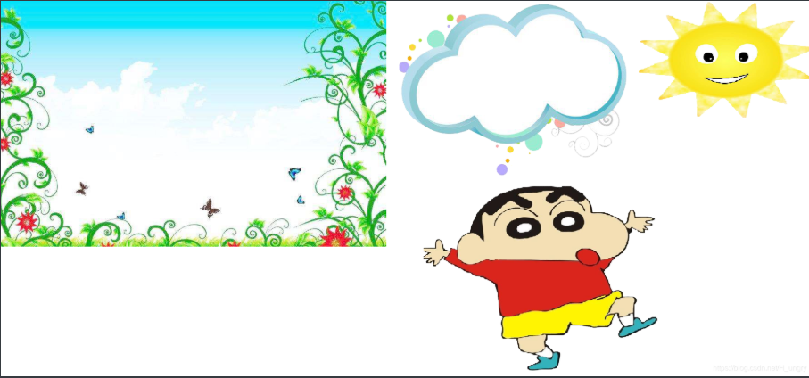

## 基本介绍

实际上，`<canvas> `标签只有两个样式属性 —— `width`和`height`。这些都是可选的，并且同样利用 `DOM properties` 来设置。当没有设置宽度和高度的时候，`canvas`会初始化宽度为300像素和高度为150像素。该元素可以使用CSS来定义大小，但在绘制时图像会伸缩以适应它的框架尺寸：如果CSS的尺寸与初始画布的比例不一致，它会出现扭曲。

```javascript
<canvas id="canvas" width="300" height="300"></canvas>
```

**注意:** 如果你绘制出来的图像是扭曲的, 尝试用`width`和`height`属性为<canvas>明确规定宽高，而不是使用CSS
**当开始时没有为canvas规定样式规则，其将会完全透明。**
`<canvas> `元素有一个叫做` getContext() `的方法，这个方法是用来获得渲染上下文和它的绘画功能。getContext()只有一个参数，上下文的格式。

开始的时候需要判断某些浏览器是否支持该方法

```javascript
var canvas = document.getElementById('canvas ');

if (canvas.getContext){
  var ctx = canvas.getContext('2d');
  // drawing code here
} else {
  // canvas-unsupported code here
}
```
在我们开始画图之前，我们需要了解一下画布栅格（canvas grid）以及坐标空间。HTML模板中有个宽150px, 高150px的`canvas`元素。`canvas`元素默认被网格所覆盖。

通常来说网格中的一个单元相当于canvas元素中的一像素。栅格的起点为左上角（坐标为（0,0））。所有在canvas上绘制的元素都相对于坐标原点的。

图形的基本元素是路径。路径是通过不同颜色和宽度的线段或曲线相连形成的不同形状的点的集合。一个路径，甚至一个子路径，都是闭合的。使用路径绘制图形需要一些额外的步骤。

 - 首先，你需要创建路径起始点。
 - 然后你使用画图命令去画出路径。
 - 之后你把路径封闭。
 - 一旦路径生成，你就能通过描边或填充路径区域来渲染图形。

### 基本绘制

**描边或填充：**
1、描边：

```javascript
//定义描边的颜色
ctx.strokeStyle = 'red'  //支持rgb()、十六进制
//指定描边的粗细  
ctx.lineWidth = 2 ;
//执行绘制 
ctx.stroke()
```

2、填充

```javascript
//定义填充颜色
ctx.fillStyle = 'blue'     //支持rgb()、十六进制
//执行绘制  
ctx.fill()
```

绘制图形的基本函数：
 - `beginPath()`  新建一条路径，和之前的路径没关系，图形绘制命令被指向到路径上生成路径。（绘制路径之前有必要这样写）
 - `closePath()`闭合路径之后图形绘制命令又重新指向到上下文中。
 - `stroke()`通过线条来绘制图形轮廓。
 - `fill()`通过填充路径的内容区域生成实心的图形。

#### moveTo(x, y)

一个非常有用的函数，而这个函数实际上并不能画出任何东西，也是上面所描述的路径列表的一部分，这里可以理解为我们写字，笔触到达纸上的那一个点。

#### lineTo(x,y)

用来绘制直线的方法，有两个参数，`x`以及`y `，代表坐标系中直线结束的点。开始点和之前的绘制路径有关，之前路径的结束点就是接下来的开始点，和`moveTo(x, y)`搭配使用。

当`canvas`初始化或者`beginPath()`调用后，通常会使用`moveTo()`函数设置起点。

```html
<!--- 绘制固定宽高的画布--->
<canvas id="c1" width="300" height="200" ></canvas>
```
```css
body{text-align:center;}
canvas{border: 1px solid #000;}
```
```javascript
// 取到canvas画布元素
let canvas = document.getElementById('c1');
// 取到canvas的上下文，在这个上下文上可以调用Canvas的API
let gd = canvas.getContext('2d');

gd.beginPath();//开始一条新的绘制


// 填充三角形
gd.moveTo(25, 25);  // 设置起点
gd.lineTo(105, 25); // 设置第二个点
gd.lineTo(25, 105); // 设置第三个点
gd.fillStyle = 'red';//	设置填充颜色，不写则默认黑色
gd.fill(); //  填充


// 描边三角形
gd.beginPath();
gd.moveTo(125, 125);
gd.lineTo(125, 45);
gd.lineTo(45, 125);
gd.closePath();
gd.stroke();

```
填充时不需要使用`closePath()`, 不需要闭合，描边时根据需要进行使用。

 

#### beginPath()

#### closePath()

#### bezierCurveTo()

#### quadraticCurveTo()

#### rect()

```javascript
rect(x, y, width, height)
```
- `x：` 矩形右上角横轴上距离原点的距离
- `y:`  矩形右上角纵轴上距离原点的距离

绘制一个矩形

```javascript
// 开始一条新路径
gd.beginPath();
gd.rect(10,10,50,50)
gd.strokeStyle = "red";//描边颜色
gd.storkeWidth = 8;
gd.stroke();

// 开始一条新路径
gd.beginPath();
gd.rect(60,60,80,80)
gd.fill();//默认为黑色
```
 

快速绘制矩形的方法：

```javascript
// 描边矩形
gd.strokeStyle = 'green';
gd.strokeRect( 10, 10, 300, 100 );

// 填充矩形
gd.fillStyle = 'red';
gd.fillRect( 200, 300, 200, 80 );
```

是先描边还是先填充，不同顺序不同的结果；

1. 先描边 ，在填充，填充的会截取描边宽度的一半

```javascript
// 绘制矩形描边 红色
gd.beginPath();
gd.rect(10,10,50,50)
gd.strokeStyle = 'red';
gd.lineWidth = 8;
gd.stroke();
// 绘制填充的蓝色
gd.fillStyle = 'blue';
gd.fill();
```
 

2. 先填充，在描边，描边的会覆盖填充的部分，覆盖描边的宽度

```javascript

gd.beginPath();
gd.rect(10,10,50,50)
//先填充  在描边
gd.fillStyle = 'blue';
gd.fill();


gd.strokeStyle = 'red';
gd.lineWidth = 8;
gd.stroke();

```
 

 **清除指定矩形区域，让清除部分完全透明。**

#### clearRect()

```javascript
clearRect(x, y, width, height)
```

综合练习：

```html
<canvas id="c1" width="900" height="500" ></canvas>
```
```javascript
// 取到canvas画布元素
let canvas = document.getElementById('c1');
// 取到canvas画布上的画笔
let gd = canvas.getContext('2d');
gd.beginPath(); // 开启一个新的路径，使接下来的路径和原来的路径没有任何关系
gd.rect( 10, 10, 50, 50 );
gd.strokeStyle = 'red';
gd.lineWidth = 10;
gd.stroke();

gd.beginPath(); // 开启一个新的路径，使接下来的路径和原来的路径没有任何关系
gd.moveTo( 100, 100 );
gd.lineTo( 200, 30 );
gd.lineWidth = 4;
gd.strokeStyle = 'green';
gd.stroke();
```
 

**绘制圆弧：**

#### arc()

```javascript
arc(x, y, radius, startAngle, endAngle, anticlockwise)
```

- `x:` 圆弧的圆心，距离X轴的横坐标
- `y:`圆弧的圆心，距离Y轴的横坐标
- `radius:` 圆弧的半径
- `startAngle:` 圆弧的起始弧度
- `endAngle:` 圆弧的中止弧度
- `anticlockwise: ` 沿顺时针还是逆时针  `true`为逆时针，`false`为顺时针

画一个以（x,y）为圆心的以`radius`为半径的圆弧（圆），从`startAngle`开始到`endAngle`结束，按照`anticlockwise`给定的方向（默认为顺时针）来生成。

`arc()`函数中表示角的单位是弧度，不是角度。角度与弧度的`js`表达式:`弧度=(Math.PI/180)*角度。`

```javascript
draw()
		// 取到canvas画布元素
function draw() {
  var canvas = document.getElementById('c1');
  if (canvas.getContext){
    var ctx = canvas.getContext('2d');

    for(var i = 0; i < 4; i++){
      for(var j = 0; j < 3; j++){
        ctx.beginPath();
        var x = 25 + j * 50; // x 坐标值
        var y = 25 + i * 50; // y 坐标值
        var radius = 20; // 圆弧半径
        var startAngle = 0; // 开始点
        var endAngle = Math.PI + (Math.PI * j) / 2; // 结束点
        var anticlockwise = i % 2 == 0 ? false : true; // 顺时针或逆时针

        ctx.arc(x, y, radius, startAngle, endAngle, anticlockwise);

        if (i>1){
          ctx.fill();
        } else {
          ctx.stroke();
        }
      }
    }
  }
}
```
 

辅助函数

```javascript
// 角度转弧度
function a2r(ang){
	return Math.PI / 180 * ang;
}

// 弧度转角度
function r2a(rad){
	return 180 / Math.PI * rad;
}
```

#### arcTo()

#### ellipse()

#### shadowBlur

#### shadowColor

#### shadowOffsetX()

#### createConicGradient()

#### createImageData()

#### createLinearGradient()

其他绘制属性

#### lineCap(x)

x参数可以是` butt 、round 、 square`

```javascript
gd.lineCap = 'butt';
```
 
```javascript
gd.lineCap = 'round';
```
 
```javascript
gd.lineCap = 'square';
```
 

`gd.lineJoin()`的参数值有` miter、bevel、round`

```javascript
gd.beginPath();
gd.moveTo( 20, 20 );
gd.lineTo( 300, 100 );
gd.lineTo( 30, 200 );
gd.strokeStyle = 'red';
gd.lineJoin = 'miter'; // bevel round
gd.lineWidth = 20;
gd.stroke();
```
 

**保存与恢复：**

#### save()和restore()

`save()`保存画布(canvas)的所有状态
`restore()`恢复画布保存之前的状态
`save` 和 `restore `方法是用来保存和恢复 canvas 状态的，都没有参数。Canvas 的状态就是当前画面应用的所有样式和变形的一个快照。

简单理解就是，执行`save()`方法之后，会将`save()`之前的状态保存到栈里面，`restore()`一次，会根据最后面`save()`的先恢复其状态，栈的就是：后进先出。

你可以调用任意多次 save方法。每一次调用 restore 方法，上一个保存的状态就从栈中弹出，所有设定都恢复。

```javascript
draw()
function draw() {
  var ctx = document.getElementById('c1').getContext('2d');

  ctx.fillRect(0,0,150,150);   // 使用默认设置绘制一个矩形
  ctx.save();                  // 保存默认状态

  ctx.fillStyle = 'red'        // 在原有配置基础上对颜色做改变
  ctx.fillRect(15,15,120,120); // 使用新的设置绘制一个矩形
  ctx.save();   			   // 保存当前状态
	               
  ctx.fillStyle = 'blue'       // 再次改变颜色配置
  // ctx.globalAlpha = 0.5;
  ctx.fillRect(30,30,90,90);   // 使用新的配置绘制一个矩形

  ctx.restore();               // 重新加载之前的颜色状态
  ctx.fillRect(45,45,60,60);   // 使用上一次的配置绘制一个矩形

  ctx.restore();               // 加载默认颜色配置
  ctx.fillRect(60,60,30,30);   // 使用加载的配置绘制一个矩形

}
```
 

```javascript
gd.save();//保存当前画布的坐标系，经过保存后，后面的都是基于保存后操作的坐标系，直到遇到gd.restore()
gd.fillRect()//恢复上一次保存的画布坐标系,save()之前的画布坐标系
```

实例：

```javascript
gd.fillStyle = 'red';
gd.strokeStyle = 'black';
gd.lineWidth = 12;


gd.save(); // 箱子里面存了红色的画笔(fill)，黄色的画笔(stroke)

gd.rotate(Math.PI / 4);

gd.beginPath();
gd.fillStyle = 'green';
gd.strokeStyle = 'orange';
gd.lineWidth = 30;
gd.rect( 0, 0, 100, 100 );
gd.fill();
gd.stroke();

gd.restore(); // 从箱子里面把上边save()的红色的画笔(fill)，黄色的画笔(stroke)给取出来
gd.beginPath();
// gd.fillStyle = 'olive';
gd.rect(100, 100, 100, 100);
gd.fill();
gd.stroke();

```

绘制后的结果：

 

#### globalAlpha

`globalAlpha`的使用

 `lineWidth`, `strokeStyle`,` fillStyle` 只能当前路径上有效，`globalAlpha `能对它以后的所有路径都会产生效果

```javascript
gd.beginPath();
gd.rect( 10, 10, 300, 100 );
gd.fillStyle = 'blue';
gd.lineWidth = 8;
gd.strokeStyle = 'green';
gd.globalAlpha = 0.1;
gd.fill();;
gd.stroke();

gd.beginPath();
gd.arc( 500, 300, 100, 0, Math.PI * 2 );
gd.fillStyle = 'red';
gd.globalAlpha = 1;
gd.fill();
```

 

### 变形

####  移动：Translate
`translate `方法，它用来移动 canvas 和它的原点到一个不同的位置。
`translate(x, y)`

- `x: `x 是左右偏移量
- `y:`y 是上下偏移量

 

在每次做变形之前，应保存之前的状态

例如：绘制9个方块

```javascript
function draw() {
  var ctx = document.getElementById('c1').getContext('2d');
  for (var i = 0; i < 3; i++) {
    for (var j = 0; j < 3; j++) {
      ctx.save();//变形前进行保存状态
      ctx.fillStyle = 'rgb(' + (51 * i) + ', ' + (255 - 51 * i) + ', 255)';
      ctx.translate(10 + j * 50, 10 + i * 50); // 通过移动原点坐标来进行绘制
      ctx.fillRect(0, 0, 25, 25);  
      ctx.restore();//恢复状态
    }
  }
}
```
#### 旋转：Rotate
旋转是以原点为中心进行旋转的，

`gd.rotate(deg)`只接收一个参数，旋转角度，是顺时针方向的，以弧度为单位；如果改变旋转的位置，可以搭配
`translate`使用

例子：画一个圆环图

```javascript
function draw() {
  var ctx = document.getElementById('c1').getContext('2d');
  ctx.translate(75,75);
 	for (var i = 0; i < 6; i++) {
 		ctx.save()//绘制变形前保存之前的状态
 		ctx.fillStyle = 'rgb('+(51 * i)+','+(255-51*i)+',255)'//通过循环改变圆的填充色
 		for (var j = 0; j < 6 * 6; j++) {
 			ctx.rotate(Math.PI*2/(i*6))//
 			console.log(2/(i*6));
 			ctx.beginPath()//绘制不同的圆之前新建一个路径
	 		ctx.arc(0,i*12.5,5,0,Math.PI*2,true)//圆心坐标x为原点，通过改变y轴上的坐标绘制不同位置的圆
	 		ctx.fill();
 		}
 		ctx.restore();
 	}

}
```
#### 缩放：Scale

用来增减图形在canvas中的像素数目，对形状，位图进行缩小或者放大
`scale(x, y)`可以缩放画布的水平和垂直的单位。两个参数都是实数，可以为负数，x 为水平缩放因子，y 为垂直缩放因子，如果比1小，会缩小图形， 如果比1大会放大图形。默认值为1， 为实际大小。

默认情况，canvas的1个单位为1像素，如果缩放因子为0.5，1个单位就变成对应的0.5个像素，这样绘制出来的形状就是原先的一半，如果设置为2时，1个单位就对应变成了2像素，绘制结果就是图形放大了两倍

画布初始情况下， 是以左上角坐标为原点的第一象限。如果参数为负实数， 相当于以x 或 y轴作为对称轴镜像反转（例如， 使用translate(0,canvas.height); scale(1,-1); 以y轴作为对称轴镜像反转， 就可得到著名的笛卡尔坐标系，左下角为原点）。
```javascript
function draw() {
  var ctx = document.getElementById('c1').getContext('2d');
  ctx.save();
  ctx.fillRect(1, 10, 10, 10);
  ctx.restore();
  ctx.font = '48px serif';//字体设置
  ctx.fillText('H_ungery', 100, 120);// ctx.fillText(text,x,y) 在(x, y)位置填充文本的方法
}
```
 

缩放后：

```javascript
function draw() {
  var ctx = document.getElementById('c1').getContext('2d');
  ctx.save();
  ctx.scale(10, 3);
  ctx.fillRect(1, 10, 10, 10);
  ctx.restore();

  ctx.scale(-1, 1);
  ctx.font = '48px serif';//字体设置
  ctx.fillText('H_ungery', -200, 120);// ctx.fillText(text,x,y) 在(x, y)位置填充文本的方法
}

```
 

###  canvas动画

绘制动画有一套基本的步骤

 1. 清空`canvas`（在接下来要画的内容不填充整个canvas的话，就必须清空整个画布，一般使用`clearRect`方法）
 2. 保存`canvas`状态（如果要改变`canvas`状态的设置（样式，变形等），接下来的绘画需要原始状态的话，应该需要保存）
 3. 绘制动画图形（重绘动画帧）
 4. 恢复`canvas`状态（如果已经保存，就需要恢复，进行下一帧的绘画）

为了实现动画，我们需要一些可以定时执行重绘的方法。有两种方法可以实现这样的动画操控。
首先可以通过 `setInterval `和 `setTimeout `方法来控制在设定的时间点上执行重绘。

更新画布：
首先，可以用`window.setInterval()`，`window.setTimeout()`，和`window.requestAnimationFrame()`来设定定期执行一个指定函数。

`setInterval(function, delay)`
当设定好间隔时间后，function会定期执行。

`setTimeout(function, delay)`
在设定好的时间之后执行函数

`requestAnimationFrame(callback)`
告诉浏览器你希望执行一个动画，并在重绘之前，请求浏览器执行一个特定的函数来更新动画。

采用 `window.requestAnimationFrame()`实现动画效果。这个方法提供了更加平缓并更加有效率的方式来执行动画，当系统准备好了重绘条件的时候，才调用绘制动画帧。一般每秒钟回调函数执行60次，也有可能会被降低。
使用`window.setInterval()`进行绘制:

```html
<!-- 准备好画布,以后的画布都是基于这个进行绘制 -->
<canvas id="c1" width="900" height="500" ></canvas>
```
```css
body{text-align:center;}
canvas{border: 1px solid #000;}
```

```javascript
	let canvas = document.getElementById('c1')
	let ctx = canvas.getContext('2d');
	//绘制一个动画的正方形，一个静止的圆，以后绘制某个物体的时候可以通过对象来进行包装
	let rect = {
		x:0,y:0,width:100,height:100,color:'blue'
	};
	let circle ={
		x:canvas.width / 2,y:canvas.height / 2,r:50,color:'green'
	}
	// 绘制动画前的配置
	let startX = 0,endX = canvas.width - rect.width; //正方形移动前x轴的坐标，结束时x轴的坐标
	let nowX = startX ;//设置当前移动的位置
	let speed = 10;//移动的速度,既每隔多长时间

	// 通过定时器进行移动
	let timer = setInterval(function(){
		nowX += speed;
		if( nowX >= endX ){//当方块移动到右边界的时候停止动画
		nowX = endX;
		clearInterval( timer );
		}
		rect.x = nowX;//
		//绘制前清除画布 
		ctx.clearRect(0,0,canvas.width,canvas.height)
		// 开始绘制
		drawRect(rect);
		drawCircle();
	},50);//假设过50毫秒绘制一次

function drawRect(r){
	ctx.beginPath();//新建绘制路径
	ctx.rect(r.x,r.y,r.width,r.height);
	ctx.fillStyle = r.color;
	ctx.fill()

}
function drawCircle(){
	ctx.beginPath();//新建绘制路径
	ctx.arc( circle.x, circle.y, circle.r, 0, Math.PI * 2 );
	ctx.fillStyle = circle.color;
	ctx.fill();
}
```
 

#### requestAnimationFrame()：

```javascript
//删除setInterval()那块代码，添加下列代码
	loop();
	function loop(){
		window.requestAnimationFrame(function (){
			nowX += speed;
			if(nowX>= endX){
				nowX = endX;
			}
			rect.x = nowX;
			ctx.clearRect(0,0,canvas.width,canvas.height);
			drawRect(rect);
			drawCircle();
			//判断是否需要在执行一次loop
			if(nowX>=endX){

			}else{
				loop();
			}
		})
	}
```
得到与上列相同的结果

案例1：绘制匀速运动；


```javascript
// 取到canvas画布元素
let canvas = document.getElementById('c1');
// 取到canvas画布上的画笔
let gd = canvas.getContext('2d');

let rect = {
	x : 10, y:10, width:80, height:80, color:'red'
};

let startX = rect.x, endX = 200;
let startY = rect.y, endY = 200;
let startW = rect.width, endW = rect.width + 20;
let nowStep = 0, step = 80;

loop();

function loop(){
	
	window.requestAnimationFrame( function(){
		
		gd.clearRect( 0, 0, canvas.width, canvas.height );
		rect.x = startX + ( endX - startX ) * (nowStep / step);
		rect.y = startY + ( endY - startY ) * (nowStep / step);
		rect.width = startW + ( endW - startW ) * (nowStep / step);
		nowStep += 4;
		gd.beginPath();
		gd.rect( rect.x, rect.y, rect.width, rect.height );
		gd.strokeStyle = rect.color;
		gd.stroke();
		
		if( nowStep >= step ){
			nowStep = step;
		}else{
			loop();
		}
		
		
	} );
	
}
```
 

案例2：逐渐缓慢移动：

```javascript
// 取到canvas画布元素
let canvas = document.getElementById('c1');
// 取到canvas画布上的画笔
let gd = canvas.getContext('2d');


let circle = {
	x:40, y:40, r:30, color:'rgba(255, 0, 0, 1)'
};

let startX = circle.x, endX = 260;
let startAlpha = 1, endAlpha = 0.4;
let nowStep = 0, step = 200;

loop();

function loop(){
	
	window.requestAnimationFrame( function(){
		// console.log(nowStep, step)
		if( nowStep  >= step ){
			nowStep = step;
			
		}
	
		// 先擦除
		gd.clearRect( 0, 0, canvas.width, canvas.height );
		
		circle.x = startX + ( endX - startX ) * ( nowStep / step );
		circle.color = 'rgba(255, 0, 0, '+ (startAlpha + ( endAlpha - startAlpha ) * ( nowStep / step )) +')';
		// nowStep += 1;
		nowStep = nowStep + Math.ceil((step - nowStep) / 10);
		// nowStep = nowStep + ((step - nowStep) / 10);
		gd.beginPath();
		gd.arc( circle.x, circle.y, circle.r, 0, Math.PI * 2 );
		gd.fillStyle = circle.color;
		gd.fill();
		console.log(circle.x +  circle.r);
		console.log(canvas.width);

		if(nowStep  >= step){
			return ;

		}else{
			loop();

		}
	} );
	
}
```
 

案例3：弹性运动；

```javascript
// 取到canvas画布元素
let canvas = document.getElementById('c1');
// 取到canvas画布上的画笔
let gd = canvas.getContext('2d');


let rect = {
	x : 10, y:10, width:50, height:50, color:'red'
};

let startX = rect.x,  endX = 200;
let nowStep = 0, step = 60;
let v = 0, a = 0, k = 1/8;

loop();
function loop(){

	
	window.requestAnimationFrame( function(){
		if( Math.abs(v) <1 && Math.abs( step - nowStep ) < 1 ){
			nowStep = step;
			return ;
		}
		gd.clearRect( 0, 0, canvas.width, canvas.height );
		
		gd.beginPath();
		gd.rect( rect.x, rect.y, rect.width, rect.height );
		gd.strokeStyle = rect.color;
		gd.stroke();
		
		a = (step - nowStep)*k;
		v = v + a;
		v = v * 0.80;
		nowStep = nowStep + v;
		rect.x = startX + (endX - startX) * (nowStep / step);
		
		
			loop();
		
		
	} );
	
}
```

例子:求两点间的距离；

```javascript
let p1 = {
	x:500, y:200, color:'red', r:10
};
let p2 = {
	x: 700, y:400, color:'red', r:10
};
function getDistance(obj1,obj2){
	return Math.sqrt( (obj1.x - obj2.x) * (obj1.x - obj2.x) + (obj1.y - obj2.y)*(obj1.y - obj2.y) );
}
getDistance(p1,p2);
```
基本的三角函数

```javascript
//常用数学公式：
Math.sin(Math.PI);
Math.cos(Math.PI);
Math.atan2(x,y);
//已知某个角度，半径，可求的对应的坐标
//ang，弧度
x=  Math.cos(ang) * len;
y=  Math.sin(ang) * len ;
```
三种基本的变换：
多次位移的叠加：下一次是在上一次的基础上进行位移

```javascript
//先移动，在放大
gd.translate( 100, 0 );
gd.scale(2, 2);
```
 

 

五角星的绘制：

```html
<canvas id="c1" width="900" height="500" ></canvas>
```

```javascript
let canvas = document.getElementById('C1');
	let gd = canvas.getContext('2d');
	let origin = {
		x:canvas.width / 2,
		y:canvas.height / 2
	};
	let arrColor = ['red', 'green', 'yellow', 'pink', 'olive'];
	for(let i =0 ;i < 10;i++){
		let R =100* Math.random();
		let r = 100* Math.random();
		let strokeColor = arrColor[Math.floor(arrColor.length * Math.random())];
		let posX = canvas.width *Math.random(),posY = canvas.height * Math.random();
		drawStar(R, r, strokeColor, posX, posY);


	}
	function drawStar(R, r, strokeColor, posX, posY){
		let deg =  Math.PI *2 /10;
		gd.save();
		gd.translate(posX,posY);
		gd.rotate(-Math.PI / 2);
		gd.beginPath();
		for(let i = 1;i<=10 ;i++){
			let ang = (i-1) * deg;
		let cos = Math.cos(ang), sin = Math.sin(ang);
		
		let radius = 0;
		radius = i % 2 ? R : r;
		
		if( i == 1 ){
			gd.moveTo( radius * cos, radius * sin );
		}else{
			gd.lineTo( radius * cos, radius * sin );
		}
		}
		gd.closePath();
		gd.strokeStyle = strokeColor;
		gd.lineWidth = 4;
		gd.stroke();
		gd.restore()
	}
```
五星红旗的绘制：

```html
<canvas id="c1" width="900" height="500" ></canvas>
```
```css
body{text-align:center;}
canvas{border: 1px solid #000;}
```
```javascript
// 取到canvas画布元素
let canvas = document.getElementById('c1');
// 取到canvas画布上的画笔
let gd = canvas.getContext('2d');

drawStarFlag();

function drawStarFlag(){
	
	let Width = 600, Height = 400;
	let x = (canvas.width - Width) / 2, y = (canvas.height - Height) / 2;
	
	gd.beginPath();
	gd.rect( x, y, Width, Height );
	gd.fillStyle = 'red';
	gd.fill();
	
	// 以下绘制五角星
	// 大的
	gd.save();
	
	gd.translate( x + 150, y + 145 );
	drawStar( 50, 20, 0, 0 );
		gd.save();
		// 1
		gd.rotate( -30 * Math.PI / 180 );
		gd.translate( 120, 0 );
		gd.rotate( 50 * Math.PI / 180 );
		drawStar(30, 10, 0, 0);
		
		gd.restore();
	
		gd.save();
		// 2
		gd.rotate( 8 * Math.PI / 180 );
		gd.translate( 140, 0 );
		gd.rotate( 20 * Math.PI / 180 );
		drawStar(30, 10, 0, 0);
		
		gd.restore();
	
		gd.save();
		// 3
		gd.rotate( 40 * Math.PI / 180 );
		gd.translate( 140, 0 );
		gd.rotate( 30 * Math.PI / 180 );
		drawStar(30, 10, 0, 0);
		
		gd.restore();
	
		gd.save();
		// 4
		gd.rotate( 80 * Math.PI / 180 );
		gd.translate( 140, 0 );
		gd.rotate( 30 * Math.PI / 180 );
		drawStar(30, 10, 0, 0);
		
		gd.restore();
}

// 绘制五角星
function drawStar(R, r, posX, posY){
	
	let deg = Math.PI * 2 / 10;
	
	gd.save(); // 
	
	gd.translate( posX, posY );
	gd.rotate( -Math.PI / 2 );

	gd.beginPath();

	for( let i = 1; i <= 10; i ++ ){
		let ang = (i-1) * deg;
		let cos = Math.cos(ang), sin = Math.sin(ang);
		
		let radius = 0;
		radius = i % 2 ? R : r;
		
		if( i == 1 ){
			gd.moveTo( radius * cos, radius * sin );
		}else{
			gd.lineTo( radius * cos, radius * sin );
		}
	}
	gd.closePath();
	gd.fillStyle = 'yellow';
	gd.fill();
	gd.restore(); 
	
}
```
### 图像

#### drawImage() 

 

```javascript
gd.drawImage(image, sx, sy, sWidth, sHeight, dx, dy, dWidth, dHeight);
```
`sx`（可选）
需要绘制到目标上下文中的，image的矩形（裁剪）选择框的左上角 X 轴坐标。

`sy`（可选）
需要绘制到目标上下文中的，image的矩形（裁剪）选择框的左上角 Y 轴坐标。

`sWidth`（可选）
需要绘制到目标上下文中的，image的矩形（裁剪）选择框的宽度。如果不说明，整个矩形（裁剪）从坐标的sx和sy开始，到image的右下角结束。

`sHeight`（可选）需要绘制到目标上下文中的，image的矩形（裁剪）选择框的高度。

`dx:`image的左上角在目标canvas上 X 轴坐标。
`dy:` image的左上角在目标canvas上 Y 轴坐标。

`dWidth`（可选）image在目标canvas上绘制的宽度。 允许对绘制的image进行缩放。 如果不说明， 在绘制时image宽度不会缩放。

`dHeigh`（可选）image在目标canvas上绘制的高度。 允许对绘制的image进行缩放。 如果不说明， 在绘制时image高度不会缩放。

### 案例1：绘制行走中的英雄

通过不断的进行刷新，让英雄进行变换；

 

每一行代表英雄不同方向的行走，通过获取每一个大小一样的英雄，使得让英雄进行行走
将每一个英雄的位置通过数组存储：

```javascript
let dataArr = [
	[[22,   0], [116,   0], [214,   0], [312,   0]],
	[[22,   97], [116,   97], [214,   97], [312,   97]],
	[[22,   194], [116,   194], [214,   194], [312,   194]],
	[[22,   288], [116,   288], [214,   288], [312,   288]],
];
```
比如[22,   0]代表第一行第一列英雄距离左边为22，上边为0；依次类推
```html
<canvas id="c1" width="900" height="500" ></canvas>
```
```css
body{text-align:center;}
canvas{border: 1px solid #000;}

```

```javascript
// 取到canvas画布元素
let canvas = document.getElementById('c1');
// 取到canvas画布上的画笔
let gd = canvas.getContext('2d');

let oImg = document.getElementById('img1');

let dataArr = [
	[[22,   0], [116,   0], [214,   0], [312,   0]],
	[[22,   97], [116,   97], [214,   97], [312,   97]],
	[[22,   194], [116,   194], [214,   194], [312,   194]],
	[[22,   288], [116,   288], [214,   288], [312,   288]],
];

let bDown = false;
let hero = {
	x : 100, y:100, w:51, h:85, dir:0, now:0, Frame:8, frame:0,left:false, right:false, up:false, down:false,
};

oImg.onload = function(){
	
	initHero();
};

function initHero(){
	
	// draw()
	loop();
	
	document.onkeydown = function(e){
		
		
		
		// console.log(e.keyCode);
		switch(e.keyCode){
			
			case 37:
				bDown = true;
				hero.left = true;
				hero.dir = 1;
				//hero.now = 0;
				break;
			case 39:
				bDown = true;
				
				hero.right = true;
				hero.dir = 2;
				//hero.now = 0;
				break;
			case 38:
				bDown = true;
				
				hero.up = true;
				hero.dir = 3;
				//hero.now = 0;
				break;
			case 40:
				bDown = true;
				
				hero.down = true;
				hero.dir = 0;
				//hero.now = 0;
				break;
			
		}
		
		return false;
	}
	
	document.onkeyup = function(){
		
		bDown = false;
		hero.left = hero.right = hero.up = hero.down = false;
	}
}

function loop(){
	
	window.requestAnimationFrame( function(){
		
		draw();
		update();
		
		loop();
	} );
	
}

function update(){
	hero.frame ++;
	// 切换每行的now值，体现不同的行走姿势
	if( hero.frame % hero.Frame == 0 ){
		hero.now ++;
		if( hero.now >= 4 ){
			hero.now = 0;
		}
		
	}
	
	if( hero.left ){
		hero.x -= 4;
	}else if( hero.right ){
		hero.x += 4;
	}else if( hero.up ){
		hero.y -= 4;
	}else if( hero.down ){
		hero.y += 4;
	}
	
}

function draw(){
	
	gd.clearRect( 0, 0, canvas.width, canvas.height );
	gd.beginPath();
	gd.rect( 0, 0, canvas.width, canvas.height );
	gd.fillStyle = '#000'; // black
	gd.fill();
	
	gd.drawImage( oImg, 
		dataArr[hero.dir][hero.now][0], dataArr[hero.dir][hero.now][1], hero.w, hero.h,
		hero.x, hero.y, hero.w, hero.h
	);
	
}

```
### 案例2： 子弹装上飞机爆炸的效果

 

```html
<canvas id="c1" width="900" height="500" ></canvas>


```
```css
body{text-align:center;}
canvas{border: 1px solid #000;background:black;}
img{display:none;}

```
```javascript
let canvas = document.getElementById('c1');
let gd = canvas.getContext('2d');

let oBullet = document.getElementById('bullet');
let oPlane  = document.getElementById('plane');
let oBomb = document.getElementById('bomb');
//子弹对象
let bulletObj = {
	img:oBullet,//子弹节点
	x : -15,//在画布上的初始X轴位置
	y : canvas.height / 2,//在画布上的初始y的位置
	w : 27,//子弹宽
	h : 31,//子弹高
	vx : 2,//子弹的水平速度
	vy : 0,
	r:16,
	live:true,//当子弹撞击到飞机上子弹消失，live为false
};
//飞机对象
let planeObj = {
	
	img : oPlane,
	x : canvas.width / 2 + 200,
	y : canvas.height / 2,
	w :271,
	h : 193,
	r:85,
	live:true,
};
	//爆炸效果对象 
let bombObj = {
	img:oBomb,
	w : 128,
	h : 135,
	now : 0,
	x : -100,
	y : -100,
	live:false,//当子弹撞击到飞机上产生爆炸效果，live为true
	Frame:3,
	frame:0,
	count : 16,//18种子弹爆炸效果的切换
};

window.onload = function(){
	
	
	draw();
	
	loop();
	
	function loop(){
		// 15ms
		window.requestAnimationFrame( function(){
			
			
			draw();
			update();
			
			loop();
		} );
	}
	function update(){
		// 子弹以某一速度向X轴正方向移动
		bulletObj.x += bulletObj.vx;
		// 这里如果子弹未撞击
		if( bulletObj.live && checkCollision(bulletObj, planeObj) ){
			bulletObj.live = false;
			bombObj.x = bulletObj.x;
			bombObj.y = bulletObj.y;
			bombObj.live = true;
		}
		
		
		if( bombObj.live ){
			
			bombObj.frame ++;
			if( bombObj.frame % bombObj.Frame == 0 ){
				bombObj.now ++;
			}
			
			if( bombObj.now >= bombObj.count ){
				bombObj.live = false;
			}
		}
	}
	
	function draw(){
		gd.clearRect( 0, 0, canvas.width, canvas.height );
		
		// plane
		if( planeObj.live ){
			gd.save();
			gd.translate( planeObj.x, planeObj.y );
			gd.drawImage( planeObj.img, -planeObj.w/2, -planeObj.h/2 );
			gd.restore();
		}
		
		// bullet
		if(  bulletObj.live ){
			gd.save();
			gd.translate(bulletObj.x, bulletObj.y);
			gd.rotate( Math.PI / 2 );
			gd.drawImage( bulletObj.img, -bulletObj.w/2, -bulletObj.h/2 );
			gd.restore();
		}
		
		// bomb
		if( bombObj.live ){
			
			gd.save();
			
			gd.translate( bombObj.x, bombObj.y );
			//gd.drawImage( bombObj.img, -bombObj.w/2, -bombObj.h/2 );
			let r = getRowCol(bombObj.now, 8).r;
			let c = getRowCol(bombObj.now, 8).c;
			gd.drawImage( bombObj.img,
				c * bombObj.w, r * bombObj.h, bombObj.w, bombObj.h,
				-bombObj.w/2, -bombObj.h/2, bombObj.w, bombObj.h
			);
			gd.restore();
			
		}
		
	}
	
};
// 用来检查子弹是否撞击飞机，
function checkCollision( c1, c2 ){
	
	let dist = Math.sqrt( (c1.x - c2.x) ** 2 + (c1.y - c2.y) ** 2 );
	let sumR = c1.r + c2.r;
	//两点间的距离大于两个半径之和，未碰撞，否则碰撞
	if( sumR < dist ){
		return false;
	}
	
	return true;
	
}

// 在二维数组内，根据一个元素的索引，得到该索引处元素的行与列
function getRowCol( index, C ){
	
	let r = Math.floor(index / C);
	let c = index % C;
	
	return {r, c};
}

```
### 案例3： 图像的合成

最终效果：

 
几张需要合成的图片

 

```html
<canvas id="c1" width="900" height="500" ></canvas>
```

```css
body{text-align:center;}
canvas{border: 1px solid #000;}
img{display:none;}
```

JavaScript

```javascript
let canvas = document.getElementById('c1');
let gd = canvas.getContext('2d');
//这次将图片存为数组，方便循环加载
	let arrImg = [ 'sky.jpg', 'sun.png', 'xin.png', 'cloud.png' ];
	//开始加载图片
loadImg( arrImg, function(arr){
	let sky = arr[0], sun = arr[1], xin = arr[2], cloud = arr[3];
	
	canvas.width = sky.width;
	canvas.height = sky.height;
	//绘制不同的图片到画布上
	draw( sky, sun, xin, cloud );
	
} );
	function draw(sky, sun, xin, cloud){
		// 根据在画布上图片的不同的位置进行绘制
		gd.clearRect( 0, 0, canvas.width, canvas.height );
		
		// sky
		gd.drawImage( sky, 0, 0 );
		
		// sun
		gd.drawImage( sun, 233, 24, 170, 170 );
		
		// cloud 252, 162 467 138
		gd.drawImage( cloud, 467, 138, 252, 162 );
		
		// xin 193 208 293 308
		gd.drawImage( xin, 293, 308, 193, 208 );
	
}

	
	function loadImg(arr,finish){
		let now = 0;
		let res = [];
		finish = finish || function(){};
		_load();
		function _load(){
			if(now >= arr.length){
				finish(res);
				return;
			}
			// 循环遍历加载图片 分别将图片存储到res数组里面，并返回
			let img = new Image();
			img.src = arr[now];
			img.onload = function(){
				res.push(img);
				now ++;
				_load();
			}
			img.onerror = function(){
			alert('第'+now+'图片加载失败');
			now ++;
			_load();
		};

		}
	}
```

## 图像处理

## 处理视频

资料参考

https://developer.mozilla.org/zh-CN/docs/Web/API/Canvas_API
https://www.51zxw.net/list.aspx?cid=668