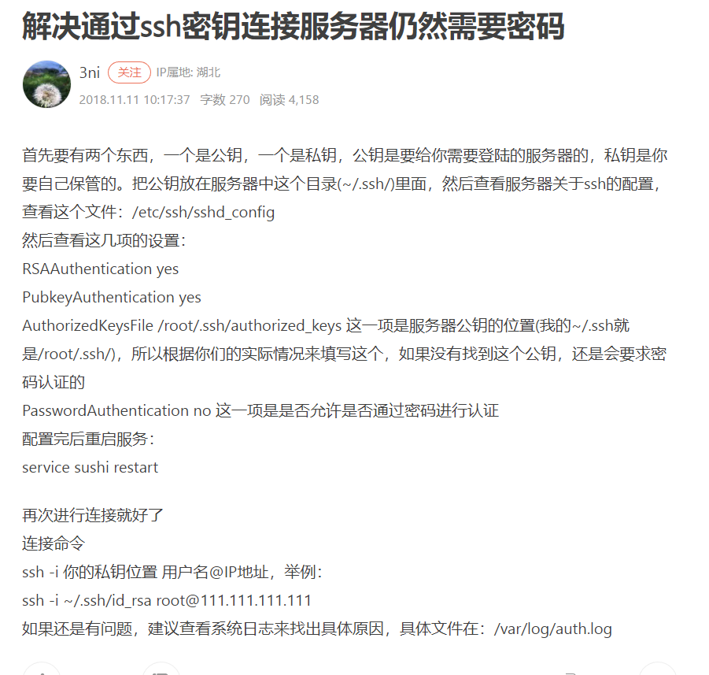

# Linux安装docker

### cp -a

cp -a 保留原文件属性的前提下复制文件 

cp -r dirname（源文件） destdi（目标文件）

复制目录后其文件属性会发生变化
想要使得复制之后的目录和原目录完全一样包括文件权限，可以使用cp -a dirname destdir 

```shell
# 101.132.124.188:22 SSH-2.0-OpenSSH_7.4
101.132.124.188 ssh-rsa AAAAB3NzaC1yc2EAAAADAQABAAABAQDLit4lX9SEYNVhSFFBBo/3+rb2qxfDyGHpTkrbJz6sFDyWoB0fSfFiOVUnGe/h9LB5QffsLKdSGOdY82r41OOyWFyxxtUhuXCu1ZsgYiGLwKlPRrzICagyNC8HKU4auj5ALBeopmF6DBeMVp6e7mGDpPWFgiKLZtyO/oq5qwpyrbHw13UgfWbAAEpGW4OdgmaRUhjnWbeTXJLqHXybYnlPyWm1WsIXCDWzMyvefIL1DSAl3hVBgys1YgrIfU/KMoUEFet6wldysql9Kb0mvpU6WnmWi0l+j8iesEDdCWlKaxgIyxIxcx9cRPaoXADWUR6YdxYenqnFoHzQnDe2LzLD
# 101.132.124.188:22 SSH-2.0-OpenSSH_7.4
101.132.124.188 ecdsa-sha2-nistp256 AAAAE2VjZHNhLXNoYTItbmlzdHAyNTYAAAAIbmlzdHAyNTYAAABBBIwUq1CsNFfLs3A34rDuQZO0YNTM3nLaUK4UZMnWRLOHRYmF0o1mjGii32AK3FbkuZcdfD7mXbJUhSE3W/H2J58=
# 101.132.124.188:22 SSH-2.0-OpenSSH_7.4
101.132.124.188 ssh-ed25519 AAAAC3NzaC1lZDI1NTE5AAAAIKYxuxg/8WN2TEU4mD1NFQEjQiR3PjCMVminKp9tLtfe
```

安装软件：

\- run: sudo apt-get update && sudo apt-get install rsync && sudo apt-get install openssh-client

## linux服务器之间传输文件

https://blog.csdn.net/qq_43674360/article/details/126096275

https://blog.csdn.net/weixin_44256848/article/details/126466072

https://www.ydisp.cn/ement/75140.html

## Rsync远程同步

https://blog.csdn.net/weixin_71429839/article/details/127191015

## 给文件/文件夹增加权限

## rsync 错误 failed: Permission denied (13)

文件缺少权限，需要增加权限

```bash
chmod 755 /data/javaprefs
```

## 查看是否安装某个软件包

```shell
rpm -qa | grep "软件包名"
```

## rsync常见问题及解决办法

https://blog.csdn.net/qq_44786814/article/details/114849655

https://blog.csdn.net/qq_39577008/article/details/104826277


## ssh

查看是否安装ssh

```shell
ssh -V
```


检查ssh的状态

```shel
systemctl status sshd.service
```

检查ssh是否启动成功

```shell
ps -aux | grep ssh
```


ssh的位置

```shell
/etc/ssh
```

修改完配置重启ssh服务

```shell
service sshd restart
```


## 排查连接不上到linux的问题


circleci存的是密钥 

linux存的是公钥


## circleci在使用免密登录时的一些错误问题

### 使用私钥的情况下还输入密码问题

3个解决办法

1. 修改/etc/ssh/sshd_config文件

```shell
PasswordAuthentication no
```

2. 在登录时使用下面命令

```shell
ssh -o StrictHostKeyChecking=no user@ip
```

3. 有博客说修改的是：

在文件/etc/ssh/ssh_config(全局)或者~/.ssh/config(某用户)开头加入以下内容

StrictHostKeyChecking ask打开注释修改为StrictHostKeyChecking no即可


但是这样做好像没什么反应

4. 还有说是：

连接ssh的时候，带上GSSAPIAuthentication=no参数：

```javascript
ssh -o GSSAPIAuthentication=no root@ip
```

这样也可以避免需要二次确认连接。

只有通过1这种方法才可以

如果看登录的详细情况的话可以使用下面命令

```shell
ssh root@192.168.111.22 -vvv 
```

出现什么问题，然后在配置文件或命令行修改对应的参数即可


连接成功后的ssh_config的配置，下面的修改是部分修改，打开注释或修改值

```shell
RSAAuthentication yes
PasswordAuthentication no
GSSAPIAuthentication no
StrictHostKeyChecking no
UserKnownHostsFile /dev/null
```


## Linux操作系统如何使用SSH命令连接另外一台Linux服务器

https://www.cnblogs.com/hls-code/p/16158324.html

### windows终端通过密钥远程连接Linux服务器

## SSH密钥连接

sshd服务提供两种安全验证的方法：

- 基于口令的安全验证:经过验证帐号与密码即可登陆到远程主机。
- 基于密钥的安全验证:需要在服务端生成"密钥对"后将私钥传送至本地端，进行密钥的比较。

**创建密钥**

在服务器端的终端中执行命令 `ssh-keygen`，
出现提示时一直按Enter即可 ，会在将在 `~/.ssh/` 路径下生成公钥(id_rsa.pub)和私钥(id_rsa)

保证公钥在服务器端，私钥在本地端，就可以在本地端使用私钥进行免密登录服务器


---这个好像没用到

在服务器端执行以下命令，在服务器上安装公钥
`cat id_rsa.pub >> authorized_keys`

`chmod 600 *` 修改文件权限，只允许文件拥有者读写

**配置密钥**

使用 sz 或 scp等命令将私钥(id_rsa)文件下载到本地，并记下文件路径

找到本地用户目录下的.ssh文件夹，选中config-右键-打开方式-使用记事本打开

安装注释修改下面的内容，并复制到config文件中，注意 `//` 和之后的注释都要删去，然后保存

```text
Host tx    // 远程机器别名
HostName 192.*.*.*   // 远程机器IP地址/域名
Port 22   // 端口号，默认为22
User root   // 登录账号
IdentityFile path/id_rsa // 下载的私钥文件在本机的地址
```

**连接远程主机**

```shell
ssh tx
```

也可以通过以下命令手动选中密钥连接远程主机
`ssh -i path/id_rsa user_name@IP_address`


## 远程连接的方法

(publickey,gssapi-keyex,gssapi-with-mic,password).

## Win10自带的ssh客户端key权限设置

https://zhuanlan.zhihu.com/p/108445764#:~:text=Win10%E8%87%AA%E5%B8%A6%E7%9A%84ssh%E5%AE%A2%E6%88%B7%E7%AB%AFkey%E6%9D%83%E9%99%90%E8%AE%BE%E7%BD%AE%201%20%E5%AE%89%E8%A3%85%20%E6%89%93%E5%BC%80PowerShell%EF%BC%8C%E8%BE%93%E5%85%A5ssh%E4%B8%89%E4%B8%AA%E5%AD%97%E6%AF%8D%EF%BC%8C%E6%8C%89Enter%E3%80%82%20...%202%20%E5%8A%9F%E8%83%BD%20%E4%B8%8D%E5%A6%A8%E7%9C%8B%E4%B8%80%E4%B8%8BWin10%E6%8A%8A%E8%BF%99%E4%B8%AAssh%E5%AE%A2%E6%88%B7%E7%AB%AF%E6%94%BE%E5%93%AA%E9%87%8C%E4%BA%86%E3%80%82,%E4%BF%AE%E6%94%B9key%E6%9D%83%E9%99%90%20%E5%AF%B9id_rsa%E6%96%87%E4%BB%B6%EF%BC%9A%E5%8F%B3%E5%87%BB-%E5%B1%9E%E6%80%A7-%E5%AE%89%E5%85%A8-%E9%AB%98%E7%BA%A7%E3%80%82%20...%205%20%E5%85%B6%E4%BB%96%20%E4%B8%80%E4%B8%AA%E9%9D%9E%E5%B8%B8%E6%9C%89%E7%94%A8%E7%9A%84%E4%B8%9C%E8%A5%BF%EF%BC%8C%E5%9C%A8PowerShell%E9%87%8C%E6%8C%89Ctrl%2BR%EF%BC%8C%E8%BE%93%E5%85%A5ssh%E5%AD%97%E6%A0%B7%EF%BC%8C%E7%84%B6%E5%90%8E%E4%B8%8D%E6%96%AD%E6%8C%89Ctrl%2BR%EF%BC%8C%E5%8F%AF%E4%BB%A5%E5%BE%80%E4%B8%8A%E7%BF%BB%E4%BB%A5%E5%89%8D%E8%BE%93%E8%BF%87%E7%9A%84%E5%B8%A6%27ssh%27%E5%AD%97%E6%A0%B7%E7%9A%84%E5%91%BD%E4%BB%A4%EF%BC%8C%E5%92%8CLinux%20Shell%E5%87%A0%E4%B9%8E%E4%B8%80%E6%A0%B7%EF%BC%8C%E9%9D%9E%E5%B8%B8%E6%96%B9%E4%BE%BF%E3%80%82%20

## 解决在windows，circleci连接服务器的办法

1. 进入控制台；找到服务器，创建一个密钥，之后会返回一个.pem的文件，而这个pem的文件就是服务器返回的私钥，我这里下载的名为test_login.pem

 

2. 尝试windows登录服务，进入window的终端

```shell
ssh root@ip -i ./test_login.pem
```

 

以上表示登录成功

3. 尝试使用circleci远程登录

```shell
- run: ssh root@ip -vvv
```

登录成功会有提示

 

 

使用ssh任然需要密码的问题

https://blog.csdn.net/qq_32239417/article/details/52774199

上面3步 -vvv表示我们在登录过程中可以显示登录信息；这在登录失败排查问题很有用

会返回一些debug开头的信息

主要展示的是使用的登录方式；成功会有成功的提示；失败也有失败的信息，

关于错误信息的详细信息：查看下面的链接

http://www.nndssk.com/xtwt/201718NT4CGZ.html

https://blog.csdn.net/weixin_29980355/article/details/116859080

网上给出使用window终端连接linux的方法

https://blog.csdn.net/tyustli/article/details/122222605

## 如果我们只想传输文件，但也要输入密码，可以在命令行加StrictHostKeyChecking=no

**这样就可以解决跳过第一次登录时确认的问题**

     ```shell
command: scp -vr  -o StrictHostKeyChecking=no /home/circleci/cloudspace/dist/* $SSH_USER@$SSH_IP:/www/wwwroot/testbuild/
     ```


## 阿里云远程连接linux服务器的方法

https://help.aliyun.com/document_detail/59083.html

## 通过密钥连接之后，在通过密码连会提示说服务器禁止了使用密码进行连接，要使用密钥进行连接，现在登录linux服务器就需要使用密钥进行登录了，密钥文件放在网上

## 出现Permission denied (publickey)的解决方法

https://blog.csdn.net/a1489540461/article/details/126751164

------------------------------

# [CircleCI 自动化部署](https://segmentfault.com/a/1190000021579837)

## 关于备份工具rsync，你不知道的事

https://developer.kingdee.com/article/387551352031207424?productLineId=29&isKnowledge=2

## [GitHub + circleCI 自动构建/自动部署 应用](https://www.cnblogs.com/liugx/p/10339010.html)

## CentOS 7 免密登录异常 -- we did not send a packet, disable method

https://blog.csdn.net/u010766726/article/details/108236397

## circleci 使用手册

https://haofly.net/circleci/


## window自带ssh软件，可以使用ssh登录远程服务器

where.is   软件名

## SCP的使用

 

使用circleci自动部署前端是在circleci服务上构建好，然后通过将文件上传到服务器上的一种方法

gitlab私有库是在linux环境上进行构建的，可以通过镜像来操作，很耗内存，

说明以下项目的构建

cloudspace是大项目，构建的时候很大，将他放在circleci上面进行构建，他的后端代码也是放到circleci上面的


knowledge是通过github来访问的，也是通过circleci来构建，然后上传的github上面，这样做是因为很早测试了，然后没有改动


interview这个是静态的项目，还没确定放到什么地方上


光明公益小程序+后台+后端：放的地方不一致