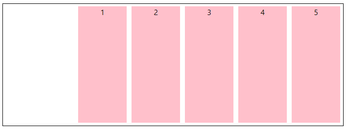

---
tags:
  - CSS
  - 主题
  - 索引
---
## 样式表书写位置

1. 内嵌样式

```css
<head>
	<style>
		样式表书写内容
	</style>
</head> 
```

2. 外链

```html
<link href="css文件路径" type="text/css" ref="stylesheet"/>
```

3. 行内

```html
<div style="width: 200px"></div>
```

## 选择器

### 基础选择器

**类型选择器：**

```
元素 { 属性：值;}
```

特点：类型选择器定义之后，会将页面所有的元素都执行这个类型样式。

```css
div {}
```

**类选择器：**

```
.类名{ 属性: 值;}
```

一个元素可以调用多个类选择器。

多个元素可以调用同一个类选择器。

```css
.box {
	color: red;
}
.box1 {
    font-size: 18px;
}
```

```html
<div class="box box1">类选择器</div>
```

**id选择器：**

一个ID选择器在一个页面只能调用一次。

```css
#box2 {
	color:red
}
```

```html
<div class="box" id="box2">类选择器</div>
```

**通配符选择器：**

```
* { 属性: 值; }
```

给所有的标签都使用相同的样式。

```css
* {
	box-boxing: box-content;
}
```

### 复合选择器

两个或者两个以上的基础选择器通过不同的方式连接在一起

**交集选择器：**

```
类型 + 类 / （ID）选择器  { 属性：值；}
```

即要满足使用了某个标签，还要满足使用了类（id）选择器。

```css
div .box {
	color:red;
}
div #box {
	color: green;
}
```

```css
<div class="box">类box</div>
<div id="box">idbox</div>
```

**后代选择器：**

```
选择器 + 空格 + 选择器 { 属性：值;}
```

后代选择器首选要满足包含（嵌套）关系。

父集元素在前边，子集元素在后边。

特点：无限制隔代。

只要能代表标签，标签、类选择器、ID选择器自由组合。

```html
<div>
	<span>你好啊</span>
</div>
```

```css
div span {
    color: red;
}
```

**子代选择器：**

```
选择器 > 选择器{ 属性: 值;}
```

选中直接下一代元素。

```css
div > span {
	color: red;
}
p > span {
	color: green;
}
```

```html
<div>
	<p><span>p下的span</span></p>
	<span>div下的span</span>
</div>
```

**并集选择器：**

```
选择器，选择器，选择器 { 属性: 值;}
```

通过`,`分隔的选择器，每一个选择器都会适配对应的样式

```html
<div class="one">
   你好啊
</div>
<div class="two">
    我很好
</div>
```

```css
.one, .two {
    color: red;
}
```

`one `和`two`类的文本都会变为红色

通用兄弟

匹配不行相邻的的兄弟元素

```css
h1 ~ p {
    font-weight: bold;
    background-color: #333;
    color: #fff;
    padding: .5em;
}
```

```html
<article>
    <h1>A heading</h1>
    <p>I am a paragraph.</p>
    <div>I am a div</div>
    <p>I am another paragraph.</p>
</article>
    
```

上述的结果是`p`元素都会被选中

### 属性选择器

```html
<a href="www.baidu.coom"></a>
<div class="two hellow"></div>
```

| 选择器        | 示例                | 含义                                |
| ------------- | ------------------- | ----------------------------------- |
| E[attr]       | a[href]             | 存在attr属性即可                    |
| E[attr=val]   | a[href="xxx"]       | 属性值完全等于val                   |
| E[attr\*=val] | div[class="two"]    | 属性值里包含val字符                 |
| E[attr^=val]  | div[class="two"]    | 属性值里包含val字符并且在“开始”位置 |
| E[attr$=val]  | div[class="hellow"] | 属性值里包含val字符并且在“结束”位置 |

**大小写敏感**

如果你想在大小写不敏感的情况下，匹配属性值的话，你可以在闭合括号之前，使用`i`值

```html
<ul>
    <li class="a">Item 1</li>
    <li class="A">Item 2</li>
    <li class="Ab">Item 3</li>
</ul>
```

```css
li[class^="a" i] {
    color: red;
}
```

以上写法均匹配到了`li`元素

### 伪类

伪类是选择器的一种，它用于选择处于特定状态的元素，比如当它们是这一类型的第一个元素时，或者是当鼠标指针悬浮在元素上面的时候，伪类就是开头为冒号的关键字：

```css
:hover {}
```

除了以前学过的:link、:active、:visited、:hoverd等用户行为类，CSS3又新增了其它的伪类选择器。

1、结构(位置)伪类

以某元素（E）相对于其父元素或兄弟元素的位置来获取无素；

| 选择器                | 含义                                                       |
| --------------------- | ---------------------------------------------------------- |
| E:first-child         | 其父元素的第1个子元素(不是后代元素)                        |
| E:last-child          | 其父元素的最后1个子元素(不是后代元素)                      |
| E:nth-child(n)        | 其父元素的第n个子元素(不是后代元素)                        |
| E:nth-last-child(n)   | 其父元素的倒数第n个子元素（倒着数，从1开始）(不是后代元素) |
| E:root                | 文档的根元素 HTML里面为`<html>`                            |
| E:empty               | 无子元素的元素（空格和注释也会匹配到）                     |
| E:first-letter        | 元素的首字母                                               |
| E:first-line          | 元素的首行                                                 |
| E:first               | 匹配分页媒体的第一页。                                     |
| E:left                | 在分页媒体中，匹配左手边的页                               |
| E:only-child          | 父元素仅有E元素的元素                                      |
| E:nth-of-type(n)      | 元素中指定索引的E元素                                      |
| E:nth-last-of-type(n) | 元素中指定逆序索引的E元素                                  |
| E:first-of-type       | 元素中指定的第一个E元素                                    |
| E:last-of-type        | 元素中指定的最后一个E元素                                  |
| E:only-of-type        | 元素中仅有E元素的元素                                      |

n遵循线性变化，其取值0、1、2、3、4、... 

n可是多种形式：nth-child(2n+0)、nth-child(2n+1)、nth-child(-1n+3)等；

例子：

```html
<div class="wrapper">
  <p>我是第一个段落</p> // 1
  <p>我是第二个段落</p> // 2
  <div>我是第一个Div元素</div> // 3
  <div>我是第二个Div元素</div> // 4
  <p>我是第三个段落</p> // 5
  <p>我是第四个段落</p> // 6
  <div>我是第三个Div元素</div> // 7
  <div>我是第四个Div元素</div> // 8
   <span>我是span标签</span> // 9
   <div><span>测试</span> <p>测试2</p></div>  // 10
    <div><span>测试</span> <span>测试2</span></div>  // 11
     <div><span>测试</span></div>  // 12
</div>
```

```css
/*标记为1的背景为橙色*/
.wrapper > p:first-of-type {
  background: orange;
}
/*标记为6的背景为粉色*/
.wrapper > p:last-of-type {
  background: pink;
}
/*标记为4的背景为黄色*/
.wrapper > div:nth-of-type(2) {
  background: red;
}
/*标记为7的背景为黄色*/
.wrapper > div:nth-last-of-type(2) {
  background: yellow;
}
/*标记为9的字体大写变为20px, .wrapper下只要一个span时才会生效，当span换做p时不生效*/
.wrapper > span:only-of-type {
  font-size: 20px;
}

/*使用该样式时，10 11 不生效。12生效*/
.wrapper > div span:only-child {
  font-size: 30px;
}

```


2、目标伪类

`E:target `结合锚点进行使用，处于当前锚点的元素会被选中；

```html
<h2><a href="#brand">Brand</a></h2>
<div class="menuSection" id="brand">
  <p>scroll current</p>
</div>
```

```css
.menuSection{
  display: none;
}
/*这里的:target就是指id="brand"的div对象*/
:target{
  display:block;
}
```

触发元素的URL中通常会包含一个`#`号，如上面所示，当我点击Brand的时候，会匹配到id为brand的元素，定位到当前元素，然后触发`:target`,  

如果出现多个url时，会去匹配当前元素`href`的值和目标`id`值相同的元素

3、排除伪类

`E:not(selector) ` 可以选择除某个元素之外的所有元素；

```css
form {
  width: 200px;
  margin: 20px auto;
}
div {
  margin-bottom: 20px;
}
input:not([type="submit"]){
  border:1px solid red;
}
```

以上代码表示排除了form表单中的submit按钮；

### 伪元素

伪元素开头为双冒号`::`

```
::before
```

1、`E::first-letter`文本的第一个单词或字（如中文、日文、韩文等）

2、`E::first-line` 文本第一行；

3、`E::selection` 匹配文档中被选择的那部分

4、`E::before`和`E::after`

`E:after`、`E:before `在旧版本里是伪元素，CSS3的规范里“:”用来表示伪类，“::”用来表示伪元素，但是在高版本浏览器下`E:after`、`E:before`会被自动识别`E::after`、`E::before`，这样做的目的是用来做兼容处理。他们和`content`属性一起使用

```html
<p class="box">Content in the box in my HTML page.</p>
```

```css
.box::after {
    content: " ➥";
}
```

也可以使用`::after`、`::before `来清除浮动

```css
.clearfix::before, .clearfix::after{
    content: ".";
    display: block;
    hight: 0;
    visibility: hidden;
}
.clearfix:after{ clear: both}
.clearfix { zoom: 1;}
```


组合伪类和伪元素

```html
<article>
    <p>Veggies es bonus vobis, proinde vos postulo essum magis kohlrabi welsh onion daikon amaranth tatsoi tomatillo
            melon azuki bean garlic.</p>

    <p>Gumbo beet greens corn soko endive gumbo gourd. Parsley shallot courgette tatsoi pea sprouts fava bean collard
            greens dandelion okra wakame tomato. Dandelion cucumber earthnut pea peanut soko zucchini.</p>
</article>
```

```css
article p:first-child::first-line {
  font-size: 120%;
  font-weight: bold;
}
```

上述结果是加粗第一段第一行

**伪类列表**

| 选择器         | 描述                               |
| -------------- | ---------------------------------- |
| E:target       | 当前锚点的元素                     |
| E:read-write   | 可读可写的表单元素                 |
| E:blank        | 输入为空的表单元素                 |
| E:current()    | 匹配正在展示的元素，或者其上级元素 |
| E:link         | 未访问的链接元素                   |
| E:visited      | 已访问的链接元素                   |
| E:focus        | 输入聚焦的表单元素                 |
| E:required     | 输入必填的表单元素                 |
| E:valid        | 输入合法的表单元素                 |
| E:invalid      | 输入非法的表单元素                 |
| E:in-range     | 输入范围以内的表单元素             |
| E:out-of-range | 输入范围以外的表单元素             |
| E:checked      | 选项选中的表单元素                 |
| E:optional     | 选项可选的表单元素                 |
| E:enabled      | 事件启用的表单元素                 |
| E:disabled     | 事件禁用的表单元素                 |
| E:read-only    | 匹配用户不可更改的元素             |
| E:read-write   | 匹配用户可更改的元素               |
| E:past()       | 已浏览的元素                       |
| E:future()     | 未浏览的元素                       |
| E:playing      | 匹配播放时的媒体资源               |
| E:paused       | 匹配正在暂停的媒体资源             |
| E:lang()       | 基于元素语言来匹配页面元素         |
| E:dir()        | 匹配特定文字书写方向的元素         |
| E:has()        | 匹配包含指定元素的元素             |
| E:is()         | 匹配指定选择器列表里的任何元素     |
| E:not()        | 用来匹配不符合一组选择器的元素     |

例子：

```html
<div>
    <label for="enabled">可用输入框:</label>
    <input type="text" id="enabled" />
  </div>

  <div>
    <label for="disabled">禁用输入框:</label>
    <input type="text" id="disabled" disabled="disabled" />
  </div>
***********************
 <input type="radio" checked="checked"  id="boy" name="1" /><span></span>

***********************
<textarea name="comment" id="" cols="30" rows="10" readonly="readonly"></textarea>
```

```css
input[type="text"]:enabled {
  border: 1px solid #f36;
  box-shadow: 0 0 5px #f36;
}

input[type="text"]:disabled{
  box-shadow: none;
}

***********************
/* 给选中的radio背景设为红色 */
input[type="radio"]:checked + span {
  background: red;
}

***********************
/* textarea 为只读的文本框设置样式*/
textarea:read-only {
  border: 1px solid #ccc;
  height: 50px;
  resize: none;
  background: #eee;
}
```

### 优先级

1、同一元素引用了多个样式时，排在后面的样式属性的优先级高；

```html
<div class="one two"></div>
<!-- two类的优先级高于one类-->
```

2、样式选择器的类型不同时，优先级顺序为：id 选择器 > class 选择器 > 标签选择器；

```html
<div class="one" id="two">你好吗</div>
```

```css
.one {
    color: red;
}
.two {
    color: green;
}
div {
    color: yellow;
}
/* 此时"你好吗"字体的颜色为红色*/
```

3、标签之间存在层级包含关系时，后代元素会继承祖先元素的样式。如果后代元素定义了与祖先元素相同的样式，则祖先元素的相同的样式属性会被覆盖；继承的样式的优先级比较低，至少比标签选择器的优先级低；

```html
<div class="one">
    <span>我继承了div的color</span>
</div>
<div class="two">
    <span>我有自己的color</span>
</div>
```

```css
.one {
    color: red;
}
.two {
    color: green;
}
.two  span {
    color: blue;
}
```

4、带有!important 标记的样式属性的优先级最高；

```html
<div class="one" id="two">你好吗</div>
```

```css
.one {
    color: red;
}
.two {
    color: green !important;
}
div {
    color: yellow;
}
/* 此时"你好吗"字体的颜色为绿色*/
```

5、样式表的来源不同时，优先级顺序为：内联样式 > 内部样式 > 外部样式 > 浏览器用户自定义样式 > 浏览器默认样式

## 文本元素

属性：

`font-size:16px`  ;  文字大小

`font-weight: 700`	;  值从100-900，文字粗细

`font-family`:微软雅黑;  文本的字体

`font-style: normal | italic`;    normal 默认值  italic   斜体

`line-height`: 行高

`text-shadow`，可分别设置偏移量、模糊度、颜色（可设透明度）。

```css
text-shadow: 2px 2px 2px #CCC;
1、水平偏移量 正值向右 负值向左；

2、垂直偏移量 正值向下 负值向上；

3、模糊度是不能为负值；
```

文本属性连写

```
font: font-style font-weight  font-size/line-height  font-family;
```

> font:后边写属性的值。一定按照书写顺序。文本属性连写文字大小和字体为必写项。Font:italic 700 16px/40px  微软雅黑;

`text-align`: 水平位置

`text-indent`：首行缩进

`text-decoration`：下划线

`letter-spacing`：属性增加或减少字符间的空白

`word-spacing`：属性增加或减少字与字之间的空白  (英文里面表示单词之间的空白)

`white-space`：设置或检索对象内文本显示方式， 

```css
white-space:normal ；默认处理方式

white-space:nowrap ；　强制在同一行内显示所有文本，直到文本结束或者遭遇br标签对象才换行。
```

`text-overflow `: 设置或检索是否使用一个省略标记（...）标示对象内文本的溢出

```css
text-overflow : clip ；不显示省略标记（...），而是简单的裁切 

text-overflow：ellipsis ； 当对象内文本溢出时显示省略标记（...）
```

超出省略的常用代码

```css
/*1. 先强制一行内显示文本*/
white-space: nowrap;
/*2. 超出的部分隐藏*/
overflow: hidden;
/*3. 文字用省略号替代超出的部分*/
text-overflow: ellipsis;
```

**行高**

`line-height`

浏览器默认文字大小

浏览器默认文字大小：16px

行高：是基线与基线之间的距离

行高=文字高度+上下边距

| **单独给一个标签设置行高** | **结果**             |
| -------------------------- | -------------------- |
| 如果行高单位是px           | 行高与文字大小无关   |
| 如果行高单位是em           | 行高=文字大小*行高值 |
| 如果行高单位是 %           | 同上                 |
| 如果行高没有单位           | 同上                 |

一行文字行高和父元素高度一致的时候，垂直居中显示。

**行高的单位**

| 行高单位 | 文字大小 | 值   |
| -------- | -------- | ---- |
| 20px     | 20px     | 20px |
| 2em      | 20px     | 40px |
| 150%     | 20px     | 30px |
| 2        | 20px     | 40px |

总结:单位除了像素以为，行高都是与文字大小乘积。

| 行高单位 | 父元素文字大小 | 子元素文字大小 | 行高 |
| -------- | -------------- | -------------- | ---- |
| 40px     | 20px           | 30px           | 40px |
| 2em      | 20px           | 30px           | 40px |
| 150%     | 20px           | 30px           | 30px |
| 2        | 20px           | 30px           | 60px |

| **给父元素设置行高** | **子元素行高结果**                                 |
| -------------------- | -------------------------------------------------- |
| 行高单位是px         | 行高=父元素行高                                    |
| 行高单位是em         | 行高=父元素文字大小*行高值（与子元素文字大小无关） |
| 行高单位是%          | 同上                                               |
| 行高单位无           | **行高=子元素文字大小\*行高值**                    |

总结:不带单位时，行高是和子元素文字大小相乘，em和%的行高是和父元素文字大小相乘。行高以像素为单位，就是定义的行高值。

**垂直对齐**

- 有宽度的块级元素居中对齐，是margin: 0 auto;
- 让文字居中对齐，是 text-align: center;

但是我们从来没有讲过有垂直居中的属性。

vertical-align 垂直对齐，它只针对于**行内元素**或者**行内块元素**

 

```css
vertical-align : baseline |top |middle |bottom 
```

vertical-align 不影响块级元素中的内容对齐，它只针对于**行内元素**或者**行内块元素**，

特别是行内块元素， **通常用来控制图片/表单与文字的对齐**。

与图片结合的对齐方式

 

## 颜色

**颜色的显示方式：**

直接写颜色的名称： "red"

十六进制显示颜色： 前2为代表红色，中间2位代表绿色，后边2位代表蓝色

rgb：rgb(110,110,110)

rgba： rgba(110,110,110,0.2)，0.2为透明度。0-1之间，0为完全透明，1为不透明

新增了RGBA、HSLA模式，其中的A 表示透明度通道，即可以设置颜色值的透明度，相较opacity，它们不具有继承性，即不会影响子元素的透明度。

所示为颜色表示方法：

Red、Green、Blue、Alpha即RGBA

Hue、Saturation、Lightness、Alpha即HSLA

不同的颜色表示方法其取值也不相同，具体如下：

```
R、G、B 取值范围0~255

H 色调 取值范围0~360，0/360表示红色、120表示绿色、240表示蓝色

S 饱和度 取值范围0%~100%

L 亮度 取值范围0%~100%

A 透明度 取值范围0~1
```

RGBA、HSLA可应用于所有使用颜色的地方。

关于CSS透明度：

1、opacity只能针对整个盒子设置透明度，子盒子及内容会继承父盒子的透明度；

2 、transparent 不可调节透明度，始终完全透明

## 盒子模型

所谓盒子模型就是把HTML页面中的元素看作是一个矩形的盒子，也就是一个盛装内容的容器。每个矩形都由元素的内容、内边距（padding）、边框（border）和外边距（margin）组成。

CSS3中可以通过box-sizing 来指定盒模型，即可指定为content-box、border-box，这样我们计算盒子大小的方式就发生了改变。

可以分成两种情况：

1、box-sizing: border-box  盒子大小为 width

2、box-sizing: content-box  盒子大小为 width + padding + border


 

css中盒子模型由三部分组成: 边框（border） 内边距（padding） 外边距（margin） 

## 边框

```css
border-top-style:  solid  实线 
dotted  点线
dashed  虚线

border-top-color:  边框颜色

border-top-width:  边框粗细
```

四个边框值相同的写法

```css
border: 12px solid red;
```

边框合并   border-collapse:collapse;

**获取焦点**

```
.username {
	border: 0 none;去掉边框
	outline-style: none;去掉轮廓线
	background: #ccc
}
.username:focus {
	background: red
}
```

label  for  id    获取光标焦点

```html
<label for="username">用户名：</label><input type='text' class="username" id="username">
```

| 轮廓线       | outline-style:none  取消轮廓线 |
| ------------ | ------------------------------ |
| 获取焦点     | :focus 获取鼠标光标状态        |
| 取消表单边框 | border:0 none;      兼容性好   |
| label标签    | `<label for="ID名">`   友好性  |

**内边距**

Padding-left  |  right   |  top  |  bottom

padding连写

```css
Padding: 20px;  上右下左内边距都是20px

Padding: 20px 30px;  上下20px  左右30px

Padding: 20px  30px  40px;  上内边距为20px  左右内边距为30px  下内边距为40

Padding:  20px  30px  40px  50px;  上20px 右30px  下40px  左  50px
```

内边距撑大盒子的问题:

影响盒子宽度的因素

1. 内边距影响盒子的宽度
2. 边框影响盒子的宽度

> 盒子的宽度=定义的宽度+边框宽度+左右内边距

继承的盒子一般不会被撑大:

包含（嵌套）的盒子，如果子盒子没有定义宽度，给子盒子设置左右内边距，一般不会撑大盒子。

**外边距**

用法与padding一样，margin对盒子宽度不会有影响

margin-left  | right  |  top  |  bottom

外边距连写

```css
margin: 20px;   上下左右外边距20PX

margin: 20px 30px;  上下20px  左右30px

margin: 20px  30px  40px;   上20px  左右30px  下  40px

margin: 20px  30px  40px  50px; 上20px  右30px  下40px  左50px
```

垂直方向外边距合并

外边距合并（叠加）是一个相当简单的概念。
简单地说，外边距合并指的是，当两个垂直外边距相遇时，它们将形成一个外边距。合并后的外边距的高度等于两个发生合并的外边距的高度中的较大者。
当一个元素出现在另一个元素上面时，第一个元素的下外边距与第二个元素的上外边距会发生合并。

两个盒子垂直一个设置上外边距，一个设置下外边距，取的设置较大的值。

边距合并问题只发生在块级元素之间

嵌套的盒子外边距塌陷

解决方法:  1  给父盒子设置边框

​      			2  给父盒子overflow:hidden;  BFC  格式化上下文

**标准流初体验**

 

 

标准流：块级元素纵向有序排列，行内块（行内）元素横向有序排列

## 浮动

语s法：float:left  |  right

设置了浮动的元素，脱离标准流

浮动特点

1：浮动找浮动，不浮动找不浮动
2：浮动只影响后面的元素
3：浮动以元素顶部为基准对齐
4：浮动可是实现模式转换（span 设置浮动可以设置宽高）
5：让块级元素在一行显示

当父容器没有设置高度，里面的盒子没有设置浮动的情况下会将父容器的高度撑开。一旦父容器中的盒子设置浮动，脱离标准文档流，父容器立马没有高度，下面的盒子会跑到浮动的盒子下面。出现这种情况，我们需要清除浮动

**清除浮动的方式**

1：给父容器设置高度

2：通过设置`clear`

- left：不允许左侧有浮动元素（清除左侧浮动的影响）
- right  不允许右侧有浮动元素（清除右侧浮动的影响）
- both   同时清除左右两侧浮动的影响

3：给父容器设置 `overflow`

可以给父级添加： overflow为 hidden| auto| scroll  都可以实现

4：通过伪元素  

 ```CSS
.clearfix:after{
    content:"";
    height:0; line-height:0;
    visibily:hidden;
    clear:both;
    display:block;
}
.clearfix{
    zoom:1    　　　为了兼容IE浏览器
}
 ```

5: 使用双伪元素清除浮动

```css
.clearfix:before,.clearfix:after { 
  content:"";
  display:table; 
}
.clearfix:after {
 clear:both;
}
.clearfix {
  *zoom:1;
}
```


## **Overflow**

overflow 属性规定当内容溢出元素框时发生的事情。

| 属性              | 描述                                                     |
| ----------------- | -------------------------------------------------------- |
| overflow: visible | 默认值。内容不会被修剪，会呈现在元素框之外。             |
| overflow: hidden  | 内容会被修剪，并且其余内容是不可见的。                   |
| overflow: scroll  | 内容会被修剪，但是浏览器会显示滚动条以便查看其余的内容。 |
| overflow: auto    | 如果内容被修剪，则浏览器会显示滚动条以便查看其余的内容。 |

## 定位

定位是通过定位模式 + 偏移量使得本应该在标准流当中的盒子发生位置上的变化

| **语法**           | **介绍** |
| ------------------ | -------- |
| position: static   | 静态定位 |
| position: absolute | 绝对定位 |
| position: relative | 相对定位 |
| position: fixed    | 固定定位 |

1. 绝对定位（absloute）

- 是元素以带有定位的父级元素来移动位置 
- 当一个盒子包含在另一个盒子中，父盒子未设置定位，子盒子以浏览器左上角为基准设置位置； 当父盒子设置定位，子盒子以父盒子左上角为基准设置位置
- 绝对定位绝对不占空间位置（与浮动一样）
- 绝对定位可是实现模式转换

2. 相对定（relative)

- 相对定位以元素自身的位置为基准设置位置

- 相对定位占位置

- 一般子元素设置相对定位，父元素设置绝对定位（子绝父相）

3. 固定定位（fixed）

- 固定定位不占位置

4. 静态定位（static）
   按照标准流的显示方式    取消定位：position:static
   
   只认**浏览器的可视窗口** —— `浏览器可视窗口 + 边偏移属性` 来设置元素的位置；
   
   不随滚动条滚动

**水平居中**

步骤：1 设置父盒子为相对定位
           2 设置子盒子left值为父盒子宽度一半
           3  设置子盒子左边距为自己宽度一半

总结：margin: 0 auto 只能让在标准流的盒子居中

```
规范：
1：行内元素尽量里面包含行内元素
	不推荐:   <a href=”#”>   <h2> 标题 </h2 ></a>

2: 有些块级元素不能包含其他块级元素
    标题标签，段落标签不能包含div
    尤其是P标签不能包含div
```

由于浮动、定位都脱离了标准流，会对网页布局造成一定的影响，在以后的网页布局中优先考虑：标准流，浮动，定位

在使用**绝对定位**时要想实现水平居中，可以按照下图的方法：

1. `left: 50%;`：让**盒子的左侧**移动到**父级元素的水平中心位置**；
2. `margin-left: -100px;`：让盒子**向左**移动**自身宽度的一半**。

**使用margin-left: auto  规避脱标**

margin: 0 auto         居中对齐的由来

margin-left: auto     让盒子左侧充满
margin-right: auto    让盒子右侧充满

 

规避脱标流之 让图片和文字垂直对齐

使用 vertical-align:middle  让行内，行内块元素设置垂直距离

vertical-align:middle  常与 display:inline-block 配合使用， 表格对此属性最敏感

 

## 可见性

| 属性               | **作用**         |
| ------------------ | ---------------- |
| overflow：hidden   | 隐藏超出的那部分 |
| display：none      | 不显示元素       |
| visibility:hidden; | 不显示元素       |

特点总结：
 display: none        元素隐藏不占位置
overflow: hidden;  将超出部分的元素隐藏
visibility: hidden;    元素隐藏占位置

**overflow**

| 属性值  |                                            |
| ------- | ------------------------------------------ |
| visible | 不剪切内容也不添加滚动条                   |
| hidden  | 不显示超过对象尺寸的内容，超出的部分隐藏掉 |
| scroll  | 不管超出内容否，总是显示滚动条             |
| auto    | 超出自动显示滚动条，不超出不显示滚动条     |

使用text-indent移除文字

使用padding撑开盒子，overflow：hidden 移除内容

## 鼠标样式

设置或检索在对象上移动的鼠标指针采用何种系统预定义的光标形状。

| 属性值          | 描述       |
| --------------- | ---------- |
| **default**     | 小白  默认 |
| **pointer**     | 小手       |
| **move**        | 移动       |
| **text**        | 文本       |
| **not-allowed** | 禁止       |

## 轮廓线 outline

 是绘制于元素周围的一条线，位于边框边缘的外围，可起到突出元素的作用。 

```css
 outline : outline-color ||outline-style || outline-width 
```

 但是我们都不关心可以设置多少，我们平时都是去掉的。

最直接的写法是 ： `outline: 0; `  或者  `outline: none;`

```html
 <input  type="text"  style="outline: 0;"/>
```

**CSS 精灵工作原理**
CSS 精灵其实是将网页中的一些背景图像整合到一张大图中（精灵图）。然而，各个网页元素通常只需要精灵图中不同位置的某个小图，要想精确定位到精灵图中的某个小图，就需要使用CSS的`background-image`、`background-repeat`和`background-position`属性进行背景定位，其中最关键的是使用`background-position`属性精确地定位。

精灵图用法总结：
1：精灵图只能用打开的方式，不能使用导入得方式打开
2：使用精灵图的时候注意坐标位置的正负取值

| 元字符 | 含义       | 示例                                                         |
| ------ | ---------- | ------------------------------------------------------------ |
| []     | 全部可选项 | `padding: [<length> | <percentage>]{1, 4}`                   |
| \|\|   | 并列       | `border: <line-width> || <line-style> || <color>`            |
| \|     | 多选一     | position: static \| relative \| absolute \| fixed            |
| ?      | 0个或1个   | `box-shadow: none | <shadow>[, <shadow>]* <shadow>: inset? && <length>{2, 4} && <color>?` |
| *      | 0个或多个  |                                                              |
| {}     | 范围       |                                                              |

## box-shadow

`box-shadow` 是一种 CSS 属性，可以用来向一个元素添加一个或多个阴影。它的语法如下：

```css
box-shadow: h-offset v-offset blur spread color inset;
```

其中：

- `h-offset`：横向偏移量，可以是正数也可以是负数，表示阴影相对于元素的水平位置。
- `v-offset`：纵向偏移量，可以是正数也可以是负数，表示阴影相对于元素的垂直位置。
- `blur`：模糊半径，用来控制阴影的模糊程度，值越大阴影越模糊。
- `spread`：扩散半径，用来控制阴影的大小，如果为正数，阴影会扩大；如果为负数，阴影会缩小。
- `color`：阴影颜色，可以使用任何合法的 CSS 颜色值。
- `inset`：可选属性，用来指定阴影是否在元素内部而不是外部。

以下是一个示例，展示了如何使用 `box-shadow` 为一个 div 元素添加阴影效果：

```css
div {
  box-shadow: 2px 2px 4px rgba(0, 0, 0, 0.3);
}
```

这将在 div 元素的右下角添加一个模糊半径为 4 像素、颜色为黑色透明度为 0.3 的阴影。

技巧：

- 可以使用 `,` 分隔多个阴影，来为元素添加多个阴影效果；
- 如果要制作带有内阴影的效果，需要在 `box-shadow` 后面添加 `inset` 属性，如：`box-shadow: inset 2px 2px 4px rgba(0, 0, 0, 0.3);`
- 可以使用 `rgba()` 函数来设置阴影颜色，这样可以指定颜色和透明度；
- 在设置多个阴影时，建议将模糊半径和扩散半径较小的阴影放在后面，这样可以避免阴影出现重叠或者覆盖的情况。

添加多个投影，使用逗号隔开即可

```
box-shadow: 

  X轴偏移量 Y轴偏移量 [阴影模糊半径] [阴影扩展半径] [阴影颜色] [投影方式],

  X轴偏移量 Y轴偏移量 [阴影模糊半径] [阴影扩展半径] [阴影颜色] [投影方式];
```

注意：inset 可以写在参数的第一个或最后一个，其它位置是无效的。

设置边框阴影不会改变盒子的大小，即不会影响其兄弟元素的布局。可以设置多重边框阴影，实现更好的效果，增强立体感，符合渐进增强

阴影模糊半径与阴影扩展半径的区别

阴影模糊半径：此参数可选，其值只能是为正值，如果其值为0时，表示阴影不具有模糊效果，其值越大阴影的边缘就越模糊；

阴影扩展半径：此参数可选，其值可以是正负值，如果值为正，则整个阴影都延展扩大，反之值为负值时，则缩小。一个-5px的扩张半径会把投影的宽度和高度各减少10px（即每边各5px）

多边投影

只需把阴影藏进一侧，另一侧自然露出就好。因此，扩张半径不应设为模糊半径的相反值，而应该是这个相反值的一半。

需要指定两个偏移量，因为我们希望投影在水平和垂直方向上同时移动。它们的值需要大于或等于模糊半径的一半，因为我们希望把投影藏进另外两条边之内。

```css
.boxshadow-outset{
    width:100px;
	height:100px;
    box-shadow: 4px 4px  6px #666, 4px -4px 6px #456 inset; 
}
.boxshadow-inset{
    width:100px;
    height:100px;
    box-shadow:4px 4px 6px #666 inset; 
}
.boxshadow-multi{
    width:100px;
    height:100px;
    box-shadow:4px 2px 6px #f00, -4px -2px 6px #000, 0px 0px 12px 5px #33CC00 inset;
}
```

```html
<h2>外阴影</h2>
<div class="boxshadow-outset">
</div>
<br />
<h2>内阴影</h2>
<div class="boxshadow-inset">
</div>
<br />
<h2>多阴影</h2>
<div class="boxshadow-multi">
</div>
```

## border-radius

圆角处理时，脑中要形成圆、圆心、横轴、纵轴的概念，正圆是椭圆的一种特殊情况。

分别设置横纵轴半径，以`/`进行分隔，遵循`1，2，3，4`规则，`/`前面的1~4个用来设置横轴半径（分别对应横轴1、2、3、4位置 ），``后面1~4个参数用来设置纵轴半径（分别对应纵轴1、2、3、4位置 ）。

支持简写模式，具体如下：

1、`border-radius: 10px; `表示四个角的横纵轴半径都为10px；

2、`border-radius: 10px 5px; `表示1和3角横纵轴半径都为10px，2和4角横纵轴半径为5px；

3、`border-radius: 10px 5px 8px; `表示1角模纵轴半径都为10px，2和4角横纵轴半径都为8px，3角的横纵轴半径都为8px；

4、`border-radius: 10px 8px 6px 4px; `表示1角横纵轴半径都为10px，表示2角横纵轴半径都为8px，表示3角横纵轴半径都为6px，表示4角横纵轴半径都为6px；

直观的看就是下面的描述：

```
其值可以为多个，最多为4个；
      四个值时：分别为左上，右上，右下，左下，
      两个值时：左上-右下  右上-左下
      三个值时：左上 右上-坐下  右下
      一个值时：四个角都为同样的，
```

```css
div.circle {
    height: 100px;
    /*与width设置一致*/
    width: 100px;
    background: #9da;
    border-radius: 50px;
    /*四个圆角值都设置为宽度或高度值的一半*/
}

div.semi-circle {
    height: 100px;
    width: 50px;
    background: #9da;
    border-radius: 20px 10px;
}
```

## border-image

设置的图片将会被“切割”成九宫格形式，然后进行设置。

最少“4刀”便可以将一个图片切成9部分，“切割”完成后生成虚拟的9块图形，

将一个盒子想象是由9部分组成的，分别是左上角、上边框、右上角、右边框、右下角、下边框、左下角、左边框、中间，那么浏览器会将切割好的9张虚拟图片分别对应到盒子的各个部分上。

其中四个角位置、形状保持不变，中心位置水平垂直两个方向平铺或拉伸，

定义要使用的边框图像。可以使用以下属性进行设置：

`border-image-source - `设置要用作边框的图像的路径。

`border-image-slice - `定义如何切割图像以适应边框。例如，可以设置一个数字表示每个边缘上的像素数，也可以使用百分比表示法（例如50%）。

`border-image-width - `定义边框图像的宽度。默认情况下，边框图像被拉伸以填充整个边框区域，但您可以使用此属性来更改其大小。

`border-image-repeat - `定义在边框周围重复图像的方式。默认情况下，图像将在边框周围平铺。

 有几个参数：`no-repeat round stretch repeat`

将`border-image`属性设置为`border-image: <source> <slice> <width> <repeat>`。在这里，您可以指定上述属性的值，以便将图像设置为元素的边框。

下面是一个示例CSS代码块，展示了如何使用border-image属性：

```css
.my-element {
     border-image: url(border.png) 30 repeat;
     border-width: 30px;
}
```

在这个例子中，我们将`border-image`设置为一个名为border.png的图像，使用`border-image-slice`切割边框，

使用border-image-width属性控制边框图像的大小，最后使用border-image-repeat重复边框图像。同时，border-width属性定义了边框的宽度

```css
.border_image {
    margin:0 auto;
    height:100px;
    line-height:100px;
    text-align:center;
    font-size:30px;
    width:450px;
    border:15px solid #ccc;
    border-image: url('http://img.mukewang.com/52e22a1c0001406e03040221.jpg') 70  repeat;
}
```

```html
<div class="border_image"></div>
```

## 颜色渐变

**线性渐变**

```css
background-image:linear-gradient(to left top, #fff,#999);
```


| 角度   | 用英文      | 作用           |
| ------ | ----------- | -------------- |
| 0deg   | to top      | 从下向上       |
| 90deg  | to right    | 从左向右       |
| 180deg | to bottom   | 从上向下       |
| 270deg | to left     | 从右向左       |
|        | to top left | 右下角到左上角 |
|        | to toright  | 左下角到右上角 |

CSS线性渐变是一种可以用来为元素的背景、边框等属性添加平滑颜色过渡效果的方式，可以通过指定渐变的起始点和结束点，以及沿着渐变轴线上的颜色分布来创建。

要使用 CSS 线性渐变，我们需要使用 linear-gradient() 函数，并在其中定义一组颜色值。该函数的语法如下：

```css
background: linear-gradient(direction, color-stop1, color-stop2, ...);
```

其中，direction 表示渐变的方向，可以使用角度或关键字（如 to top 或 to right）进行定义；color-stop 表示渐变中每个颜色的位置和颜色值。位置可以使用百分比或关键字（如 left 或 top）进行定义。

以下是一个示例 CSS 代码，它演示了如何在一个 div 元素的背景上应用一条从左到右的线性渐变：

```css
div {
    background: linear-gradient(to right, #FF0000, #0000FF);
}
```

这将生成一个从红色到蓝色的渐变背景，从左侧向右侧渐变。

您还可以使用多个 color-stop 值来定义更复杂的渐变效果，如下所示：

```css
div {
    background: linear-gradient(to right, #FF0000, #FFFF00, #0000FF);
}
```

这将生成一个从红色到黄色再到蓝色的渐变背景，从左侧向右侧渐变。

需要注意的是，在某些老版本的浏览器中，CSS 线性渐变可能不被支持。如果您的网站需要在旧版浏览器上运行，请确保提供替代方案或考虑使用其他背景属性来实现相似的效果。

**径向渐变**

CSS中的径向渐变是指从中心向外辐射的颜色平滑过渡。以下是一个示例：

```css
background: radial-gradient(red, yellow, green);
```

这将在元素的背景中创建一个从红色到黄色到绿色的径向渐变。

您还可以使用关键字，例如`at`和`circle`，来更好地控制径向渐变的位置和形状。例如，以下代码将在元素的中心创建一个圆形径向渐变：

```
background: radial-gradient(circle at center, red, yellow, green);
```

关键字`circle`指定了渐变的形状，`at center`指定了渐变的位置为中心。

CSS渐变还支持使用`ellipse`来指定椭圆形状的径向渐变。例如，以下代码将创建一个沿着元素的x轴和y轴的椭圆形径向渐变：

```
background: radial-gradient(ellipse at center, red, yellow, green);
```

## 文本省略

**text-overflow**用来设置是否使用一个**省略标记**（...）标示对象内文本的溢出。

```css
text-overflow: clip | ellipsis
```

clip：表示剪切
ellipis: 表示显示 省略标记

但是**text-overflow**只是用来说明文字溢出时用什么方式显示，要实现溢出时产生**省略号**的效果，还须定义**强制文本在一行内显示**（white-space:nowrap）及**溢出内容为隐藏**（overflow:hidden），只有这样才能实现**溢出文本显示省略号**的效果，代码如下

```css
text-overflow:ellipsis; 
overflow:hidden; 
white-space:nowrap; 
```

同时，**word-wrap**也可以用来设置**文本行为**，当前行超过指定容器的边界时是否断开转行。

```css
word-wrap: normal | break-word
```

normal: 表示控制连续文本换行
break-word:表示内容在边界内换行

**normal**为浏览器默认值，**break-word**设置在**长单词**或 **URL地址**内部进行换行，此属性不常用，用浏览器默认值即可。

## text-show

text-shadow可以用来设置文本的阴影效果。

**语法：**

```css
text-shadow: X-Offset Y-Offset blur color;
```

X-Offset：表示阴影的水平偏移距离，其值为正值时阴影向右偏移，反之向左偏移；   

Y-Offset：是指阴影的垂直偏移距离，如果其值是正值时，阴影向下偏移，反之向上偏移；

Blur：是指阴影的模糊程度，其值不能是负值，如果值越大，阴影越模糊，反之阴影越清晰，如果不需要阴影模糊可以将Blur值设置为0；

Color：是指阴影的颜色，其可以使用rgba色。

比如，我们可以用下面代码实现设置阴影效果。

```css
text-shadow: 0 1px 1px #fff
```

## 背景

**background-origin**

设置元素背景图片的**原始起始位置**。

```css
background-origin ： border-box | padding-box | content-box;
```

参数分别表示背景图片是从**边框**，还是**内边距（默认值）**，或者是**内容区域**开始显示。

 

**需要注意的是**，如果背景不是**no-repeat**，这个属性无效，它会从边框开始显示。

**background-clip**

用来将背景图片做适当的**裁剪**以适应实际需要。

```css
background-clip ： border-box | padding-box | content-box | no-clip
```

参数分别表示从**边框、**或**内边距**，或者**内容区域**向外裁剪背景。**no-clip**表示不裁切，和**参数border-box**显示同样的效果。`backgroud-clip`默认值为**border-box**。

 

根据所选，展示选择后对应里面的内容

**background-size**

设置背景图片的大小，以**长度值**或**百分比**显示，还可以通过**cover**和**contain**来对图片进行伸缩。

```css
background-size: auto | <长度值> | <百分比> | cover | contain
```

1、`auto`：默认值，不改变背景图片的原始高度和宽度；

2、`<长度值>`：成对出现如200px 50px，将背景图片宽高依次设置为前面两个值，当设置一个值时，将其作为图片宽度值来**等比缩放**；

3、`<百分比>`：0％~100％之间的任何值，将背景图片宽高依次设置为所在元素宽高乘以前面百分比得出的数值，当设置一个值时同上；

4、`cover`：顾名思义为**覆盖**，即将背景图片等比缩放以**填满整个容器**；

5、`contain`：容纳，即将背景图片等比缩放至**某一边紧贴容器边缘为止**。

**多重背景**

我们可以使用逗号分隔的方式加入多个图片，其他属性也对应的使用逗号分隔开

```css
.demo{
    width: 300px;
    height: 140px;
    border: 1px solid #999;
    background-image: 										url(http://img.mukewang.com/54cf2365000140e600740095.jpg),
        url(http://img.mukewang.com/54cf238a0001728d00740095.jpg),
        url(http://img.mukewang.com/54cf23b60001fd9700740096.jpg);
    background-position: left top , 100px 0, 120px 0;
    background-repeat: no-repeat, no-repeat, no-repeat;
    margin:0 0 20px 0;
}
```

```html
<div class="demo"></div>
```

**背景其他属性**

| 背景属性    | 默认值      | 可选                                        | 描述                 |
| ----------- | ----------- | ------------------------------------------- | -------------------- |
| -color      | transparent | 各种颜色值                                  | 背景颜色             |
| -image      | none        | none \| url                                 | 背景图片             |
| -repeat     | repeat      | repeat \| no-repeat \| repeat-x \| repeat-y | 背景平铺             |
| -position   |             | length \|\| length  position \|\| position  | 背景定位             |
| -attachment |             | scroll \| fixed                             | 背景是滚动的还是固定 |

**background-position**

- 必须先指定background-image属性
- position 后面是x坐标和y坐标。 可以使用方位名词或者 精确单位。
- 如果指定两个值，两个值都是方位名字，则两个值前后顺序无关，比如left  top和top  left效果一致
- 如果只指定了一个方位名词，另一个值默认居中对齐。
- 如果position 后面是精确坐标， 那么第一个，肯定是 x  第二的一定是y
- 如果只指定一个数值,那该数值一定是x坐标，另一个默认垂直居中
- 如果指定的两个值是 精确单位和方位名字混合使用，则第一个值是x坐标，第二个值是y坐标

**background-attachment**

- scroll  背景图像是随对象内容滚动

- fixed: 背景图像固定

**背景简写**

```css
background: transparent url(image.jpg) repeat-y  scroll center top ;
```

## 图片

我们可以给图片设置圆角（`border-radius`）、阴影(`text-shadow`)、边框(`border`)

如果你需要自由缩放图片，且图片放大的尺寸不大于其原始的最大值，则可使用以下代码

```css
img {
    max-width: 100%;
    height: auto;
}
```

**图片滤镜**

 `filter` 属性用为元素添加可视效果

修改所有图片的颜色为黑白 (100% 灰度):

```css
img {
    -webkit-filter: grayscale(100%);
    filter: grayscale(100%);
}
```

## 渐变

渐变是CSS3当中比较丰富多彩的一个特性，通过渐变我们可以实现许多炫丽的效果，有效的减少图片的使用数量，并且具有很强的适应性和可扩展性。

####  线性渐变

linear-gradient线性渐变指沿着某条直线朝一个方向产生渐变效果，是从黄色渐变到绿色。

**1、必要的元素：**

借助Photoshop总结得出线性渐变的必要元素

```
a、方向

b、起始色

c、终止色

d、渐变距离
```

**2、关于方向**

设置渐变方向，可以用关键字如to top、to right，也可以用角度（正负值均可）如45deg、-90deg等，当以角度做为参数时，0deg从下往上，90deg从左向右，进而可以推算出180deg从上向下。

> 我们可以设置渐变的起始点，这个起始点的值可以是百分比形式，这个百分比在没有设置background-size时，是相对于盒子大小的，当设置了background-size时则是相对于background-size的。

#### 径向渐变

radial-gradient径向渐变指从一个中心点开始沿着四周产生渐变效果

**1、必要的元素：**

```
a) 辐射范围即圆半径 

b) 中心点 即圆的中心

c) 渐变起始色

d) 渐变终止色

e) 渐变范围
```

**2、关于中心点**

中心位置参照的是盒子的左上角，例如background-image: radial-gradient(120px at 0 0 yellow green)其圆心点为左上角，background-image: radial-gradient(120px at 0 100% yellow green)其圆心为左下角。

**3、关于辐射范围**

其半径可以不等，即可以是椭圆，如background-image: radial-gradient(120px 100px at 0 0 yellow green)会是一个椭圆形（横轴120px、纵轴100px）的渐变。

## 过渡

`transition`是一个复合属性，其属性可拆解如下表：

| 属性                       | 含义                        |
| -------------------------- | --------------------------- |
| transition-property        | 设置过渡属性（默认为all）   |
| transition-duration        | 设置过渡持续时间（默认为0） |
| transition-timing-function | 设置过渡函数（默认为ease）  |
| transition-delay           | 设置过渡延时（默认为0）     |

```css
transition: transition-property transition-duration transition-timing-function transition-delay;
```

复合属性中的每个子属性通过空格分隔，不能用逗号，逗号表示不同属性表示多个过渡，`transition-duration`是必填，并且不能为0，如果`transition-duration`， `transition-delay`表示的时间同时出现时，第一个时间表示`transition-duration`，第二个表示  `transition-delay`，若只出现一个时，表示`transition-duration`

**`transition-property`**

值：`none | all | proterty`

`none`: 不指定任何样式

`all`: 默认值，表示指定元素支持 所有属性

`protery`: 指定过渡的属性

可过渡的CSS属性有：

颜色：`color background-color border-color outline-color`

位置：`backround-position left right top bottom`

长度：`max-height min-height max-width min-width height width; border-width margin padding outline-width outline-offset ;font-size line-height text-indent vertical-align;border-spacing letter-spacing word-spacing`

数字：`opacity visibility z-index font-weight zoom`

组合：`text-shadow transform box-shadow clip`

其他：`gradient`

**`transition-timing-function`**

用于指定CSS过渡效果的时间函数，它控制在过渡期间属性值的变化方式。该属性可以应用于`transition`属性或`transition-property`属性中的每个属性，或者在`transition`简写属性中作为第三个值。

`transition-timing-function`属性可以接受以下几种不同的值：

- `ease`：默认值。表示过渡效果开始缓慢，然后加速，最后再次缓慢结束。
- `linear`：表示过渡效果在整个过程中保持匀速。
- `ease-in`：表示过渡效果开始缓慢，然后逐渐加速。
- `ease-out`：表示过渡效果开始较快，然后逐渐减速。
- `ease-in-out`：表示过渡效果开始缓慢，然后加速，再减速结束。
- `step-start`：表示过渡效果在开始时立即跳转到结束状态。
- `step-end`：表示过渡效果在结束时立即跳转到结束状态。
- `steps(<number>)`：表示过渡效果在指定数量的步骤中跳转，步骤的数量由`<number>`指定。
- `cubic-bezier(<x1>, <y1>, <x2>, <y2>)`：自定义贝塞尔曲线函数，通过控制点`<x1>`、`<y1>`和`<x2>`、`<y2>`来定义过渡效果的时间曲线。这些值应在0到1之间。

 

1、steps函数

该值可用于创建离散的过渡效果，其中属性值在每个步骤之间突然变化，而不是平滑地过渡。每个步骤的变化是离散的，不会产生中间值。

`<number>`参数是一个正整数，指定了过渡过程中的步骤数量。较大的数字将导致更多的离散步骤，从而产生更突然的变化。

以下是一个示例，展示如何使用`steps(<number>)`来创建离散的过渡效果：

```css
.element {
  transition-property: background-color;
  transition-duration: 1s;
  transition-timing-function: steps(5);
}
```

上述示例将元素的背景颜色在1秒的时间内通过5个离散的步骤进行过渡。在每个步骤之间，背景颜色突然发生变化，而不是平滑过渡。

2、`cubic-bezier`

贝塞尔曲线是一种数学曲线，由控制点来定义曲线的形状。`cubic-bezier`函数接受四个参数，分别表示两个控制点的坐标。

```css
cubic-bezier(<x1>, <y1>, <x2>, <y2>)
```

参数`<x1>`和`<y1>`是第一个控制点的坐标，位于0到1之间。参数`<x2>`和`<y2>`是第二个控制点的坐标，也位于0到1之间。这些参数定义了贝塞尔曲线的形状，进而定义了过渡效果的时间曲线。

- `<x1>`和`<x2>`控制了曲线的水平形状，0表示左边，1表示右边。
- `<y1>`和`<y2>`控制了曲线的垂直形状，0表示顶部，1表示底部。

使用`cubic-bezier`函数创建自定义的时间函数：

```css
.element {
  transition-property: opacity;
  transition-duration: 1s;
  transition-timing-function: cubic-bezier(0.25, 0.1, 0.25, 1);
}
```

上述示例使用`cubic-bezier`函数定义了一个自定义的时间函数，使元素的不透明度属性在1秒的时间内以特定的曲线过渡

**`transition-duration`**

该属性表示整个过渡持续多长时间；

单位为s（秒）或ms（毫秒），初始值为0s。不能为0，必须要带参数。

**`transition-delay`**

该属性表示延迟多少时间后开始过渡

单位为ms（毫秒）或s（秒）;

## 2D转换

转换是CSS3中具有颠覆性的特征之一，可以实现元素的位移、旋转、变形、缩放，甚至支持矩阵方式

1、移动` translate(x, y) `可以改变元素的位置，`x`、`y`可为负值；

- 移动位置相当于自身原来位置

- y轴正方向朝下

- 除了可以像素值，也可以是百分比，相对于自身的宽度或高度

2、缩放` scale(x, y) `可以对元素进行水平和垂直方向的缩放，`x`、`y`的取值可为小数；

- 可以设置为1个参数，表示X,Y两个方向缩放的倍数是一样的

```css
div {
    transform: scale(2,3); 
}
```

`scale（2,3）`转变宽度为原来的大小的2倍，高度为原来的大小的3倍。

3、旋转 `rotate(deg) `可以对元素进行旋转，正值为顺时针，负值为逆时针；

```css
div {
    transform: rotate(45deg)
}
```

沿顺时针方向将`div`旋转45度角

4、倾斜 `skew(deg, deg)` 可以使元素按一定的角度进行倾斜，可为负值，表示向相反方向倾斜。第二个参数不写默认为0。

- `skewX(<angle>)`;表示只在X轴(水平方向)倾斜。
- `skewY(<angle>)`;表示只在Y轴(垂直方向)倾斜。

```css
transform:skew(<angle> [,<angle>]);
```

```css
.box {
	transform:skew(30deg,20deg);
}
```

5、矩阵`matrix() `把所有的2D转换组合到一起，需要6个参数，包含旋转，缩放，移动（平移）和倾斜功能

[关于矩阵的学习资料](http://www.zhangxinxu.com/wordpress/2012/06/css3-transform-matrix-矩阵/comment-page-2/)

6、`transform-origin`可以调整元素转换的原点

任何一个元素都有一个中心点，默认情况之下，其中心点是居于元素X轴和Y轴的50%处。

在没有重置`transform-origin`改变元素原点位置的情况下，CSS变形进行的旋转、位移、缩放，扭曲等操作都是**以元素自己中心位置进行变形**。但很多时候，我们可以通过`transform-origin`来对元素进行原点位置改变，使元素原点不在元素的中心位置，以达到需要的原点位置。

取值如下表所示：

 

我们可以同时使用多个转换，其格式为：`transform: translate() rotate() scale() ...`等，其顺序会影响转换的效果。

```html
<div class="wrapper">
  <div>原点在默认位置处</div>
</div>
<div class="wrapper transform-origin">
  <div>原点重置到左上角</div>
</div>
```

```css
.wrapper {
  width: 300px;
  height: 300px;
  float: left;
  margin: 100px;
  border: 2px dotted red;
  line-height: 300px;
  text-align: center;
}
.wrapper div {
  background: orange;
  transform: rotate(45deg);
}
.transform-origin div {
  transform-origin: left top;
}
```

## 动画

CSS的`@keyframes`规则用于创建动画序列，通过定义关键帧和每个关键帧的样式，实现元素在一段时间内的动画效果。

使用`@keyframes`规则，您可以指定动画序列中的关键帧，即动画的起始状态、中间状态和结束状态，并为每个关键帧定义相应的样式。每个关键帧由一个百分比值（0%到100%）或关键词（如`from`和`to`）来表示。

当在 **@keyframes** 创建动画，把它绑定到一个选择器，否则动画不会有任何效果。

指定至少这两个CSS3的动画属性绑定向一个选择器：

- 规定动画的名称
- 规定动画的时长

```html
<div></div>
```

```css
div {
	width: 100px;
	height: 100px;
	background: red;
	animation: myfirst 5s;
}

@keyframes myfirst {
	from {background:red;}
	to {background:yellow;}
}
```

把 "myfirst" 动画捆绑到 div 元素，时长：5 秒；

下面的表格列出了 `@keyframes` 规则和所有动画属性：

| 属性                      | 描述                                                         |
| :------------------------ | :----------------------------------------------------------- |
| @keyframes                | 规定动画。                                                   |
| animation                 | 所有动画属性的简写属性。                                     |
| animation-name            | 规定 @keyframes 动画的名称。                                 |
| animation-duration        | 规定动画完成一个周期所花费的秒或毫秒。默认是 0。             |
| animation-timing-function | 规定动画的速度曲线。默认是 "ease"。（和transition中的transition-timing-function一样） |
| animation-fill-mode       | 规定当动画不播放时（当动画完成时，或当动画有一个延迟未开始播放时），要应用到元素的样式。 |
| animation-delay           | 规定动画何时开始。默认是 0。                                 |
| animation-iteration-count | 规定动画被播放的次数。默认是 1。                             |
| animation-direction       | 规定动画是否在下一周期逆向地播放。默认是 "normal"。          |
| animation-play-state      | 规定动画是否正在运行或暂停。默认是 "running"，暂停是"paused"。 |

**animation-direction**

`alternate`：动画播放在第偶数次向前播放，第奇数次向反方向播放。

`normal`：动画的每次循环都是向前播放

**animation-iteration-count**

`animation-iteration-count`属性让动画只播放5次，代码为：

```css
animation-iteration-count:5;
```

可以设置为`infinite` 表示无限次循环

**animation-play-state**

让暂停的span元素动起来

```html
<div><span></span></div>
```

```css
div:hover span {
  animation-play-state: running;
}
span {
  ...动画
  animation-play-state:paused;
}
```

**animation-fill-mode**：

- `none`： 默认值，表示动画将按预期进行和结束，在动画完成其最后一帧时，动画会反转到初始帧处
- `forwards`：表示动画在结束后继续应用最后的关键帧的位置
- `backwards`：会在向元素应用动画样式时迅速应用动画的初始帧
- `both`: 元素动画同时具有forwards和backwards效果

```html
<div></div>
```

```css
@keyframes redToBlue{
  from{
    background: red;
  }
  20%{
      background:green;
  }
  40%{
      background:lime;
  }
  60%{
      background:yellow;
  }
  to{
    background:blue;
  }
}

div {
  width: 200px;
  height: 200px;
  background: red;
  margin: 20px auto;
  animation-name:redToBlue;
  animation-duration: 20s;
  animation-timing-function: ease;
  animation-delay: 1s;
  animation-fill-mode: none;  // 该属性为none时，完成动画的最后一帧回到初始帧，red
  animation-fill-mode: forwards;  // 完成动画的最后一帧，停止在最后一帧的样式上，blue
  animation-fill-mode: backwards; // 迅速为动画设置初始帧
  
}
```

示例：

```html
<div></div>
```

```css
div {
	width:100px;
	height:100px;
	background:red;
	position:relative;
	animation-name:myfirst;
	animation-duration:5s;
	animation-timing-function:linear;
	animation-delay:2s;
	animation-iteration-count:infinite;
	animation-direction:alternate;
	animation-play-state:running;
}

@keyframes myfirst {
	0%   {background:red; left:0px; top:0px;}
	25%  {background:yellow; left:200px; top:0px;}
	50%  {background:blue; left:200px; top:200px;}
	75%  {background:green; left:0px; top:200px;}
	100% {background:red; left:0px; top:0px;}
}
```

可以使用简写属性：

```css
div {
    animation: myfirst 5s linear 2s infinite alternate;
}
```

## 3D转换

CSS的3D转换（3D Transformations）允许您在三维空间中对元素进行变换，包括平移、旋转、缩放和倾斜等操作。这些转换效果可以通过CSS的`transform`属性来实现。

**1、左手坐标系**

伸出左手，让拇指和食指成“L”形，大拇指向右，食指向上，中指指向前方。这样我们就建立了一个左手坐标系，拇指、食指和中指分别代表X、Y、Z轴的正方向。

**2、CSS中的3D坐标系**

CSS3中的3D坐标系与上述的3D坐标系是有一定区别的，相当于其绕着X轴旋转了180度，

**3、左手法则**

左手握住旋转轴，竖起拇指指向旋转轴正方向，正向就是其余手指卷曲的方向。

**4、透视（perspective）**

电脑显示屏是一个2D平面，图像之所以具有立体感（3D效果），其实只是一种视觉呈现，通过透视可以实现此目的。

透视可以将一个2D平面，在转换的过程当中，呈现3D效果。

**注：并非任何情况下需要透视效果，根据开发需要进行设置。**

**perspective有两种写法**

(1) 作为一个属性，设置给父元素，作用于所有3D转换的子元素

 (2) 作为`transform`属性的一个值，做用于元素自身

```html
<div class="container">
  <div class="box">
    <h1>透视效果</h1>
    <p>这是一个文本块</p>
  </div>
</div>
```

```css
.container {
  perspective: 800px;
  width: 400px;
  height: 300px;
  margin: 0 auto;
}

.box {
  width: 200px;
  height: 200px;
  background-color: lightblue;
  transform: rotateY(30deg);
  transform-origin: center;
  margin: 50px auto;
  padding: 20px;
  border-radius: 10px;
  box-shadow: 0 0 10px rgba(0, 0, 0, 0.3);
}
```

 

**5、理解透视距离**

透视会产生“近大远小”的效果

**6、3D呈现（transform-style）**

设置内嵌的元素在 3D 空间如何呈现，这些子元素必须为转换原素。

`flat`：所有子元素在 2D 平面呈现

`preserve-3d`：保留3D空间

3D元素构建是指某个图形是由多个元素构成的，可以给这些元素的父元素设置`transform-style: preserve-3d`来使其变成一个真正的3D图形。

```html
<div id="div1">
  <div id="div2">HELLO
  	<div id="div3">YELLOW</div>
  </div>
</div>
```

```css
#div1 {
	position: relative;
	height: 200px;
	width: 200px;
	margin: 100px;
	padding:10px;
	border: 1px solid black;
}

#div2 {
	padding:50px;
	position: absolute;
	border: 1px solid black;
	background-color: red;
	transform: rotateY(60deg);
    /*将父元素设置为3图形*/
	transform-style: preserve-3d; 
}

#div3 {
	padding:40px;
	position: absolute;
	border: 1px solid black;
	background-color: yellow;
	transform: rotateY(-60deg);
}
```

以上代码表示让转换的子元素保留3D转换

**7、backface-visibility**

设置元素背面是否可见

```html
<div class="container">
  <div class="box">
    <h1>正面</h1>
    <p>这是正面内容</p>
  </div>
</div>
```

```css
.container {
  perspective: 800px;
  width: 400px;
  height: 300px;
  margin: 0 auto;
}

.box {
  width: 200px;
  height: 200px;
  background-color: lightblue;
  // 将正面以y轴为旋转轴旋转180°后，展示出来的为背面
  transform: rotateY(180deg);
  transform-origin: center;
  margin: 50px auto;
  padding: 20px;
  border-radius: 10px;
  box-shadow: 0 0 10px rgba(0, 0, 0, 0.3);
   // 通过设置这个属性，该元素的背面不可见
  backface-visibility: hidden;
}
```

**8、transform-origin**

设置旋转元素的基点位置

2D转换元素可以改变元素的X和Y轴。 3D转换元素，还可以更改元素的Z轴。

[演示案例](https://www.runoob.com/try/try.php?filename=trycss3_transform-origin_inuse).

下面是一些常用的3D转换函数和示例：

1. 平移（Translate）：`translate3d(x, y, z)`函数可以将元素沿 x、y 和 z 轴进行平移。例如，`translate3d(100px, -50px, 0)`表示将元素向右平移100像素，向上平移50像素，z 轴平移为0。

```css
.element {
  transform: translate3d(100px, -50px, 0);
}
```

2. 旋转（Rotate）：`rotate3d(x, y, z, angle)`函数可以围绕 x、y 和 z 轴进行旋转。例如，`rotate3d(1, 0, 0, 45deg)`表示绕 x 轴顺时针旋转45度。

```css
.element {
  transform: rotate3d(1, 0, 0, 45deg);
}
```

3. 缩放（Scale）：`scale3d(x, y, z)`函数可以在 x、y 和 z 轴上对元素进行缩放。例如，`scale3d(1.5, 1, 1)`表示在 x 轴方向上将元素放大1.5倍，而在 y 和 z 轴上保持不变。

```css
.element {
  transform: scale3d(1.5, 1, 1);
}
```

4. 倾斜（Skew）：`skewX(angle)`和`skewY(angle)`函数可以分别在 x 和 y 轴上对元素进行倾斜。例如，`skewX(30deg)`表示在 x 轴上以30度角进行倾斜。

```css
.element {
  transform: skewX(30deg);
}
```

5. 透视（Perspective）：`perspective(value)`函数用于创建透视效果，使元素看起来有深度感。透视值越小，元素离观察者越近，深度感越强。

```css
.element {
  perspective: 1000px;
}
```

这些3D转换函数可以结合使用，并通过组合不同的转换来实现复杂的效果。同时，也可以在`transform`属性中添加过渡效果（使用`transition`属性）或动画（使用`@keyframes`规则），以创建平滑的动画过渡或自定义的动画序列。

[**参考文档**](http://isux.tencent.com/css3/index.html?transform)

**CSS3动画库**

animate.css

**1、必要元素：**

a、通过@keyframes指定动画序列；

b、通过百分比将动画序列分割成多个节点；

c、在各节点中分别定义各属性;

d、通过animation将动画应用于相应元素；

**2、关键属性**

a、animation-name设置动画序列名称

b、animation-duration动画持续时间

c、animation-delay动画延时时间

d、animation-timing-function动画执行速度，linear、ease等

e、animation-play-state动画播放状态，running、paused等

f、animation-direction动画逆播，alternate等

g、animation-fill-mode动画执行完毕后状态，forwards、backwards等

h、animation-iteration-count动画执行次数，inifinate等

i、steps(60) 表示动画分成60步完成

**参数值的顺序：**

关于几个值，除了名字，动画时间，延时有严格顺序要求其它随意

## 布局

### 正常布局流

正常布局是根据元素默认的属性，从上到下从左到右的方式依次排列，在排除其他布局情况，就是正常布局；

在正常的布局流中，有两个重要的盒子，块级盒子和内联盒子，这个盒子怎么布局跟他是块级还是内联有很大的关系。可以通俗的讲，把盒子看成是一个元素。

对于盒子本身有一个外部显示类型，所以它知道如何与其他盒子一起工作。然后它有一个内部显示类型，它改变了它的子对象的行为方式，这些子级也有一个外部和内部显示类型。

比如，`div`元素默认是块级元素，他的宽度默认是它父元素的100%，高度与内容的高度一致，单独占据一行；而`span`元素默认是行内级元素，它的宽高是其内容自身的宽高，是不能给设置的，如果想要给`span`元素设置宽高，需要将`span`元素设置为`display: block;`或者 `display: inline-block;`

```html
<div>我是块级元素</div>
<span>我是行内元素</span>
  
<span>我是2号行内元素</span>
```

**块级元素和行内元素**

**块级元素**是指在HTML文档中以块的形式显示的元素。每个块级元素都会单独占据一行，并且默认情况下会在上下方向上留有一定的空白间距。常见的块级元素包括 `<div>、<p>、<h1> - <h6>、<ul>、<ol>、<li>` 等。同级的盒子间的垂直距离会由`margin`属性决定。会存在[边距重叠](https://developer.mozilla.org/zh-CN/docs/Web/CSS/CSS_box_model/Mastering_margin_collapsing)的问题。块级元素可以设置宽度、高度、边距（margin）和内边距（padding），并且可以通过CSS属性控制其在页面上的布局。

行内元素是指在HTML文档中以行的形式显示的元素。行内元素不会独占一行，它们会在同一行上尽可能地排列。常见的行内元素包括 `<span>、<a>、<strong>、<em>、、<input>` 等。行内元素的宽度和高度通常由其内容决定，无法直接设置，但可以设置水平方向的边距和内边距以及边框，宽高是由内容撑开。

除了块级元素和行内元素之外，还有一种特殊的元素叫做行内块级元素（inline-block elements）。行内块级元素在外观上类似于行内元素，但可以设置宽度、高度、边距和内边距。常见的行内块级元素包括 `` 和 `<input>`。

要改变元素的显示类型，可以使用CSS的 `display` 属性。通过将 `display` 设置为 `block`、`inline` 或 `inline-block`，可以控制元素的显示行为。

示例：

```html
<div>这是一个块级元素</div>
<span>这是一个行内元素</span>


```

```css
div {
  display: block;
  width: 200px;
  height: 100px;
  background-color: red;
  margin-bottom: 10px;
}

span {
  display: inline;
  color: blue;
}

img {
  display: inline-block;
  width: 100px;
  height: 100px;
}
```

在上面的示例中，`<div>` 元素被设置为块级元素，宽度为200像素，高度为100像素，具有红色背景，并且在下方有10像素的边距。`<span>` 元素被设置为行内元素，文本颜色为蓝色。`` 元素被设置为行内块级元素，宽度和高度都是100像素。这些都是元素的默认行为，但我们可以对这默认行为进行修改。

### flex布局

在理解`flex`弹性布局时，需要先理解下面的术语：

**flex容器**：元素被设置了`display: flex;`后，该元素就是`flex`容器了

**flex项目**：父元素作为`flex`容器，那他的直接子元素就作为`flex`项目

**主轴**：`flex`容器的主轴主要用来配置`flex`项目，默认是水平方向

**交叉轴**：与主轴垂直的轴称作交叉轴，默认是垂直方向的

**方向**：默认主轴从左向右，交叉轴默认从上到下

`flex`容器他也是一个盒子，因此它们的外部显示类型取决于它们是 `flex`格式上下文的一部分。然而，他们有一种内在的流动显示类型，这意味着他们的孩子参与正常的流动。嵌套在 flex 项中的项将自己设置为块活着内联元素，除非有什么改变了它们的显示类型。如果我们的flex容器为`div`元素，`flex`子项目为`span`元素，子项目会默认被修改为`display: block;`

主轴和侧轴并不是固定不变的，可通过`flex-direction`进行修改。

`flex` 容器的属性

- flex-direction
- flex-wrap
- flex-flow
- justify-content
- align-items
- align-content

`flex` 项目的属性

- order
- flex-grow  
- flex-shrink 
- flex-basis 
- flex
- align-self

现在来看看flex容器上的一些flex布局的属性

1. 我们使用flex布局时，如果flex容器设置了高度，flex项目未设置高度，因为`display: flex` 属性会将 flex 项目的高定义成容器的高度，即`align-items: stretch;`
2. 

**flex容器属性介绍：**

- `flex-direction`：指定主轴的方向，可以是`row`（水平方向）、`column`（垂直方向）、`row-reverse`（反向水平方向）、`column-reverse`（反向垂直方向）。
- `justify-content`：指定项目在**主轴上**的对齐方式，可以是`flex-start`（起始位置对齐）、`flex-end`（结束位置对齐）、`center`（居中对齐）、`space-between`（两端对齐，项目之间间距相等）、`space-around`（每个项目两侧间距相等）等。
- `align-items`：指定项目在交叉轴上的对齐方式，可以是`flex-start`（起始位置对齐）、`flex-end`（结束位置对齐）、`center`（居中对齐）、`baseline`（基线对齐，以项目的第一行文字的基线对齐）、`stretch`（拉伸填满整个容器高度）等。
- `flex-wrap`：指定项目是否换行，可以是`nowrap`（不换行，所有项目在一行上，会挤压）、`wrap`（默认值，换行，后续项目从下一行开始）、`wrap-reverse`（反向换行）。
- `align-content`：

**项目属性：**

- `flex-grow`：指定项目的放大比例，默认为0，即不放大。如果某个项目设置为非零值，它将占据剩余空间的比例。
- `flex-shrink`：指定项目的缩小比例，默认为1。如果空间不足，项目将按照该比例缩小。
- `flex-basis`：指定项目在分配多余空间之前的基准大小。可以是像素值或百分比。
- `flex`：`flex-grow`, `flex-shrink`, 和 `flex-basis` 的简写形式。
- `align-self`：覆盖容器的`align-items`属性，单独设置某个项目在交叉轴上的对

#### **flex-direction**

`flex-direction`是设置在`flex`容器上的一个属性，指定主轴的方向，默认为`row`，及子元素应该以什么方向去排列；

他有以下值：

| 值             | 描述                      |
| -------------- | ------------------------- |
| row            | 主轴为X轴，方向为从左向右 |
| row-reverse    | 主轴为X轴，方向为从右到左 |
| column         | 主轴为Y轴，方向为从上到下 |
| column-reverse | 主轴为Y轴，方向为从下到上 |

 

 

 

 

确定了轴的方向，并知道轴的方向是可更改的，我们就知道了对于多个项目整体的排列布局方式；

#### **justify-content**

`justify-content`上面已经说过了，概念已经在上面介绍了，通过图来看看是怎样布局的；

`justify-content`默认是`flex-start`，即从`start`位置开始排列

1. `justify-content`默认是`flex-start`，

 

2. `justify-content: flex-end`

 

2. `justify-content: center`

 

3. `justify-content: space-between`

 

4. `justify-content: space-around`

 

对于示例4，子项是平均分布，子项1左右两侧会各有间距，对于子项2左右两侧也会各有间距，这样造成了子项1和子项2之间的间距变大；

#### **align-items & align-self**

通过`align-items`属性，可以将交叉轴上的所有子项目对齐，此时使用的是垂直方向的块轴，而**align-self**控制交叉轴（纵轴）上的单个 flex 项目的对齐。

以下子项目均设置了高度100

1. `align-items: flex-start` flex 项目的开始端的对齐（默认方式）

 

2. `align-items: flex-end` flex 项目的结束端对齐

 

3. `align-items: center` flex 项目居中对齐

 

4. `align-items: stretch` `flex` 项目撑满 `flex` 容器，在设置` stretch`值时子项如果设置了高度，这个值将无效，

 

5. `align-items: baseline` flex 项目的基线对齐

   基线（baseline）是指项目中的文本基线，它通常是文字的底部对齐线。不同字体、字号和样式的文本具有不同的基线位置。基线对齐是根据项目中的文本内容来确定对齐方式的。

   当使用 `align-items: baseline;` 时，Flex容器会根据项目中的基线位置来对齐项目。具有不同字体或不同字号的项目将根据其基线对齐。这意味着项目的底部可能不对齐，而是根据文本内容的基线来进行对齐。

   这种对齐方式在处理包含文本内容的项目时特别有用，可以在视觉上将它们对齐到一个基线，从而创建一致的布局效果。

对于以下内容不使用`align-items: baseline` 时；

未指明flex子项的高度

```css
div,  h1,   h2, h3 {
    margin: 4px;
}

.one1 {
    text-align: center;
    width: 100px;
    background: pink;
}
.flexContainer {
    margin-top: 100px;
    display: flex;
    border: 1px solid;
    width: 560px;
    height: 400px;
}
```

```html
  <div class="flexContainer">
    <div class="one1">
      div
    </div>
    <h1 class="one1">
      h1
    </h1>
    <h2 class="one1">
      h2
    </h2>
    <h3 class="one1">
      h3
    </h3>
    <div class="one1 one5">
      5
    </div>
  </div>
```

 

使用`align-items: baseline` 后，

```css
.flexContainer {
    ...
    align-items: baseline;
}
```

 

以上指定了`align-items`对整个子项目在交叉轴上的对齐方式，现在使用`align-self`来对每一个flex项目设置交叉轴上的对齐方式

```html
<div class="flexContainer">
    <div class="one">
        1
    </div>
    <div class="one one2">
        2
    </div>
    <div class="one one3">
        3
    </div>
    <div class="one one4">
        4
    </div>
    <div class="one one5">
        5
    </div>
</div>
```

```css
.flexContainer {
    margin-top: 100px;
    display: flex;
    border: 1px solid;
    width: 560px;
    height: 200px;
}
div {  margin: 4px;  }
.one {
    text-align: center;
    width: 100px;
    background: pink;
    align-self: flex-start;
}
.one2 {
    align-self: flex-end;
}
.one3 {
    align-self: stretch;
}
.one4 {
    align-self: center;
}
.one5 {
    align-self: baseline;
}
```

 

#### **justify-content**

可以对齐主轴上的项目，主轴是水平方向的，默认是`flex-start`

1. `justify-content: flex-start`

 

2. `justify-content: flex-end` 

 

3. `justify-content: center`

 

4. `justify-content: space-between`

 

5. `justify-content: space-around`

 

#### **align-content**

`align-content` 是 flex 布局中用于调整多行或多列项目在交叉轴上的对齐方式的属性。

在 flex  布局中，当容器的总高度大于所有项目在交叉轴上所占据的空间时，`align-content` 属性可以控制项目在交叉轴上的分布方式。

下面是对 `align-content` 属性的介绍：

- `align-content: flex-start;`：将项目在交叉轴上顶部对齐。
- `align-content: flex-end;`：将项目在交叉轴上底部对齐。
- `align-content: center;`：将项目在交叉轴上居中对齐。
- `align-content: space-between;`：将项目均匀分布在交叉轴上，第一行在容器顶部，最后一行在容器底部。
- `align-content: space-around;`：将项目均匀分布在交叉轴上，每行两侧的间距相等。
- `align-content: stretch;`：将项目在交叉轴上拉伸以填满容器的剩余空间。

`align-content` 属性仅在容器的高度大于项目在交叉轴上所占据的空间时生效。如果所有项目在交叉轴上的高度总和已经填满了容器，或者容器只有一行项目，`align-content` 属性将不会产生任何效果。

1. `align-content: flex-start;`

 

2. `align-content: flex-end;`

 

3. `align-content: center`

 

4. `align-content: space-between;`

 

5. `align-content: space-around`

 

6. `align-content: stretch`

 

#### **flex-wrap**

flex-wrap默认子项目不换行；`nowrap`

子项目不换行，的情况下是溢出或者压缩，在flex布局里面，子项目是压缩；

1. `flex-wrap: nowrap`

 

2. `flex-wrap: wrap` 如果子项一行放不下会放到下一行，能够看到，换行后第二行和第一行之间有间距；这是因为父元素有固定高度，子元素在垂直方向上会平均分布

 

**注意：** 默认情况下，flex盒子会在交叉轴上尽量保持项目的对齐，使它们在垂直方向上居中对齐。当容器设置了固定的高度后，剩余的空间将被垂直方向上的间距填充，从而导致项目之间出现垂直间距。我们可以不用指定高度即可；

3. `flex-wrap: wrap-reverse`

  

#### order

在flex 布局中，`order` 属性用于控制项目在容器中的排列顺序。通过指定不同的 `order` 值，可以改变项目在渲染时的顺序，从而实现重新排序的效果。

默认情况下，项目的 `order` 值为 0，即按照它们在源代码中的出现顺序进行排列。当多个项目具有相同的 `order` 值时，它们按照它们在源代码中的出现顺序进行排序。

要使用 `order` 属性重新排列项目，可以为项目设置不同的 `order` 值。`order` 值可以是负数、零或正数，它们决定了项目在容器中的排列顺序。具有较小 `order` 值的项目将在具有较大 `order` 值的项目之前进行渲染。

例如，如果有三个项目：

```html
<div class="flexContainer">
    <div class="one one1">
        order 0
    </div>
    <div class="one one2">
        order -1
    </div>
    <div class="one one3">
        order 4
    </div>
    <div class="one one4">
        order 2
    </div>
    <div class="one one5">
        order 1
    </div>
</div>
```

```css
.one1 {
    order: 0;
}

.one2 {
    order: -1;
}

.one3 {
    order: 4;
}

.one4 {
    order: 2;

}

.one5 {
    order: 1;
}
```

 

通过调整 `order` 属性的值，可以改变项目的排列顺序。

- `order` 属性只影响项目的渲染顺序，不会改变它们在文档流中的顺序。
- `order` 属性值越小，项目越早渲染，越靠前。
- 相同 `order` 值的项目按照它们在源代码中的顺序进行排序。
- 负数的 `order` 值可以用于将项目移至开头，正数的 `order` 值可以用于将项目移至末尾。
- `order` 属性仅在 Flex 容器中生效，不会影响非 Flex 元素。

#### **flex-grow & flex-shrink & flex-basis**

这三个元属性能控制flex子项在主轴上的尺寸和伸缩，通常将这三个属性简写未`flex`的表达式；

**1、必要元素：**

a、指定一个盒子为伸缩盒子 display: flex

b、设置属性来调整此盒的子元素的布局方式 例如 flex-direction

c、明确主侧轴及方向

d、可互换主侧轴，也可改变方向

**2、各属性详解**

a、`flex-direction`调整主轴方向（默认为水平方向）

b、`justify-content`调整主轴对齐

c、`align-items`调整侧轴对齐

d、`flex-wrap`控制是否换行

e、`align-content`堆栈（由flex-wrap产生的独立行）对齐

f、`flex-flow`是`flex-direction`、`flex-wrap`的简写形式

g、`flex`子项目在主轴的缩放比例，不指定`flex`属性，则不参与伸缩分配

h、`order`控制子项目的排列顺序，正序方式排序，从小到大

### 多列布局

类似报纸或杂志中的排版方式，以控制大篇幅文本。

分几列 `-webkit-column-count:3`;
分割线  `-webkit-column-rule:1px dashed red`;
设置列间距  `-webkit-column-gap:60px`;
列宽度  `-webkit-column-width: 400px`;

### 网格布局

### 定位

### 浮动

### 表格布局

**固定宽度被挤压 flex为1的元素宽度超出父元素**

当子元素设置固定宽度，如果整体宽度不足时，会把固定宽度给压缩，解决方法: 给固定宽度的元素添加`flex-shrink:0`。
`flex-shrink`：指定了 flex 元素的收缩规则。

设置右边元素flex：1，当右边元素宽度超过父元素时，会造成右边宽度溢出。
解决方案：给右侧设置了flex:1;的元素，同时设置width:0