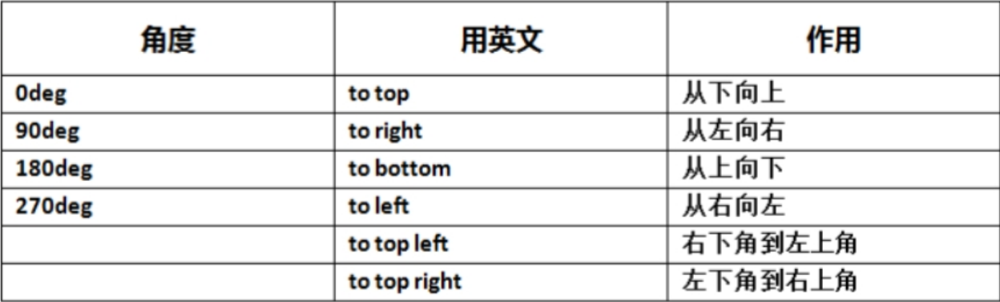
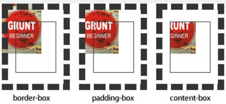

# 固定宽度被挤压 flex为1的元素宽度超出父元素

当子元素设置固定宽度，如果整体宽度不足时，会把固定宽度给压缩，解决方法: 给固定宽度的元素添加flex-shrink:0。
flex-shrink：指定了 flex 元素的收缩规则。

设置右边元素flex：1，当右边元素宽度超过父元素时，会造成右边宽度溢出。
解决方案：给右侧设置了flex:1;的元素，同时设置width:0

# box-shadow

`box-shadow` 是一种 CSS 属性，可以用来向一个元素添加一个或多个阴影。它的语法如下：

```
css复制代码box-shadow: h-offset v-offset blur spread color inset;
```

其中：

- `h-offset`：横向偏移量，可以是正数也可以是负数，表示阴影相对于元素的水平位置。
- `v-offset`：纵向偏移量，可以是正数也可以是负数，表示阴影相对于元素的垂直位置。
- `blur`：模糊半径，用来控制阴影的模糊程度，值越大阴影越模糊。
- `spread`：扩散半径，用来控制阴影的大小，如果为正数，阴影会扩大；如果为负数，阴影会缩小。
- `color`：阴影颜色，可以使用任何合法的 CSS 颜色值。
- `inset`：可选属性，用来指定阴影是否在元素内部而不是外部。

以下是一个示例，展示了如何使用 `box-shadow` 为一个 div 元素添加阴影效果：

```css
div {
  box-shadow: 2px 2px 4px rgba(0, 0, 0, 0.3);
}
```

这将在 div 元素的右下角添加一个模糊半径为 4 像素、颜色为黑色透明度为 0.3 的阴影。

一些技巧和注意点：

- 可以使用 `,` 分隔多个阴影，来为元素添加多个阴影效果；
- 如果要制作带有内阴影的效果，需要在 `box-shadow` 后面添加 `inset` 属性，如：`box-shadow: inset 2px 2px 4px rgba(0, 0, 0, 0.3);`
- 可以使用 `rgba()` 函数来设置阴影颜色，这样可以指定颜色和透明度；
- 在设置多个阴影时，建议将模糊半径和扩散半径较小的阴影放在后面，这样可以避免阴影出现重叠或者覆盖的情况。

添加多个投影，使用逗号隔开即可

```
box-shadow: 

  X轴偏移量 Y轴偏移量 [阴影模糊半径] [阴影扩展半径] [阴影颜色] [投影方式],

  X轴偏移量 Y轴偏移量 [阴影模糊半径] [阴影扩展半径] [阴影颜色] [投影方式];
```

注意：inset 可以写在参数的第一个或最后一个，其它位置是无效的。

阴影模糊半径与阴影扩展半径的区别

阴影模糊半径：此参数可选，其值只能是为正值，如果其值为0时，表示阴影不具有模糊效果，其值越大阴影的边缘就越模糊；

阴影扩展半径：此参数可选，其值可以是正负值，如果值为正，则整个阴影都延展扩大，反之值为负值时，则缩小。一个-5px的扩张半径会把投影的宽度和高度各减少10px（即每边各5px）

多边投影

只需把阴影藏进一侧，另一侧自然露出就好。因此，扩张半径不应设为模糊半径的相反值，而应该是这个相反值的一半。

需要指定两个偏移量，因为我们希望投影在水平和垂直方向上同时移动。它们的值需要大于或等于模糊半径的一半，因为我们希望把投影藏进另外两条边之内。

```css
.boxshadow-outset{
    width:100px;
	height:100px;
    box-shadow: 4px 4px  6px #666, 4px -4px 6px #456 inset; 
}
.boxshadow-inset{
    width:100px;
    height:100px;
    box-shadow:4px 4px 6px #666 inset; 
}
.boxshadow-multi{
    width:100px;
    height:100px;
    box-shadow:4px 2px 6px #f00, -4px -2px 6px #000, 0px 0px 12px 5px #33CC00 inset;
}
```

```html
<h2>外阴影</h2>
<div class="boxshadow-outset">
</div>
<br />
<h2>内阴影</h2>
<div class="boxshadow-inset">
</div>
<br />
<h2>多阴影</h2>
<div class="boxshadow-multi">
</div>
```

# border-radius

```
其值可以为多个，最多为4个；
      四个值时：分别为左上，右上，右下，左下，
      两个值时：左上-右下  右上-左下
      三个值时：左上 右上-坐下  右下
      一个值时：四个角都为同样的，
```

```css
div.circle {
    height: 100px;
    /*与width设置一致*/
    width: 100px;
    background: #9da;
    border-radius: 50px;
    /*四个圆角值都设置为宽度或高度值的一半*/
}

div.semi-circle {
    height: 100px;
    width: 50px;
    background: #9da;
    border-radius: 20px 10px;
}
```


# border-image

定义要使用的边框图像。可以使用以下属性进行设置：

border-image-source - 设置要用作边框的图像的路径。

border-image-slice - 定义如何切割图像以适应边框。例如，可以设置一个数字表示每个边缘上的像素数，也可以使用百分比表示法（例如50%）。

border-image-width - 定义边框图像的宽度。默认情况下，边框图像被拉伸以填充整个边框区域，但您可以使用此属性来更改其大小。

border-image-repeat - 定义在边框周围重复图像的方式。默认情况下，图像将在边框周围平铺。

 有几个参数：no-repeat round stretch repeat

将border-image属性设置为`border-image: <source> <slice> <width> <repeat>`。在这里，您可以指定上述属性的值，以便将图像设置为元素的边框。

下面是一个示例CSS代码块，展示了如何使用border-image属性：

```css
.my-element {
 border-image: url(border.png) 30 repeat;
 border-width: 30px;
}
```

在这个例子中，我们将border-image设置为一个名为border.png的图像，使用border-image-slice切割边框，

使用border-image-width属性控制边框图像的大小，最后使用border-image-repeat重复边框图像。同时，border-width属性定义了边框的宽度

```css
.border_image {
    margin:0 auto;
    height:100px;
    line-height:100px;
    text-align:center;
    font-size:30px;
    width:450px;
    border:15px solid #ccc;
    border-image: url('http://img.mukewang.com/52e22a1c0001406e03040221.jpg') 70  repeat;
}
```

```html
<div class="border_image"></div>
```

# 颜色渐变

**线性渐变**

```css
background-image:linear-gradient(to left top, #fff,#999);
```



| 角度   | 用英文      | 作用           |
| ------ | ----------- | -------------- |
| 0deg   | to top      | 从下向上       |
| 90deg  | to right    | 从左向右       |
| 180deg | to bottom   | 从上向下       |
| 270deg | to left     | 从右向左       |
|        | to top left | 右下角到左上角 |
|        | to toright  | 左下角到右上角 |

CSS线性渐变是一种可以用来为元素的背景、边框等属性添加平滑颜色过渡效果的方式，可以通过指定渐变的起始点和结束点，以及沿着渐变轴线上的颜色分布来创建。

要使用 CSS 线性渐变，我们需要使用 linear-gradient() 函数，并在其中定义一组颜色值。该函数的语法如下：

```css
background: linear-gradient(direction, color-stop1, color-stop2, ...);
```

其中，direction 表示渐变的方向，可以使用角度或关键字（如 to top 或 to right）进行定义；color-stop 表示渐变中每个颜色的位置和颜色值。位置可以使用百分比或关键字（如 left 或 top）进行定义。

以下是一个示例 CSS 代码，它演示了如何在一个 div 元素的背景上应用一条从左到右的线性渐变：

```css
div {
    background: linear-gradient(to right, #FF0000, #0000FF);
}
```

这将生成一个从红色到蓝色的渐变背景，从左侧向右侧渐变。

您还可以使用多个 color-stop 值来定义更复杂的渐变效果，如下所示：

```css
div {
    background: linear-gradient(to right, #FF0000, #FFFF00, #0000FF);
}
```

这将生成一个从红色到黄色再到蓝色的渐变背景，从左侧向右侧渐变。

需要注意的是，在某些老版本的浏览器中，CSS 线性渐变可能不被支持。如果您的网站需要在旧版浏览器上运行，请确保提供替代方案或考虑使用其他背景属性来实现相似的效果。

**径向渐变**

CSS中的径向渐变是指从中心向外辐射的颜色平滑过渡。以下是一个示例：

```css
background: radial-gradient(red, yellow, green);
```

这将在元素的背景中创建一个从红色到黄色到绿色的径向渐变。

您还可以使用关键字，例如`at`和`circle`，来更好地控制径向渐变的位置和形状。例如，以下代码将在元素的中心创建一个圆形径向渐变：

```
background: radial-gradient(circle at center, red, yellow, green);
```

关键字`circle`指定了渐变的形状，`at center`指定了渐变的位置为中心。

CSS渐变还支持使用`ellipse`来指定椭圆形状的径向渐变。例如，以下代码将创建一个沿着元素的x轴和y轴的椭圆形径向渐变：

```
background: radial-gradient(ellipse at center, red, yellow, green);
```

# 文本省略

**text-overflow**用来设置是否使用一个**省略标记**（...）标示对象内文本的溢出。

```css
text-overflow: clip | ellipsis
```

clip：表示剪切
ellipis: 表示显示 省略标记

但是**text-overflow**只是用来说明文字溢出时用什么方式显示，要实现溢出时产生**省略号**的效果，还须定义**强制文本在一行内显示**（white-space:nowrap）及**溢出内容为隐藏**（overflow:hidden），只有这样才能实现**溢出文本显示省略号**的效果，代码如下

```css
text-overflow:ellipsis; 
overflow:hidden; 
white-space:nowrap; 
```

同时，**word-wrap**也可以用来设置**文本行为**，当前行超过指定容器的边界时是否断开转行。

```css
word-wrap: normal | break-word
```

normal: 表示控制连续文本换行
break-word:表示内容在边界内换行

**normal**为浏览器默认值，**break-word**设置在**长单词**或 **URL地址**内部进行换行，此属性不常用，用浏览器默认值即可。

# text-show

text-shadow可以用来设置文本的阴影效果。

**语法：**

```css
text-shadow: X-Offset Y-Offset blur color;
```

X-Offset：表示阴影的水平偏移距离，其值为正值时阴影向右偏移，反之向左偏移；   

Y-Offset：是指阴影的垂直偏移距离，如果其值是正值时，阴影向下偏移，反之向上偏移；

Blur：是指阴影的模糊程度，其值不能是负值，如果值越大，阴影越模糊，反之阴影越清晰，如果不需要阴影模糊可以将Blur值设置为0；

Color：是指阴影的颜色，其可以使用rgba色。

比如，我们可以用下面代码实现设置阴影效果。

```css
text-shadow: 0 1px 1px #fff
```

 # 背景

##  background-origin

设置元素背景图片的**原始起始位置**。

```css
background-origin ： border-box | padding-box | content-box;
```

参数分别表示背景图片是从**边框**，还是**内边距（默认值）**，或者是**内容区域**开始显示。

 

**需要注意的是**，如果背景不是**no-repeat**，这个属性无效，它会从边框开始显示。

## background-clip

用来将背景图片做适当的**裁剪**以适应实际需要。

```css
background-clip ： border-box | padding-box | content-box | no-clip
```

参数分别表示从**边框、**或**内填充**，或者**内容区域**向外裁剪背景。**no-clip**表示不裁切，和**参数border-box**显示同样的效果。`backgroud-clip`默认值为**border-box**。

 

根据所选，展示选择后对应里面的内容

## background-size

设置背景图片的大小，以**长度值**或**百分比**显示，还可以通过**cover**和**contain**来对图片进行伸缩。

```css
background-size: auto | <长度值> | <百分比> | cover | contain
```

1、`auto`：默认值，不改变背景图片的原始高度和宽度；

2、`<长度值>`：成对出现如200px 50px，将背景图片宽高依次设置为前面两个值，当设置一个值时，将其作为图片宽度值来**等比缩放**；

3、`<百分比>`：0％~100％之间的任何值，将背景图片宽高依次设置为所在元素宽高乘以前面百分比得出的数值，当设置一个值时同上；

4、`cover`：顾名思义为**覆盖**，即将背景图片等比缩放以**填满整个容器**；

5、`contain`：容纳，即将背景图片等比缩放至**某一边紧贴容器边缘为止**。

## 多重背景

我们可以使用逗号分隔的方式加入多个图片，其他属性也对应的使用逗号分隔开

```css
.demo{
    width: 300px;
    height: 140px;
    border: 1px solid #999;
    background-image: 										url(http://img.mukewang.com/54cf2365000140e600740095.jpg),
        url(http://img.mukewang.com/54cf238a0001728d00740095.jpg),
        url(http://img.mukewang.com/54cf23b60001fd9700740096.jpg);
    background-position: left top , 100px 0, 120px 0;
    background-repeat: no-repeat, no-repeat, no-repeat;
    margin:0 0 20px 0;
}
```

```html
<div class="demo"></div>
```

