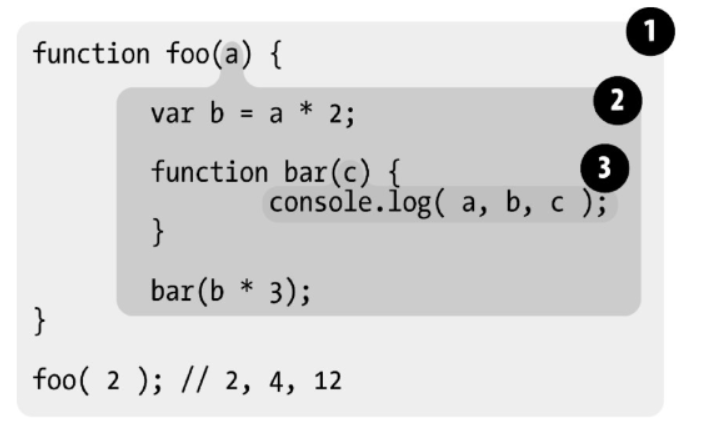

## 什么是作用域

介绍作用域前我们先看几个问题？

这些变量住在哪里？换句话说，它们储存在哪里？最重要的是，程序需要时如何找到它们？

设计良好的规则来存储变量，并且之后可以方便地找到这些变量。这套规则被称为作用域

### 1.1 编译原理

尽管通常将JavaScript归类为“动态”或“解释执行”语言，但事实上它是一门编译语言

在传统编译语言的流程中，程序中的一段源代码在执行之前会经历三个步骤，统称为“编译”

**分词/词法分析**

这个过程会将由字符组成的字符串分解成（对编程语言来说）有意义的代码块，这些代码块被称为词法单元

考虑程序var a = 2;。这段程序通常会被分解成为下面这些词法单元：var、a、=、2 、;。空格是否会被当作词法单元，取决于空格在这门语言中是否具有意义。

分词（tokenizing）和词法分析（Lexing）之间的区别：在于词法单元的识别是通过有状态还是无状态的方式进行的。简单来说，如果词法单元生成器在判断a是一个独立的词法单元还是其他词法单元的一部分时，调用的是有状态的解析规则，那么这个过程就被称为词法分析

**解析/语法分析**

这个过程是将词法单元流（数组）转换成一个由元素逐级嵌套所组成的代表了程序语法结构的树。这个树被称为“抽象语法树”（AST）

var a = 2；的抽象语法树中可能会有一个叫作VariableDeclaration的顶级节点，接下来是一个叫作Identifier（它的值是a）的子节点，以及一个叫作AssignmentExpression的子节点。AssignmentExpression节点有一个叫作NumericLiteral（它的值是2）的子节点。

**代码生成**

将AST转换为可执行代码的过程被称为代码生成。这个过程与语言、目标平台等息息相关。

简单来说就是有某种方法可以将var a =2；的AST转化为一组机器指令，用来创建一个叫作a的变量（包括分配内存等），并将一个值储存在a中。


JavaScript引擎不会有大量的（像其他语言编译器那么多的）时间用来进行优化，因为与其他语言不同，JavaScript的编译过程不是发生在构建之前的

对于JavaScript来说，大部分情况下编译发生在代码执行前的几微秒（甚至更短！）的时间内。

任何JavaScript代码片段在执行前都要进行编译（通常就在执行前）。因此，JavaScript编译器首先会对var a =2；这段程序进行编译，然后做好执行它的准备，并且通常马上就会执行它。

### 1.2 理解作用域

对程序var a = 2处理的过程：

先来看看几个重要的角色

 **引擎**

从头到尾负责整个JavaScript程序的编译及执行过程。

**编译器**

引擎的好朋友之一，负责语法分析及代码生成等脏活累活（详见前一节的内容）。

**作用域**

引擎的另一位好朋友，负责收集并维护由所有声明的标识符（变量）组成的一系列查询，并实施一套非常严格的规则，确定当前执行的代码对这些标识符的访问权限

分解var a = 2，看看这些角色都做了什么

编译器首先会将这段程序分解成词法单元，然后将词法单元解析成一个树结构。但是当编译器开始进行代码生成时，它对这段程序的处理方式会和预期的有所不同

可以合理地假设编译器所产生的代码能够用下面的伪代码概括：

为一个变量分配内存，将其命名为a，然后将值2保存进这个变量，这并不完全正确

事实上编译器会进行如下处理。

1．遇到var a，编译器会询问作用域是否已经有一个该名称的变量存在于同一个作用域的集合中。如果是，编译器会忽略该声明，继续进行编译；否则它会要求作用域在当前作用域的集合中声明一个新的变量，并命名为a。

2．接下来编译器会为引擎生成运行时所需的代码，这些代码被用来处理a = 2这个赋值操作。引擎运行时会首先询问作用域，在当前的作用域集合中是否存在一个叫作a的变量。如果是，引擎就会使用这个变量；如果否，引擎会继续查找该变量（查看1.3节）。如果引擎最终找到了a变量，就会将2赋值给它。否则引擎就会举手示意并抛出一个异常！

总结：变量的赋值操作会执行两个动作，首先编译器会在当前作用域中声明一个变量（如果之前没有声明过），然后在运行时引擎会在作用域中查找该变量，如果能够找到就会对它赋值。


编译器在编译过程的第二步中生成了代码，引擎执行它时，会通过查找变量a来判断它是否已声明过。查找的过程由作用域进行协助，但是引擎执行怎样的查找，会影响最终的查找结果

引擎会为变量a进行LHS查询。另外一个查找的类型叫作RHS。

当变量出现在赋值操作的左侧时进行LHS查询，出现在右侧时进行RHS查询。

RHS查询与简单地查找某个变量的值别无二致，而LHS查询则是试图找到变量的容器本身，从而可以对其赋值

在看看`console.log(a)`

其中对a的引用是一个RHS引用，因为这里a并没有赋予任何值。相应地，需要查找并取得a的值，这样才能将值传递给console.log(..)。

相比 a = 2;

a的引用则是LHS引用，因为实际上我们并不关心当前的值是什么，只是想要为=2这个赋值操作找到一个目标。

```js
function foo(a) {
    console.log(a);// 2
}
foo(2)
```

foo (..)函数的调用需要对foo进行RHS引用，意味着“去找到foo的值，并把它给我”

代码中隐式的a=2操作可能很容易被你忽略掉。这个操作发生在2被当作参数传递给foo(..)函数时，2会被分配给参数a。为了给参数a（隐式地）分配值，需要进行一次LHS查询

这里还有对a进行的RHS引用，并且将得到的值传给了console.log(..)。console. log(..)本身也需要一个引用才能执行，因此会对console对象进行RHS查询，并且检查得到的值中是否有一个叫作log的方法

引擎和作用域之间的对话：

```js
function foo(a) {
    console.log(a);// 2
}
foo(2)
```

引擎：我说作用域，我需要为foo进行RHS引用。你见过它吗？

作用域：别说，我还真见过，编译器那小子刚刚声明了它。它是一个函数，给你。

引擎：哥们太够意思了！好吧，我来执行一下foo。

引擎：作用域，还有个事儿。我需要为a进行LHS引用，这个你见过吗？

作用域：这个也见过，编译器最近把它声名为foo的一个形式参数了，拿去吧。

引擎：大恩不言谢，你总是这么棒。现在我要把2赋值给a。

引擎：哥们，不好意思又来打扰你。我要为console进行RHS引用，你见过它吗？

作用域：咱俩谁跟谁啊，再说我就是干这个。这个我也有，console是个内置对象。给你。

引擎：么么哒。我得看看这里面是不是有log(..)。太好了，找到了，是一个函数。

引擎：哥们，能帮我再找一下对a的RHS引用吗？虽然我记得它，但想再确认一次。

作用域：放心吧，这个变量没有变动过，拿走，不谢。

引擎：真棒。我来把a的值，也就是2，传递进log(..)。

检测

```js
function foo(a) {
    var b = a;
    return a + b;
}
var c = foo(2)
```

LHS查询（3处）

RHS查询（4处）

### 作用域嵌套

当一个块或函数嵌套在另一个块或函数中时，就发生了作用域的嵌套

在当前作用域中无法找到某个变量时，引擎就会在外层嵌套的作用域中继续查找，直到找到该变量，或抵达最外层的作用域（也就是全局作用域）为止；

```js
function foo(a) {
console.log(a+b)
}
var b = 2;
foo(2)  // 4
```

引擎：foo的作用域兄弟，你见过b吗？我需要对它进行RHS引用。

作用域：听都没听过，走开。

引擎：foo的上级作用域兄弟，咦？有眼不识泰山，原来你是全局作用域大哥，太好了。你见过b吗？我需要对它进行RHS引用。

作用域：当然了，给你吧。


遍历嵌套作用域链的规则很简单：引擎从当前的执行作用域开始查找变量，如果找不到，就向上一级继续查找。当抵达最外层的全局作用域时，无论找到还是没找到，查找过程都会停止。

### 异常

在变量还没有声明（在任何作用域中都无法找到该变量）的情况下，这两种查询的行为是不一样的。

```JS
function foo(a) {
console.log(a+b)
    b=a
}

foo(2) 
```

如果RHS查询在所有嵌套的作用域中遍寻不到所需的变量，引擎就会抛出ReferenceError异常。值得注意的是，ReferenceError是非常重要的异常类型

相较之下，当引擎执行LHS查询时，如果在顶层（全局作用域）中也无法找到目标变量，全局作用域中就会创建一个具有该名称的变量，并将其返还给引擎，前提是程序运行在非“严格模式”下。

在严格模式中LHS查询失败时，并不会创建并返回一个全局变量，引擎会抛出同RHS查询失败时类似的ReferenceError异常。

如果RHS查询找到了一个变量，但是你尝试对这个变量的值进行不合理的操作，比如试图对一个非函数类型的值进行函数调用，或者引用null或undefined类型的值中的属性，那么引擎会抛出另外一种类型的异常，叫作TypeError


ReferenceError同作用域判别失败相关，而TypeError则代表作用域判别成功了，但是对结果的操作是非法或不合理的

# 词法作用域

作用域共有两种主要的工作模型。第一种是最为普遍的，被大多数编程语言所采用的词法作用域，我们会对这种作用域进行深入讨论。另外一种叫作动态作用域


## 词法阶段

词法作用域就是定义在词法阶段的作用域。换句话说，词法作用域是由你在写代码时将变量和块作用域写在哪里来决定的，因此当词法分析器处理代码时会保持作用域不变（大部分情况下是这样的）

比如：

 

❶ 包含着整个全局作用域，其中只有一个标识符：foo。

❷ 包含着foo所创建的作用域，其中有三个标识符：a、bar和b。

❸ 包含着bar所创建的作用域，其中只有一个标识符：c。

作用域气泡由其对应的作用域块代码写在哪里决定，它们是逐级包含的

bar的气泡被完全包含在foo所创建的气泡中，唯一的原因是那里就是我们希望定义函数bar的位置

引擎执行console.log(..)声明，并查找a、b和c三个变量的引用。它首先从最内部的作用域，也就是bar(..)函数的作用域气泡开始查找。引擎无法在这里找到a，因此会去上一级到所嵌套的foo(..)的作用域中继续查找。在这里找到了a，因此引擎使用了这个引用。对b来讲也是一样的。而对c来说，引擎在bar(..)中就找到了它。如果a、c都存在于bar(..)和foo(..)的内部，console.log(..)就可以直接使用bar(..)中的变量，而无需到外面的foo(..)中查找。

如果在当前作用域查找到想要的变量，引擎就不会去外面继续查找，而使用当前作用域中的变量；

无论函数在哪里被调用，也无论它如何被调用，它的词法作用域都只由函数被声明时所处的位置决定

词法作用域意味着作用域是由书写代码时函数声明的位置来决定的。编译的词法分析阶段基本能够知道全部标识符在哪里以及是如何声明的，从而能够预测在执行过程中如何对它们进行查找。

# 函数作用域

在JS中，美声明一个函数就会为自身创建一个作用域，

```js
function foo(a) {
    var b = 2;
    function bar() {
        
    }
    var c = 3;
}

```

在上面的例子中，

无论标识符声明出现在作用域中的何处，这个标识符所代表的变量或函数都将附属于所处作用域的气泡

bar有自己的作用域，全局也有自己的作用域，包含了foo

对于变量a，b，c都附属在foo的作用域内，所以外界无法访问他们，而在foo

的内部都是可以被访问的。

函数作用域是：输入这个函数的全部变量，都可以在整个函数的范围内使用或者在其嵌套的作用域内使用；

## 隐藏内部实现

```js
function doSomething(a) {
    b = a+ doSomethingElse(a*2);
    console.log(b * 3)
}
function doSomethingElse(a) {
    return a- 1
    
}
var b;
doSomething(2); // 15
```

变量b和函数doSomethingElse(..)应该是doSomething(..)内部具体实现的“私有”内容。给予外部作用域对b和doSomethingElse(..)的“访问权限”不仅没有必要，而且可能是“危险”的，因为它们可能被有意或无意地以非预期的方式使用，从而导致超出了doSomething(..)的适用条件。更“合理”的设计会将这些私有的具体内容隐藏在doSomething(..)内部;

```js
function doSomething(a) {
    function doSomethingElse(a) {
    	return a- 1
	}
    var b;
    b = a+ doSomethingElse(a*2);
    console.log(b * 3)
}

var b;
```

b和doSomethingElse(..)都无法从外部被访问，而只能被doSomething(..)所控制