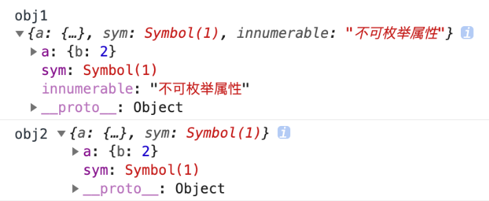
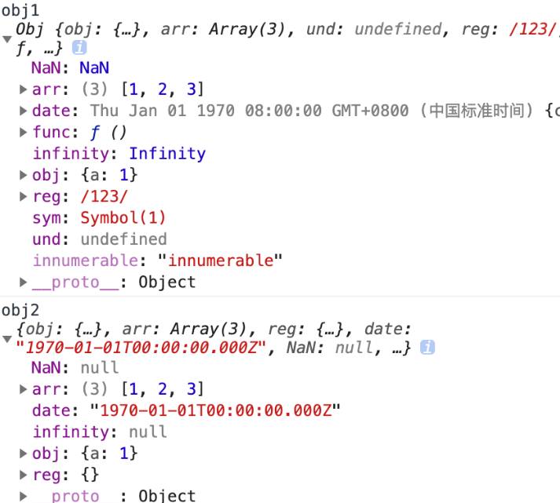
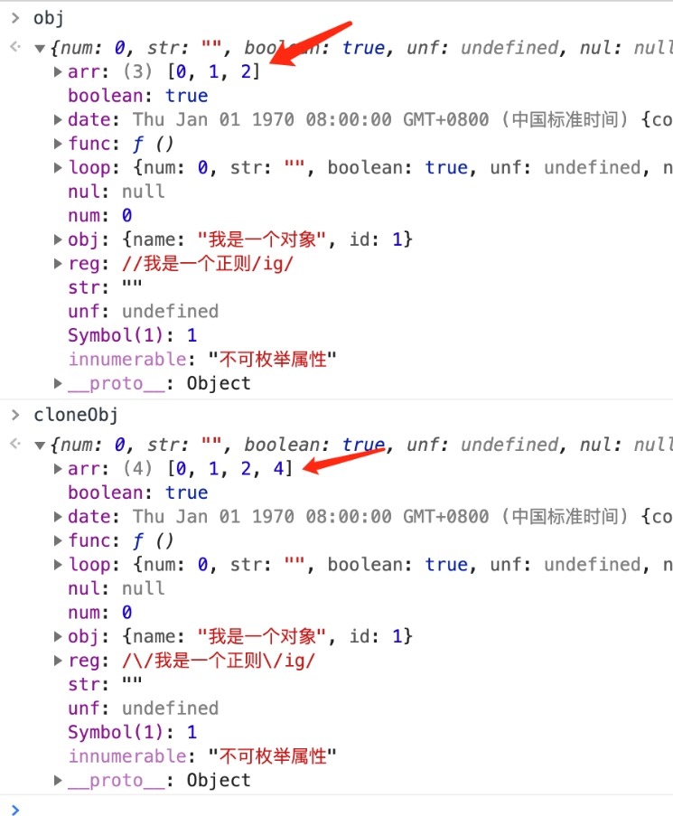

# 数据类型的分类、判断、类型转换

## 分类

| 类型                | 范围                | 判断方式 |
| ------------------- | ------------------- | -------- |
| 数字（number）      | 任意数值            | typeof   |
| 字符串（string）    | 任意字符串          | typeof   |
| 布尔值（boolean）   | true/false          | typeof   |
| 未定义（undefined） | undefined           | typeof   |
| 空值（null）        | null                | ===      |
| 对象（object）      | Array function null |          |
| 符号（symbol）      |                     | typeof   |

对象(引用)类型
* Object ----- typeof/instanceof
* Array ------ instanceof
* Function ---- typeof

其中Arrray和function是object的子类型

## 判断

**typeof**

typeof返回的是一个小写字母的字符串

* 可以区别: number, string, boolean, undefined, function
* 不能区别: null与对象、 一般对象与数组

```js
typeof 1 // 'number'
typeof '1' // 'string'
typeof undefined // 'undefined'
typeof true // 'boolean'
typeof Symbol() // 'symbol'


typeof null // 'object'
typeof [] // 'object'
typeof {} // 'object'
typeof console // 'object'
typeof console.log // 'function'
```

在使用typeof操作时，得到的结果并不是该遍历的类型，而是该变量持有值的类型

> JavaScript中的变量没有类型

**instanceof**

* 专门用来判断对象数据的类型： Object, Array与Function
* 不能正确判断基础数据类型

```js
let Car = function() {}
let benz = new Car()
benz instanceof Car // true  Object.getPrototypeOf(benz) === Car.prototype
let car = new String('Mercedes Benz')
car instanceof String // true
let str = 'Covid-19'
str instanceof String // false
```

手写instanceof

```js
function myInstanceof(left, right) {
  // 这里先用typeof来判断基础数据类型，如果是，直接返回false
  if(typeof left !== 'object' || left === null) return false;
  // getProtypeOf是Object对象自带的API，能够拿到参数的原型对象
  let proto = Object.getPrototypeOf(left);
  while(true) {                  //循环往下寻找，直到找到相同的原型对象
    if(proto === null) return false;
    if(proto === right.prototype) return true;//找到相同原型对象，返回true
    	proto = Object.getPrototypeof(proto);
    }
}
// 验证一下自己实现的myInstanceof是否OK
console.log(myInstanceof(new Number(123), Number));    // true
console.log(myInstanceof(123, Number));                // false
```

相关知识

**`instanceof`** **运算符**用于检测构造函数的 `prototype` 属性是否出现在某个实例对象的原型链上。

**===**

检查两个操作数是否相等，不会对左右两边的值进行转换，属于严格相等

可以判断: undefined和null

```js
undefined === undefined // true
null === null
```

**Object.prototype.toString**

toString() 是 Object 的原型上的方法，调用该方法，可以统一返回格式为` [object Xxx]`的字符串

对于 Object 对象，直接调用 toString() 就能返回 `[object Object]`而对于其他对象，则需要通过 call 来调用，才能返回正确的类型信息

```js
Object.prototype.toString({})       // "[object Object]"
Object.prototype.toString.call({})  // 同上结果，加上call也ok
Object.prototype.toString.call(1)    // "[object Number]"
Object.prototype.toString.call('1')  // "[object String]"
Object.prototype.toString.call(true)  // "[object Boolean]"
Object.prototype.toString.call(function(){})  // "[object Function]"
Object.prototype.toString.call(null)   //"[object Null]"
Object.prototype.toString.call(undefined) //"[object Undefined]"
Object.prototype.toString.call(/123/g)    //"[object RegExp]"
Object.prototype.toString.call(new Date()) //"[object Date]"
Object.prototype.toString.call([])       //"[object Array]"
Object.prototype.toString.call(document)  //"[object HTMLDocument]"
Object.prototype.toString.call(window)   //"[object Window]"
```

手写一个数据类型判断的方法

```js
function getType(obj){
  let type  = typeof obj;
  if (type !== "object") {    // 先进行typeof判断，如果是基础数据类型，直接返回
    return type;
  }
  // 对于typeof返回结果是object的，再进行如下的判断，正则返回结果
  return Object.prototype.toString.call(obj).replace(/^\[object (\S+)\]$/, '$1');  // 注意正则中间有个空格
}

getType([])     // "Array" typeof []是object，因此toString返回
getType('123')  // "string" typeof 直接返回
getType(window) // "Window" toString返回
getType(null)   // "Null"首字母大写，typeof null是object，需toString来判断
getType(undefined)   // "undefined" typeof 直接返回
getType()            // "undefined" typeof 直接返回
getType(function(){}) // "function" typeof能判断，因此首字母小写
getType(/123/g)      //"RegExp" toString返回
```

相关知识：正则表达式中的replace

语法 `str.replace(regexp|substr, newSubStr|function)`

第一个参数为正则或一个字符串
正则匹配到的内容会被第二个参数的返回值替换掉，字符串匹配到的内容会被第二个参数替换掉

第二个参数为要替换的字符串或一个函数
将第一个匹配到的内容替换为newSubstr， 函数的返回值替换第一个参数匹配到的结果，

返回部分或全部有替代模式所取代的新的字符串

上面正则的`(\S+)`代表将`[object Window]`的第二个参数通过$1返回

## 类型转换

先测试下面的代码

```js
'123' == 123   
'' == null    
'' == 0        
[] == 0       
[] == ''      
[] == ![]      
null == undefined 
Number(null)     
Number('')      
parseInt('');   
{}+10 
let obj = {
    [Symbol.toPrimitive]() {
        return 200;
    },
    valueOf() {
        return 300;
    },
    toString() {
        return 'Hello';
    }
}
console.log(obj + 200); // 这里打印出来是多少？
```

强制类型转换
强制类型转换方式包括 Number()、parseInt()、parseFloat()、toString()、String()、Boolean()，这几种方法都比较类似，通过字面意思可以很容易理解，都是通过自身的方法来进行数据类型的强制转换

上面代码中，第 8 行的结果是 0，第 9 行的结果同样是 0，第 10 行的结果是 NaN。这些都是很明显的强制类型转换，因为用到了 Number() 和 parseInt()。

Number() 方法的强制转换规则

如果是**布尔值**，true 和 false 分别被转换为 1 和 0；
如果是**数字**，返回自身；
如果是 **null**，返回 0；
如果是 **undefined**，返回 NaN；
如果是**字符串**，遵循以下规则：
		如果字符串中只包含数字（或者是 0X / 0x 开头的十六进制数字字符串，允许包含正负号），则将其转换为十进制；如果字符串中包含有效的浮点格式，将其转换为浮点数值；如果是空字符串，将其转换为 0；如果不是以上格式的字符串，均返回 NaN；
如果是 **Symbol**，抛出错误；
如果是**对象**，并且部署了 [Symbol.toPrimitive] ，那么调用此方法，否则调用对象的 valueOf() 方法，然后依据前面的规则转换返回的值；如果转换的结果是 NaN ，则调用对象的 toString() 方法，再次依照前面的顺序转换返回对应的值

例如：

```js
Number(true);        // 1
Number(false);       // 0
Number('0111');      //111
Number(null);        //0
Number('');          //0
Number('1a');        //NaN
Number(-0X11);       //-17
Number('0X11')       //17
```

Boolean() 方法的强制转换规则

这个方法的规则是：除了 undefined、 null、 false、 ''、 0（包括 +0，-0）、 NaN 转换出来是 false，其他都是 true。

例如：

```js
Boolean(0)          //false
Boolean(null)       //false
Boolean(undefined)  //false
Boolean(NaN)        //false
Boolean(1)          //true
Boolean(13)         //true
Boolean('12')       //true
```

隐式类型转换
凡是通过逻辑运算符 (&&、 ||、 !)、运算符 (+、-、*、/)、关系操作符 (>、 <、 <= 、>=)、相等运算符 (==) 或者 if/while 条件的操作，如果遇到两个数据类型不一样的情况，都会出现隐式类型转换。

**'==' 的隐式类型转换规则**

如果类型相同，无须进行类型转换；

如果其中一个操作值是 null 或者 undefined，那么另一个操作符必须为 null 或者 undefined，才会返回 true，否则都返回 false；

如果其中一个是 Symbol 类型，那么返回 false；

两个操作值如果为 string 和 number 类型，那么就会将字符串转换为 number；不能转换为number的则为false

如果一个操作值是 boolean，那么转换成 number；

如果一个操作值为 object 且另一方为 string、number 或者 symbol，就会把 object 转为原始类型再进行判断（调用 object 的 valueOf/toString 方法进行转换）。

```js
null == undefined       // true  
null == 0               // false 
'' == null              // false
'' == 0                 // true  字符串转隐式转换成Number之后再对比
'123' == 123            // true  字符串转隐式转换成Number之后再对比
0 == false              // true  布尔型隐式转换成Number之后再对比
1 == true               // true  布尔型隐式转换成Number之后再对比
var a = {
  value: 0,
  valueOf: function() {
    this.value++;
    return this.value;
  }
};
// 注意这里a又可以等于1、2、3
console.log(a == 1 && a == 2 && a ==3);  //true Object隐式转换
// 注：但是执行过3遍之后，再重新执行a==3或之前的数字就是false，因为value已经加上去了
```

**'+' 的隐式类型转换规则**

'+' 号操作符，不仅可以用作数字相加，还可以用作字符串拼接。仅当 '+' 号两边都是数字时，进行的是加法运算；如果两边都是字符串，则直接拼接，无须进行隐式类型转换。

除了上述比较常规的情况外，还有一些特殊的规则，如下所示。

如果其中有一个是字符串，另外一个是 undefined、null 或布尔型，则调用 toString() 方法进行字符串拼接；如果是纯对象、数组、正则等，则默认调用对象的转换方法会存在优先级，然后再进行拼接。

如果其中有一个是数字，另外一个是 undefined、null、布尔型或数字，则会将其转换成数字进行加法运算

如果其中一个是字符串、一个是数字，则按照字符串规则进行拼接。

下面还是结合代码来理解上述规则，如下所示。

```js
1 + 2        // 3  常规情况
'1' + '2'    // '12' 常规情况
// 下面看一下特殊情况
'1' + undefined   // "1undefined" 规则1，undefined转换字符串
'1' + null        // "1null" 规则1，null转换字符串
'1' + true        // "1true" 规则1，true转换字符串
'1' + 1n          // '11' 比较特殊字符串和BigInt相加，BigInt转换为字符串
1 + undefined     // NaN  规则2，undefined转换数字相加NaN
1 + null          // 1    规则2，null转换为0
1 + true          // 2    规则2，true转换为1，二者相加为2
1 + 1n            // 错误  不能把BigInt和Number类型直接混合相加
'1' + 3           // '13' 规则3，字符串拼接
```

整体来看，如果数据中有字符串，JavaScript 类型转换还是更倾向于转换成字符串

**Object 的转换规则**

对象转换的规则，会先调用内置的 [ToPrimitive] 函数，其规则逻辑如下：

如果部署了 Symbol.toPrimitive 方法，优先调用再返回；

调用 valueOf()，如果转换为基础类型，则返回；

调用 toString()，如果转换为基础类型，则返回；

如果都没有返回基础类型，会报错。

例如：

```js
var obj = {
  value: 1,
  valueOf() {
    return 2;
  },
  toString() {
    return '3'
  },
  [Symbol.toPrimitive]() {
    return 4
  }
}
console.log(obj + 1); // 输出5
// 因为有Symbol.toPrimitive，就优先执行这个；如果Symbol.toPrimitive这段代码删掉，则执行valueOf打印结果为3；如果valueOf也去掉，则调用toString返回'31'(字符串拼接)
// 再看两个特殊的case：
10 + {}
// "10[object Object]"，注意：{}会默认调用valueOf是{}，不是基础类型继续转换，调用toString，返回结果"[object Object]"，于是和10进行'+'运算，按照字符串拼接规则来
[1,2,undefined,4,5] + 10
// "1,2,,4,510"，注意[1,2,undefined,4,5]会默认先调用valueOf结果还是这个数组，不是基础数据类型继续转换，也还是调用toString，返回"1,2,,4,5"，然后再和10进行运算，还是按照字符串拼接规则
```


# 深浅拷贝

## 浅拷贝

自己创建一个新的对象，来接受你要重新复制或引用的对象值。如果对象属性是基本的数据类型，复制的就是基本类型的值给新对象；但如果属性是引用数据类型，复制的就是内存中的地址，如果其中一个对象改变了这个内存中的地址，肯定会影响到另一个对象。

**一、 object.assign**

object.assign 是 ES6 中 object 的一个方法，该方法可以用于 JS 对象的合并等多个用途，其中一个用途就是可以进行浅拷贝。该方法的第一个参数是拷贝的目标对象，后面的参数是拷贝的来源对象（也可以是多个来源）。

> object.assign 的语法为：Object.assign(target, ...sources)

object.assign 的示例代码如下：

```js
let target = {};
let source = { a: { b: 1 } };
Object.assign(target, source);
console.log(target); // { a: { b: 1 } };
```

从上面的代码中可以看到，通过 object.assign 我们的确简单实现了一个浅拷贝，“target”就是我们新拷贝的对象，下面再看一个和上面不太一样的例子。

```js
let target = {};
let source = { a: { b: 2 } };
Object.assign(target, source);
console.log(target); // { a: { b: 10 } }; 
source.a.b = 10; 
console.log(source); // { a: { b: 10 } }; 
console.log(target); // { a: { b: 10 } };
```

从上面代码中我们可以看到，首先通过 Object.assign 将 source 拷贝到 target 对象中，然后我们尝试将 source 对象中的 b 属性由 2 修改为 10。通过控制台可以发现，打印结果中，三个 target 里的 b 属性都变为 10 了，证明 Object.assign 暂时实现了我们想要的拷贝效果。

但是使用 object.assign 方法有几点需要注意：

它不会拷贝对象的继承属性；

它不会拷贝对象的不可枚举的属性；

可以拷贝 Symbol 类型的属性。

可以简单理解为：Object.assign 循环遍历原对象的属性，通过复制的方式将其赋值给目标对象的相应属性，来看一下这段代码，以验证它可以拷贝 Symbol 类型的对象。

```js
let obj1 = { a:{ b:1 }, sym:Symbol(1)}; 
Object.defineProperty(obj1, 'innumerable' ,{
    value:'不可枚举属性',
    enumerable:false
});
let obj2 = {};
Object.assign(obj2,obj1)
obj1.a.b = 2;
console.log('obj1',obj1);
console.log('obj2',obj2);
```

我们来看一下控制台打印的结果，如下图所示。

 

从上面的样例代码中可以看到，利用 object.assign 也可以拷贝 Symbol 类型的对象，但是如果到了对象的第二层属性 obj1.a.b 这里的时候，前者值的改变也会影响后者的第二层属性的值，说明其中依旧存在着访问共同堆内存的问题，也就是说这种方法还不能进一步复制，而只是完成了浅拷贝的功能。

**二、扩展运算符方式**

我们也可以利用 JS 的扩展运算符，在构造对象的同时完成浅拷贝的功能。

> 扩展运算符的语法为：let cloneObj = { ...obj };

代码如下所示。

```js
/* 对象的拷贝 */
let obj = {a:1,b:{c:1}}
let obj2 = {...obj}
obj.a = 2
console.log(obj)  //{a:2,b:{c:1}} console.log(obj2); //{a:1,b:{c:1}}
obj.b.c = 2
console.log(obj)  //{a:2,b:{c:2}} console.log(obj2); //{a:1,b:{c:2}}
/* 数组的拷贝 */
let arr = [1, 2, 3];
let newArr = [...arr]; //跟arr.slice()是一样的效果
```

扩展运算符 和 object.assign 有同样的缺陷，也就是实现的浅拷贝的功能差不多，但是如果属性都是基本类型的值，使用扩展运算符进行浅拷贝会更加方便。

**三、concat拷贝数组**

数组的 concat 方法其实也是浅拷贝，所以连接一个含有引用类型的数组时，需要注意修改原数组中的元素的属性，因为它会影响拷贝之后连接的数组。不过 concat 只能用于数组的浅拷贝，使用场景比较局限。代码如下所示。

```js
let arr = [1, 2, 3];
let newArr = arr.concat();
newArr[1] = 100;
console.log(arr);  // [ 1, 2, 3 ]
console.log(newArr); // [ 1, 100, 3 ]
```


**四、slice 拷贝数组**

slice 方法也比较有局限性，因为它仅仅针对数组类型。slice 方法会返回一个新的数组对象，这一对象由该方法的前两个参数来决定原数组截取的开始和结束时间，是不会影响和改变原始数组的。

> slice 的语法为：arr.slice(begin, end);

我们来看一下 slice 怎么使用，代码如下所示。

```js
let arr = [1, 2, {val: 4}];
let newArr = arr.slice();
newArr[2].val = 1000;
console.log(arr);  //[ 1, 2, { val: 1000 } ]
```


**实现一个浅拷贝**

1. 对基础类型做一个最基本的一个拷贝；

2. 对引用类型开辟一个新的存储，并且拷贝一层对象属性。

```js
const shallowClone = (target) => {
  if (typeof target === 'object' && target !== null) {
    const cloneTarget = Array.isArray(target) ? []: {};
    for (let prop in target) {
      if (target.hasOwnProperty(prop)) {
          cloneTarget[prop] = target[prop];
      }
    }
    return cloneTarget;
  } else {
    return target;
  }
}
```

## 深拷贝

浅拷贝只是创建了一个新的对象，复制了原有对象的基本类型的值，而引用数据类型只拷贝了一层属性，再深层的还是无法进行拷贝。深拷贝则不同，对于复杂引用数据类型，其在堆内存中完全开辟了一块内存地址，并将原有的对象完全复制过来存放。

这两个对象是相互独立、不受影响的，彻底实现了内存上的分离。总的来说，深拷贝的原理可以总结如下：

将一个对象从内存中完整地拷贝出来一份给目标对象，并从堆内存中开辟一个全新的空间存放新对象，且新对象的修改并不会改变原对象，二者实现真正的分离。

现在原理你知道了，那么怎么去实现深拷贝呢？我也总结了几种方法分享给你。

方法一：乞丐版（JSON.stringify）
JSON.stringify() 是目前开发过程中最简单的深拷贝方法，其实就是把一个对象序列化成为 JSON 的字符串，并将对象里面的内容转换成字符串，最后再用 JSON.parse() 的方法将JSON 字符串生成一个新的对象。示例代码如下所示。

复制代码

```js
let obj1 = { a:1, b:[1,2,3] }
let str = JSON.stringify(obj1)；
let obj2 = JSON.parse(str)；
console.log(obj2);   //{a:1,b:[1,2,3]} 
obj1.a = 2；
obj1.b.push(4);
console.log(obj1);   //{a:2,b:[1,2,3,4]}
console.log(obj2);   //{a:1,b:[1,2,3]}
```

从上面的代码可以看到，通过 JSON.stringify 可以初步实现一个对象的深拷贝，通过改变 obj1 的 b 属性，其实可以看出 obj2 这个对象也不受影响。

但是使用 JSON.stringify 实现深拷贝还是有一些地方值得注意，我总结下来主要有这几点：

拷贝的对象的值中如果有函数、undefined、symbol 这几种类型，经过 JSON.stringify 序列化之后的字符串中这个键值对会消失；

- 拷贝 Date 引用类型会变成字符串；

- 无法拷贝不可枚举的属性；

- 无法拷贝对象的原型链；

- 拷贝 RegExp 引用类型会变成空对象；

- 对象中含有 NaN、Infinity 以及 -Infinity，JSON 序列化的结果会变成 null；

- 无法拷贝对象的循环应用，即对象成环 (obj[key] = obj)。

针对这些存在的问题，你可以尝试着用下面的这段代码亲自执行一遍，来看看如此复杂的对象，如果用 JSON.stringify 实现深拷贝会出现什么情况。

```js
function Obj() { 
  this.func = function () { alert(1) }; 
  this.obj = {a:1};
  this.arr = [1,2,3];
  this.und = undefined; 
  this.reg = /123/; 
  this.date = new Date(0); 
  this.NaN = NaN;
  this.infinity = Infinity;
  this.sym = Symbol(1);
} 
let obj1 = new Obj();
Object.defineProperty(obj1,'innumerable',{ 
  enumerable:false,
  value:'innumerable'
});
console.log('obj1',obj1);
let str = JSON.stringify(obj1);
let obj2 = JSON.parse(str);
console.log('obj2',obj2);
```

通过上面这段代码可以看到执行结果如下图所示。

 

使用 JSON.stringify 方法实现深拷贝对象，虽然到目前为止还有很多无法实现的功能，但是这种方法足以满足日常的开发需求，并且是最简单和快捷的。而对于其他的也要实现深拷贝的，比较麻烦的属性对应的数据类型，JSON.stringify 暂时还是无法满足的，那么就需要下面的几种方法了。

**二：基础版（手写递归实现）**
下面是一个实现 deepClone 函数封装的例子，通过 for in 遍历传入参数的属性值，如果值是引用类型则再次递归调用该函数，如果是基础数据类型就直接复制，代码如下所示。

```js
let obj1 = {
  a:{
    b:1
  }
}
function deepClone(obj) { 
  let cloneObj = {}
  for(let key in obj) {                 //遍历
    if(typeof obj[key] ==='object') { 
      cloneObj[key] = deepClone(obj[key])  //是对象就再次调用该函数递归
    } else {
      cloneObj[key] = obj[key]  //基本类型的话直接复制值
    }
  }
  return cloneObj
}
let obj2 = deepClone(obj1);
obj1.a.b = 2;
console.log(obj2);   //  {a:{b:1}}
```

虽然利用递归能实现一个深拷贝，但是同上面的 JSON.stringify 一样，还是有一些问题没有完全解决，例如：

这个深拷贝函数并不能复制不可枚举的属性以及 Symbol 类型；

这种方法只是针对普通的引用类型的值做递归复制，而对于 Array、Date、RegExp、Error、Function 这样的引用类型并不能正确地拷贝；

对象的属性里面成环，即循环引用没有解决。


**方法三：改进版（改进后递归实现）**

1. 针对能够遍历对象的不可枚举属性以及 Symbol 类型，我们可以使用 Reflect.ownKeys 方法；

2. 当参数为 Date、RegExp 类型，则直接生成一个新的实例返回；

3. 利用 Object 的 getOwnPropertyDescriptors 方法可以获得对象的所有属性，以及对应的特性，顺便结合 Object 的 create 方法创建一个新对象，并继承传入原对象的原型链；

4. 利用 WeakMap 类型作为 Hash 表，因为 WeakMap 是弱引用类型，可以有效防止内存泄漏（你可以关注一下 Map 和 weakMap 的关键区别，这里要用 weakMap），作为检测循环引用很有帮助，如果存在循环，则引用直接返回 WeakMap 存储的值。

当然，如果你在考虑到循环引用的问题之后，还能用 WeakMap 来很好地解决，并且向面试官解释这样做的目的，那么你所展示的代码，以及你对问题思考的全面性，在面试官眼中应该算是合格的了。

那么针对上面这几个问题，我们来看下改进后的递归实现的深拷贝代码应该是什么样子的，如下所示。

```js

const isComplexDataType = obj => (typeof obj === 'object' || typeof obj === 'function') && (obj !== null)
const deepClone = function (obj, hash = new WeakMap()) {
  if (obj.constructor === Date) 
  return new Date(obj)       // 日期对象直接返回一个新的日期对象
  if (obj.constructor === RegExp)
  return new RegExp(obj)     //正则对象直接返回一个新的正则对象
  //如果循环引用了就用 weakMap 来解决
  if (hash.has(obj)) return hash.get(obj)
  let allDesc = Object.getOwnPropertyDescriptors(obj)
  //遍历传入参数所有键的特性
  let cloneObj = Object.create(Object.getPrototypeOf(obj), allDesc)
  //继承原型链
  hash.set(obj, cloneObj)
  for (let key of Reflect.ownKeys(obj)) { 
    cloneObj[key] = (isComplexDataType(obj[key]) && typeof obj[key] !== 'function') ? deepClone(obj[key], hash) : obj[key]
  }
  return cloneObj
}
// 下面是验证代码
let obj = {
  num: 0,
  str: '',
  boolean: true,
  unf: undefined,
  nul: null,
  obj: { name: '我是一个对象', id: 1 },
  arr: [0, 1, 2],
  func: function () { console.log('我是一个函数') },
  date: new Date(0),
  reg: new RegExp('/我是一个正则/ig'),

[Symbol('1')]: 1,

};
Object.defineProperty(obj, 'innumerable', {
  enumerable: false, value: '不可枚举属性' }
);
obj = Object.create(obj, Object.getOwnPropertyDescriptors(obj))
obj.loop = obj    // 设置loop成循环引用的属性
let cloneObj = deepClone(obj)
cloneObj.arr.push(4)
console.log('obj', obj)
console.log('cloneObj', cloneObj)
```

我们看一下结果，cloneObj 在 obj 的基础上进行了一次深拷贝，cloneObj 里的 arr 数组进行了修改，并未影响到 obj.arr 的变化，如下图所示。

 

从这张截图的结果可以看出，改进版的 deepClone 函数已经对基础版的那几个问题进行了改进，也验证了我上面提到的那四点理论。

# 数据，变量，内存

* 什么是数据?

  * 在内存中可读的, 可传递的保存了特定信息的'东东'
  * 一切皆数据, 函数也是数据
  * 在内存中的所有操作的目标: 数据

* 什么是变量?

  * 在程序运行过程中它的值是允许改变的量
  * 一个变量对应一块小内存, 它的值保存在此内存中  

* 什么是内存?

  * 内存条通电后产生的存储空间(临时的)
  * 一块内存包含2个方面的数据
    * 内部存储的数据
    * 地址值数据
  * 内存空间的分类
    * 栈空间: 全局变量和局部变量
    * 堆空间: 对象 

* 内存,数据, 变量三者之间的关系

  * 内存是容器, 用来存储不同数据
  * 变量是内存的标识, 通过变量我们可以操作(读/写)内存中的数据  

  ```js
  // 2个引用变量指向同一个对象, 通过一个引用变量修改对象内部数据, 另一个引用变量也看得见
  var obj1 = {}
  var obj2 = obj1
  obj2.name = 'Tom'
  console.log(obj1.name)
  function f1(obj) {
    obj.age = 12
  }
  f1(obj2)
  console.log(obj1.age)
  
  // 2个引用变量指向同一个对象,让一个引用变量指向另一个对象, 另一个引用变量还是指向原来的对象
  var obj3 = {name: 'Tom'}
  var obj4 = obj3
  obj3 = {name: 'JACK'}
  console.log(obj4.name)
  function f2(obj) {
    obj = {name: 'Bob'}
  }
  f2(obj4)
  console.log(obj4.name)
  
  ```

  在js调用函数时传递变量参数时, 是值传递还是引用传递

  * 只有值传递, 没有引用传递, 传递的都是变量的值, 只是这个值可能是基本数据, 也可能是地址(引用)数据
  * 如果后一种看成是引用传递, 那就值传递和引用传递都可以有

```js
function f(a) {
    console.log(a)
  }
  var n = 4
  f(n) //传递的是n的值 --->值传递

  function f2(a) {
    a.name = 'zhangsan'
  }
  n = {}
  f2(n) // 传递的是n指向的对象 ---> 引用传递   ???
  console.log(n.name)
```

JS引擎如何管理内存?

    1. 内存生命周期
    
    1). 分配需要的内存
    2). 使用分配到的内存
    3). 不需要时将其释放/归还
    
    2. 释放内存
    
    * 为执行函数分配的栈空间内存: 函数执行完自动释放
    * 存储对象的堆空间内存: 当内存没有引用指向时, 对象成为垃圾对象, 垃圾回收器后面就会回收释放此内存

```js
var obj = {}
  obj = null // ?

  function fn () {
    var a = 3
    var b = {}
  }
  fn()
```

## 对象的理解和使用

* 什么是对象?

  * 多个数据(属性)的集合
  * 用来保存多个数据(属性)的容器

* 属性组成:

  * 属性名 : 字符串(标识)
  * 属性值 : 任意类型

* 属性的分类:

  * 一般 : 属性值不是function  描述对象的状态
  * 方法 : 属性值为function的属性  描述对象的行为

* 特别的对象

  * 数组: 属性名是0,1,2,3之类的索引
  * 函数: 可以执行的

* 如何操作内部属性(方法)

  * .属性名

  * ['属性名']: 属性名有特殊字符/属性名是一个变量

  ```js
  // 创建对象
  var p = {
    name: 'Tom',
    age: 12,
    setName: function (name) {
      this.name = name
    },
    setAge: function (age) {
      this.age = age
    }
  }
  
  // 访问对象内部数据
  console.log(p.name, p['age'])
  p.setName('Jack')
  p['age'](23)
  console.log(p['name'], p.age)
  ```

  什么时候必须使用['属性名']的方式?

  * 属性名不是合法的标识名
  * 属性名不确定

```js
// 创建对象
  var p = {}

/*一: 属性名不是合法的标识名*/
  /*需求: 添加一个属性: content-type: text/json */
  //  p.content-type = 'text/json' //不正确
  p['content-type'] = 'text/json'

/*二: 属性名不确定*/
  var prop = 'xxx'
  var value = 123
  // p.prop = value  //不正确
  p[prop] = value
  console.log(p['content-type'], p[prop])
```

## 函数的理解和使用

* 什么是函数?

  * 用来实现特定功能的, n条语句的封装体
  * 只有函数类型的数据是可以执行的, 其它的都不可以

* 为什么要用函数?

  * 提高复用性
  * 便于阅读交流

* 函数也是对象

  * `instanceof Object===true`
  * 函数有属性: `prototype`
  * 函数有方法: `call()/apply()`
  * 可以添加新的属性/方法

* 函数的3种不同角色

  * 一般函数 : 直接调用
  * 构造函数 : 通过new调用
  * 对象 : 通过`.`调用内部的属性/方法

* 函数中的this

  * 显式指定谁: `obj.xxx()`

  * 通过call/apply指定谁调用: `xxx.call(obj)`

  * 不指定谁调用: xxx()  : `window`

  * 回调函数: 看背后是通过谁来调用的: window/其它

    

    如何确定this的值?

  * test()

  * obj.test()

  * new test()

  * test.call(obj)

```js
 function Person(color) {
    console.log(this)
    this.color = color;
    this.getColor = function () {
      console.log(this)
      return this.color;
    };
    this.setColor = function (color) {
      console.log(this)
      this.color = color;
    };
  }

  Person("red"); //this是谁?

  var p = new Person("yello"); //this是谁?

  p.getColor(); //this是谁?

  var obj = {};
  p.setColor.call(obj, "black"); //this是谁?

  var test = p.setColor;
  test(); //this是谁?

  function fun1() {
    function fun2() {
      console.log(this);
    }

    fun2(); //this是谁?
  }
  fun1();
```

  ```js
  function showInfo (age) {
    if(age<18) {
      console.log('未成年, 再等等!')
    } else if(age>60) {
      console.log('算了吧!')
    } else {
      console.log('刚好!')
    }
  }
  //调用
  showInfo(17)
  showInfo(22)

  /*
   函数也是对象
   */
  function fn() {

  }
  console.log(fn instanceof Object) // 是Object类型的实例
  console.log(fn.prototype) // 内部有属性
  console.log(fn.call) // 内部有方法
  fn.t1 = 'zhangsan' // 可以添加属性
  fn.t2 = function () { // 可以添加方法
    console.log('t2() '+this.t1)
  }
  fn.t2()
  ```

* 匿名函数自调用:

  ```
  (function(w, obj){
    //实现代码
  })(window, obj)
  ```

  * 专业术语为: IIFE (Immediately Invoked Function Expression) 立即调用函数表达式	

* 隐藏内部实现

  * 不污染外部命名空间	

  ```js
  (function (i) {
    var a = 4
    function fn() {
      console.log('fn ', i+a)
    }
    fn()
  })(3)
  ```

* 回调函数的理解

  * 什么函数才是回调函数?
    * 你定义的
    * 你没有调用
    * 但它最终执行了(在一定条件下或某个时刻)
  * 常用的回调函数
    * dom事件回调函数
    * 定时器回调函数
    * ajax请求回调函数(后面讲解)
    * 生命周期回调函数(后面讲解)

  ```js
  //1. DOM事件函数
  var btn = document.getElementById('btn')
  btn.onclick = function () {
    alert(this.innerHTML)
  }
  
  //2. 定时器函数
  setInterval(function () {
    alert('到点啦!')
  }, 2000)
  ```

## 原型和原型链

 所有函数都有一个特别的属性: `prototype` : 显式原型属性

 所有实例对象都有一个特别的属性: `__proto__` : 隐式原型属性

原型对象中有一个属性constructor, 它指向函数对象

```js
console.log(Date.prototype, typeof Date.prototype)
// {constructor: ƒ, toString: ƒ, toDateString: ƒ, toTimeString: ƒ, toISOString: ƒ, …} 'object'
function fn() {

}
console.log(fn.prototype, typeof fn.prototype) // {constructor: ƒ} 'object'

// 原型对象中有一个属性constructor, 它指向函数对象
console.log(Date.prototype.constructor===Date)  // true
console.log(fn.prototype.constructor===fn)   // true
```

给原型对象添加属性；

```js
function F() {}
F.prototype.age = 12 //添加属性
F.prototype.setAge = function (age) { // 添加方法
    this.age = age
}
// 创建函数的实例对象
var f = new F()
console.log(f.age) // 12
f.setAge(23)
console.log(f.age) // 23
```

 显式原型与隐式原型的关系

  函数的prototype: 定义函数时被自动赋值, 值默认为{}, 即用为原型对象

  实例对象的`__proto__`: 在创建实例对象时被自动添加, 并赋值为构造函数的prototype值

  原型对象即为当前实例对象的父对象

```js
function Fn() {
}
var fn = new Fn()
console.log(Fn.prototype, fn.__proto__)  // {constructor: ƒ} {constructor: ƒ}
console.log(Fn.prototype===fn.__proto__)  // true

Fn.prototype.test = function () {
    console.log('test()')  // test()
}
fn.test()


```

 原型链

  所有的实例对象都有`__proto__`属性, 它指向的就是原型对象

  这样通过`__proto__`属性就形成了一个链的结构---->原型链

  当查找对象内部的属性/方法时, js引擎自动沿着这个原型链查找

  当给对象属性赋值时不会使用原型链, 而只是在当前对象中进行操作

访问一个对象的属性时，

1. 先在自身属性中查找，找到返回
2. 如果没有, 再沿着`__proto__`这条链向上查找, 找到返回
3. 如果最终没找到, 返回undefined

```js
function Fn() {
    this.test1 = function () {
        console.log('test1()')  // test1()
    }
}
Fn.prototype.test2 = function () {
    console.log('test2()')  // test2()
}
var fn = new Fn()

fn.test1()
fn.test2()
console.log(fn.toString())  // [object Object]

fn.test3()  // Uncaught TypeError: fn.test3 is not a function
```

1. 读取对象的属性值时: 会自动到原型链中查找

2. 设置对象的属性值时: 不会查找原型链, 如果当前对象中没有此属性, 直接添加此属性并设置其值

3. 方法一般定义在原型中, 属性一般通过构造函数定义在对象本身上

```js
function Person(name, age) {
    this.name = name;
    this.age = age;
}
Person.prototype.setName = function (name) {
    this.name = name;
}
Person.prototype.sex = '男';

var p1 = new Person('Tom', 12)
p1.setName('Jack')
console.log(p1.name, p1.age, p1.sex)  // Jack 12 男
p1.sex = '女'
console.log(p1.name, p1.age, p1.sex)  // Jack 12 女

var p2 = new Person('Bob', 23)  
console.log(p2.name, p2.age, p2.sex) // Bob 23 男
```

如果prototype属性上有属性，在对象上定义相同名字的属性；此时会发生生命；

会显示这个对象上最近定义的属性

不同的实例对象去修改同一个属性；最后以自己属性上的为准；其他修改了无用


instanceof是如何判断的?

表达式: A instanceof B

如果B函数的显式原型对象在A对象的原型链上, 返回true, 否则返回false

Function是通过new自己产生的实例

```js
function Foo() {  }
var f1 = new Foo();
console.log(f1 instanceof Foo);  // true
console.log(f1 instanceof Object);  // true

//案例2
console.log(Object instanceof Function)   // true
console.log(Object instanceof Object) // true
console.log(Function instanceof Object) // true
console.log(Function instanceof Function) // true
function Foo() {}
console.log(Object instanceof  Foo);   // false
```

测试

```js
 var A = function() {

  }
  A.prototype.n = 1

  var b = new A()

  A.prototype = {
    n: 2,
    m: 3
  }

  var c = new A()
  console.log(b.n, b.m, c.n, c.m)  // 1 undefined 2 3
```

```js
var F = function(){};
Object.prototype.a = function(){
    console.log('a()')
};
Function.prototype.b = function(){
    console.log('b()')
};
var f = new F();
f.a() // a()
f.b()  //Uncaught TypeError: f.b is not a function
F.a() // a()
F.b() // b()
```

原型链继承

方式1: 原型链继承

1. 套路

1. 定义父类型构造函数

2. 给父类型的原型添加方法

3. 定义子类型的构造函数

4. 创建父类型的对象赋值给子类型的原型

5. 将子类型原型的构造属性设置为子类型

6. 给子类型原型添加方法

7. 创建子类型的对象: 可以调用父类型的方法

2. 关键

1. 子类型的原型为父类型的一个实例对象

```js
//父类型
function Supper() {
    this.supProp = 'Supper property'
}
Supper.prototype.showSupperProp = function () {
    console.log(this.supProp)
}

//子类型
function Sub() {
    this.subProp = 'Sub property'
}

// 子类型的原型为父类型的一个实例对象
Sub.prototype = new Supper()
// 让子类型的原型的constructor指向子类型
Sub.prototype.constructor = Sub
Sub.prototype.showSubProp = function () {
    console.log(this.subProp)
}

var sup = new Supper();
console.log(sup);
var sub = new Sub()
sub.showSupperProp()
// sub.toString()
sub.showSubProp()

console.log(sub)  // Sub


```

方式2: 借用构造函数继承(假的)

1. 套路:

1. 定义父类型构造函数

2. 定义子类型构造函数

3. 在子类型构造函数中调用父类型构造

2. 关键:

1. 在子类型构造函数中通用call()调用父类型构造函数

```js
function Person(name, age) {
    this.name = name
    this.age = age
}
function Student(name, age, price) {
    Person.call(this, name, age)  // 相当于: this.Person(name, age)
    /*this.name = name
    this.age = age*/
    this.price = price
}

var s = new Student('Tom', 20, 14000)
console.log(s);
console.log(s.name, s.age, s.price)
```

方式3: 原型链+借用构造函数的组合继承

1. 利用原型链实现对父类型对象的方法继承

2. 利用super()借用父类型构建函数初始化相同属性

```js
function Person(name, age) {
    this.name = name
    this.age = age
}
Person.prototype.setName = function (name) {
    this.name = name
}

function Student(name, age, price) {
    Person.call(this, name, age)  // 为了得到属性
    this.price = price
}
Student.prototype = new Person() // 为了能看到父类型的方法
Student.prototype.constructor = Student //修正constructor属性
Student.prototype.setPrice = function (price) {
    this.price = price
}

var s = new Student('Tom', 24, 15000)
console.log(s);
s.setName('Bob')
s.setPrice(16000)
console.log(s.name, s.age, s.price)
```


## 执行上下文与执行上下文栈

 变量提升与函数提升

  变量提升: 在变量定义语句之前, 就可以访问到这个变量(undefined)

  函数提升: 在函数定义语句之前, 就执行该函数

  先有变量提升, 再有函数提升

```js
// 输出什么?

var a = 4
function fn () {
    console.log(a)  // undefined
    var a = 5
    }
fn()
/*变量提升*/
console.log(a1) //可以访问, 但值是undefined
/*函数提升*/
a2() // 可以直接调用

var a1 = 3
function a2() {
    console.log('a2()')  // a2
}
```


 理解

  执行上下文: 由js引擎自动创建的对象, 包含对应作用域中的所有变量属性

  执行上下文栈: 用来管理产生的多个执行上下文

 分类:

  全局: window

  函数: 对程序员来说是透明的

 生命周期

  全局 : 准备执行全局代码前产生, 当页面刷新/关闭页面时死亡

  函数 : 调用函数时产生, 函数执行完时死亡

 包含哪些属性:

  全局 : 

   用var定义的全局变量  ==>undefined

   使用function声明的函数  ===>function

   this  ===>window

  函数

   用var定义的局部变量  ==>undefined

   使用function声明的函数  ===>function

   this  ===> 调用函数的对象, 如果没有指定就是window 

   形参变量  ===> 对应实参值

   arguments ===>实参列表的伪数组

 执行上下文创建和初始化的过程

  全局:

   在全局代码执行前最先创建一个全局执行上下文(window)

   收集一些全局变量, 并初始化

   将这些变量设置为window的属性

  函数:

   在调用函数时, 在执行函数体之前先创建一个函数执行上下文

   收集一些局部变量, 并初始化

   将这些变量设置为执行上下文的属性

```js
 console.log(a1)  // undefined
  console.log(a2)   // function a2() {}
  console.log(a3)   // function a3() {}
  console.log(this)  // window

  var a1 = 3
  var a2 = function () {
    console.log('a2()')
  }
  function a3() {
    console.log('a3()')
  }
  a4 = 4

  function fn(x, y) {
    console.log(x, y)   // undefined undefined
    console.log(b1)   // undefined
    console.log(b2)   // function b2 (){}
    console.log(arguments)  // Argument length: 0
    console.log(this)   // window
    var b1 = 5
    function b2 () {
    }
    b3 = 6
  }
  fn() 
```

1. 在全局代码执行前, JS引擎就会创建一个栈来存储管理所有的执行上下文对象

2. 在全局执行上下文(window)确定后, 将其添加到栈中(压栈)

3. 在函数执行上下文创建后, 将其添加到栈中(压栈)

4. 在当前函数执行完后,将栈顶的对象移除(出栈)

5. 当所有的代码执行完后, 栈中只剩下window

```js
var a = 10
var bar = function (x) {
    var b = 5
    foo(x + b)              //3. 进入foo执行上下文
}
var foo = function (y) {
    var c = 5
    console.log(a + c + y)   // 30
}
bar(10)                    //2. 进入bar函数执行上下文
```

依次输出什么?

整个过程中产生了几个执行上下文?

```js
console.log('global begin: '+ i)
  var i = 1
  foo(1);
  function foo(i) {
    if (i == 4) {
      return;
    }
    console.log('foo() begin:' + i);
    foo(i + 1);
    console.log('foo() end:' + i);
  }
  console.log('global end: ' + i)
/* 
global begin: undefined
foo() begin:1
foo() begin:2
foo() begin:3
foo() end:3
foo() end:2
foo() end:1
global end: 1
*/
```

测试

```js
// 先预处理变量, 后预处理函数
function a() {}
var a;
console.log(typeof a)  // function

```

```js
// 变量预处理, in操作符  
if (!(b in window)) {
    var b = 1;
  }
  console.log(b)
```


```js
// 预处理, 顺序执行
var c = 1
  function c(c) {
    console.log(c)
    var c = 3
  }
console.log(c) // undefined
```


## 作用域与作用域链

  作用域: 一块代码区域, 在编码时就确定了, 不会再变化

  作用域链: 多个嵌套的作用域形成的由内向外的结构, 用于查找变量

 分类: 全局、  函数；  js没有块作用域(在ES6之前)

```js
var a = 10,
      b = 20
  function fn(x) {
    var a = 100,
        c = 300;
    console.log('fn()', a, b, c, x)  // fn() 100 20 300 10
    function bar(x) {
      var a = 1000,
          d = 400
      console.log('bar()', a, b, c, d, x)   // 第一次  bar() 1000 20 300 400 100  第二次  bar() 1000 20 300 400 200
    } 

    bar(100)
    bar(200)
  }
  fn(10)
```


 作用

  作用域: 隔离变量, 可以在不同作用域定义同名的变量不冲突

  作用域链: 查找变量

 区别作用域与执行上下文

  作用域: 静态的, 编码时就确定了(不是在运行时), 一旦确定就不会变化了

  执行上下文: 动态的, 执行代码时动态创建, 当执行结束消失

  联系: 执行上下文环境是在对应的作用域中的

 全局上下文环境==>全局作用域

函数上下文环境==>对应的函数使用域

```js
//   1. 有几个作用域?  2. 产生过几个上下文环境对象?

var a = 10,
    b = 20
function fn(x) {
    var a = 100,
        c = 300;
    console.log('fn()', a, b, c, x)
    function bar(x) {
        var a = 1000,
            d = 400
        console.log('bar()', a, b, c, d, x)
    }

    bar(100)
    bar(200)
}
fn(10)
```

1. 理解

 \* 多个上下级关系的作用域形成的链, 它的方向是从下向上的(从内到外)

 \* 查找变量时就是沿着作用域链来查找的

2. 查找一个变量的查找规则

 \* 在当前作用域下的执行上下文中查找对应的属性, 如果有直接返回, 否则进入2

 \* 在上一级作用域的执行上下文中查找对应的属性, 如果有直接返回, 否则进入3

 \* 再次执行2的相同操作, 直到全局作用域, 如果还找不到就抛出找不到的异常

```js
var a = 2;
function fn1() {
    var b = 3;
    function fn2() {
        var c = 4;
        console.log(c);   // 4
        console.log(b);  // 3
        console.log(a);   // 2
        console.log(d);  // Uncaught ReferenceError: d is not defined
    }

    fn2();
}
fn1();
```

```js
var x = 10;
  function fn() {
    console.log(x);   // 10
  }
  function show(f) {
    var x = 20;
    f();
  }
  show(fn);
```

```js
var fn = function () {
    console.log(fn)  
    // ƒ () { console.log(fn) }
}
fn()

var obj = {
    fn2: function () {
        console.log(fn2)   // Uncaught ReferenceError: fn2 is not defined
    }
}
obj.fn2()
```


## 闭包

 理解:

  当嵌套的内部函数引用了外部函数的变量时就产生了闭包

  通过chrome工具得知: 闭包本质是内部函数中的一个对象, 这个对象中包含引用的变量属性

 作用:

  延长局部变量的生命周期

  让函数外部能操作内部的局部变量

产生条件

函数嵌套

内部函数引用了外部函数的数据(变量/函数)

 写一个闭包程序

 ```js
function fn1() {
    var a = 2;
    function fn2() {
        a++;
        console.log(a);
    }
    return fn2;
}
var f = fn1();
f();
f();
 ```

```html

<button>测试1</button>
<button>测试2</button>
<button>测试3</button>
```

```js
var btns = document.getElementsByTagName('button')
//利用闭包
for (var i = 0,length=btns.length; i < length; i++) {
    (function (j) {
        var btn = btns[j]
        btn.onclick = function () {
            alert('第'+(j+1)+'个')
        }
    })(i)
}
```

常见的闭包

```js
// 1. 将函数作为另一个函数的返回值
function fn1() {
    var a = 2
    function fn2() {
        a++
        console.log(a)
    }
    return fn2
}
var f = fn1()
f() // 3
f() // 4

// 2. 将函数作为实参传递给另一个函数调用
function showDelay(msg, time) {
    setTimeout(function () {
        alert(msg)
    }, time)
}
showDelay('zhangsan', 2000)

```

 闭包应用

```js
// 1. 将函数作为另一个函数的返回值
function fn1() {
    var a = 2
    function fn2() {
        a++
        console.log(a)
    }
    return fn2
}
var f = fn1()
f() // 3
f() // 4

// 2. 将函数作为实参传递给另一个函数调用
function showDelay(msg, time) {
    setTimeout(function () {
        alert(msg)
    }, time)
}
showDelay('atguigu', 2000)
```

1. 使用函数内部的变量在函数执行完后, 仍然存活在内存中(延长了局部变量的生命周期)

2. 让函数外部可以操作(读写)到函数内部的数据(变量/函数)

问题:

1. 函数执行完后, 函数内部声明的局部变量是否还存在?  一般是不存在, 存在于闭中的变量才可能存在

2. 在函数外部能直接访问函数内部的局部变量吗? 不能, 但我们可以通过闭包让外部操作它

```js
 function fn1() {
  var a = 2
  function fn2() {
   a++
   console.log(a)
   // return a
  }
  function fn3() {
   a--
   console.log(a)
  }
  return fn3
 }
 var f = fn1()
 f() // 1
 f() // 0
```

```js
function fn1() {
    //此时闭包就已经产生了(函数提升, 内部函数对象已经创建了)
    var a = 2
    function fn2 () {
        a++
        console.log(a)
    }
    return fn2
}
var f = fn1()
f() // 3
f() // 4
f = null //闭包死亡(包含闭包的函数对象成为垃圾对象)
```

闭包的应用2 : 定义JS模块

 \* 具有特定功能的js文件

 \* 将所有的数据和功能都封装在一个函数内部(私有的)

 \* 只向外暴露一个包信n个方法的对象或函数

 \* 模块的使用者, 只需要通过模块暴露的对象调用方法来实现对应的功能

```js
<script type="text/javascript" src="myModule.js"></script>
<script type="text/javascript">
  var module = myModule()
  module.doSomething()
  module.doOtherthing()
</script>
```

myModule.js

```js
function myModule() {
    //私有数据
    var msg = 'My atguigu'
    //操作数据的函数
    function doSomething() {
        console.log('doSomething() '+msg.toUpperCase())
    }
    function doOtherthing () {
        console.log('doOtherthing() '+msg.toLowerCase())
    }

    //向外暴露对象(给外部使用的方法)
    return {
        doSomething: doSomething,
        doOtherthing: doOtherthing
    }
}

```

闭包的应用2 : 定义JS模块

 \* 具有特定功能的js文件

 \* 将所有的数据和功能都封装在一个函数内部(私有的)

 \* 只向外暴露一个包信n个方法的对象或函数

 \* 模块的使用者, 只需要通过模块暴露的对象调用方法来实现对应的功能

```js
<script type="text/javascript" src="myModule2.js"></script>
<script type="text/javascript">
  myModule2.doSomething()
  myModule2.doOtherthing()
</script>
```

myModule2.js

```js
(function () {
    //私有数据
    var msg = 'My atguigu'
    //操作数据的函数
    function doSomething() {
        console.log('doSomething() '+msg.toUpperCase())
    }
    function doOtherthing () {
        console.log('doOtherthing() '+msg.toLowerCase())
    }

    //向外暴露对象(给外部使用的方法)
    window.myModule2 = {
        doSomething: doSomething,
        doOtherthing: doOtherthing
    }
})()
```

1. 缺点
  * 函数执行完后, 函数内的局部变量没有释放, 占用内存时间会变长
  * 容易造成内存泄露
2. 解决
  * 能不用闭包就不用
  * 及时释放

```js

  function fn1() {
    var arr = new Array[100000]
    function fn2() {
      console.log(arr.length)
    }
    return fn2
  }
  var f = fn1()
  f()

  f = null //让内部函数成为垃圾对象-->回收闭包
```


测试

```js
//代码片段一
var name = "The Window";
var object = {
    name : "My Object",
    getNameFunc : function(){
        return function(){
            return this.name;
        };
    }
};
alert(object.getNameFunc()());  //?  the window


//代码片段二
var name2 = "The Window";
var object2 = {
    name2 : "My Object",
    getNameFunc : function(){
        var that = this;
        return function(){
            return that.name2;
        };
    }
};
alert(object2.getNameFunc()()); //?  my object


```

```js
function fun(n,o) {
    console.log(o)
    return {
        fun:function(m){
            return fun(m,n)
        }
    }
}
var a = fun(0)
a.fun(1)
a.fun(2)
a.fun(3)//undefined,0,0,0

var b = fun(0).fun(1).fun(2).fun(3)//undefined,0,1,2

var c = fun(0).fun(1)
c.fun(2)
c.fun(3)//undefined,0,1,1
```

对象创建模式

方式一: Object构造函数模式

 \* 套路: 先创建空Object对象, 再动态添加属性/方法

 \* 适用场景: 起始时不确定对象内部数据

 \* 问题: 语句太多

  ```js

  // 一个人: name:"Tom", age: 12
  // 先创建空Object对象
  var p = new Object()
  p = {} //此时内部数据是不确定的
  // 再动态添加属性/方法
  p.name = 'Tom'
  p.age = 12
  p.setName = function (name) {
    this.name = name
  }

  //测试
  console.log(p.name, p.age)
  p.setName('Bob')
  console.log(p.name, p.age)
  ```

方式二: 对象字面量模式

 \* 套路: 使用{}创建对象, 同时指定属性/方法

 \* 适用场景: 起始时对象内部数据是确定的

 \* 问题: 如果创建多个对象, 有重复代码

```js
var p = {
    name: 'Tom',
    age: 12,
    setName: function (name) {
        this.name = name
    }
}

//测试
console.log(p.name, p.age)
p.setName('JACK')
console.log(p.name, p.age)

var p2 = {  //如果创建多个对象代码很重复
    name: 'Bob',
    age: 13,
    setName: function (name) {
        this.name = name
    }
}
```

方式三: 工厂模式

套路: 通过工厂函数动态创建对象并返回

适用场景: 需要创建多个对象

问题: 对象没有一个具体的类型, 都是Object类型

```js
function createPerson(name, age) { //返回一个对象的函数===>工厂函数
    var obj = {
        name: name,
        age: age,
        setName: function (name) {
            this.name = name
        }
    }

    return obj
}


// 创建2个人
var p1 = createPerson('Tom', 12)
var p2 = createPerson('Bob', 13)
console.log(p1);
// p1/p2是Object类型

function createStudent(name, price) {
    var obj = {
        name: name,
        price: price
    }
    return obj
}
var s = createStudent('张三', 12000)
// s也是Object
```

方式四: 自定义构造函数模式

套路: 自定义构造函数, 通过new创建对象

适用场景: 需要创建多个类型确定的对象

问题: 每个对象都有相同的数据, 浪费内存

```js
//定义类型
function Person(name, age) {
    this.name = name
    this.age = age
    this.setName = function (name) {
        this.name = name
    }
}
var p1 = new Person('Tom', 12)
p1.setName('Jack')
console.log(p1.name, p1.age)
console.log(p1 instanceof Person)

function Student (name, price) {
    this.name = name
    this.price = price
}
var s = new Student('Bob', 13000)
console.log(s instanceof Student)

var p2 = new Person('JACK', 23)
console.log(p1, p2)

```

方式六: 构造函数+原型的组合模式

套路: 自定义构造函数, 属性在函数中初始化, 方法添加到原型上

适用场景: 需要创建多个类型确定的对象

```js
function Person(name, age) { //在构造函数中只初始化一般函数
    this.name = name
    this.age = age
}
Person.prototype.setName = function (name) {
    this.name = name
}

var p1 = new Person('Tom', 23)
var p2 = new Person('Jack', 24)
console.log(p1, p2)

```

线程机制与事件机制

```
1. 进程：程序的一次执行, 它占有一片独有的内存空间
2. 线程： CPU的基本调度单位, 是程序执行的一个完整流程
3. 进程与线程
   一个进程中一般至少有一个运行的线程: 主线程
   一个进程中也可以同时运行多个线程, 我们会说程序是多线程运行的
   一个进程内的数据可以供其中的多个线程直接共享
   多个进程之间的数据是不能直接共享的
4. 浏览器运行是单进程还是多进程?
   有的是单进程
     firefox
     老版IE
   有的是多进程
     chrome
     新版IE
5. 如何查看浏览器是否是多进程运行的呢?
   任务管理器==>进程
6. 浏览器运行是单线程还是多线程?
   都是多线程运行的
```

```
1. 什么是浏览器内核?
   支持浏览器运行的最核心的程序
2. 不同的浏览器可能不太一样
   Chrome, Safari: webkit
   firefox: Gecko
   IE: Trident
   360,搜狗等国内浏览器: Trident + webkit
3. 内核由很多模块组成
   html,css文档解析模块 : 负责页面文本的解析
   dom/css模块 : 负责dom/css在内存中的相关处理
   布局和渲染模块 : 负责页面的布局和效果的绘制
   布局和渲染模块 : 负责页面的布局和效果的绘制

   定时器模块 : 负责定时器的管理
   网络请求模块 : 负责服务器请求(常规/Ajax)
   事件响应模块 : 负责事件的管理
```
## 线程与进程
 进程:
   程序的一次执行, 它占有一片独有的内存空间
   可以通过windows任务管理器查看进程
 线程:
   是进程内的一个独立执行单元
   是程序执行的一个完整流程
   是CPU的最小的调度单元
 关系
   一个进程至少有一个线程(主)
   程序是在某个进程中的某个线程执行的

## 浏览器内核模块组成
 主线程
   js引擎模块 : 负责js程序的编译与运行
   html,css文档解析模块 : 负责页面文本的解析
   DOM/CSS模块 : 负责dom/css在内存中的相关处理 
   布局和渲染模块 : 负责页面的布局和效果的绘制(内存中的对象)
 分线程
   定时器模块 : 负责定时器的管理
   DOM事件模块 : 负责事件的管理
   网络请求模块 : 负责Ajax请求

## js线程
 js是单线程执行的(回调函数也是在主线程)
 H5提出了实现多线程的方案: Web Workers
 只能是主线程更新界面

## 定时器问题:
 定时器并不真正完全定时
 如果在主线程执行了一个长时间的操作, 可能导致延时才处理
    
## 事件处理机制
 代码分类
   初始化执行代码: 包含绑定dom事件监听, 设置定时器, 发送ajax请求的代码
   回调执行代码: 处理回调逻辑
 js引擎执行代码的基本流程: 
   初始化代码===>回调代码
 模型的2个重要组成部分:
   事件管理模块
   回调队列
 模型的运转流程
   执行初始化代码, 将事件回调函数交给对应模块管理
   当事件发生时, 管理模块会将回调函数及其数据添加到回调列队中
   只有当初始化代码执行完后(可能要一定时间), 才会遍历读取回调队列中的回调函数执行
    
## H5 Web Workers
 可以让js在分线程执行
 Worker
  ```
  var worker = new Worker('worker.js');
  worker.onMessage = function(event){event.data} : 用来接收另一个线程发送过来的数据的回调
  worker.postMessage(data1) : 向另一个线程发送数据
  ```
 问题:
   worker内代码不能操作DOM更新UI
   不是每个浏览器都支持这个新特性
   不能跨域加载JS

 svn版本控制
 svn server
1. 定时器真是定时执行的吗?

  定时器并不能保证真正定时执行

  一般会延迟一丁点(可以接受), 也有可能延迟很长时间(不能接受)

2. 定时器回调函数是在分线程执行的吗?

  在主线程执行的, js是单线程的

```js

document.getElementById('btn').onclick = function () {
    var start = Date.now()
    console.log('启动定时器前...')
    setTimeout(function () {
        console.log('定时器执行了', Date.now()-start)
    }, 200)
    console.log('启动定时器后...')

    // 做一个长时间的工作
    for (var i = 0; i < 1000000000; i++) {

    }
}
```

```
1. 如何证明js执行是单线程的?
   setTimeout()的回调函数是在主线程执行的
   定时器回调函数只有在运行栈中的代码全部执行完后才有可能执行
2. 为什么js要用单线程模式, 而不用多线程模式?
   JavaScript的单线程，与它的用途有关。
   作为浏览器脚本语言，JavaScript的主要用途是与用户互动，以及操作DOM。
   这决定了它只能是单线程，否则会带来很复杂的同步问题

3. 代码的分类:
   初始化代码
   回调代码
4. js引擎执行代码的基本流程
   先执行初始化代码: 包含一些特别的代码   回调函数(异步执行)
     设置定时器
     绑定事件监听
     发送ajax请求
   后面在某个时刻才会执行回调代码
```

```js
setTimeout(function () {
    console.log('timeout 2222')
    alert('22222222')
}, 2000)
setTimeout(function () {
    console.log('timeout 1111')
    alert('1111111')
}, 1000)
setTimeout(function () {
    console.log('timeout() 00000')
}, 0)
function fn() {
    console.log('fn()')
}
fn()

console.log('alert()之前')
alert('------') //暂停当前主线程的执行, 同时暂停计时, 点击确定后, 恢复程序执行和计时
console.log('alert()之后')
```

```
1. 所有代码分类
   初始化执行代码(同步代码): 包含绑定dom事件监听, 设置定时器, 发送ajax请求的代码
   回调执行代码(异步代码): 处理回调逻辑
2. js引擎执行代码的基本流程:
   初始化代码===>回调代码
3. 模型的2个重要组成部分:
   事件(定时器/DOM事件/Ajax)管理模块
   回调队列
4. 模型的运转流程
   执行初始化代码, 将事件回调函数交给对应模块管理
   当事件发生时, 管理模块会将回调函数及其数据添加到回调列队中
   只有当初始化代码执行完后(可能要一定时间), 才会遍历读取回调队列中的回调函数执行
```

```js
function fn1() {
    console.log('fn1()')
}
fn1()
document.getElementById('btn').onclick = function () {
    console.log('点击了btn')
}
setTimeout(function () {
    console.log('定时器执行了')
}, 2000)
function fn2() {
    console.log('fn2()')
}
fn2()
```

web works

```
1. H5规范提供了js分线程的实现, 取名为: Web Workers
2. 相关API
   Worker: 构造函数, 加载分线程执行的js文件
   Worker.prototype.onmessage: 用于接收另一个线程的回调函数
   Worker.prototype.postMessage: 向另一个线程发送消息
3. 不足
   worker内代码不能操作DOM(更新UI)
   不能跨域加载JS
   不是每个浏览器都支持这个新特性
```

```html
<input type="text" placeholder="数值" id="number">
<button id="btn">计算</button>
```


```js
 // 1 1 2 3 5 8    f(n) = f(n-1) + f(n-2)
  function fibonacci(n) {
    return n<=2 ? 1 : fibonacci(n-1) + fibonacci(n-2)  //递归调用
  }
  // console.log(fibonacci(7))
  var input = document.getElementById('number')
  document.getElementById('btn').onclick = function () {
    var number = input.value
    var result = fibonacci(number)
    alert(result)
  }

```


测试2

```js
var input = document.getElementById('number')
document.getElementById('btn').onclick = function () {
    var number = input.value

    //创建一个Worker对象
    var worker = new Worker('worker.js')
    // 绑定接收消息的监听
    worker.onmessage = function (event) {
        console.log('主线程接收分线程返回的数据: '+event.data)
        alert(event.data)
    }

    // 向分线程发送消息
    worker.postMessage(number)
    console.log('主线程向分线程发送数据: '+number)
}
```

works.js

```js
function fibonacci(n) {
  return n<=2 ? 1 : fibonacci(n-1) + fibonacci(n-2)  //递归调用
}

console.log(this)
this.onmessage = function (event) {
  var number = event.data
  console.log('分线程接收到主线程发送的数据: '+number)
  //计算
  var result = fibonacci(number)
  postMessage(result)
  console.log('分线程向主线程返回数据: '+result)
  // alert(result)  alert是window的方法, 在分线程不能调用
  // 分线程中的全局对象不再是window, 所以在分线程中不可能更新界面
}
```


模块化: 封装一些数据以及操作数据的函数, 向外暴露一些行为

  循环遍历加监听

  JS框架(jQuery)大量使用了闭包

 缺点:

  变量占用内存的时间可能会过长

  可能导致内存泄露

  解决:

   及时释放 : f = null; //让内部函数对象成为垃圾对象

## 内存溢出与内存泄露

1. 内存溢出

  一种程序运行出现的错误

  当程序运行需要的内存超过了剩余的内存时, 就出抛出内存溢出的错误

2. 内存泄露

 占用的内存没有及时释放

 内存泄露积累多了就容易导致内存溢出

 常见的内存泄露:

 意外的全局变量

 没有及时清理的计时器或回调函数

闭包

  ```js
// 1. 内存溢出
  var obj = {}
  for (var i = 0; i < 10000; i++) {
    obj[i] = new Array(10000000)
    console.log('-----')
  }

  // 2. 内存泄露
    // 意外的全局变量
  function fn() {
    a = new Array(10000000)
    console.log(a)
  }
  fn()

   // 没有及时清理的计时器或回调函数
  var intervalId = setInterval(function () { //启动循环定时器后不清理
    console.log('----')
  }, 1000)

  // clearInterval(intervalId)

    // 闭包
  function fn1() {
    var a = 4
    function fn2() {
      console.log(++a)
    }
    return fn2
  }
  var f = fn1()
  f()
  ```

