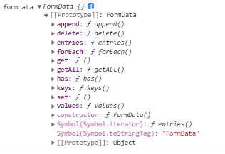

# vue+node实现图片上传

- **multer**
- **fs.rename()**
- **FormData()**
-  **FileReader()**
- **Buffer**
- **fs.writeFile**

## [FormData()](https://developer.mozilla.org/zh-CN/docs/Web/API/FormData)

**`FormData`** 接口提供了一种表示表单数据的键值对 `key/value` 的构造方式，如果送出时的编码类型被设为 `"multipart/form-data"`，它会使用和表单一样的格式。如下图所示：


通过FormData()构造函数可以创建出一个FormData对象；

```js
let formData = new FormData(...)
```

打印formdata：




**方法**

#### `formdata.append()`

>  向 `FormData` 中添加新的属性值，`FormData` 对应的属性值存在也不会覆盖原值，而是新增一个值，如果属性不存在则新增一项属性值。

**格式：**

```js
formData.append(name, value);
formData.append(name, value, filename);
```

```js
name
	value中包含的数据对应的表单名称。
value
	表单的值。可以是USVString 或 Blob (包括子类型，如 File)。
filename 可选
	传给服务器的文件名称 (一个 USVString), 当一个 Blob 或 File 被作为第二个参数的时候， Blob 对象的默认文件名是 "blob"。 File 对象的默认文件名是该文件的名称。
```

**使用：**

你可以通过 FormData.append 往对象里加入键值对：

```js
formData.append('username', 'Chris');
formData.append('userpic', myFileInput.files[0], 'chris.jpg');
```

跟常规表单数据一样，你可以使用同一个名称添加多个值 。例如 (为了与PHP命名习惯一致在名称中添加了[])：

```js
formData.append('userpic[]', myFileInput1.files[0], 'chris1.jpg');
formData.append('userpic[]', myFileInput2.files[0], 'chris2.jpg');
```


#### `formdata.delete()`

> 从 FormData 对象里面删除一个键值对。

**格式：**

```js
formData.delete(name);
```

```js
name
	要删除的键（Key）的名字
```

**使用：**

```js
formData.delete('username');
```

#### `formdata.entries()`

> 返回一个包含所有键值对的iterator对象。

**使用：**

```js
formData.append('key1', 'value1');
formData.append('key2', 'value2');

for(var pair of formData.entries()) {
   console.log(pair[0]+ ', '+ pair[1]);
}
// 结果
key1, value1
key2, value2
```

#### `formdata.get()`

> 返回在 FormData 对象中与给定键关联的第一个值。

**格式：** 

```js
formData.get(name);
```

**使用：**

```js
formData.append('username', 'Chris');
formData.append('username', 'Bob');
```

```js
formData.get('username'); // Returns "Chris"
```

#### `formdata.getAll()`

>  返回一个包含 `FormData` 对象中与给定键关联的所有值的数组。

**格式：** 

```js
formData.getAll(name);
```

`name`

要检索的 key 名称。

**返回：**

一个 数组。

**使用：**

```js
formData.append('username', 'Chris');
formData.append('username', 'Bob');
```

下列 `getAll()` 方法会返回一个数组，包含了所有 `username` 的值：

```js
formData.getAll('username'); // Returns ["Chris", "Bob"]
```

#### `formdata.has()`

>  返回一个布尔值表明 FormData对象是否包含某些键。

**格式：**

```js
formData.has(name);
```

`name`

要查询的 key 名称。

**返回：**

一个 Boolean。

**使用：**

下列代码用来检测 FormData对象是否存在username这个key。默认检测一次，使用 插入username之后再检测一次：

```
formData.has('username'); // Returns false
formData.append('username', 'Chris');
formData.has('username'); // Returns true
```

#### `formdata.keys()`

> 返回一个包含所有键的iterator对象。

**格式：**

```
formData.keys();
```

**使用：**

```js
formData.append('key1', 'value1');
formData.append('key2', 'value2');

// 输出所有的 key
for (var key of formData.keys()) {
   console.log(key);
}
// 结果
key1
key2

```

#### `formdata.set()`

> 给 `FormData` 设置属性值，如果`FormData` 对应的属性值存在则覆盖原值，否则新增一项属性值。

**格式：**

```js
formData.set(name, value);
formData.set(name, value, filename);
```

name： 字段名称。

value ：字段的值，该值可以是一个 Blob或其子类File，如果不是这两个指定的类型，其将被转成一个字符串。

`filename` 可选

当第二个参数传递的是一个 blob 对象 或其子类File，filename 参数就代表传给服务端的文件名。Blob对象的默认文件名是 "blob"，File对象的默认文件名则为其 “name” 属性

**使用：**

```js
formData.set('username', 'Chris');
formData.set('userpic', myFileInput.files[0], 'chris.jpg');
```

#### `formdata.values()`

> 返回一个包含所有值的iterator对象。

**格式：**

```js
formData.values();
```

**使用：**

```js
formData.append('key1', 'value1');
formData.append('key2', 'value2');

//显示值
for (var value of formData.values()) {
   console.log(value);
}
//结果
value1
value2
```


## [Multer](https://github.com/expressjs/multer/blob/master/doc/README-zh-cn.md)

>  Multer 是一个 node.js 中间件，用于处理 `multipart/form-data` 类型的表单数据，它主要用于上传文件。

**注意**: Multer 不会处理任何非 `multipart/form-data` 类型的表单数据。前端通过formData对象格式向后端传递参数


安装 

```
npm install --save multer
```

**使用**

Multer 会添加一个 `body` 对象 以及 `file` 或 `files` 对象 到 express 的 `request` 对象中。 `body` 对象包含表单的文本域信息，`file` 或 `files` 对象包含对象表单上传的文件信息。

```js
const express = require('express')
const multer  = require('multer')
const upload = multer({ dest: 'uploads/' })

const app = express()

app.post('/profile', upload.single('avatar'), function (req, res, next) {
    
   //  avatar 在传递参数的时候 为表单名称 如上面的image 
    
  // req.file 是 `avatar` 文件的信息
  // req.body 将具有文本域数据，如果存在的话
    // 此时req.file为文件信息
   req.file {
      fieldname: 'image',
      originalname: '微信图片_20220120144112.png',
      encoding: '7bit',
      mimetype: 'image/png',
      destination: 'uploads/',
      filename: '18a4622c000fac4f6cc29faba3aac0aa',
      path: 'uploads\\18a4622c000fac4f6cc29faba3aac0aa',
      size: 3315143
   }
})
app.post('/photos/upload', upload.any(), function (req, res, next) {
  // 接受一切上传的文件。文件数组将保存在 req.files。
    eq.files[0].path {
      fieldname: 'image',
      originalname: '微信图片_20220120144112.png',
      encoding: '7bit',
      mimetype: 'image/png',
      destination: 'uploads/',
      filename: '18a4622c000fac4f6cc29faba3aac0aa',
      path: 'uploads\\18a4622c000fac4f6cc29faba3aac0aa',
      size: 3315143
    })
})
```

字段解释：

| Key            | Description                     | Note            |
| -------------- | ------------------------------- | --------------- |
| `fieldname`    | Field name 由表单指定           |                 |
| `originalname` | 用户计算机上的文件的名称        |                 |
| `encoding`     | 文件编码                        |                 |
| `mimetype`     | 文件的 MIME 类型                |                 |
| `size`         | 文件大小（字节单位）            |                 |
| `destination`  | 保存路径                        | `DiskStorage`   |
| `filename`     | 保存在 `destination` 中的文件名 | `DiskStorage`   |
| `path`         | 已上传文件的完整路径            | `DiskStorage`   |
| `buffer`       | 一个存放了整个文件的 `Buffer`   | `MemoryStorage` |

##  [fs.rename](http://nodejs.cn/api/fs.html#fsrenameoldpath-newpath-callback)

> Nod的一个fs模块中的一个方法，可修改文件名称，更改文件的存放路径

**格式：**

```js
fs.rename(oldPath, newPath, callback)
```

- oldPath   原路径

- newPath  新路径

- callback    回调，传递一个err异常参数

**使用：**

更改文件名称：

```js
fs.rename('zs.txt','lisi.txt',function(err) {
// 通过err判断是否修改成功
})
```

不同路径下的文件改名，然后移动，如果新路径不存在，则返回异常

```js
fs.rename('zs.txt','newFile/lisi.txt',function(err) {
// 通过err判断是否修改并移动成功
})
```


## [fs.writeFile](http://nodejs.cn/api/fs.html#fswritefilefile-data-options-callback)

#### fs.write(fd, buffer[, offset[, length[, position]]], callback)

#### fs.write(fd, string[, position[, encoding]], callback)

#### fs.writeFile(file, data[, options], callback)

-  file 			`<string>` | `<Buffer>` | `<URL>` | `<integer>` 文件名或文件描述符

- data 		 `<string>` | `<Buffer>` | `<TypedArray> `| `<DataView>` | `<Object>`

- options     `<Object>` | `<string>`

  ​	encoding 		`<string>` | `<null>` 默认值: 'utf8'

   	mode 			`<integer>` 默认值: 0o666

  ​	flag 					`<string>` 请参阅对文件系统 flags 的支持。 默认值: 'w'。

  ​	signal				 `<AbortSignal>` 允许中止正在进行的写入文件

- callback    `<Function>`

  ​	err 					`<Error> `| `<AggregateError>`

当 `file` 是文件名时，将数据异步地写入文件，如果文件已存在则替换该文件。 `data` 可以是字符串或缓冲区。

当 `file` 是文件描述符时，其行为类似于直接调用 `fs.write()`（推荐）。 请参阅以下有关使用文件描述符的说明。

如果 `data` 是缓冲区，则忽略 `encoding` 选项。

`mode` 选项仅影响新创建的文件。 有关详细信息，请参阅 [`fs.open()`](http://nodejs.cn/api/fs.html#fsopenpath-flags-mode-callback)。

如果 `data` 是普通的对象，则它必须具有自有的（不是继承的）`toString` 函数属性。


```js
import { writeFile } from 'fs';
import { Buffer } from 'buffer';

const data = new Uint8Array(Buffer.from('Hello Node.js'));
writeFile('message.txt', data, (err) => {
  if (err) throw err;
  console.log('The file has been saved!');
});
```

如果 `options` 是字符串，则它指定编码：

```js
import { writeFile } from 'fs';

writeFile('message.txt', 'Hello Node.js', 'utf8', callback);
```

在同一个文件上多次使用 `fs.writeFile()` 而不等待回调是不安全的。 对于这种情况，建议使用 [`fs.createWriteStream()`](http://nodejs.cn/api/fs.html#fscreatewritestreampath-options)。

与 `fs.readFile` 类似，`fs.writeFile` 是一个便捷的方法，其在内部执行多次 `write` 调用以写入传给它的缓冲区。 对于性能敏感的代码，则考虑使用 [`fs.createWriteStream()`](http://nodejs.cn/api/fs.html#fscreatewritestreampath-options)。

可以使用AbortSignal取消 `fs.writeFile()`。 取消是"尽力而为"的，并且可能仍会写入一些数据。

```js
import { writeFile } from 'fs';
import { Buffer } from 'buffer';

const controller = new AbortController();
const { signal } = controller;
const data = new Uint8Array(Buffer.from('Hello Node.js'));
writeFile('message.txt', data, { signal }, (err) => {
  // 当请求中止时 - 使用 AbortError 调用回调
});
// 当应该中止请求时
controller.abort();
```

中止正在进行的请求不会中止单个操作系统请求，而是中止内部缓冲的 `fs.writeFile` 执行。

```js
uploadImg (file) {
    //file.type: 文件类型
    //file.base64: 图片base64
    return new Promise((resolve, reject) => {
        //将base64转换程二进制文件
        let buffer = Buffer.from(file.base64, 'base64');

        //文件名
        let filename = '_p' + Math.random().toString().slice(2) + '.' + file.type;

        //将文件写入服务器
        fs.writeFile(__basename + '/upload/' + filename, buffer, err => {
            //如果上传失败
            if (err) {
                reject({ msg: '上传文件失败', code: 1021 });
            } else {
                resolve({
                    msg: '上传文件成功',
                    code: 1020,
                    filename
                })
            }
        })

    })
```


## Buffer

#### Buffer.from(array)


#### Buffer.from(arrayBuffer[, byteOffset[, length]])


#### Buffer.from(buffer)


#### Buffer.from(object[, offsetOrEncoding[, length]])


#### Buffer.from(string[, encoding])

- `string`  `<string>`要编码的字符串。
- `encoding` `<string>`  string的编码。 **默认值:** `'utf8'`。

> 创建包含 `string` 的新 `Buffer`。 `encoding` 参数标识将 `string` 转换为字节时要使用的字符编码。

**使用：**

将base64转换为二进制文件

```js
//将base64转换程二进制文件
const buffer = Buffer.from(file.base64, 'base64');
// 然后将二进制文件写入到文件里面
fs.writeFile('name',buffer,(err) => {
    // 其他操作
})
```

字符串转换为二进制

```js
const buf1 = Buffer.from('this is a tést');
const buf2 = Buffer.from('7468697320697320612074c3a97374', 'hex');

console.log(buf1.toString());
// 打印: this is a tést
console.log(buf2.toString());
// 打印: this is a tést
console.log(buf1.toString('latin1'));
// 打印: this is a tést
```


## 上传文件两种方式

**第一种**

FormData转换：

前端：

```html
<input type="file" id="file" name="file" @change="changeUpload"/>
```

```js
function changeUpload(event) {
    let $file = event.target.files[0]
    var formdata = new FormData()
    formdata.append("image", $file)
    this.$http.post('/article/articleImg', formdata).then((res) => {
		// 成功的回调
    }).catch((err) => {
        // 失败的回调
    })
    // axios的另一种
    // axios({
    //   url: `/article/articleImg`,
    //   method: "post",
    //   data: formdata,
    //   headers: { "Content-Type": "multipart/form-data" },
    // }).then((url) => {
    // }).catch((err) => { 
    //})
}
```

后端：

```js
const upload = multer({ dest: './upload/article' })
app.post("/article/articleImg", upload.single('image'), (req, res) => {
    const { originalname } = req.file;
    // 创建一个新路径
    let name = '_A' + Math.random().toString().slice(2);
    const newName = name + path.parse(originalname).ext;
    fs.rename(req.file.path, "upload/article/" + newName, function (err) {
        if (err) {
            res.send({ code: 0, msg: "上传失败", data: [] });
        } else {
            res.send({ code: 1, msg: "上传成功", data: newName });
        }
    });
});
```

**第二种：**

FileReader

前端

```html
<input id="choice_p" size="small" type="file" />
```

```js
let that = this
document
    .getElementById("choice_p")
    .addEventListener("change", function (e) {
    var files = this.files
    var reader = new FileReader()
    reader.readAsDataURL(files[0])
    reader.onload = function (e) {
        let obj = {
            // this.result为base64
            base64: this.result,
        }
        that.$http.post("/userImg", obj).then(() => {
            // 成功的回调
        }).chtch(() => {
            // 失败的回调
        })
    }
})
```

后端

```js
//上传文章图片
uploadImg (file) {
    //获取图片
    let base64 = req.body.pdimg
    .replace(/data:image\/[a-z]+;base64,/, "")
    .replace(/ /g, "+");

    let type = req.body.pdimg.split(";")[0].split("/")[1];

    //file.type: 文件类型
    //file.base64: 图片base64
    return new Promise((resolve, reject) => {
        //将base64转换程二进制文件
        let buffer = Buffer.from(file.base64, 'base64');

        //文件名
        let filename = '_p' + Math.random().toString().slice(2) + '.' + file.type;

        //将文件写入服务器
        fs.writeFile(__basename + '/upload/' + filename, buffer, err => {
            //如果上传失败
            if (err) {
               
                reject({ msg: '上传文件失败', code: 1021 });
            } else {
                resolve({
                    msg: '上传文件成功',
                    code: 1020,
                    filename
                })
            }
        })

    })
}
```

## 下载文件

```js
<input type="button" value="点击下载" @click="handleDownload">
    handleDownload() {  
  axios({  
    method: 'get',  
    url: "http://localhost:9527/download",  
    data: {    
      test: "test data" 
    },  
    responseType: "arraybuffer" // arraybuffer是js中提供处理二进制的接口
  }).then(response => {          
    // 用返回二进制数据创建一个Blob实例 
    if(!response) return;
    let blob = new Blob([response.data], {            
      type: "application/vnd.openxmlformats-officedocument.spreadsheetml.sheet", 
    }) // for .xlsx files          
    // 通过URL.createObjectURL生成文件路径          
    let url = window.URL.createObjectURL(blob) 
    console.log("url==========",url)        
    // 创建a标签          
    let ele = document.createElement("a")          
    ele.style.display = 'none'         
    // 设置href属性为文件路径，download属性可以设置文件名称          
    ele.href = url          
    ele.download = this.name          
    // 将a标签添加到页面并模拟点击          
    document.querySelectorAll("body")[0].appendChild(ele)          
    ele.click()          
    // 移除a标签          
    ele.remove()        
  });
},
```

```js
// 二进制流图片文件的下载
downLoadImg() {
   axios({
      method: 'get',
      url: `http://localhost:9527/download/img`,
      responseType: 'arraybuffer',
      params: {
        id: 12
      }
    }).then(res => {
      var src = 'data:image/jpg;base64,' + btoa(new Uint8Array(res.data).reduce((data, byte) => data + String.fromCharCode(byte), ''))
     // this.srcImg = src // 图片回显
      var a = document.createElement('a')
      a.href = src
      a.download = '2.jpg'
      a.click()
      a.remove()
    })
  }
```

## 删除图片

```js
deleteFolderRecursive(url, name) {
    var files = [];

    if (fs.existsSync(url)) {    //判断给定的路径是否存在

        files = fs.readdirSync(url);    //返回文件和子目录的数组

        files.forEach(function (file, index) {

            var curPath = path.join(url, file);

            if (fs.statSync(curPath).isDirectory()) { //同步读取文件夹文件，如果是文件夹，则函数回调
                deleteFile(curPath, name);
            } else {

                if (file.indexOf(name) > -1) {    //是指定文件，则删除
                    fs.unlinkSync(curPath);
                    console.log("删除文件：" + curPath);
                }
            }
        });
    } else {
        console.log("给定的路径不存在！");
    }
}
```

