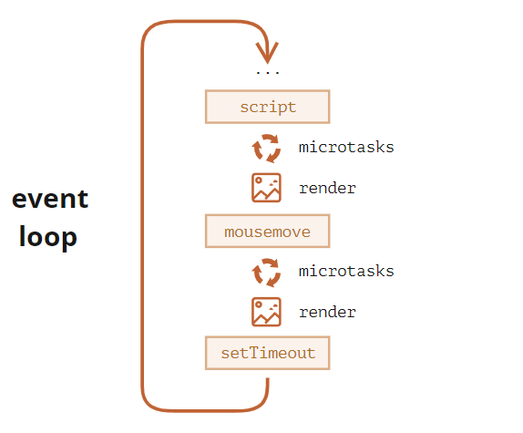
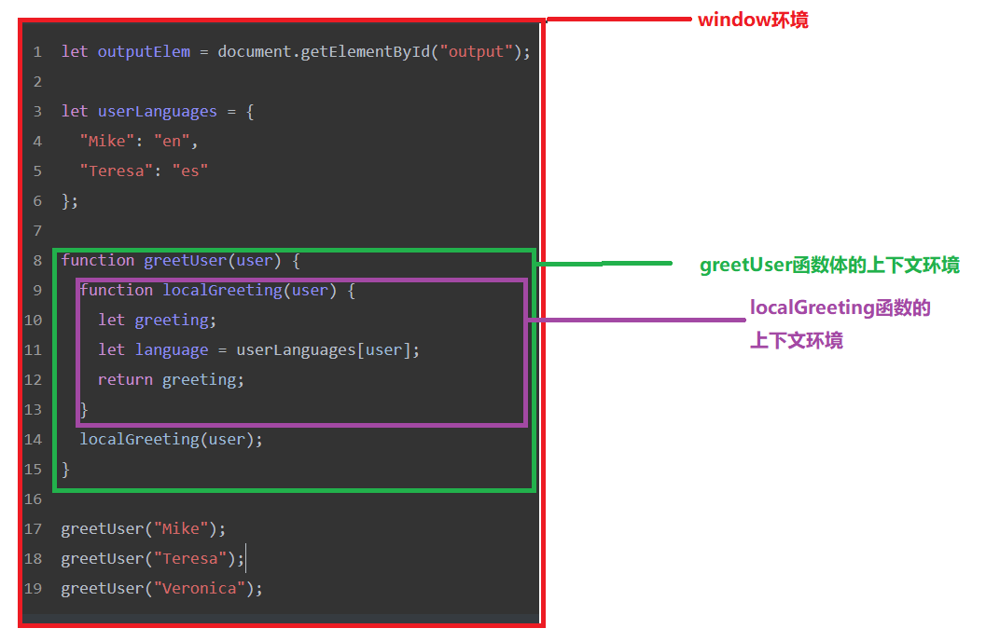
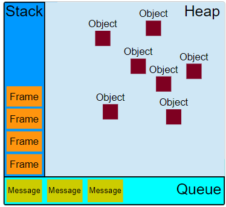
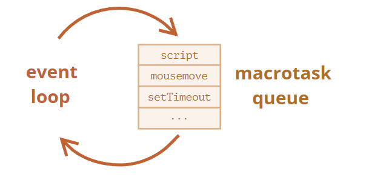

## 宏任务和微任务

一个**任务**就是指计划由标准机制来执行的任何 JavaScript，如程序的初始化、事件触发的回调等

微任务：

```js
process.nextTick
promise
Object.observe
MutationObserver  // 监听DOM元素变化
```

宏任务

```js
setInterval
setImmdiate
I/O
UI rendering  // UI渲染
```


**微任务的引入**

对于每个宏任务而言，其内部都有一个微任务队列。那为什么要引入微任务？微任务在什么时候执行呢？

其实引入微任务的初衷是为了解决异步回调的问题。想一想，对于异步回调的处理，有多少种方式？总结起来有两点:

1）将异步回调进行宏任务队列的入队操作。

2）将异步回调放到当前宏任务的末尾。

如果采用第一种方式，那么执行回调的时机应该是在前面 **所有的宏任务** 完成之后，倘若现在的任务队列非常长，那么回调迟迟得不到执行，造成 应用卡顿 。

为了规避这样的问题，`V8` 引入了第二种方式，这就是 微任务 的解决方式。在每一个宏任务中定义一个**微任务队列**，当该宏任务执行完成，会检查其中的微任务队列，如果为空则直接执行下一个宏任务，如果不为空，则 依次执行微任务 ，执行完成才去执行下一个宏任务。

- 当执行来自任务队列中的任务时，在每一次新的事件循环开始迭代的时候运行时都会执行队列中的每个任务。在每次迭代开始之后加入到队列中的任务需要**在下一次迭代开始之后才会被执行**.
- 每次当一个任务退出且执行上下文为空的时候，微任务队列中的每一个微任务会依次被执行。不同的是它会等到微任务队列为空才会停止执行——即使中途有微任务加入。换句话说，微任务可以添加新的微任务到队列中，并在下一个任务开始执行之前且当前事件循环结束之前执行完所有的微任务

**每个宏任务之后，引擎会立即执行微任务队列中的所有任务，然后再执行其他的宏任务，或渲染，或进行其他任何操作。**

例如：

```js
setTimeout(() => alert("timeout"));

Promise.resolve()
  .then(() => alert("promise"));

alert("code");
```

这里的执行顺序是怎样的？

1. `code` 首先显示，因为它是常规的同步调用。
2. `promise` 第二个出现，因为 `then` 会通过微任务队列，并在当前代码之后执行。
3. `timeout` 最后显示，因为它是一个宏任务。

从上往下的执行可以理解为一次宏任务；然后`promise`是微任务，执行完紧接着执行`setTimeout`宏任务，查找队列里面是否还存在任务，不存在值执行完成；

更详细的事件循环图示如下（顺序是从上到下，即：首先是脚本，然后是微任务，渲染等）：

 

<u>**微任务会在执行任何其他事件处理，或渲染，或执行任何其他宏任务之前完成。**</u>

这很重要，因为它确保了微任务之间的应用程序环境基本相同（没有鼠标坐标更改，没有新的网络数据等）。

如果我们想要异步执行（在当前代码之后）一个函数，但是要在更改被渲染或新事件被处理之前执行，那么我们可以使用 `queueMicrotask` 来对其进行安排（schedule）。

它使用了 `queueMicrotask` 。你可以看到它在最后才渲染。就像写的是同步代码一样

**更详细的事件循环算法：**

1. 从 **宏任务** 队列（例如 “script”）中出队（dequeue）并执行最早的任务。 属于同步代码
2. 执行所有微任务：
   - 当微任务队列非空时：
     - 出队（dequeue）并执行最早的微任务。
3. 如果有变更，则将变更渲染出来。
4. 如果宏任务队列为空，则休眠直到出现宏任务。 即开始下一轮的循环
5. 转到步骤 1。

安排（schedule）一个新的 **宏任务**：

- 使用零延迟的 `setTimeout(f)`。

它可被用于将繁重的计算任务拆分成多个部分，以使浏览器能够对用户事件作出反应，并在任务的各部分之间显示任务进度。

此外，也被用于在事件处理程序中，将一个行为（action）安排（schedule）在事件被完全处理（冒泡完成）后。

安排一个新的 **微任务**：

- 使用 `queueMicrotask(f)`。
- `promise `处理程序也会通过微任务队列。

**在微任务之间没有 `UI` 或网络事件的处理**：它们一个立即接一个地执行。

所以，我们可以使用 `queueMicrotask` 来在保持环境状态一致的情况下，异步地执行一个函数。

如果宏任务中的异步代码有大量的计算，且需要操作DOM，为了快速响应界面，可以把操作DOM放入到微任务中

**另一个版本**

1）一开始整段脚本作为第一个宏任务执行

2）执行过程中同步代码直接执行，宏任务进入宏任务队列，微任务进入微任务队列

3）当前宏任务执行完出队，检查微任务队列，如果有则依次执行，直到微任务队列为空

4）执行浏览器` UI `线程的渲染工作

5）检查是否有Web worker任务，有则执行

6）执行队首新的宏任务，回到2，依此循环，直到宏任务和微任务队列都为空

**在理解代码执行顺序和作用域**

我们知道JavaScript是单线程的，最早的时候JS主要用于浏览器，使用单线程是一种很好的选中，避免了其他的问题；

我们还知道，执行JS代码的时候，会从上往下执行，代码执行在一个**上下文环境**中。

问？

在什么情况下会创建一个上下问呢？

答：

1. 全局上下文，即函数、代码块之外的地方，我们可以算做处在一个全局的上下文环境中
2. 函数执行的上下文，函数在执行的时候会存在自己的上下文环境
3. 使用`eval()`函数，也会创建一个独立的上下文环境

上下文的本质是一种作用域的层级，每个代码段开始执行的时候都会创建一个新的上下文来运行它，并且在代码退出的时候销毁掉

```js
let outputElem = document.getElementById("output");

let userLanguages = {
  "Mike": "en",
  "Teresa": "es",
   "Veronica": "ch"
};

function greetUser(user) {
  function localGreeting(user) {
    let greeting;
    let language = userLanguages[user];
    return greeting;
  }
  localGreeting(user);
}

greetUser("Mike");
greetUser("Teresa");
greetUser("Veronica");
```

执行上面的代码，我们可以发现他存在3个执行上下文环境

- 程序开始运行时，全局上下文就会被创建好。
  - 当执行到`greetUser("Mike")`的时候会为`greetUser()` 函数创建一个它的上下文。这个执行上下文会被推入执行上下文栈中。
    - 当 `greetUser()` 调用 `localGreeting()`的时候会为该方法创建一个新的上下文。并且在 `localGreeting()` 退出的时候它的上下文也会从执行栈中弹出并销毁。程序会从栈中获取下一个上下文并恢复执行，也就是从 `greetUser()` 剩下的部分开始执行。
    - `greetUser()` 执行完毕并退出，其上下文也从栈中弹出并销毁。
  - 当`greetUser("Teresa")` 开始执行时，程序又会为它创建一个上下文并推入栈顶。
    - 当 `greetUser()` 调用 `localGreeting()`的时候另一个上下文被创建并用于运行该函数。当 `localGreeting()` 退出的时候它的上下文也从栈中弹出并销毁。 `greetUser()` 得到恢复并继续执行剩下的部分。
    - `greetUser()` 执行完毕并退出，其上下文也从栈中弹出并销毁。
  - 然后执行到`greetUser("Veronica")`又再为它创建一个上下文并推入栈顶。
    - 当 `greetUser()` 调用 `localGreeting()`的时候，另一个上下文被创建用于执行该函数。当 `localGreeting()`执行完毕，它的上下文也从栈中弹出并销毁。
    - `greetUser()` 执行完毕退出，其上下文也从栈中弹出并销毁。
- 主程序退出，全局执行上下文从执行栈中弹出。此时栈中所有的上下文都已经弹出，程序执行完毕

 

在这样的上下文环境中执行代码，隔绝了外部环境的影响，在内部有自己的变量和其他对象，每个执行的上下文环境就是一个作用域，而在当前执行环境中如果找不到某个变量和会向外层去查找，直到全局环境，这样查找的一个链条就是作用域链。

JavaScript 运行时实际上维护了一组用于执行 JavaScript 代码的**代理**。每个代理由一组执行上下文的集合、执行上下文栈、主线程、一组可能创建用于执行 worker 的额外的线程集合、一个任务队列以及一个微任务队列构成

 

### [栈(Stack)](https://developer.mozilla.org/zh-CN/docs/Web/JavaScript/EventLoop#栈)

函数调用形成了一个由若干帧组成的栈。

```js
function foo(b) {
  let a = 10;
  return a + b + 11;
}

function bar(x) {
  let y = 3;
  return foo(x * y);
}

console.log(bar(7)); // 返回 42
```

当调用 `bar` 时，第一个帧被创建并压入栈中，帧中包含了 `bar` 的参数和局部变量。当 `bar` 调用 `foo` 时，第二个帧被创建并被压入栈中，放在第一个帧之上，帧中包含 `foo` 的参数和局部变量。当 `foo` 执行完毕然后返回时，第二个帧就被弹出栈（剩下 `bar` 函数的调用帧）。当 `bar` 也执行完毕然后返回时，第一个帧也被弹出，栈就被清空了。

### **堆**(Heap)

对象被分配在堆中，堆是一个用来表示一大块（通常是非结构化的）内存区域的计算机术语。

### **队列**(Queue)

一个 JavaScript 运行时包含了一个待处理消息的消息队列。每一个消息都关联着一个用以处理这个消息的回调函数。

在 [事件循环](https://developer.mozilla.org/zh-CN/docs/Web/JavaScript/EventLoop#事件循环) 期间的某个时刻，运行时会从最先进入队列的消息开始处理队列中的消息。被处理的消息会被移出队列，并作为输入参数来调用与之关联的函数。正如前面所提到的，调用一个函数总是会为其创造一个新的栈帧。

函数的处理会一直进行到执行栈再次为空为止；然后事件循环将会处理队列中的下一个消息（如果还有的话）

**零延迟**

零延迟并不意味着回调会立即执行。以 0 为第二参数调用 `setTimeout` 并不表示在 0 毫秒后就立即调用回调函数。其等待的时间取决于队列里待处理的消息数量，这是因为延迟参数是运行时处理请求所需的最小等待时间，但并不保证是准确的等待时间。

**添加消息**

在浏览器里，每当一个事件发生并且有一个事件监听器绑定在该事件上时，一个消息就会被添加进消息队列。如果没有事件监听器，这个事件将会丢失。所以当一个带有点击事件处理器的元素被点击时，就会像其他事件一样产生一个类似的消息

## 事件循环

每个代理都是由**事件循环**驱动的，事件循环负责收集用事件（包括用户事件以及其他非用户事件等）、对任务进行排队以便在合适的时候执行回调。然后它执行所有处于等待中的 JavaScript 任务（宏任务），然后是微任务，然后在开始下一次循环之前执行一些必要的渲染和绘制操作。

```js
while (queue.waitForMessage()) {
  queue.processNextMessage(); // 会同步地等待消息到达
}
```

JavaScript引擎的一般算法：

1. 当有任务时：
   - 从最先进入的任务开始执行。
2. 休眠直到出现任务，然后转到第 1 步

当我们浏览一个网页时就是上述这种形式。JavaScript 引擎大多数时候不执行任何操作，它仅在脚本/处理程序/事件激活时执行。

任务示例：

- 当外部脚本 `<script src="...">` 加载完成时，任务就是执行它。
- 当用户移动鼠标时，任务就是派生出 `mousemove` 事件和执行处理程序。
- 当安排的（scheduled）`setTimeout` 时间到达时，任务就是执行其回调。

设置任务 —— 引擎处理它们 —— 然后等待更多任务（即休眠，几乎不消耗 CPU 资源）。一个任务到来时，引擎可能正处于繁忙状态，那么这个任务就会被排入队列。多个任务组成了一个队列，即所谓的“宏任务队列”（v8 术语）：

 

当引擎正在忙于执行一段 `script` 时，用户可能会移动鼠标而产生 `mousemove` 事件，`setTimeout` 或许也刚好到期，以及其他任务，这些任务组成了一个队列，如上图所示。

队列中的任务基于**“先进先出”**的原则执行。当浏览器引擎执行完 `script` 后，它会处理 `mousemove` 事件，然后处理 `setTimeout` 处理程序，依此类推。

两个细节：

1. 引擎执行任务时永远**不会进行渲染**（render）。如果任务执行需要很长一段时间也没关系。仅在任务完成后才会绘制对 DOM 的更改。
2. 如果一项任务执行花费的时间过长，浏览器将无法执行其他任务，例如处理用户事件。因此，在一定时间后，浏览器会抛出一个如**“页面未响应”**之类的警报，建议你终止这个任务。这种情况常发生在有大量复杂的计算或导致死循环的程序错误时

当我们处理很逻辑很复杂的JS任务时，浏览器是不允许我们处理其他DOM相关的工作，点击选中等，时间太长有可能会出现页面奔溃的现象

比如下面的代码，当执行JS代码时，页面不会让用户处理其他事件，直到执行完JS

```js
let i = 0;

let start = Date.now();

function count() {

  // 做一个繁重的任务
  for (let j = 0; j < 1e9; j++) {
    i++;
  }

  alert("Done in " + (Date.now() - start) + 'ms');
}

count();
```

让我们使用嵌套的 `setTimeout` 调用来拆分这个任务：

```js
let i = 0;

let start = Date.now();

function count() {

  // 做繁重的任务的一部分 (*)
  do {
    i++;
  } while (i % 1e6 != 0);

  if (i == 1e9) {
    alert("Done in " + (Date.now() - start) + 'ms');
  } else {
    setTimeout(count); // 安排（schedule）新的调用 (**)
  }

}

count();
```

这样我们在执行JS复杂的代码同时，也可以操作DOM

单次执行 `count` 会完成工作 `(*)` 的一部分，然后根据需要重新安排（schedule）自身的执行 `(**)`：

1. 首先执行计数：`i=1...1000000`。
2. 然后执行计数：`i=1000001..2000000`。
3. ……以此类推。

现在，如果在引擎忙于执行第一部分时出现了一个新的副任务（例如 `onclick` 事件），则该任务会被排入队列，然后在第一部分执行结束时，并在下一部分开始执行前，会执行该副任务。周期性地在两次 `count` 执行期间返回事件循环，这为 JavaScript 引擎提供了足够的“空气”来执行其他操作，以响应其他的用户行为。

值得注意的是这两种变体 —— 是否使用了 `setTimeout` 对任务进行拆分 —— 在执行速度上是相当的。在执行计数的总耗时上没有多少差异。

为了使两者耗时更接近，让我们来做一个改进。

我们将要把调度（scheduling）移动到 `count()` 的开头：

```javascript
let i = 0;

let start = Date.now();

function count() {

  // 将调度（scheduling）移动到开头
  if (i < 1e9 - 1e6) {
    setTimeout(count); // 安排（schedule）新的调用
  }

  do {
    i++;
  } while (i % 1e6 != 0);

  if (i == 1e9) {
    alert("Done in " + (Date.now() - start) + 'ms');
  }

}

count();
```

现在，当我们开始调用 `count()` 时，会看到我们需要对 `count()` 进行更多调用，我们就会在工作前立即安排（schedule）它。

如果你运行它，你很容易注意到它花费的时间明显减少了。

为什么？

这很简单：你应该还记得，多个嵌套的 `setTimeout` 调用在浏览器中的最小延迟为 4ms。即使我们设置了 `0`，但还是 `4ms`（或者更久一些）。所以我们安排（schedule）得越早，运行速度也就越快。

最后，我们将一个繁重的任务拆分成了几部分，现在它不会阻塞用户界面了。而且其总耗时并不会长很多。

 

## **Web Workers**

一个 web worker 或者一个跨域的 `iframe` 都有自己的栈、堆和消息队列。两个不同的运行时只能通过 [`postMessage`](https://developer.mozilla.org/zh-CN/docs/Web/API/Window/postMessage) 方法进行通信。如果另一个运行时侦听 `message` 事件，则此方法会向该运行时添加消息。

对于不应该阻塞事件循环的耗时长的繁重计算任务，我们可以使用 [Web Workers](https://html.spec.whatwg.org/multipage/workers.html)。

这是在另一个并行线程中运行代码的方式。

Web Workers 可以与主线程交换消息，但是它们具有自己的变量和事件循环。

Web Workers 没有访问 DOM 的权限，因此，它们对于同时使用多个 CPU 内核的计算非常有用。

例子1

```js
1. console.log(1);

2. setTimeout(() => console.log(2));

3. Promise.resolve().then(() => console.log(3));

4. Promise.resolve().then(() => setTimeout(() => console.log(4)));

5. Promise.resolve().then(() => console.log(5));

6. setTimeout(() => console.log(6));

7. console.log(7);
```

打印结果：

从上往下执行代码；

到1;  打印  1

到2；发现是宏任务，放入宏任务队列，        ma = [2]

到3；发现是微任务，放入微任务队列			mi = [3]

到4；发现是微任务，放入微任务队列			mi = [3，4]

到5；发现是微任务，放入微任务队列			mi = [3，4，5]

到6；发现是宏任务，放入宏任务队列			ma = [2，6]

到7；打印7

第一次循环走完，打印了1 ，7，队列存在微任务mi和宏任务ma，最终微任务: [3，4，5] 宏任务：[2,6]

然后走微任务；执行打印输出 3   5  ，在4里面存在宏任务，放入宏任务队列；这一轮打印结果为：3 ，5 

此时微任务走完，宏任务为[2,6,4]

然后执行宏任务  2  ，6，4

所以最终的输出结果为： 1  7  3  5  2  6  4

例子2

```js
1： Promise.resolve().then(()=>{
    console.log('Promise1')
    setTimeout(()=>{
        console.log('setTimeout2')
    },0)
});
2：setTimeout(()=>{
    console.log('setTimeout1')
    Promise.resolve().then(()=>{
        console.log('Promise2')
    })
}, 0);
3：console.log('start');
```

打印结果:

执行顺序可根据上面的方式，按照优先级往队列中添加任务

start  Promise1  setTimeout1    Promise2 s etTimeout2