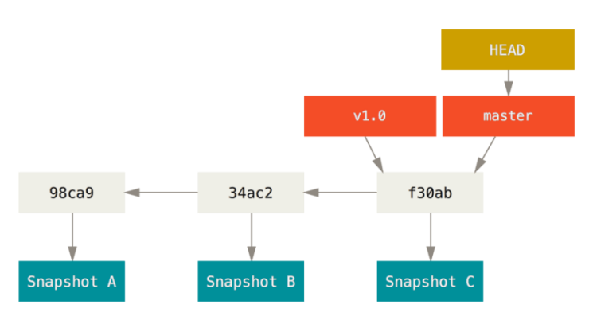

::: slot doclist
[[toc]]
:::


Git一个分布式管理系统

## Git安装

git 地址 : https://git-scm.com/download/win

完成安装之后，就可以使用命令行的 git 工具（已经自带了 ssh 客户端）

```bash
git --version
```


当你点击 git bash Here 菜单之后，可以看到一个终端窗口，在终端里面输入

命令 git --version，如果可以看到 git 的版本信息，则说明安装成功，

## Git初始化配置

Git 提供了一个叫做 git config 的命令来配置或读取相应的工作环境变量而正是由这些环境变量，决定了 Git 在各个环节的具体工作方式和行为。这些变量可以存放在以下三个不同的地方

`/etc/gitconfig` 文件：系统中对所有用户都普遍适用的配置。若使用 git config 时用 --system 选项，读写的就是这个文件

`~/.gitconfig` 文件：用户目录下的配置文件只适用于该用户。若使用 git config 时用 --global 选项，读写的就是这个文件

`.git/config` 文件**：**当前项目的 Git 目录中的配置文件（也就是工作目录中的 .git/config 文件）这里的配置仅仅针对当前项目有效。

**每一个级别的配置都会覆盖上层的相同配置**

第一个要配置的是你个人的用户名称和电子邮件地址。这两条配置很重要，每次 Git 提交时都会引用这两条信息，说明是谁提交了更新，所以会随更新内容一起被永久纳入历史记录：

```bash
$ git config --global user.name "hhh"

$ git config --global user.email hhh@example.com
```

要检查已有的配置信息，可以使用 git config --list 命令

删除配置信息 `git config --global --unset user.email`

```bash
git config --system --list # 查看系统config

git config --global --list # 查看当前用户（global）配置

git config --local --list # 查看当前仓库配置信息
```

## 基础命令

```bash
git init #初始化git仓库
```

初始化后，在当前目录下会出现一个名为 .git 的目录，所有 Git 需要的数据和资源都存放在这个目录中。不过目前，仅仅是按照既有的结构框架初始化好了里边所有的文件和目录，但我们还没有开始跟踪管理项目中的任何一个文件

.git目录


```
hooks 		目录包含客户端或服务端的钩子脚本；
info 		包含一个全局性排除文件
logs 		保存日志信息
objects	 	目录存储所有数据内容
refs 		目录存储指向数据的提交对象的指针（分支）
config 	  	文件包含项目特有的配置选项
description 用来显示对仓库的描述信息
HEAD      	文件指示目前被检出的分支
index	  	文件保存暂存区信息
```

## Git原理

Git 的核心部分是一个简单的键值对数据库。你可以向该数据库插入任意类型的内容，它会返回一个键值，通过该键值可以在任意时刻再次检索该内容

### Git对象

**向数据库写入内容** **并返回对应键值** 

```bash
echo 'test content' | git hash-object -w --stdin
# 返回
d670460b4b4aece5915caf5c68d12f560a9fe3e4
```

-w选项指示 hash-object命令存储数据对象；若不指定此选项，则该命令仅返回对应的键值

--stdin（standard input）选项则指示该命令从标准输入读取内容；若不指定此选项，则须在命令尾部给出待存储文件的路径

```bash
git hash-object -w 文件路径  # 存文件
git hash-object 文件路径  # 返回对应文件的键值
```

**查看** **Git** **是如何存储数据的**

```bash
find .git/objects -type f  
# 返回
.git/objects/d6/70460b4b4aece5915caf5c68d12f560a9fe3e4
```

这就是开始时 Git 存储内容的方式：一个文件对应一条内容。校验和的前两个字符(d6)用于命名子目录，余下的 38 个字符(70460...9fe3e4)则用作文件名

**根据键值拉取数据**

```bash
git cat-file -p d670460b4b4aece5915caf5c68d12f560a9fe3e4
# 返回对应的文件内容
```

-p 选项可指示该命令自动判断内容的类型，并为我们显示格式友好的内容

 ###  对一个文件进行简单的版本控制

**创建一个新文件并将其内容存入数据库**

```bash
echo 'version 1' > test.txt
git hash-object -w test.txt
# 返回
83baae61804e65cc73a7201a7252750c76066a30
```

**向文件里写入新内容，并再次将其存入数据库** 

```bash
echo 'version 2' > test.txt 
git hash-object -w test.txt 
返回： 
1f7a7a472abf3dd9643fd615f6da379c4acb3e3a
```

**查看数据库内容** 

```bash
find .git/objects -type f 
git cat-file -p 83baae61804e65cc73a7201a7252750c76066a30  	# test.txt的第一个版本
git cat-file -p 1f7a7a472abf3dd9643fd615f6da379c4acb3e3a 	# test.txt的第二个版本
```

```bash
git cat-file -t 1f7a7a472abf3dd9643fd615f6da379c4acb3e3a 
# 返回blob 
```

利用 cat-file -t 命令，可以让 Git 告诉我们其内部存储的任何对象类型

1. 记住文件的每一个版本所对应的 SHA-1 值并不现实
2. 在 Git 中，文件名并没有被保存——我们仅保存了文件的内容
解决方案：树对象 

> 当前的操作都是在对本地数据库进行操作 不涉及暂存区

**由上面的操作可以看到，每修改一次文件内容，都会生一个版本，这个就是历史记录，通过这个标志，可以回到指定的历史版本去**

### 构建树对象

 树对象（tree object），它能解决文件名保存的问题，也允许我们将多个文件组织到一起。Git 以一种类似UNIX 文件系统的方式存储内容。所有内容均以树对象和数据对象(git 对象)的形式存储，其中树对象对应了 UNIX 中的目录项，数据对象(git 对象)则大致上对应文件内容。一个树对象包含了一条或多条记录（每条记录含有一个指向 git 对象或者子树对象的 SHA-1 指针，以及相应的模式、类型、文件名信息）。一个树对象也可以包含另一个树对象

我们可以通过 `update-index`；`write-tree`；`read-tree` 等命令来构建树对像并塞入到暂存区

1. 利用 `update-index` 命令 为 test.txt 文件的首个版本——创建一个暂存区。并通过 `write-tree` 命令生成树对像

```bash
git update-index --add --cacheinfo 100644 83baae61804e65cc73a7201a7252750c76066a30 test.txt
git write-tree
# 返回
d8329fc1cc938780ffdd9f94e0d364e0ea74f579
```

文件模式为：
100644，表明这是一个普通文件 
100755，表示一个可执行文件； 
120000，表示一个符号链接。
--add 选项： 			因为此前该文件并不在暂存区中 首次需要 --add 
--cacheinfo 选项：  因为将要添加的文件位于 Git 数据库中，而不是位于当前目录下 所有需要--cacheinfo

2. 新增 new.txt， 将 new.txt 和 test.txt 文件的第二个个版本塞入暂存区。并通过`write-tree` 命令生成树对像

```bash
echo 'new file' > new.txt
git update-index --cacheinfo 100644 1f7a7a472abf3dd9643fd615f6da379c4acb3e3a test.txt
git update-index --add new.txt
git write-tree
# 返回
0155eb4229851634a0f03eb265b69f5a2d56f341
```

3. 将第一个树对象加入第二个树对象，使其成为新的树对象

```bash
git read-tree --prefix=bak d8329fc1cc938780ffdd9f94e0d364e0ea74f579 
git write-tree 
# 返回
3c4e9cd789d88d8d89c1073707c3585e41b0e614
```

read-tree 命令，可以把树对象读入暂存区

**总结：**

经过上面的操作后，查看对象

```bash
 find .git/objects -type f
 
 # new.txt 第一次写入的树对象
.git/objects/01/55eb4229851634a0f03eb265b69f5a2d56f341 

# test.txt 第二次写内容
.git/objects/1f/7a7a472abf3dd9643fd615f6da379c4acb3e3a 

# 将第一个树对象(test.txt v1) 加入到第二个书对象(test.txt v2)  产生的新对象
.git/objects/3c/4e9cd789d88d8d89c1073707c3585e41b0e614 

# test.txt 第一次写内容
.git/objects/83/baae61804e65cc73a7201a7252750c76066a30 

# 下面的是为 test.txt文件的首个版本创建的暂存区，生成的树对象
.git/objects/d8/329fc1cc938780ffdd9f94e0d364e0ea74f579  

.git/objects/fa/49b077972391ad58037050f2a75f74e3671e92
```

此时的树对象；

 

### 树对象

查看暂存区当前的样子

```bash
$ git ls-files -s
100644 83baae61804e65cc73a7201a7252750c76066a30 0       bak/test.txt
100644 fa49b077972391ad58037050f2a75f74e3671e92 0       new.txt
100644 1f7a7a472abf3dd9643fd615f6da379c4acb3e3a 0       test.txt
```

查看树对象

```bash
git cat-file -p master^{tree}（或者是树对象的 hash）

# 返回
100644 blob a906cb2a4a904a152e80877d4088654daad0c859 README
100644 blob 8f94139338f9404f26296befa88755fc2598c289 Rakefile
040000 tree 99f1a6d12cb4b6f19c8655fca46c3ecf317074e0 lib
```

master^{tree} 语法表示 master 分支上最新的提交所指向的树对象。

 

>  lib 子目录（所对应的那条树对象记录）并不是一个数据对象，而是一个指针，其指向的是另一个树对象：

**解析树对象**

Git 根据某一时刻暂存区（即 index 区域）所表示的状态创建并记录一个对应的树对象，如此重复便可依次记录（某个时间段内）一系列的树对象。

其实树对象是对暂存区内操作的抽象，这颗树对象相对于就是快照。当我们的工作区有任何更改同步到暂存区时。便会调用 write-tree 命令

通过 write-tree 命令向暂存区内容写入一个树对象。它会根据当前暂存区状态自动创建一个新的树对象。即每一次同步都产生一颗树对象。且该命令会返回一个 hash 指向树对象。

在 Git 中每一个文件（数据）都对应一个 hash（类型 blob）每一个树对象都对应一个 hash（类型 tree）

我们可以认为树对象就是我们项目的快照

### 提交对象

我们可以通过调用commit-tree命令创建一个提交对象，为此需要指定一个树对象的SHA-1 值，以及该提交的父提交对象（如果有的话第一次将暂存区做快照就没有父对象）

**创建提交对象**

```bash
echo 'first commit' | git commit-tree d8329f
# 返回
fdf4fc3344e67ab068f836878b6c4951e3b15f3d
```

**查看提交对象**

```bash
git cat-file -p fdf4fc3 
# 返回
tree d8329fc1cc938780ffdd9f94e0d364e0ea74f579 
author Scott Chacon <schacon@gmail.com> 1243
committer Scott Chacon <schacon@gmail.com> 1243
first commit
```

**提交对象的格式**

提交对象的格式很简单：

它先指定一个顶层树对象，代表当前项目快照；然后是作者/提交者信息（依据你的 user.name 和 user.email 配置来设定，外加一个时间戳）；留空一行，最后是提交注释

接着，我们将创建另两个提交对象，它们分别引用各自的上一个提交（作为其父提交对象）

```bash
echo 'second commit' | git commit-tree 0155eb -p fdf4fc3
cac0cab538b970a37ea1e769cbbde608743bc96d
echo 'third commit' | git commit-tree 3c4e9c -p cac0cab 
1a410efbd13591db07496601ebc7a059dd55cfe9
```

 

> git commit-tree 不但生成提交对象 而且会将对应的快照（树对象）提交到本地库中

#### 总结

**git对象**

```bash
git hash-object -w fileUrl # 生成一个key(hash值):val(压缩后的文件内容)键值对存到.git/objects
```

**tree对象**

```bash
git update-index --add --cacheinfo 100644 hash test.txt # 往暂存区添加一条记录(让git对象 对应 上文件名)存到.git/index
git write-tree 		# 生成树对象存到.git/objects
```

**commit对象**

```bash
echo 'first commit' | git commit-tree treehash # 生成一个提交对象存到.git/objects
对以上对象的查询
git cat-file -p hash       # 拿对应对象的内容
git cat-file -t hash       # 拿对应对象的类型
```

### 查看暂存区

    git ls-files -s

## Git本地操作

使用git时，需要先初始化一个.git的目录，使用`git init`命令

在git同级的目录下，每个文件都无非有两种状态，已跟踪、未跟踪

已跟踪的文件是指本来就被纳入版本控制管理的文件，在上次快照中有它们的记录，工作一段时间后，它们的状态可能是已提交，已修改或者已暂存

所有其他文件都属于未跟踪文件。它们既没有上次更新时的快照，也不在当前的暂存区域。

**Git的状态变化周期**

 

这里需要明确文件的状态是什么，可以使用`git status`来查看

### 命令说明

**git add 文件名**

跟踪一个新文件，git add 的潜台词就是把目标文件快照放入暂存区域，也就是 add file into staged area，同时未曾跟踪过的文件标记为已跟踪。

我们如果将第一次提交到暂存区的文件，在次修改，通过git status 看到，该文件一次被放入到暂存区，一次已修改状态

实际上 Git 只不过暂存了你运行 git add 命令时的版本，如果现在提交，那么提交的是添加注释前的版本，而非当前工作目录中的版本。所以，运行了 git add 之后又作了修订的文件，需要重新运行 git add 把最新版本重新暂存起来：

**查看已暂存和未暂存的更新**

```bash
git status：# 查看详细的文件状态，会显示是否被跟踪 

git status -s  # 简要的查看文件的状态
```

实际上 git status 的显示比较简单，仅仅是列出了修改过的文件，如果要查看具体修改了什么地方，可以用 git diff 命令.这个命令它已经能解决我们两个问题了：

当前做的哪些更新还没有暂存？有哪些更新已经暂存起来准备好了下次提交？

1. 当前做的哪些更新还没有暂存？，
命令：git diff filename（不加参数直接输入 git diff）查看某个文件在最后一次修改了什么 
2. 有哪些更新已经暂存起来准备好了下次提交？
命令： git diff –cached 或者 git diff –staged(1.6.1 以上)

**提交暂存**

我们可以将放入暂存区的代码进行提交

```bash
git commit
```

这种方式会启动文本编辑器以便输入本次提交的说明

```bash
git commit –m “message xxx”
```

-m 参数后跟提交说明的方式，在一行命令中提交更新

提交时记录的是放在暂存区域的快照，任何还未暂存的仍然保持已修改状态，可以在下次提交时纳入版本管理。每一次运行提交操作，都是对你项目作一次快照，

以后可以回到这个状态，或者进行比较

**跳过暂存区**

Git 提供了一个跳过使用暂存区域的方式，只要在提交的时候，给 git 

commit 加上 -a 选项，Git 就会自动把所有已经跟踪过的文件暂存起来一并提交，

从而跳过 git add 步骤

```bash
git commit -a
```

**查看历史记录**

可以方便的查看每一次commit之后的提交信息，包括commitid，提交作者，邮箱，提交时间以及提交说明，他是从上到下是按照从近到远的顺序来操作的 ，如果感觉输出太多，可以后面加参数--pretty=oneline，可以简要的输出历史提交信息

```bash
git log

commit 085bb3bcb608e1e8451d4b2432f8ecbe6306e7e7
Author: Scott Chacon <schacon@gee-mail.com>
Date: Sat Mar 15 16:40:33 2008 -0700
removed unnecessary test
commit a11bef06a3f659402fe7563abf99ad00de2209e6
Author: Scott Chacon <schacon@gee-mail.com>
Date: Sat Mar 15 10:31:28 2008 -0700
first commit
```

默认不用任何参数的话，git log 会按提交时间列出所有的更新，最近的更新排在最上面

**git log** **参数**

```bash
git log --pretty=oneline  #输入简要的提交信息
git log --oneline
```

**git reset --hard HEAD^**

git的提交会形成一条线，记录每一次的提交，可是要想回到之前的某个版本，这时候就能用到reset命令了，HEAD^表示回退到上一个commit之后的地方，HEAD^^回到上上一个commit之后的地方。比如：第一次commit，commit id为45se...，第二次commit，commit id为fr2ws...，这个时候，commit与工作区的内容一致，当前的HEAD指向第二次提交的地方，可是想回到第一次提交之后，这个时候就使用git reset --hard HEAD^，如果想回退到具体的某个commit，可以使用 git reset --hard commitid，commitid之前提过，就回到commitid对应的地方。这种回退，工作区的内容会跟着回退。
在使用git log，发现此时commit记录会少一次，可是，我们又不想回退了，想回到回退之前的地方，这时使用下面的命令查看

**git reflog**

可以查看每一次的提交记录，不管是不是回退的，找到想要回退的commitid，使用git reset --hard commitid，就可以回到指定的地方

**git checkout -- filename**

使用这个命令，可以把工作区对应文件的修改全部撤销掉
比如：修改之后，回到修改之前的内容，此时跟版本库里面的内容一致

```BASH
git reset HEAD filename
# 加入修改了一个文件，现在提交到暂存区了，又不想提交，可以使用该命令，回到add之前的状态
```

**rm filename**

删除本地的文件，此时版本库种的还在。若要撤回删除，使用git checkout -- filename，因为此时版本库中被删除的文件还在

git rm filename：如果要从版本库中也删除，使用该命令，则删除文件之后在提交一次，此时版本库中的文件也被删除掉了 

**git push**

命用于从将本地的分支版本上传到远程并合并

```bash
git push <远程主机名> <本地分支名>:<远程分支名>
# 如果本地分支名与远程分支名相同，则可以省略冒号
git push <远程主机名> <本地分支名>
```

以下命令将本地的 master 分支推送到 origin 主机的 master 分支。

```bash
$ git push origin master
```


## Git分支

**git branch**

创建了一个可以移动的新的指针。 比如，创建一个 testing 分支：git branch testing。这会在当前所在的提交对象上创建一个指针

git branch 分支名 创建 一个新分支，并不会自动切换到新分支中去

 

`git branch` 不只是可以创建与删除分支。 如果不加任何参数运行它，会得到当前所有分支的一个列表

```bash
git branch -d name # 删除分支
git branch -v # 可以查看每一个分支的最后一次提交
git branch name commitHash # 新建一个分支并且使分支指向对应的提交对象
git branch –merged # 查看哪些分支已经合并到当前分支  在这个列表中分支名字前没有 * 号的分支通常可以使用git branch -d 删除掉；
git branch --no-merged  # 查看所有包含未合并工作的分支 尝试使用 git branch -d 命令删除在这个列表中的分支时会失败。如果真的想要删除分支并丢掉那些工作，可以使用 -D 选项强制删除它。
```

**git checkout**

```bash
git checkout testing #切换到testing分支上
```

 

当分支切换到testing上之后，HEAD此时指向testing

然后进行修改文件，在提及，此时的分支指向：

 

在切回master，此时HEAD指向master

 

分支切换会改变你工作目录中的文件，在切换分支时，一定要注意你工作目录里的文件会被改变。 如果是切换

到一个较旧的分支，你的工作目录会恢复到该分支最后一次提交时的样子。如果 Git 不能干净利落地完成这个任务，它将禁止切换分支

**每次在切换分支前 提交一下当前分支**

```bash
git checkout -b branchname # 创建&切换分支
```

```bash
git merge branchname  # 合并分支
```

快进合并 --> 不会产生冲突
典型合并 --> 有机会产生冲突
解决冲突 --> 打开冲突的文件 进行修改 add commit 


git   checkout brancname  跟   git reset --hard commithash特别像
    共同点
        都需要重置 HEAD   暂存区   工作目录
    区别
         checkout对工作目录是安全的    reset --hard是强制覆盖
         checkout动HEAD时不会带着分支走而是切换分支
         reset --hard时是带着分支走
checkout + 路径

   ```bash
git checkout commithash  filename 
           重置暂存区
           重置工作目录
git checkout -- filename  
          重置工作目录 
   ```

**查看项目分叉历史**

```bash
git log --oneline --decorate --graph --all
```

**分支合并**

```bash
git merge 分支名
```

## 分支案例

### **长期分支** 


###  分支本质

Git 的分支，其实本质上仅仅是指向提交对象的可变指针。 Git 的默认分支名字是 master。 在多次提交操作之后，你其实已经有一个指向最后那个提交对象的 master 分支。 它会在每次的提交操作中自动向前移动。

Git 的 “master” 分支并不是一个特殊分支。 它就跟其它分支完全没有区别。 之所以几乎每一个仓库都有 master 分支，是因为 git init 命令默认创建它，并且大多数人都懒得去改动它

 

### 分支原理

**.git/refs** **目录** 

这个目录中保存了分支及其对应的提交对象

**HEAD** **引用** 

当运行类似于 git branch (branchname) 这样的命令时，Git会取得当前所在分支最新提交对应的 SHA-1 值，并将其加入你想要创建的任何新分支中。

当你执行 git branch (branchname) 时，Git 如何知道最新提交的 SHA-1 值呢？ 答案是 HEAD 文件。

HEAD 文件是一个符号引用（symbolic reference），指向目前所在的分支。 所谓符号引用，意味着它并不像普通引用那样包含一个 SHA-1 值。它是一个指向其他引用的指针

## Git存储

在分支上的工作做到一半时 如果有切换分支的需求, 我们应该将现有的工作存储起来

```bash
git stash # 会将当前分支上的工作推到一个栈中
分支切换  进行其他工作 完成其他工作后 切回原分支
git stash apply # 将栈顶的工作内容还原 但不让任何内容出栈 
git stash drop  # 取出栈顶的工作内容后 就应该将其删除(出栈)
git stash pop   #     git stash apply +  git stash drop 
git stash list # 查看存储
```

## Git撤销

```bash
git checkout -- filename   	# 撤销工作目录的修改
git reset HEAD  filename	# 撤销暂存区的修改
git commit --amend			# 撤销提交 
git reset --soft commithash   # 用commithash的内容重置HEAD内容
git reset [--mixed] commithash # 用commithash的内容重置HEAD内容 重置暂存区
git reset --hard commithash    # 用commithash的内容重置HEAD内容 重置暂存区 重置工作目录

```

所有的路径reset都要省略第一步!!!
    第一步是重置HEAD内容  我们知道HEAD本质指向一个分支 分支的本质是一个提交对象 
    提交对象 指向一个树对象 树对象又很有可能指向多个git对象 一个git对象代表一个文件!!!
    HEAD可以代表一系列文件的状态!!!!

```bash
git reset [--mixed] commithash filename
```


 用commithash中filename的内容重置暂存区

## 远程连接

和远程（码云）建立连接

申请码云账号：注册登录

新建仓库：


线上线下关联：在一个文件夹下打开git运行界面

1、ssh-keygen -t rsa -c “邮箱账号（申请时的邮箱账号）” 目的在电脑上申请一个公钥

2、找申请好的公钥：cat ~/.ssh/id_rsa.pub

3、在码云官网的设置里面找到一个粘贴公钥的地方 起一个标题

4、在git 运行界面上设置一个姓名跟邮箱：

```bash
git config --global user.name "姓名"
git config --global user.email "邮箱"
```

5、将远程新建的仓库克隆到本地：如以下所示。

Git的一些操纵命令

```bash

git clone 仓库地址    #克隆仓库

Git checkout 分支名称 	#切换分支

Git pull 在master 	#分支上把代码拉下来

Git add . 		#将工作目录中的文件添加到暂存区

Git commit -m ‘说明’ 	#给代码添加一个标注

Git checkout master 	#切换到主分支上

Git merge 分支名 	#切换到主分支上后将在原来的分支与主分支进行合并

Git push 		#将当前分支上的代码推到仓库里面
```

第一次拉取代码：`git remote add origin git@github.com:haohuihai/gitTest.git`

第一次将本地修改push到远程：`git push -u origin master` （master表示当前分支）
把本地库的内容推送到远程，用`git push`命令，实际上是把当前分支`master`推送到远程。由于远程库是空的，我们第一次推送`master`分支时，加上了`-u`参数，Git不但会把本地的`master`分支内容推送的远程新的`master`分支，还会把本地的`master`分支和远程的`master`分支关联起来，在以后的推送或者拉取时就可以简化命令。

第n+1次提交代码的时候：`git push origin master`

拉取远程代码也可以使用克隆：`git clone git@github.com...`

若git未拉取远程分支的时候，将本地项目上传到远程

```bash
1. git init
2. git add .
3. git commit -m "XXXX"
# 连接前使用git remote -v 查看连接信息  有已经连接的可以不用执行 4 5 6 步骤

4. 获取远程仓库的ssh连接
5. git remote add origin https://github.com/haohuihai/gitTest.git  与远程仓库建立连接
# fatal: remote origin already exists  出现这个错误，删除远程分支
//git remote rm origin
6. git remote add origin https://github.com/haohuihai/gitTest.git
7. git push origin master
# 如果出现failed to push som refs to  出现错误的主要原因是github中的README.md文件不在本地代码目录中
# 通过 git pull --rebase origin master 将代码进行合并
// git push -u origin master
// git push origin master
```

### 远程操作

**gitee避免输入用户名和密码**

一、查看通信方式；

```bash
git remote -v  
```

如果是：

```bash
origin  https://gitee.com/haohuihai/gitTest.git (fetch)
origin  https://gitee.com/haohuihai/gitTest.git (push)
```

则证明是https 通信，这样每次都会提示输入用户名和密码，然后我们将其修改为ssh绑定gitee仓库服务端

二、通过以下命令删除原有origin的通信方式

```bash
git remote rm origin  # orgin是远程分支名
```

三、重新add ，通过ssh绑定gitee仓库服务端

```bash
 git remote add origin git@gitee.com:username/gitTest.git 
```

**git查看信息**

```bash
git config user.name  # 查看用户名
git config user.password # 查看密码
git config user.email # 查看邮箱
git config --global user.name "xxxx(新的用户名)" # 修改用户名
git config --global user.password "xxxx(新的密码)" # 修改密码
git config --global user.email "xxxx@xxx.com(新的邮箱)"  # 修改邮箱
```

新建仓库，在某个目录下拉取代码，得到的是一个在远程仓库里面的整个文件夹，所有的操作都需要进这个文件夹去操作

```javascript
git clone <远程仓库路径>
```

在远程仓库新建gitNote，拉下来的文件夹是git-note，均为小写

t通过下面的命令检查你的配置

```
git config --list
```

你可能会看到重复的变量名，因为 Git 会从不同的文件中读取同一个配置（例如：`/etc/gitconfig` 与
`~/.gitconfig`）。 这种情况下，Git 会使用它找到的每一个变量的最后一个配置。

通过输入 `git config <key>`：  来检查 Git 的某一项配置

```
git config user.name
```

通常有两种获取 Git 项目仓库的方式：

1. 将尚未进行版本控制的本地目录转换为 Git 仓库；
2. 从其它服务器 克隆 一个已存在的 Git 仓库。

```
git clone <url> 
```

```
 git clone https://github.com/hahaha/hahaha
```

会在当前目录下创建一个名为 “hahaha” 的目录，并在这个目录下初始化一个 .git 文件夹， 从远程仓库拉
取下所有数据放入 .git 文件夹，

如果你想在克隆远程仓库的时候，自定义本地仓库的名字，你可以通过额外的参数指定新的目录名：

```
git clone https://github.com/hahaha/hahaha myhahaha
```

这会执行与上一条命令相同的操作，但目标目录名变为了 myhahaha

**git远程切换**

1、从ssh切换至https 

```bash
git remote set-url origin(远程仓库名称) https://email/username/ProjectName.git 
```

2、从https切换至ssh 

```bash
git remote set-url origin git@email:username/ProjectName.git 
```


## 问题

拉去失败时

解决方法

1  删除.ssh文件夹（直接搜索该文件夹）下的known_hosts(手动删除即可，不需要git）

2  在下载好的Git中的bin目录下打开bash.exe输入命令ssh-keygen -t rsa -C "username" (注：username为你git上的用户名)，如果执行成功。返回：

```bash
    Generating public/private rsa key pair.
    Enter file in which to save the key (/Users/username/.ssh/id_rsa): //这里的username是电脑上的用户名，这个地址也是文件的存储地址，然后我们按
```

   回车，如果你以前有存储地址会返回/Users/your username/.ssh/id_rsa already exists.Overwrite (y/n)?直接输入y回车。如果以前没有储存地址就会出现

​    Enter passphrase(empty for no passphrase);也直接回车，两种情况回车后都会出现 Enter same passphrase again 然后接着回车会显示一长串内容其中

   还有一些..o.. o oo .oS. 之类的代码，这说明SSH key就已经生成了。文件目录就是：username/.ssh/id_rsa.pub.

  3 然后找到系统自动在.ssh文件夹下生成两个文件，id_rsa和id_rsa.pub，用记事本打开id_rsa.pub将全部的内容复制。

 4 打开https://github.com/，登陆你的账户，进入设置（Settings）找到

5 然后将你复制的内容粘贴到key中

仍然在bash.exe中输入ssh -T [git@github.com然后会跳出一堆内容你只需输入yes回车就完事了，然后他会提示你成功了。](mailto:git@github.com然后会跳出一堆内容你只需输入yes回车就完事了，然后他会提示你成功了。)