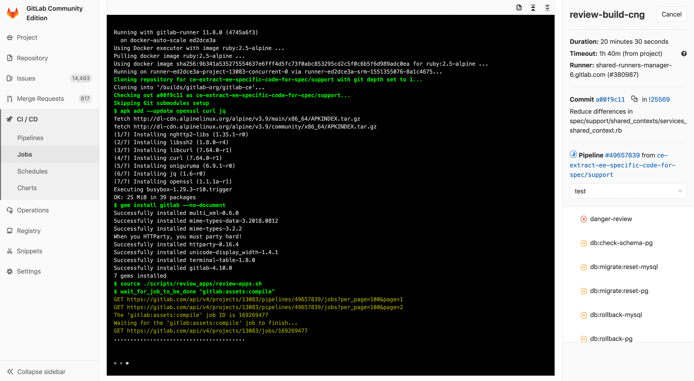

# 01-为什么要做CI/CD？


https://blog.csdn.net/bocai_xiaodaidai/article/details/119823661


## 背景-传统的应用开发发布模式

**开发团队** 在开发环境中完成软件开发，单元测试，测试通过，提交到代码版本管理库。

**运维团队** 把应用部署到测试环境，供QA团队测试，测试通过后部署生产环境。

**QA 团队** 进行测试，测试通过后通知部署人员发布到生产环境。


### 问题

**错误发现不及时**  很多 错误在项目的早期可能就存在，到最后集成的时候才发现问题。

**人工低级错误发生** 产品和服务交付中的关键活动全都需要手动操作。

**团队工作效率低** 需要等待他人的工作完成后才能进行自己的工作。

**开发运维对立**  开发人员想要快速更新，运维人员追求稳定，各自的针对的方向不同。

---


## 持续集成与持续交付

软件开发的连续方法基于自动执行脚本，以最大程度地减少在开发应用程序时引入错误的机会。从开发新代码到部署新代码，他们几乎不需要人工干预，甚至根本不需要干预。

它涉及到在每次小的迭代中就不断地构建，测试和部署代码更改，从而减少了基于错误或失败的先前版本开发新代码的机会。

此方法有三种主要方法，每种方法都将根据最适合您的策略的方式进行应用。


### 持续集成 （CI）

持续合并开发人员正在开发编写的所有代码的一种做法。通常一天内进行多次合并和提交代码，从存储库或生产环境中进行构建和自动化测试，以确保没有集成问题并及早发现任何问题。

**开发人员提交代码的时候一般先在本地测试验证，只要开发人员提交代码到版本控制系统就会触发一条提交流水线，对本次提交进行验证。**


### 持续交付 （CD）

[持续交付](https://continuousdelivery.com/)是超越持续集成的一步。不仅会在推送到代码库的每次代码更改时都进行构建和测试，而且，作为附加步骤，即使部署是手动触发的，它也可以连续部署。此方法可确保自动检查代码，但需要人工干预才能从策略上手动触发更改的部署。


### 持续部署   (CD)

通常可以通过将更改自动推送到发布系统来随时将软件发布到生产环境中。持续部署 会更进一步，并自动将更改推送到生产中。类似于持续交付，[持续部署](https://www.airpair.com/continuous-deployment/posts/continuous-deployment-for-practical-people)也是超越持续集成的又一步。不同之处在于，您无需将其手动部署，而是将其设置为自动部署。部署您的应用程序完全不需要人工干预。


---


## CICD的价值体现

- 尽早反馈，尽早发现错误。
- 减少集成问题，每次发现问题当时解决，避免问题堆积。
- 每次更改都能成功发布，降低发布风险。
- 更加频繁的交付价值，客户反馈。

## 推荐常用的CI/CD工具

### Jenkins

专业的CI工具，可扩展自动化服务器、安装配置简单、丰富的插件库、分布式架构设计、支持所有的平台、可视化的管理页面。


### GitLab

端到端DevOps工具，常用功能：代码审查、问题跟踪、动态订阅、易于扩展、项目wiki、多角色项目管理、项目代码在线编译预览、CI工具集成。


提交合并代码集成 ：通过git push 进行操作或者在GitLab Web页面操作。

发布应用到服务器 ： 获取制品库中的应用，然后用salt、ansible发布部署到服务器。

完全自动化： 提交代码-> 构建部署 -> 发布

# 02-GitLab CI/CD功能简介

## GitLab 内置持续集成功能

### 持续集成 （CI）
- 集成团队中每个开发人员提交的代码到代码存储库中。
- 开发人员在Merge或者Pull请求中合并拉取新代码。
- 在提交或者合并更改到代码存储库之前，会触发了构建，测试和新代码验证的管道。
- CI可帮助您在开发周期的早期发现并减少错误

### 连续交付 （CD） 
- 可通过结构化的部署管道确保将经过CI验证的代码交付给您的应用程序。
- CD可以将经过验证的代码更快地移至您的应用程序。

CI/CD 一起 可以加快团队为客户和利益相关者交付成果的速度。CI和CD必须无缝协作，以使您的团队快速有效地进行构建，并且对于确保完全优化的开发实践至关重要。


---


## GitLab CI/CD优势

- 开源： CI/CD是开源GitLab社区版和专有GitLab企业版的一部分。

- 易于学习： 具有详细的入门文档。

- 无缝集成： GitLab CI / CD是GitLab的一部分，支持从计划到部署,具有出色的用户体验。

- 可扩展： 测试可以在单独的计算机上分布式运行，可以根据需要添加任意数量的计算机。

- 更快的结果： 每个构建可以拆分为多个作业，这些作业可以在多台计算机上并行运行。

- 针对交付进行了优化： 多个阶段，手动部署， 环境 和 变量。

  


---


## GitLab CI/CD特点

- 多平台： Unix，Windows，macOS和任何其他支持Go的平台上执行构建。
- 多语言： 构建脚本是命令行驱动的，并且可以与Java，PHP，Ruby，C和任何其他语言一起使用。
- 稳定构建： 构建在与GitLab不同的机器上运行。
- 并行构建： GitLab CI / CD在多台机器上拆分构建，以实现快速执行。
- 实时日志记录： 合并请求中的链接将您带到动态更新的当前构建日志。
- 灵活的管道： 您可以在每个阶段定义多个并行作业，并且可以 触发其他构建。

- 版本管道： 一个 .gitlab-ci.yml文件 包含您的测试，整个过程的步骤，使每个人都能贡献更改，并确保每个分支获得所需的管道。
- 自动缩放： 您可以 自动缩放构建机器，以确保立即处理您的构建并将成本降至最低。
- 构建工件： 您可以将二进制文件和其他构建工件上载到 GitLab并浏览和下载它们。
- Docker支持： 可以使用自定义Docker映像， 作为测试的一部分启动 服务， 构建新的Docker映像，甚至可以在Kubernetes上运行。
- 容器注册表： 内置的容器注册表， 用于存储，共享和使用容器映像。
- 受保护的变量： 在部署期间使用受每个环境保护的变量安全地存储和使用机密。
- 环境： 定义多个环境。


---


## GitLab CI/CD架构

### GitLab CI / CD 

GitLab的一部分，GitLab是一个Web应用程序，具有将其状态存储在数据库中的API。
除了GitLab的所有功能之外，它还管理项目/构建并提供一个不错的用户界面。

### GitLab Runner 

是一个处理构建的应用程序。
它可以单独部署，并通过API与GitLab CI / CD一起使用。


### .gitlab-ci.yml

定义流水线作业运行，位于应用项目根目录下 。


**为了运行测试，至少需要一个 GitLab 实例、一个 GitLab Runner、一个gitlab-ci文件**

## GitLab CI/CD工作原理

- 将代码托管到Git存储库。

- 在项目根目录创建ci文件 `.gitlab-ci.yml` ，在文件中指定构建，测试和部署脚本。

- GitLab将检测到它并使用名为GitLab Runner的工具运行脚本。

- 脚本被分组为**作业**，它们共同组成了一个**管道**。




管道状态也会由GitLab显示：


最后，如果出现任何问题，可以轻松地 [回滚](https://docs.gitlab.com/12.9/ee/ci/environments.html#retrying-and-rolling-back)所有更改：


# 03-GitLabCI VS Jenkins


`Jenkins` 是一个广泛用于持续集成的可视化 `web` 自动化工具，`jenkins` 可以很好的支持各种语言的项目构建，也完全兼容`ant`、`maven`、`gradle`等多种第三方构建工具，同时跟`svn`、`git`能无缝集成，也支持直接与知名源代码托管网站，比如`github`、`bitbucket`直接集成，而且插件众多，在这么多年的技术积累之后，在国内大部分公司都有使用`Jenkins`。


`gitlab-CI`是`gitlab8.0`之后自带的一个持续集成系统，中心思想是当每一次`push`到`gitlab`的时候，都会触发一次脚本执行，然后脚本的内容包括了测试，编译，部署等一系列自定义的内容。

`gitlab-CI`的脚本执行，需要自定义安装对应`gitlab-runner`来执行，代码`push`之后，`webhook`检测到代码变化，就会触发`gitlab-CI`，分配到各个`Runner`来运行相应的脚本`script`。这些脚本有的是测试项目用的，有的是部署用的。

## 差异点对比

**分支的可配置性**

- 使用GitLab CI，新创建的分支无需任何进一步配置即可立即使用CI管道中的已定义作业。
- Jenkins 2 基于gitlab的多分支流水线可以实现。相对配置来说gitlab更加方便一些。

**定时执行构建**

有时，根据时间触发作业或整个管道会有所帮助。例如，常规的夜间定时构建。

- 使用Jenkins 2可以立即使用。可以在应执行作业或管道的那一刻以cron式语法定义。

- GitLab CI没有此功能。但是，可以通过一种变通办法来实现：通过WebAPI使用同一台或另一台服务器上的cronjob触发作业和管道。


尽管使用GitLab CI无法做到这一点，其实如果配置了提交代码即触发流水线，那么最后一次提交的构建在什么时候没有什么不同，反而减少未提交代码的定时构建资源浪费。

**拉取请求支持**

如果很好地集成了存储库管理器和CI / CD平台，您可以看到请求的当前构建状态。使用这种功能，可以避免将代码合并到不起作用或无法正确构建的主分支中。

- Jenkins没有与源代码管理系统进一步集成，需要管理员自行写代码或者插件实现。
- GitLab与其CI平台紧密集成，可以方便查看每个打开和关闭拉动请求的运行和完成管道。

**权限管理**

从存储库管理器继承的权限管理对于不想为每个服务分别设置每个用户的权限的大型开发人员或组织团体很有用。大多数情况下，两种情况下的权限都是相同的，因此默认情况下应将它们配置在一个位置。

- 由于GitLab与GitLabCI的深度整合，权限可以统一管理。

- 由于Jenkins 2没有内置的存储库管理器，因此它无法直接在存储库管理器和CI / CD平台之间合并权限。

**存储库交互**

- GitLab CI是Git存储库管理器GitLab的固定组件，因此在CI / CD流程和存储库功能之间提供了良好的交互。
- Jenkins 2与存储库管理器都是松散耦合的，因此在选择版本控制系统时它非常灵活。此外，就像其前身一样，Jenkins 2强调了对插件的支持，以进一步扩展或改善软件的现有功能。

**插件管理**

- 扩展Jenkins的本机功能是通过插件完成的。插件的维护，保护和升级成本很高。
- GitLab是开放式的，任何人都可以直接向代码库贡献更改，一旦合并，它将自动测试并维护每个更改。

## 优势与劣势

**GitLabCI**

- 轻量级，不需要复杂的安装手段。
- 配置简单，与`gitlab`可直接适配。
- 实时构建日志十分清晰，`UI`交互体验很好
- 使用 `YAML` 进行配置，任何人都可以很方便的使用。

- 没有统一的管理界面，无法统筹管理所有项目
- 配置依赖于代码仓库，耦合度没有`Jenkins`低

**Jenkins**

- 编译服务和代码仓库分离，耦合度低
- 插件丰富，支持语言众多。
- 有统一的`web`管理界面。
- 插件以及自身安装较为复杂。
- 体量较大，不是很适合小型团队。

## 实际应用

- GitLabCI 有助于DevOps人员，例如敏捷开发中，开发与运维是同一个人，最便捷的开发方式。
- JenkinsCI适合在多角色团队中，职责分明、配置与代码分离、插件丰富。

# 04-安装部署GitLab服务

## rpm方式

源地址：https://mirrors.tuna.tsinghua.edu.cn/gitlab-ce/yum/el7/

```shell
wget https://mirrors.tuna.tsinghua.edu.cn/gitlab-ce/yum/el7/gitlab-ce-12.10.0-ce.0.el7.x86_64.rpm、
rpm -ivh gitlab-ce-12.9.0-ce.0.el7.x86_64.rpm
# 编辑站点地址 external_url 'http://42.192.12.240'
vim /etc/gitlab.rb   
# 初始化配置
gitlab-ctl reconfigure  


#服务控制
gitlab-ctl start 
gitlab-ctl status
gitlab-ctl stop 
```

## Docker方式

```shell
mkdir -p ~/data/gitlab/config ~/data/gitlab/logs ~/data/gitlab/data
docker pull gitlab/gitlab-ce:12.9.0-ce.0

docker run -d  -p 443:443 -p 80:80 -p 222:22 --name gitlab --restart always -v /Users/zeyang/data/gitlab/config:/etc/gitlab -v /Users/zeyang/data/gitlab/logs:/var/log/gitlab -v /Users/zeyang/data/gitlab/data:/var/opt/gitlab gitlab/gitlab-ce:12.9.0-ce.0


docker exec -it gitlab   bash 
vim /etc/gitlab.rb   # 编辑站点地址
gitlab-ctl reconfigure  # 配置

docker restart gitlab

#服务控制
docker start gitlab
docker stop gitlab
docker rm gitlab
```

## Kubernetes部署

文件地址： https://github.com/zeyangli/devops-on-k8s/blob/master/devops/gitlab.yaml

```yaml
---
kind: Deployment
apiVersion: apps/v1
metadata:
  labels:
    k8s-app: gitlab
  name: gitlab
  namespace: devops
spec:
  replicas: 1
  revisionHistoryLimit: 10
  selector:
    matchLabels:
      k8s-app: gitlab
  template:
    metadata:
      labels:
        k8s-app: gitlab
      namespace: devops
      name: gitlab
    spec:
      containers:
        - name: gitlab
          image: gitlab/gitlab-ce:12.6.0-ce.0
          imagePullPolicy: Always
          ports:
            - containerPort: 30088
              name: web
              protocol: TCP
            - containerPort: 22
              name: agent
              protocol: TCP
          resources:
            limits:
              cpu: 1000m
              memory: 4Gi
            requests:
              cpu: 500m
              memory: 512Mi
          livenessProbe:
            httpGet:
              path: /users/sign_in
              port: 30088
            initialDelaySeconds: 60
            timeoutSeconds: 5
            failureThreshold: 12
          readinessProbe:
            httpGet:
              path: /users/sign_in
              port: 30088
            initialDelaySeconds: 60
            timeoutSeconds: 5
            failureThreshold: 12
          volumeMounts:
            - name: gitlab-conf
              mountPath: /etc/gitlab
            - name: gitlab-log
              mountPath: /var/log/gitlab
            - name: gitlab-data
              mountPath: /var/opt/gitlab
          env:
            - name: gitlab_HOME
              value: /var/lib/gitlab
      volumes:
        - name: gitlab-conf
          hostPath: 
            path: /data/devops/gitlab/config
            type: Directory
        - name: gitlab-log
          hostPath: 
            path: /data/devops/gitlab/logs
            type: Directory
        - name: gitlab-data
          hostPath: 
            path: /data/devops/gitlab/data
            type: Directory
      serviceAccountName: gitlab
---
apiVersion: v1
kind: ServiceAccount
metadata:
  labels:
    k8s-app: gitlab
  name: gitlab
  namespace: devops
---
kind: Service
apiVersion: v1
metadata:
  labels:
    k8s-app: gitlab
  name: gitlab
  namespace: devops
spec:
  type: NodePort
  ports:
    - name: web
      port: 30088
      targetPort: 30088
      nodePort: 30088
    - name: slave
      port: 22
      targetPort: 22
      nodePort: 30022
  selector:
    k8s-app: gitlab
---
kind: Role
apiVersion: rbac.authorization.k8s.io/v1beta1
metadata:
 name: gitlab
 namespace: devops
rules:
 - apiGroups: [""]
   resources: ["pods"]
   verbs: ["create","delete","get","list","patch","update","watch"]
 - apiGroups: [""]
   resources: ["pods/exec"]
   verbs: ["create","delete","get","list","patch","update","watch"]
 - apiGroups: [""]
   resources: ["pods/log"]
   verbs: ["get","list","watch"]
 - apiGroups: [""]
   resources: ["secrets"]
   verbs: ["get"]
---
apiVersion: rbac.authorization.k8s.io/v1beta1
kind: RoleBinding
metadata:
 name: gitlab
 namespace: devops
roleRef:
 apiGroup: rbac.authorization.k8s.io
 kind: Role
 name: gitlab
subjects:
 - kind: ServiceAccount
   name: gitlab
   namespace: devops
```

```
kubectl create -f gitlab.yaml
kubectl delete -f gitlab.yaml
```
