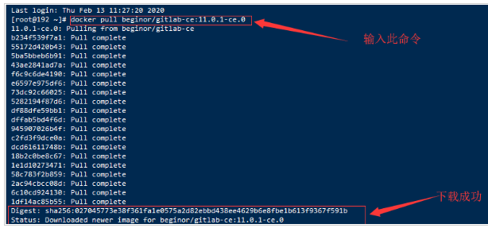
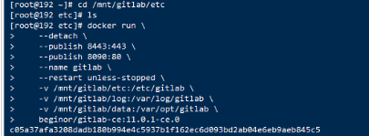
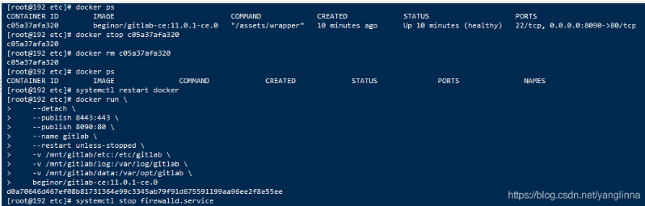

1、下载镜像

```
docker pull gitlab/gitlab-ce
```

2、创建目录

通常会将 GitLab 的配置 (etc) 、 日志 (log) 、数据 (data) 放到容器之外， 便于日后升级， 因此请先准备这三个目录

```
mkdir -p /wwwroot/gitlab/config
mkdir -p /wwwroot/gitlab/logs 
mkdir -p /wwwroot/gitlab/data
```

3、启动运行

```
docker run --detach \
  --hostname gitlab.example.com \
  --publish 8443:443 --publish 8880:80 \
  --name gitlab \
  --restart always \
  --volume /wwwroot/gitlab/config:/etc/gitlab \
  --volume /wwwroot/gitlab/logs:/var/log/gitlab \
  --volume /wwwroot/gitlab/data:/var/opt/gitlab \
  --privileged=true \
  gitlab/gitlab-ce:latest
```

- --hostname gitlab.example.com: 设置主机名或域名
- --publish 8443:443：将http：443映射到外部端口8443
- --publish 8880:80：将web：80映射到外部端口8880
- --name gitlab: 运行容器名
- --restart always: 自动重启
- --volume /wwwroot/gitlab/config:/etc/gitlab: 挂载目录
- --volume /wwwroot/gitlab/logs:/var/log/gitlab: 挂载目录
- --volume /wwwroot/gitlab/data:/var/opt/gitlab: 挂载目录
- --privileged=true 使得容器内的root拥有真正的root权限。否则，container内的root只是外部的一个普通用户权限

运行成功之后，可以使用下面的命令查看容器运行状态：

```
docker ps
```

可以看到GitLab已经在运行了，有一个属性STATUS为health:starting，说明gitlab的服务正在启动中，还没有启动完毕。等这个状态变成healthy时则说明已经部署完成，可以访问了。

访问

gitlab启动成功后，浏览器访问http://ip:8880,即可访问。

# 方法二

##### docker部署gitlab

```bash
#1:拉取gitlab镜像
docker pull gitlab/gitlab-ce  
#2:生成挂载目录
mkdir -p /home/gitlab/etc/gitlab	
mkdir -p /home/gitlab/var/log
mkdir -p /home/gitlab/var/opt
#3:启动容器（用的时候调整下命令，为了便于查看，有换行符）
 docker run -d  
 -p 443:443 -p 80:80 -p 222:22 
 --name gitlab-dev --restart always --privileged=true  
 -v /home/gitlab/etc/gitlab:/etc/gitlab 
 -v /home/gitlab/var/log:/var/log/gitlab 
 -v /home/gitlab/var/opt:/var/opt/gitlab 
 gitlab/gitlab-ce
```

【–privileged=true 要加上，不然可能因为权限问题导致启动失败】

此时访问43.165.45.556 是有界面了，如果网络不可用或者502，就再等个几分钟，此时容器尚未启动完全

#### 调整gitlab配置

**1.配置克隆项目时所需**

```bash
vim /home/gitlab/etc/gitlab/gitlab.rb

# 配置http协议所使用的访问地址,不加端口号默认为80
external_url 'http://43.165.45.556'

# 配置ssh协议所使用的访问地址和端口
gitlab_rails['gitlab_ssh_host'] = '43.165.45.556'
gitlab_rails['gitlab_shell_ssh_port'] = 222 # 此端口是run时22端口映射的222端口

# 重启gitlab容器
 docker restart gitlab-dev
```

**2.root所需**

如果访问43.165.45.556 时直接进入界面，这个时候根本不知道root密码，进行如下操作：

```bash
# 进入容器内部
docker exec -it gitlab /bin/bash

# 进入控制台
gitlab-rails console -e production

# 查询id为1的用户，id为1的用户是超级管理员
user = User.where(id:1).first
# 修改密码为123456
user.password='123456'
# 保存
user.save!
# 退出
exit
```

## 方法三：

## 1. docker拉取gitlab社区版


```undefined
docker pull gitlab/gitlab-ce:latest
```

查看是否拉取成功


```bash
[root@test gitlab] docker images
REPOSITORY         TAG       IMAGE ID       CREATED      SIZE
gitlab/gitlab-ce   latest    75d591b81fd7   4 days ago   2.23GB
```

## 2. 使用容器卷将数据映射到本地并运行

| 宿主机位置          | 容器位置        | 作用                     |
| ------------------- | --------------- | ------------------------ |
| /data/gitlab/config | /etc/gitlab     | 用于存储 GitLab 配置文件 |
| /data/gitlab/logs   | /var/log/gitlab | 用于存储日志             |
| /data/gitlab/data   | /var/opt/gitlab | 用于存储应用数据         |

### 在宿主机创建映射目录


```kotlin
[root@test ~] mkdir -p /data/gitlab/config  #递归创建目录，即使上级目录不存在，会按目录层级自动创建目录
[root@test ~] mkdir -p /data/gitlab/logs
[root@test ~] mkdir -p /data/gitlab/data
[root@test ~] cd /data/gitlab
[root@test gitlab] ls
config  data  logs
```

## 3.1 创建方法一

### 创建`gitlab_start.sh`文件


```css
[root@test gitlab] touch gitlab_start.sh
[root@test gitlab] vim gitlab_start.sh
```

编写内容


```bash
#!/bin/sh
GITLAB_HOME=/usr/local/gitlab
sudo docker run --detach 
    --hostname 部署的服务器ip 
    --publish 443:443 --publish 80:80 --publish 10080:22 
    --name gitlab 
    --restart always 
    --volume $GITLAB_HOME/config:/etc/gitlab 
    --volume $GITLAB_HOME/logs:/var/log/gitlab 
    --volume $GITLAB_HOME/data:/var/opt/gitlab 
    gitlab/gitlab-ce:latest
```

> 参数说明：
>
> --detach: 设置容器后台运行
> --hostname: 设置容器的 hostname,如果是本地localhost ，否则使用外网ip
> --publish: 端口转发规则（80：Http 访问端口，443：Https 访问端口，10080：主机的 ssh 访问端口，22：Docker 容器中 ssh 访问端口）
> --name：容器名称
> --restart always：每次启动容器就重启GitLab
> --volume: 共享目录挂载，即 docker 容器内外数据共享
> --e：配置 Gitlab 运行的环境变量

在该文件目录下,授予`gitlab_start.sh`执行权限


```css
chmod +x gitlab_start.sh    
```


```bash
./gitlab_start.sh       #执行脚本
```

# 方法四

***\*下载\*******\*镜像\*******\*文件\****

```
docker pull beginor/gitlab-ce:11.0.1-ce.0
```

 

**2.\**创建GitLab 的配置 (etc) 、 日志 (log) 、数据 (data) 放到容器之外， 便于日后升级\****

```
mkdir` `-p ``/mnt/gitlab/etc
```

```
mkdir` `-p ``/mnt/gitlab/log
```

```
mkdir` `-p ``/mnt/gitlab/data
```

**运行GitLab容器**

```
docker run \
 
  --detach \
 
  --publish 8443:443 \
 
  --publish 8090:80 \
 
  --name gitlab \
 
  --restart unless-stopped \
 
  -v /mnt/gitlab/etc:/etc/gitlab \
 
  -v /mnt/gitlab/log:/var/log/gitlab \
 
  -v /mnt/gitlab/data:/var/opt/gitlab \
 
  beginor/gitlab-ce:11.0.1-ce.0 
```

 

**4.修改/mnt/gitlab/etc/gitlab.rb**

把external_url改成部署机器的域名或者IP地址

vi /mnt/gitlab/etc/gitlab.rb

将external_url 'http://192.168.125.126'

**5.\**修改/mnt/gitlab/data/gitlab-rails/etc/gitlab.yml\****

vi /mnt/gitlab/data/gitlab-rails/etc/gitlab.yml

找到关键字 * ## Web server settings *

将host的值改成映射的外部主机ip地址和端口

**6.重启docker容器**

先停止该容器，删掉该容器信息，重启完docke之后，重新运行GitLab容器

 

# 方法五

https://www.jb51.net/article/223451.htm

# 方法六

https://www.jb51.net/article/104536.htm

# Linux执行.sh文件时提示No such file or directory该怎么办(三种解决办法)

https://www.jb51.net/article/73684.htm

# 操作系统怎么查看docker镜像的版本号

https://blog.csdn.net/wangxueying5172/article/details/122165237

# Linux下面如何运行.sh文件

http://t.zoukankan.com/lcword-p-5334059.html

# 解决#!/bin/bash - no such file or directory

https://www.jianshu.com/p/f2b867a347c9