# Docker基本知识

https://zhuanlan.zhihu.com/p/553214340

https://yeasy.gitbook.io/docker_practice/ci

https://haicoder.net/docker/docker-course.html

**为什么会有docke**


使用docker之前：前端项目在开发的时候用的node版本，还有其他依赖的版本是一种，而测试和运维使用的这些版本又是另一种，可能的办法是，我们又会将这些配置给测试人员配置一次，但每次测试都需要配置，很麻烦；让测试或运维自己去配，这样可能导致从开发，测试，运维使用的是不同的版本，导致项目出现问题

使用docker之后：我将整个项目、项目配置、node版本都打包到一个镜像里面，把这个镜像当作一个包，里面包含了开发时的所有配置，当测试开始测试的时候，我们只需要将这个包给测试人员，这些镜像使用的是Docker引擎将这个镜像跑起来，能够让这整个流程上的人使用到和我们完全相同的配置的项目；运维人员也是同样的；可以将这个镜像在任何地方进行使用


例如：一份centos7.iso镜像，  每个人的电脑安装了VMware，centos7.ios是一个linux的镜像，可以运行在不同平台的电脑上；

在docker里面，多个docker运行同一个镜像，其结果都是相同的；即一次环境，处处运行


**解决了运行环境和配置问题的软件容器，方便做持续集成并有助于整体发布的容器虚拟化技术**


**容器与虚拟机的比较**


**Docker是什么？**


Docker能做什么？

**官网在哪？**

docker.com：docker的官网

dockerhub.com： 安装docker镜像的仓库

**Docker安装**

docker依赖于已存在并运行的linux内核环境

如果其他系统想部署Docker就必须安装一个虚拟的Linux环境

centos7的安装，Linux内核版本为3.8以上，系统为64位

在windows上部署Docker的方法是先安装一个虚拟机，并在安装Linux系统的虚拟机中运行Docker

查看自己的内核：

```shell
cat /etc/redhat-release
```

uname命令用于打印当前系统的相关信息（内核版本，硬件架构，主机名称和操作系统类型）

```shell
uname -r
# 3.10.0-1160.11.1.el7.x86_64
```

docker是一种容器引擎，容器引擎上面存在容器实例，容器实例就是来自于镜像。

而鲸鱼背上的集装箱就是一个容器实例，

## 镜像：

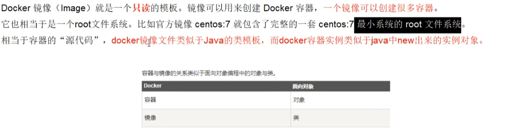 

## 容器：

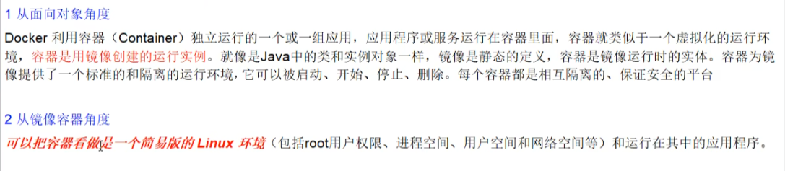 

## 仓库：

 

**Docker三要素的总结**

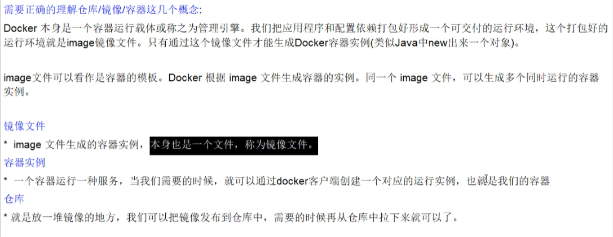 

### Docker中的镜像，容器，仓库之间的配合

客户端通过给docker发送命令。让容器来做一下操作

Docker引擎在本地找是否存在某种镜像，如果存在，直接运行，如果不存在，就去Docker仓库上去下载

都不存，报镜像文件不存在的错误

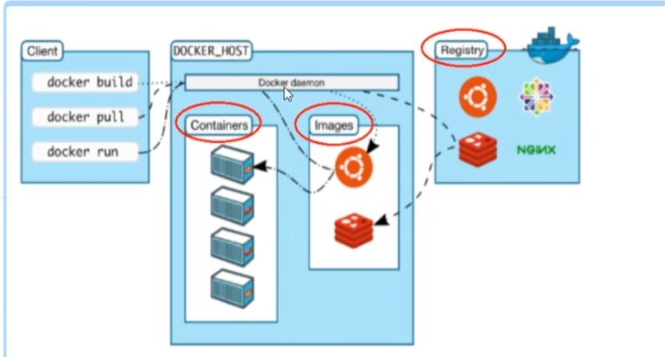 

 

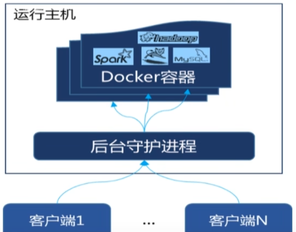 


Docker

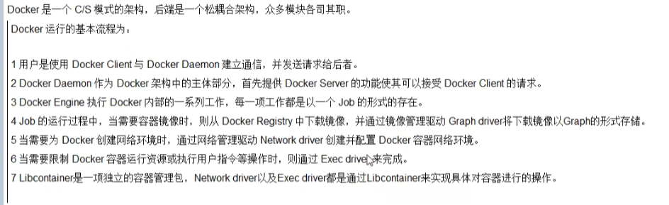 

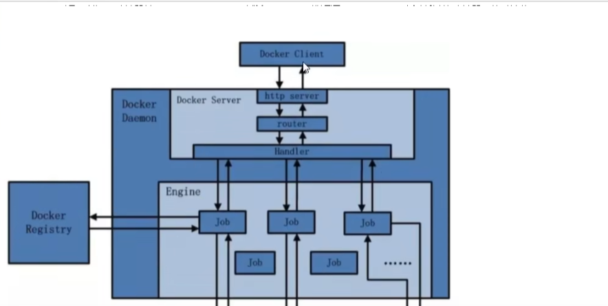 


 

#### 启动一个容器


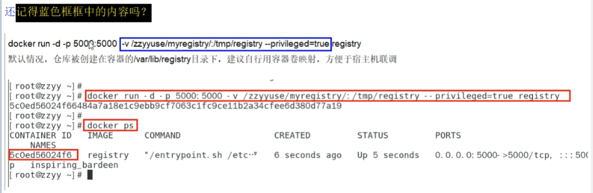 

参数介绍：

run -d  后台运行

5000:5000   前面表示宿主机的端口号，后面表示容器的端口号

-v 添加自定义的容器卷    冒号左边的表示宿主机的路径，右边表示容器内的路径；-v 可以是多组

--privileged=true表示放开权限；

### 容器中的数据卷

容器卷 加入参数  --privileged=true，表示给这个容器给了权限

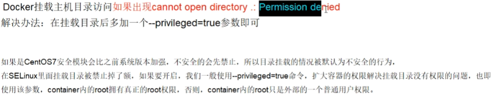 

docker可以做一个容器的目录和主机的目录做映射

将docker容器内的数据保存金宿主机的磁盘中

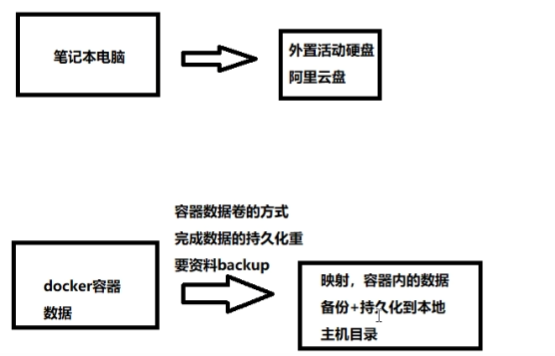 

 

如何运行一个带有容器卷存储功能的容器实例：

```shell
docker run -it --privileged=true -v /宿主机绝对路径目录:/容器内目录  镜像名
```

**容器卷的作用：**

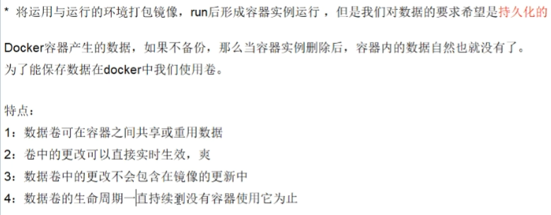 

**容器卷的使用：**

新建一个容器：

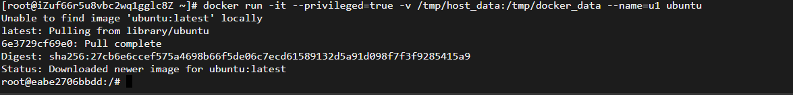 

进入容器内的/tmp/docker_data ，发现内容为空，新建一个文件，然后在主机对应的目录下查看内容

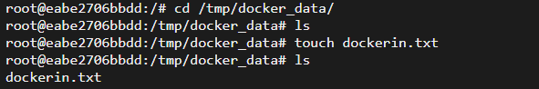 

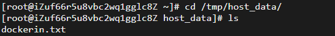 

发现在宿主机上存在了这个文件


执行同样的操作，在宿主机上/tmp/host_data/目录下新建一个文件，然后查看容器内/tmp/docker_data目录下的文件

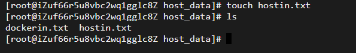 

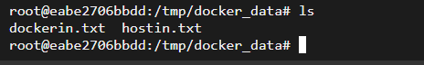 


结论： 无论在宿主机还是容器内有文件发生变动，另一个目录下的文件都会跟着发生相应的变化 

无论是宿主机还是容器内的某个文件内容发生变化，另一个文件内容也会发生变化

**查看数据卷是否挂载成功**

```shell
docker inspect 容器id
```

```json
[
    {
        "Id": "eabe2706bbdd546b4ff666b42def275b562f0516890573d4ab37c00772b1c948",
        "Created": "2023-01-08T07:31:49.63650263Z",
        "Path": "bash",
        "Args": [],
        "State": {
            "Status": "running",
            "Running": true,
            "Paused": false,
            "Restarting": false,
            "OOMKilled": false,
            "Dead": false,
            "Pid": 9148,
            "ExitCode": 0,
            "Error": "",
            "StartedAt": "2023-01-08T07:31:50.034892028Z",
            "FinishedAt": "0001-01-01T00:00:00Z"
        },
        "Image": "sha256:6b7dfa7e8fdbe18ad425dd965a1049d984f31cf0ad57fa6d5377cca355e65f03",
        "ResolvConfPath": "/var/lib/docker/containers/eabe2706bbdd546b4ff666b42def275b562f0516890573d4ab37c00772b1c948/resolv.conf",
        "HostnamePath": "/var/lib/docker/containers/eabe2706bbdd546b4ff666b42def275b562f0516890573d4ab37c00772b1c948/hostname",
        "HostsPath": "/var/lib/docker/containers/eabe2706bbdd546b4ff666b42def275b562f0516890573d4ab37c00772b1c948/hosts",
        "LogPath": "/var/lib/docker/containers/eabe2706bbdd546b4ff666b42def275b562f0516890573d4ab37c00772b1c948/eabe2706bbdd546b4ff666b42def275b562f0516890573d4ab37c00772b1c948-json.log",
        "Name": "/u1",
        "RestartCount": 0,
        "Driver": "overlay2",
        "Platform": "linux",
        "MountLabel": "",
        "ProcessLabel": "",
        "AppArmorProfile": "",
        "ExecIDs": null,
        "HostConfig": {
            "Binds": [
                "/tmp/host_data:/tmp/docker_data"
            ],
            "ContainerIDFile": "",
            "LogConfig": {
                "Type": "json-file",
                "Config": {}
            },
            "NetworkMode": "default",
            "PortBindings": {},
            "RestartPolicy": {
                "Name": "no",
                "MaximumRetryCount": 0
            },
            "AutoRemove": false,
            "VolumeDriver": "",
            "VolumesFrom": null,
            "CapAdd": null,
            "CapDrop": null,
            "CgroupnsMode": "host",
            "Dns": [],
            "DnsOptions": [],
            "DnsSearch": [],
            "ExtraHosts": null,
            "GroupAdd": null,
            "IpcMode": "private",
            "Cgroup": "",
            "Links": null,
            "OomScoreAdj": 0,
            "PidMode": "",
            "Privileged": true,
            "PublishAllPorts": false,
            "ReadonlyRootfs": false,
            "SecurityOpt": [
                "label=disable"
            ],
            "UTSMode": "",
            "UsernsMode": "",
            "ShmSize": 67108864,
            "Runtime": "runc",
            "ConsoleSize": [
                0,
                0
            ],
            "Isolation": "",
            "CpuShares": 0,
            "Memory": 0,
            "NanoCpus": 0,
            "CgroupParent": "",
            "BlkioWeight": 0,
            "BlkioWeightDevice": [],
            "BlkioDeviceReadBps": null,
            "BlkioDeviceWriteBps": null,
            "BlkioDeviceReadIOps": null,
            "BlkioDeviceWriteIOps": null,
            "CpuPeriod": 0,
            "CpuQuota": 0,
            "CpuRealtimePeriod": 0,
            "CpuRealtimeRuntime": 0,
            "CpusetCpus": "",
            "CpusetMems": "",
            "Devices": [],
            "DeviceCgroupRules": null,
            "DeviceRequests": null,
            "KernelMemory": 0,
            "KernelMemoryTCP": 0,
            "MemoryReservation": 0,
            "MemorySwap": 0,
            "MemorySwappiness": null,
            "OomKillDisable": false,
            "PidsLimit": null,
            "Ulimits": null,
            "CpuCount": 0,
            "CpuPercent": 0,
            "IOMaximumIOps": 0,
            "IOMaximumBandwidth": 0,
            "MaskedPaths": null,
            "ReadonlyPaths": null
        },
        "GraphDriver": {
            "Data": {
                "LowerDir": "/var/lib/docker/overlay2/96646c91b3fa9108b24ff81941c7195ad62468814b3fbd76a8f66a21f30014a2-init/diff:/var/lib/docker/overlay2/6e0498f19bfa6e98ead026e9afd9dd8a32a67770d424f5f49a093004f8a9e232/diff",
                "MergedDir": "/var/lib/docker/overlay2/96646c91b3fa9108b24ff81941c7195ad62468814b3fbd76a8f66a21f30014a2/merged",
                "UpperDir": "/var/lib/docker/overlay2/96646c91b3fa9108b24ff81941c7195ad62468814b3fbd76a8f66a21f30014a2/diff",
                "WorkDir": "/var/lib/docker/overlay2/96646c91b3fa9108b24ff81941c7195ad62468814b3fbd76a8f66a21f30014a2/work"
            },
            "Name": "overlay2"
        },
        // 这里就是挂载内容
        "Mounts": [
            {
                "Type": "bind",
                "Source": "/tmp/host_data", // 宿主机的挂载位置
                "Destination": "/tmp/docker_data", // 容器的文件目录
                "Mode": "",
                "RW": true,
                "Propagation": "rprivate"
            }
        ],
        "Config": {
            "Hostname": "eabe2706bbdd",
            "Domainname": "",
            "User": "",
            "AttachStdin": true,
            "AttachStdout": true,
            "AttachStderr": true,
            "Tty": true,
            "OpenStdin": true,
            "StdinOnce": true,
            "Env": [
                "PATH=/usr/local/sbin:/usr/local/bin:/usr/sbin:/usr/bin:/sbin:/bin"
            ],
            "Cmd": [
                "bash"
            ],
            "Image": "ubuntu",
            "Volumes": null,
            "WorkingDir": "",
            "Entrypoint": null,
            "OnBuild": null,
            "Labels": {}
        },
        "NetworkSettings": {
            "Bridge": "",
            "SandboxID": "1fa7b6e0151042e49f117ed8b06a7dade00f4d5d5e1838890d9a146171765b0a",
            "HairpinMode": false,
            "LinkLocalIPv6Address": "",
            "LinkLocalIPv6PrefixLen": 0,
            "Ports": {},
            "SandboxKey": "/var/run/docker/netns/1fa7b6e01510",
            "SecondaryIPAddresses": null,
            "SecondaryIPv6Addresses": null,
            "EndpointID": "b8398ae1c15074ae1eb7eaada77be3415634a728a2d5e1f2bd9c076f130e0894",
            "Gateway": "172.17.0.1",
            "GlobalIPv6Address": "",
            "GlobalIPv6PrefixLen": 0,
            "IPAddress": "172.17.0.3",
            "IPPrefixLen": 16,
            "IPv6Gateway": "",
            "MacAddress": "02:42:ac:11:00:03",
            "Networks": {
                "bridge": {
                    "IPAMConfig": null,
                    "Links": null,
                    "Aliases": null,
                    "NetworkID": "a586f565481f0514cd608ff76f8950a988bcc81d5f2b1342d9c9c5f9191c5a39",
                    "EndpointID": "b8398ae1c15074ae1eb7eaada77be3415634a728a2d5e1f2bd9c076f130e0894",
                    "Gateway": "172.17.0.1",
                    "IPAddress": "172.17.0.3",
                    "IPPrefixLen": 16,
                    "IPv6Gateway": "",
                    "GlobalIPv6Address": "",
                    "GlobalIPv6PrefixLen": 0,
                    "MacAddress": "02:42:ac:11:00:03",
                    "DriverOpts": null
                }
            }
        }
    }
]
```

可以看到上面的"Mounts"里面数据卷挂载成功了


Note:如果容器停止了，在宿主机里面的文件做修改，然后开启容器，进入容器的目录下，发现容器内的文件也发生了变化

**上面便是主机和容器之间的互通**

### 容器卷的读写规则添加说明

默认规则是同时支持**读写**  在数据卷后面添加的:rw

1。 容器实例内部被限制，只能读取不能写，在数据卷后面添加的:ro

docker run -it --privileged=true -v /宿主机绝对路径目录:/容器内目录:ro 镜像名

修改完之后，在容器内修改，会发生错误；

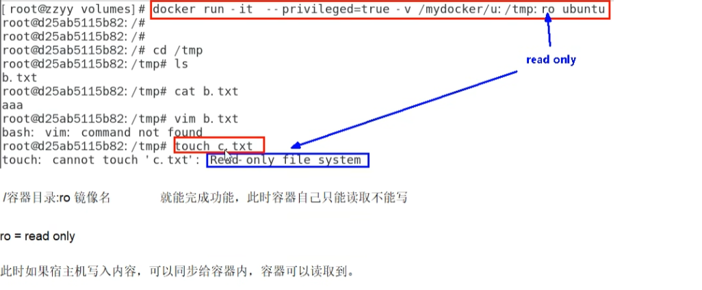 

操作流程：

docker stop 容器id/容器名字

docker rm -rf  容器id/容器名字

docker run -it --privileged=true -v /mydocker/u:/tmp/u:ro --name u2 ubuntu

### 容器卷之间的继承

1. 容器1完成和宿主机的映射/互通

新建一个u1容器

```shell
docker run -it --privileged=true -v /mydocker/u:/tmp/u --name u1 ubuntu
```


2. 容器2继承容器1的卷规则 `docker run -it --volumes-from u1 --name u2 ubuntu`

进入容器2的目录

查看容器2的/tmp/u目录，发现容器1有的内容容器2也存在，即继承了u1的文件内容

在u2新建文件，然后在u1容器里面的目录下查看，发现u1目录下存在了u2新建的文件，在主机的目录下查看，发现也存在了；


**如果将u1停止了**

不影响主机和u2之间的数据互通，即两个修改都互相影响，

**如果u1启动了**

之前u2和主机修改的文件，在u1目录下也照样存在，


## Docker命令

启动docker： systemctl start docker

关闭docker： systemctl stop docker

查看docker的运行状态： systemctl status docker

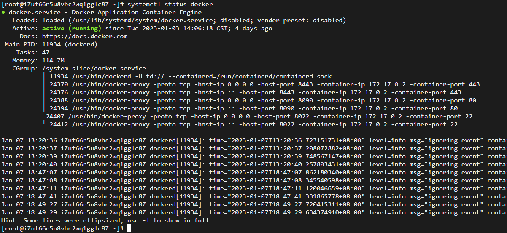 

设置docker开机自启动：systemctl enable docker

查看docker信息： docker info

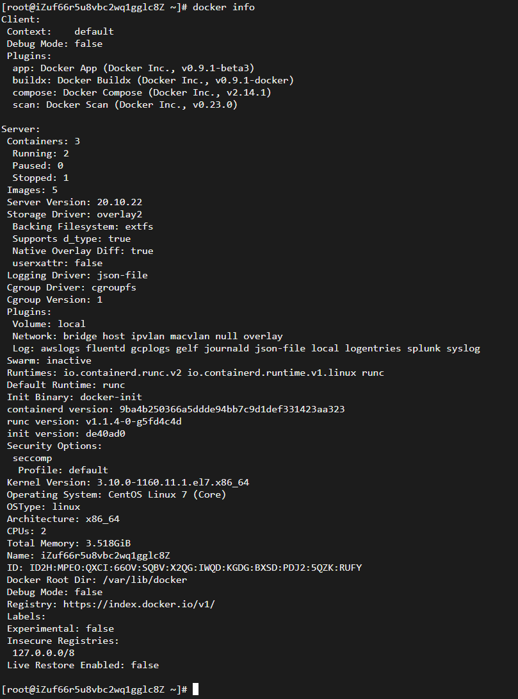 

docker帮助文档：docker --help  能够查看到很多命令

显示当前docker下的所有镜像： docker images

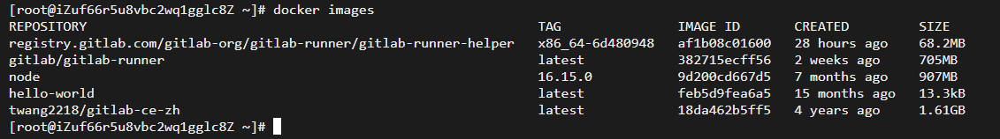 

只显示镜像id： docker images -q

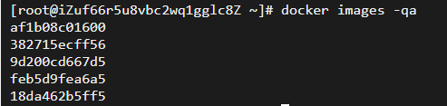 

从远程仓库查看指定名称的镜像： docker search [-limit N] 镜像名  

N： 指定只列出多少个

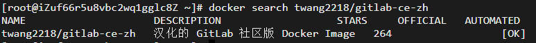 

下载镜像到本地： docker pull 镜像名

下载指定版本的镜像，默认为latest ： docker pull 镜像名字:版本号

查看镜像/容器/数据卷所占的空间： docker system df

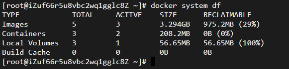 

删除镜像： docker rmi 镜像名/id

强制删除： docker rmi -f 镜像名/id

删除多个镜像 空格分割：docker rmi 镜像名/id  镜像名/id  

全部删除： docker rmi -f ${docker images -qa}


# 


# Docker安装Gitlab

https://blog.csdn.net/lianxiaohei/article/details/122665812   我是根据这个安装的

https://baijiahao.baidu.com/s?id=1735404739948635473&wfr=spider&for=pc

https://www.cnblogs.com/chenyuanbo/p/12443662.html  docker安装gitlab 和 idea安装gitlab的教材

## Gitlab修改密码

官方文档： **https://docs.gitlab.com/ee/security/reset_user_password.html**

进入gitlab容器，

```
docker exec -it gitlab bash
```

使用以下命令启动Ruby on Rails控制台

 **gitlab-rails console -e production**

控制台加载完毕后，通过邮箱或者用户名去搜索用户

**user = User.where(id: 1).first**   根据id来查找，可以看到查找到当前用户的名称

或者

**user = User.find_by(email: 'admin@example.com')**  根据id来查找，可以看到查找到当前用户的名称

更改找到的这个用户密码

**user.password = '新密码'**

**user.password_confirmation = '新密码'**

更改完进行保存

**user.save**

我们再次进入到自己搭建的gitlab服务器，然后可以使用新密码进行重新登录

# Docker安装gitlab-runner

https://blog.51cto.com/u_15067267/4293270

GitLab-Runner 从安装到配置到入门

https://blog.csdn.net/zyy247796143/article/details/123842374

gitlab-runner的配置文件

进入gitlab-runner容器： docker exec -it gitlab-runner /bin/bash

找到配置文件的路径：cd /etc/gitlab-runner  config.toml

config.toml这个文件就是runner的配置文件，当我们注册完runner之后，会生成一个这个文件

cat config.toml可以查看这个文件的信息

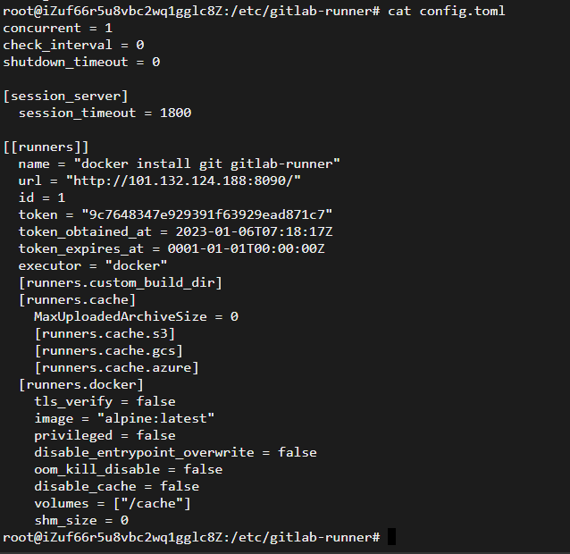 

 


**一些命令**

停掉gitlab服务再重启

```shell
停掉gitlab服务再重启
docker stop e37eeebc6c7a
docker start e37eeebc6c7a
curl 127.0.0.1:8090  # 测试能否连接gitlab
```

gitlab-runner 常用命令，需要进入gitlab-runner容器

进入runner容器： docker exec -it gitlab-runner /bin/bash

看到保存在配置文件中的所有运行程序： gitlab-runner list

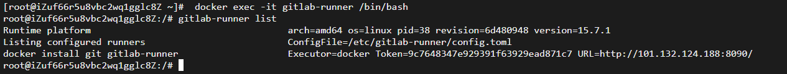 

检查注册的runner是否可以连接，但不验证GitLab服务是否正在使用runner：gitlab-runner verify  此命令。

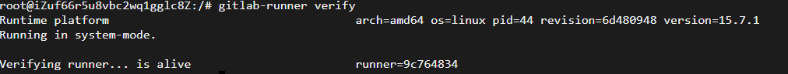 

取消已注册的runner： gitlab-runner unregister 

使用令牌注销：gitlab-runner unregister --url http://gitlab.example.com/ --token t0k3n

使用名称注销： gitlab-runner unregister --name test-runner

注销所有： gitlab-runner unregister --all-runners

停止运行并从服务中卸载GitLab Runner：gitlab-runner uninstall

启动Runner服务  ：gitlab-runner start

停止GitLab Runner服务：gitlab-runner stop

重启GitLab Runner服务：gitlab-runner restart

显示GitLab Runner服务的状态。当服务正在运行时，退出代码为零；而当服务未运行时，退出代码为非零：gitlab-runner status


调试模式排查错误特别有用： gitlab-runner --debug

获取帮助信息：gitlab-runner  --help  

gitlab-runner run       		#普通用户模式  配置文件位置 ~/.gitlab-runner/config.toml
sudo gitlab-runner run  	# 超级用户模式  配置文件位置/etc/gitlab-runner/config.toml 

## 配置gitlab-runner

可以通过修改 config.toml 文件。文件更改时不需要重启服务，每隔三秒GitLab Runner 会检查配置修改，并重新加载。

进入配置目录： cd /etc/gitlab-runner


# 解决git拉取代码时的问题

当我们新增了远程地址，可以使用ssh -T git@host来测试连通性

最近在新 Linux 中安装 GitLab 后，发现一个诡异的事情。当配置完管理员账号、SSH 密钥之后、开启防火墙端口号、在 GitLab 新建仓库 test 等等之后，笔者尝试在远程客户端 Windows 上使用 git clone 来 clone 这个在 GitLab 上的仓库，使用的是 SSH 协议。但无论 clone 的 URL 是否正确，终端提示输入密码，且输入任何密码都不对。完整提示信息内容如下：

```shell
 git clone git@xxx.xxx.xxx.xxx:XXX/test.git
Cloning into 'test'...
/c/Users/xxx/.ssh/config line 2: Unsupported option "rsaauthentication"
git@xxx.xxx.xxx.xxx's password:
Permission denied, please try again.
git@xxx.xxx.xxx.xxx's password:
34xxxPermission denied, please try again.
git@xxx.xxx.xxx.xxx's password:
git@xxx.xxx.xxx.xxx: Permission denied (publickey,gssapi-keyex,gssapi-with-mic,password).
fatal: Could not read from remote repository.

Please make sure you have the correct access rights and the repository exists.
```


但奇怪的是，如果使用 HTTP 协议进行 clone、push 却没有任何问题

试了各种方法才发现，这个密码其实是 GitLab 所在的 Linux 上的一个账户名为 git 的账户密码。这个账户是怎么来的呢？实际上，在第一次使用命令 `gitlab-ctl reconfigure` 初始化 GitLab 配置时，GitLab 会自动为 Linux 创建五个账户，分别是：

- git
- gitlab-redis
- gitlab-psql
- gitlab-prometheus
- gitlab-www

因为这些账户在被创建时，GitLab 并没有提示我们输入密码，所以我们并不知道密码，或者它们本来就没有密码。不过，我们在知道账户名的时候就可以强制改密码了。可以使用如下命令来更改账户 git 的密码：需要进入gitlab的容器

passwd git 

接下来会提示重新修改密码

**还有一种方法修改git密码的**

进入gitlab容器

su git 切换到git用户 

进入gitlab-rails console

根据邮箱查找用户ID

```shell
User.find_by(email:'123456@qq.com')
```

选定UID=14

```shell
user = User.where(id:4).first
```

修改密码

```shell
user.password='123456'
user.password_confirmation = '123456'
```

保存

```shell
user.save!
```

tips： 如果root密码错误登陆超过10次，会锁定该账号

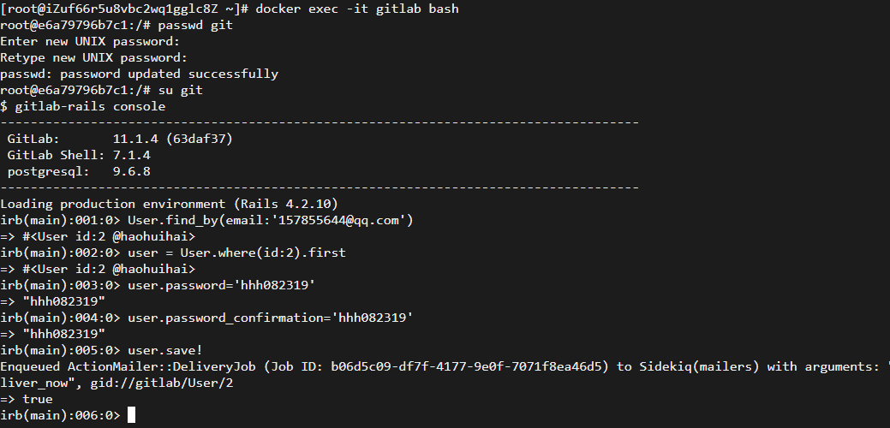 

修改完我重新拉取的时候，获取重新ssh -T git@host的时候密码还是不正确

```shell
ssh -T git@192.168.1.1
依然显示报错   
ssh -T  是添加公钥之后进行验证的操作
```

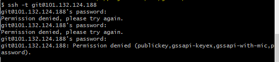 

但是我重新使用ssh拉取代码的时候。发现这个地址变了

 ssh://git@xxx.xxx.xxx.xxx:8022/haohuihai/ceshi.git

之前是

git@xxx.xxx.xxx.xxx:8022/haohuihai/ceshi.git

居然可以了。想不到

如果实在解决不了，可以重新卸载，然后重新安装，重新配置

[原文链接](https://blog.csdn.net/wangpaiblog/article/details/122295579)

<hr />

还又一些解决办法是本地生成公钥的这种方法，添加过多次，发现也行不通

怎么添加，官网又介绍

# 如何将项目同事提交到gitlab和github

https://cloud.tencent.com/developer/article/1781698

gitlab常用命令

http://t.zoukankan.com/inxworld-p-11460991.html

# GitLab-Runner配置参数详解

http://events.jianshu.io/p/6decaed7b648

# GitLab-Runner 从安装到配置到入门

https://blog.csdn.net/zyy247796143/article/details/123842374

# gitLab修改通过HTTP拉取代码时的ip地址


1. 找到gitlab.yml文件：

进入gitlab容器

```shell
docker exec -it gitlab bash
```

2. 切换到`/opt/gitlab/embedded/service/gitlab-rails/config` 目录下，找到gitlab.yml并编辑

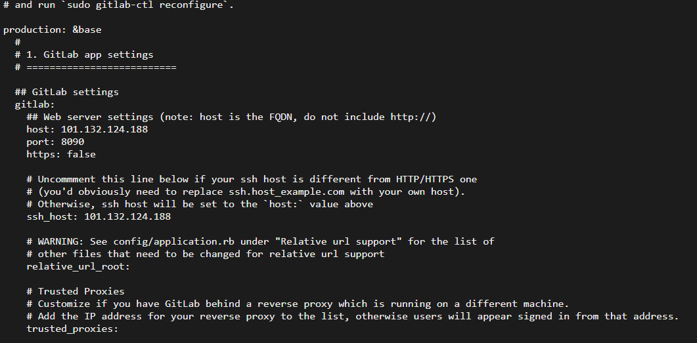 

编辑host，port， ssh_host的地址

3. 修改完重启：

```shell
gitlab-ctl restart
```

通过多次尝试，就能发现这个配置修改的就是拉取代码时的配置

## gitlab配置文件介绍

https://gitlab.com/gitlab-org/omnibus-gitlab/blob/master/doc/settings/gitlab.yml.md

## gitlab的gitlab.rb的配置

https://docs.gitlab.com/omnibus/settings/configuration.html#configuring-the-external-url-for-gitlab

## 极狐版的配置文件

https://docs.gitlab.cn/omnibus/installation/

# gitlab 企业级私有仓库搭建

https://blog.csdn.net/m0_46090675/article/details/120853935/

# gitlab帮助

http://xxx.xxx.xxx.xxx:8090/help/gitlab-basics/README.md

# 翻译的gitlab-ci.yml的配置文件

## 使用.gitlab-ci.yml配置你的jobs

.gitlab-ci.yml文件放置在项目的根目录下，里面包含了如何去构建你项目的一些定义

在使用.gitlab-ci.yml的时候，我们需要注册gitlab-runner

### jobs

jobs是具有约束性的，指明应该在什么时候去运行；

在.gitlab-ci.yml文件里面，jobs有以下特点

1. 不限制数量
2. 必须包含一个script脚本
3. 应该被定义在根元素上

```yaml
job1:
	script: 'execute-script-for-job1'
job2:
  script: "execute-script-for-job2"

```

上面的例子是具有两个互相独立的jobs，每一个job执行的是不同的命令，而这个命令是我们可以直接在容器执行的脚本(./configure;make;make install)，也可以是一个.sh执行的脚本文件

jobs是由gitlab-runner找到，并执行在Runner环境中被执行，每一个job都是相互独立的

每一个job的名称必须具有唯一性，下面的关键字不能被使用于job的名称：
image，services，stages，types，before_script，after_script，variables，cache

一个job定义的一些参数列表

| 关键字        | 必填 | 描述                                                         |
| ------------- | ---- | ------------------------------------------------------------ |
| script        | yes  | 定义了Runner执行的脚本命令或.sh文件                          |
| image         | no   | 使用的Docker，覆盖当前配置文件正在使用的imagge               |
| services      | no   | 使用的docker服务，覆盖当前配置文件正在使用的services         |
| stage         | no   | 定义了一个job进行的阶段（默认：test）                        |
| type          | no   | stage的别名                                                  |
| variables     | no   | 在一个job里面定义的变量，可以在当前job里面使用               |
| only          | no   | 定义了一组为创建job的git引用列表                             |
| except        | no   | 定义了一组不为创建job的git引用列表                           |
| tags          | no   | 定义了一组标签的列表，被用于选择Runner，在注册Runner时的tags |
| allow_failure | no   | 运行job失败，失败的job不会影响提交状态  *                    |
| when          | no   | 定义在什么时候执行job，主要有on_success, on_failure, always or manual |
| dependencies  | no   | 定义了job依赖在其他jobs上，这样你可以在他们之间传递传递artifacts * |
| artifacts     | no   | 定义了job的一组artifacts列表 *                               |
| cache         | no   | 定义了是否需要被缓存的文件列表，以便在后续执行时直接使用     |
| before_script | no   | 覆盖在作业之前执行的一组命令                                 |
| after_script  | no   | 覆盖在作业之后执行的一组命令                                 |
| environment   | no   | 定义了一个这个job完成的部署的环境名称，                      |
| coverage      | no   |                                                              |
| retry         | no   | 定义了一个job失败后重试的次数                                |

#### pages

pages是一个特殊的job，是被用于上传静态的内容到Gitlab用于你的网站，他有特殊的语法，必须满足以下语法：

- 任何静态内容都必须放在 public/ 目录下
- 必须定义具有 public/ 目录路径的artifacts

```yaml
pages:
  stage: deploy
  script:
    - mkdir .public
    - cp -r * .public
    - mv .public public
  artifacts:
    paths:
      - public
  only:
    - master
```

[更多参考](http://xxx.xxx.xxx.xxx:8090/help/user/project/pages/index.md)

#### stages


#### image

#### services

#### types

#### before_script，after_script

before_script被用于在所有jobs运行之前的命令，包括发布的jobs，这可以是数组或多行字符串，after_script被用于所有jobs运行之后的命令，包括失败的jobs，这可以是数组或多行字符串

before_script和主脚本连接在一起，并在单个上下文/容器中运行，after_script是单独运行的，因此根据执行器的不同，所做的更改工作树外部可能不可见，例如安装在before_script之前的软件。

可以为每个job设置before_script和after_script，每个job的这个脚本可以覆盖全局指定的脚本

```yaml
before_script:
  - global before script

job:
  before_script:
    - execute this instead of global before script
  script:
    - my command
  after_script:
    - execute this after my script

```


#### variables

#### cache

## 构建时的目录问题

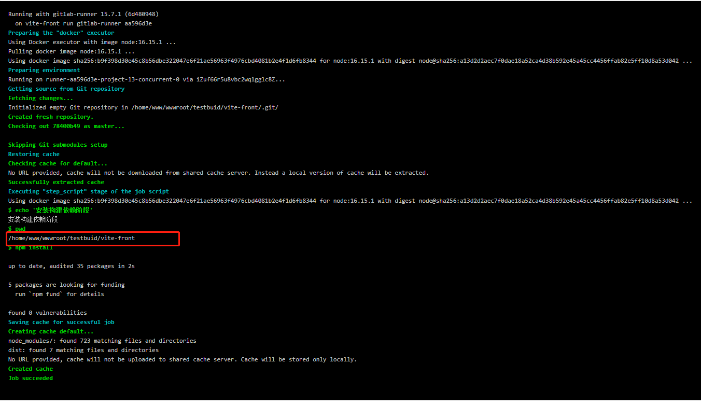 

这个目录是在gitlab-runner的config.toml里面配置

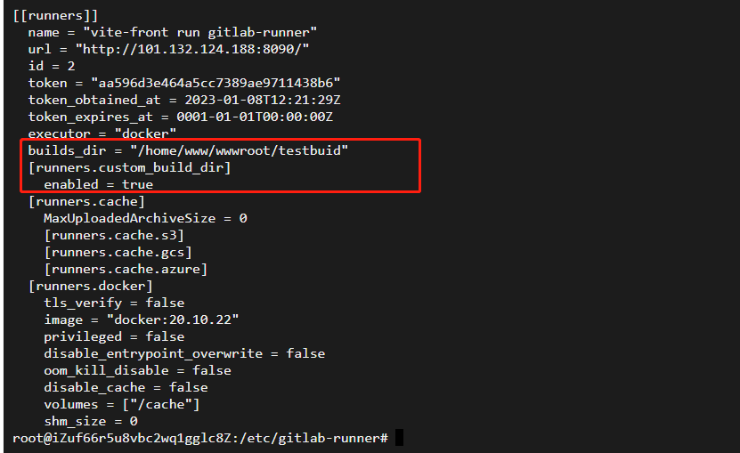 

和yml里面配置的组合

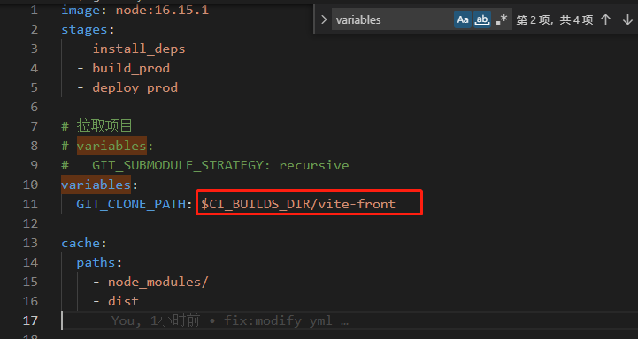 

但依然找不到这个目录在哪

在Gitlab 和Gitlab-runner里面都找了，没找到

而且想复制到宿主机上，发现找不到要复制到的目录

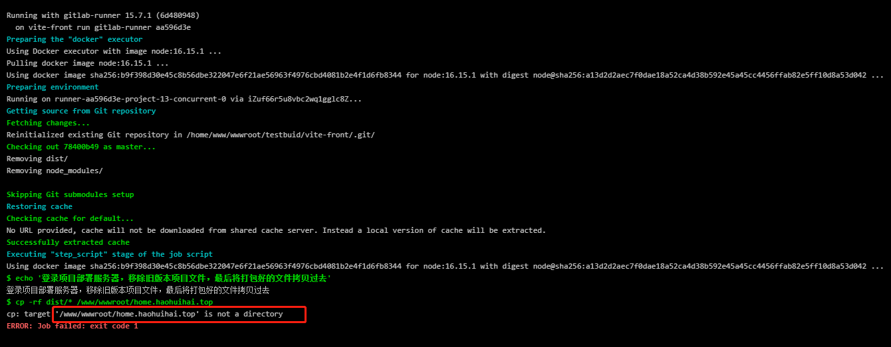 

Yml文件中的GIT_STRATEGY

\# variables:

 \#  GIT_STRATEGY: none

vite-front卷的修改  ， 

```shell
/www/wwwroot/testbuid:/home/www/wwwroot/testbuid
```

:前部分是宿主机上指定的目录，后部分是容器内，构建的目录，配置在gitlab.yml文件下面

```shell
script:
    - echo '登录项目部署服务器，移除旧版本项目文件，最后将打包好的文件拷贝过去'
    - rm -f /home/www/testbuild && mkdir -p /home/www/testbuild
    # - \cp -rf ./dist /usr/local/nginx/html
    # - cp -rf dist/* /home/www/testbuild
    - pwd
    - ls
    - mv dist /home/www/testbuild
```

由构建的目录，到容器的目录，再同步到宿主机

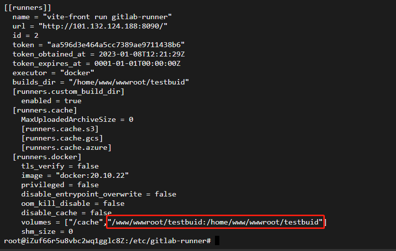 

# [Docker：bash: vi: command not found](https://www.cnblogs.com/cristin/p/9167721.html)

在使用docker容器时，有时候里边没有安装vim，敲vim命令时提示说：vim: command not found，这个时候就需要安装vim

操作步鄹：

1、apt-get update

2、apt-get install vim

# 2023-1-9  GitLab搜索记录

`docker -v`查看安装的docker版本

```
systemctl start docker` 启动docker，并执行开机自启动`systemctl enable docker
```

docker 环境安装完成后，就可以开始安装gitlab了，执行命令如下。 默认镜像的地址是国外地址，下载较慢，修改`vim /etc/docker/daemon.json`中的镜像地址。

```
{
    "registry-mirrors":["https://almtd3fa.mirror.aliyuncs.com"]      
}
```

重启docker `systemctl daemon-reload`

```
systemctl restart docker
```

## 安装gitlab

```
docker run \
 -d  \
 -p 9980:9980 \
 -p 9922:22 \
 -v /opt/gitlab/etc:/etc/gitlab  \
 -v /opt/gitlab/log:/var/log/gitlab \
 -v /opt/gitlab/opt:/var/opt/gitlab \
 --restart always \
 --privileged=true \
 --name gitlab \
 gitlab/gitlab-ce
```

要下载的文件较大，耐心等待下载安装完成即可。 这里需要修改`/opt/gitlab/etc/gitlab.rb`中的内容，否则网页上显示的clone地址会是一串带随机字符串的地址，找到`external_url` 修改为`external_url 'http://192.168.1.225:9980'`，如下图所示。

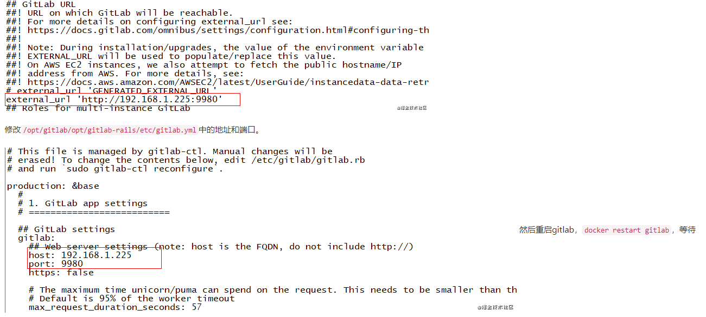 

**Gitlab 的 Runner 在构建时拉取 Git Submodules 仓库**

默认的 GitLab 的 Runner 在构建时不会去拉取 Git Submodules 仓库，将会提示 Skipping Git submodules setup 跳过初始化 Git Submodule 仓库

如 [官方文档](https://docs.gitlab.com/ee/ci/git_submodules.html) 的描述，只需要加上以下代码在 .gitlab-ci.yml 文件即可

```shell
variables:
  GIT_SUBMODULE_STRATEGY: recursive # 拉取 Submodule 内容
```

加入的逻辑和 stages 是同级，如下面例子

## GitLab Runner

一般来说，构建任务都会占用很多的系统资源 (譬如编译代码)，而 `GitLab CI` 又是 `GitLab `的一部分，如果由 `GitLab CI` 来运行构建任务的话，在执行构建任务的时候，`GitLab` 的性能会大幅下降。

`GitLab CI` 最大的作用是管理各个项目的构建状态，因此，运行构建任务这种浪费资源的事情就交给 `GitLab Runner` 来做啦。因为 `GitLab Runner` 可以安装到不同的机器上，所以在构建任务运行期间并不会影响到 `GitLab` 的性能。

`GitLab Runner`的安装特别简单，官网有各平台的安装方法或安装包，此处不再赘述

- 运行的机器上，用命令行注册，比如：

  gitlab-runner register --name="XX" --url="https://git.xx.com/" --token="XXX" --executor="shell"

按照提示一步一步安装就可以了。其中，`executor`可以是多种类型，简单的话可以选`shell`。有熟悉`docker`的可以使用`docker`。

- 配置文件在`/etc/gitlab-runner/config.toml`

  配置项类似下面，可能需要手动添加`builds_dir`和`cache_dir`这两个变量，再重启服务

  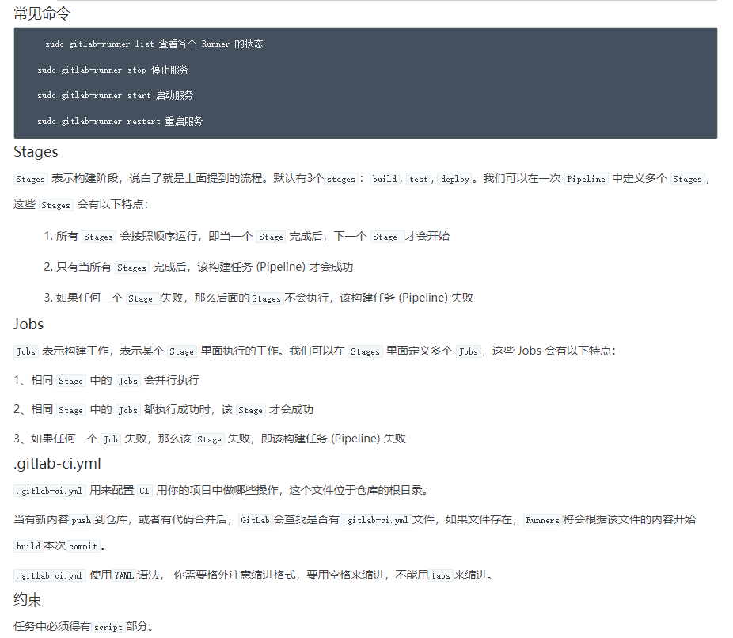 

**使用SSH与宿主机交互**

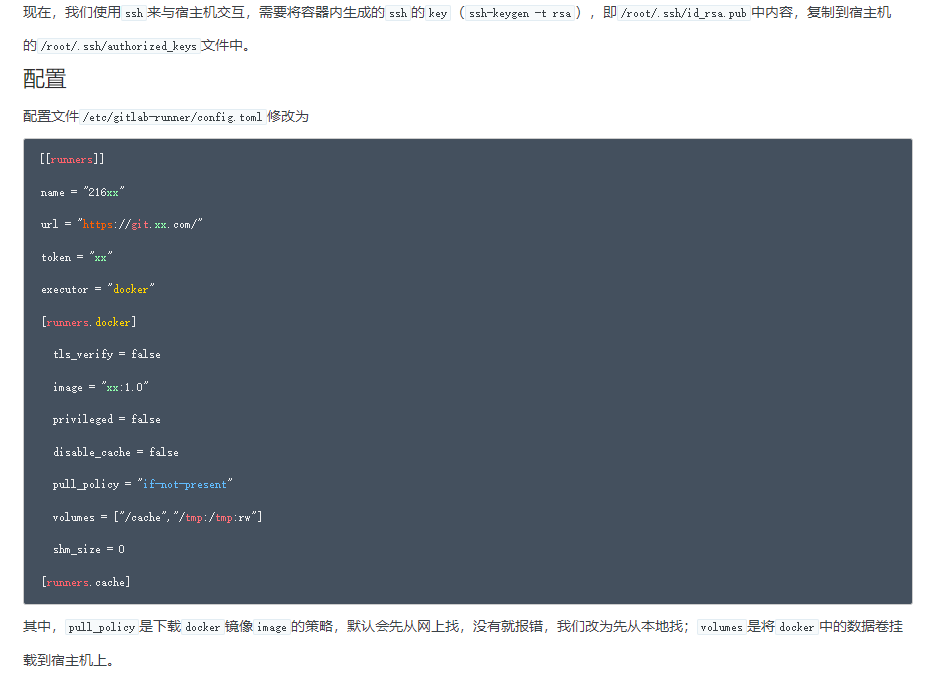 


## 如何在 gitlab-ci.yml 中将文件从存储库复制到用于作业的 Docker 容器中

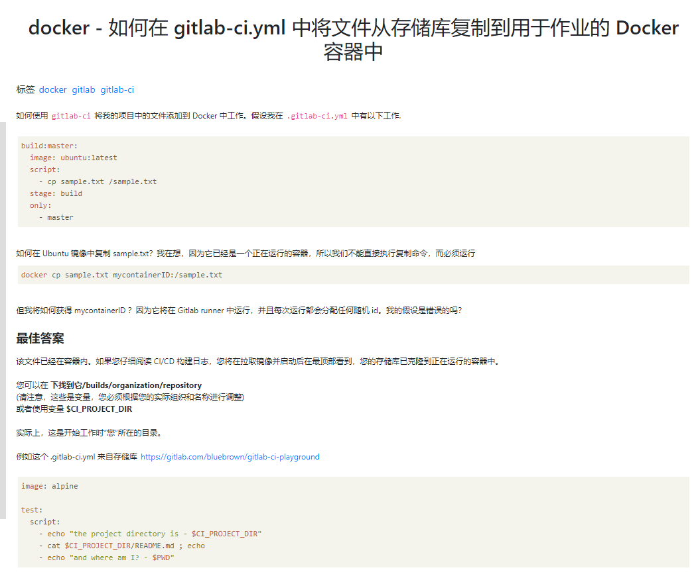 

## [GitLab & GitLab Runner 实现代码上传与CI/CD自动部署](http://whuls.cn/2022/07/21/GitLab-GitLab-Runner-%E5%AE%9E%E7%8E%B0%E4%BB%A3%E7%A0%81%E4%B8%8A%E4%BC%A0%E4%B8%8ECI-CD%E8%87%AA%E5%8A%A8%E9%83%A8%E7%BD%B2/)


## docker容器文件拷贝到宿主机

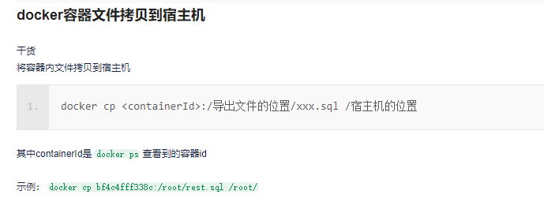


## [用gitlab-ci构建部署项目，报错cp: target ' ' is not a directory](https://segmentfault.com/q/1010000038491710)

## 构建目录设置

根据[the docs](https://www.likecs.com/default/index/tourl?u=aHR0cHM6Ly9kb2NzLmdpdGxhYi5jb20vZWUvY2kvcnVubmVycy9jb25maWd1cmVfcnVubmVycy5odG1sI2N1c3RvbS1idWlsZC1kaXJlY3Rvcmllcw%3D%3D)，您还必须启用`custom_build_dir` 设置，默认情况下仅对 docker 和 kubernetes 执行程序启用：

```
[runners.custom_build_dir]
  enabled = true
```

[See here](https://www.likecs.com/default/index/tourl?u=aHR0cHM6Ly9kb2NzLmdpdGxhYi5jb20vcnVubmVyL2NvbmZpZ3VyYXRpb24vYWR2YW5jZWQtY29uZmlndXJhdGlvbi5odG1sI3RoZS1ydW5uZXJzY3VzdG9tX2J1aWxkX2Rpci1zZWN0aW9u) 了解有关此设置的更多信息。

另外你应该尝试设置变量`$GIT_CLONE_PATH`:

```
variables:
  GIT_CLONE_PATH: $CI_BUILDS_DIR/project-name

test:
  script:
    - pwd
```

> GIT_CLONE_PATH 必须始终位于 $CI_BUILDS_DIR 内。 $CI_BUILDS_DIR 中设置的目录取决于 executor 和 runners.builds_dir 设置的配置。

> 这只能在运行器配置中启用 custom_build_dir 时使用。这是 docker 和 kubernetes 执行器的默认配置。

[Source](https://www.likecs.com/default/index/tourl?u=aHR0cHM6Ly9kb2NzLmdpdGxhYi5jb20vZWUvY2kvcnVubmVycy9jb25maWd1cmVfcnVubmVycy5odG1sI2N1c3RvbS1idWlsZC1kaXJlY3Rvcmllcw%3D%3D)

------

所以在你的具体情况下，我会在你的`config.toml` 中尝试这个：

```
builds_dir = "/home/[domain_name]/public_html/test_build"

[runners.custom_build_dir]
  enabled = true
```

并将其添加到您的 `.gitlab-ci.yml` 的顶部：

```
variables:
  GIT_CLONE_PATH: $CI_BUILDS_DIR/testing_gitlab_runner
```


