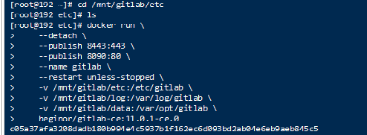

# Linux安装docker

### `CP`

```shell
cp -a 保留原文件属性的前提下复制文件 

cp -r dirname（源文件） destdi（目标文件）
```

复制目录后其文件属性会发生变化
想要使得复制之后的目录和原目录完全一样包括文件权限，可以使用下列命令：

```shell 
cp -a dirname destdir 
```

```shell
# xxx.xxx.xxx.xxx:22 SSH-2.0-OpenSSH_7.4
xxx.xxx.xxx.xxx ssh-rsa AAAAB3NzaC1yc2EAAAADAQABAAABAQDLit4lX9SEYNVhSFFBBo/3+rb2qxfDyGHpTkrbJz6sFDyWoB0fSfFiOVUnGe/h9LB5QffsLKdSGOdY82r41OOyWFyxxtUhuXCu1ZsgYiGLwKlPRrzICagyNC8HKU4auj5ALBeopmF6DBeMVp6e7mGDpPWFgiKLZtyO/oq5qwpyrbHw13UgfWbAAEpGW4OdgmaRUhjnWbeTXJLqHXybYnlPyWm1WsIXCDWzMyvefIL1DSAl3hVBgys1YgrIfU/KMoUEFet6wldysql9Kb0mvpU6WnmWi0l+j8iesEDdCWlKaxgIyxIxcx9cRPaoXADWUR6YdxYenqnFoHzQnDe2LzLD
# xxx.xxx.xxx.xxx:22 SSH-2.0-OpenSSH_7.4
xxx.xxx.xxx.xxx ecdsa-sha2-nistp256 AAAAE2VjZHNhLXNoYTItbmlzdHAyNTYAAAAIbmlzdHAyNTYAAABBBIwUq1CsNFfLs3A34rDuQZO0YNTM3nLaUK4UZMnWRLOHRYmF0o1mjGii32AK3FbkuZcdfD7mXbJUhSE3W/H2J58=
# xxx.xxx.xxx.xxx:22 SSH-2.0-OpenSSH_7.4
xxx.xxx.xxx.xxx ssh-ed25519 AAAAC3NzaC1lZDI1NTE5AAAAIKYxuxg/8WN2TEU4mD1NFQEjQiR3PjCMVminKp9tLtfe
```

安装软件：

更新软件，安装`rsync` 包，用于传输，安装`openssh-client`用于连接服务器

```shell
sudo apt-get update && sudo apt-get install rsync && sudo apt-get install openssh-client
```

#### linux服务器之间传输文件

https://blog.csdn.net/qq_43674360/article/details/126096275

https://blog.csdn.net/weixin_44256848/article/details/126466072

https://www.ydisp.cn/ement/75140.html

#### Rsync远程同步

https://blog.csdn.net/weixin_71429839/article/details/127191015

#### 给文件/文件夹增加权限

#### rsync 错误 failed: Permission denied (13)

文件缺少权限，需要增加权限

```bash
chmod 755 /data/javaprefs
```

#### 查看是否安装某个软件包

```shell
rpm -qa | grep "软件包名"
```

#### rsync常见问题及解决办法

https://blog.csdn.net/qq_44786814/article/details/114849655

https://blog.csdn.net/qq_39577008/article/details/104826277

#### ssh

查看是否安装ssh

```shell
ssh -V
```

检查ssh的状态

```shell
systemctl status sshd.service
```

检查ssh是否启动成功

```shell
ps -aux | grep ssh
```

ssh的位置

```shell
/etc/ssh
```

修改完配置重启ssh服务

```shell
service sshd restart
```

#### 排查连接不上到linux的问题

circleci存的是密钥 

linux存的是公钥

#### circleci在使用免密登录时的一些错误问题

### 使用私钥的情况下还输入密码问题

3个解决办法

1. 修改/etc/ssh/sshd_config文件

```shell
PasswordAuthentication no
```

2. 在登录时使用下面命令

```shell
ssh -o StrictHostKeyChecking=no user@ip
```

3. 有博客说修改的是：

在文件/etc/ssh/ssh_config(全局)或者~/.ssh/config(某用户)开头加入以下内容

StrictHostKeyChecking ask打开注释修改为StrictHostKeyChecking no即可

但是这样做好像没什么反应

4. 还有说是：

连接ssh的时候，带上GSSAPIAuthentication=no参数：

```javascript
ssh -o GSSAPIAuthentication=no root@ip
```

这样也可以避免需要二次确认连接。

只有通过1这种方法才可以

如果看登录的详细情况的话可以使用下面命令

```shell
ssh root@192.168.111.22 -vvv 
```

出现什么问题，然后在配置文件或命令行修改对应的参数即可


连接成功后的ssh_config的配置，下面的修改是部分修改，打开注释或修改值

```shell
RSAAuthentication yes
PasswordAuthentication no
GSSAPIAuthentication no
StrictHostKeyChecking no
UserKnownHostsFile /dev/null
```

#### Linux操作系统如何使用SSH命令连接另外一台Linux服务器

https://www.cnblogs.com/hls-code/p/16158324.html

### windows终端通过密钥远程连接Linux服务器

#### SSH密钥连接

sshd服务提供两种安全验证的方法：

- 基于口令的安全验证:经过验证帐号与密码即可登陆到远程主机。
- 基于密钥的安全验证:需要在服务端生成"密钥对"后将私钥传送至本地端，进行密钥的比较。

**创建密钥**

在服务器端的终端中执行命令 `ssh-keygen`，
出现提示时一直按Enter即可 ，会在将在 `~/.ssh/` 路径下生成公钥(id_rsa.pub)和私钥(id_rsa)

保证公钥在服务器端，私钥在本地端，就可以在本地端使用私钥进行免密登录服务器


---这个好像没用到

在服务器端执行以下命令，在服务器上安装公钥
`cat id_rsa.pub >> authorized_keys`

`chmod 600 *` 修改文件权限，只允许文件拥有者读写

**配置密钥**

使用 sz 或 scp等命令将私钥(id_rsa)文件下载到本地，并记下文件路径

找到本地用户目录下的.ssh文件夹，选中config-右键-打开方式-使用记事本打开

安装注释修改下面的内容，并复制到config文件中，注意 `//` 和之后的注释都要删去，然后保存

```text
Host tx    // 远程机器别名
HostName 192.*.*.*   // 远程机器IP地址/域名
Port 22   // 端口号，默认为22
User root   // 登录账号
IdentityFile path/id_rsa // 下载的私钥文件在本机的地址
```

**连接远程主机**

```shell
ssh tx
```

也可以通过以下命令手动选中密钥连接远程主机
`ssh -i path/id_rsa user_name@IP_address`

## 远程连接的方法

(publickey,gssapi-keyex,gssapi-with-mic,password).

#### Win10自带的ssh客户端key权限设置

https://zhuanlan.zhihu.com/p/108445764#:~:text=Win10%E8%87%AA%E5%B8%A6%E7%9A%84ssh%E5%AE%A2%E6%88%B7%E7%AB%AFkey%E6%9D%83%E9%99%90%E8%AE%BE%E7%BD%AE%201%20%E5%AE%89%E8%A3%85%20%E6%89%93%E5%BC%80PowerShell%EF%BC%8C%E8%BE%93%E5%85%A5ssh%E4%B8%89%E4%B8%AA%E5%AD%97%E6%AF%8D%EF%BC%8C%E6%8C%89Enter%E3%80%82%20...%202%20%E5%8A%9F%E8%83%BD%20%E4%B8%8D%E5%A6%A8%E7%9C%8B%E4%B8%80%E4%B8%8BWin10%E6%8A%8A%E8%BF%99%E4%B8%AAssh%E5%AE%A2%E6%88%B7%E7%AB%AF%E6%94%BE%E5%93%AA%E9%87%8C%E4%BA%86%E3%80%82,%E4%BF%AE%E6%94%B9key%E6%9D%83%E9%99%90%20%E5%AF%B9id_rsa%E6%96%87%E4%BB%B6%EF%BC%9A%E5%8F%B3%E5%87%BB-%E5%B1%9E%E6%80%A7-%E5%AE%89%E5%85%A8-%E9%AB%98%E7%BA%A7%E3%80%82%20...%205%20%E5%85%B6%E4%BB%96%20%E4%B8%80%E4%B8%AA%E9%9D%9E%E5%B8%B8%E6%9C%89%E7%94%A8%E7%9A%84%E4%B8%9C%E8%A5%BF%EF%BC%8C%E5%9C%A8PowerShell%E9%87%8C%E6%8C%89Ctrl%2BR%EF%BC%8C%E8%BE%93%E5%85%A5ssh%E5%AD%97%E6%A0%B7%EF%BC%8C%E7%84%B6%E5%90%8E%E4%B8%8D%E6%96%AD%E6%8C%89Ctrl%2BR%EF%BC%8C%E5%8F%AF%E4%BB%A5%E5%BE%80%E4%B8%8A%E7%BF%BB%E4%BB%A5%E5%89%8D%E8%BE%93%E8%BF%87%E7%9A%84%E5%B8%A6%27ssh%27%E5%AD%97%E6%A0%B7%E7%9A%84%E5%91%BD%E4%BB%A4%EF%BC%8C%E5%92%8CLinux%20Shell%E5%87%A0%E4%B9%8E%E4%B8%80%E6%A0%B7%EF%BC%8C%E9%9D%9E%E5%B8%B8%E6%96%B9%E4%BE%BF%E3%80%82%20

## 解决在windows，circleci连接服务器的办法

1. 进入控制台；找到服务器，创建一个密钥，之后会返回一个.pem的文件，而这个pem的文件就是服务器返回的私钥，我这里下载的名为test_login.pem

 

2. 尝试windows登录服务，进入window的终端

```shell
ssh root@ip -i ./test_login.pem
```

 

以上表示登录成功

3. 尝试使用circleci远程登录

```shell
- run: ssh root@ip -vvv
```

登录成功会有提示

 

 

使用ssh任然需要密码的问题

https://blog.csdn.net/qq_32239417/article/details/52774199

上面3步 -vvv表示我们在登录过程中可以显示登录信息；这在登录失败排查问题很有用

会返回一些debug开头的信息

主要展示的是使用的登录方式；成功会有成功的提示；失败也有失败的信息，

关于错误信息的详细信息：查看下面的链接

http://www.nndssk.com/xtwt/201718NT4CGZ.html

https://blog.csdn.net/weixin_29980355/article/details/116859080

网上给出使用window终端连接linux的方法

https://blog.csdn.net/tyustli/article/details/122222605

#### 如果我们只想传输文件，但也要输入密码，可以在命令行加StrictHostKeyChecking=no

**这样就可以解决跳过第一次登录时确认的问题**

```shell
 scp -vr  -o StrictHostKeyChecking=no /home/circleci/cloudspace/dist/* $SSH_USER@$SSH_IP:/www/wwwroot/testbuild/
```
#### 阿里云远程连接linux服务器的方法

https://help.aliyun.com/document_detail/59083.html

#### 通过密钥连接之后，在通过密码连会提示说服务器禁止了使用密码进行连接，要使用密钥进行连接，现在登录linux服务器就需要使用密钥进行登录了，密钥文件放在网上

#### 出现Permission denied (publickey)的解决方法

https://blog.csdn.net/a1489540461/article/details/126751164

#### [CircleCI 自动化部署](https://segmentfault.com/a/1190000021579837)

#### 关于备份工具rsync，你不知道的事

https://developer.kingdee.com/article/387551352031207424?productLineId=29&isKnowledge=2

#### [GitHub + circleCI 自动构建/自动部署 应用](https://www.cnblogs.com/liugx/p/10339010.html)

#### CentOS 7 免密登录异常 -- we did not send a packet, disable method

https://blog.csdn.net/u010766726/article/details/108236397

#### circleci 使用手册

https://haofly.net/circleci/

#### window自带ssh软件，可以使用ssh登录远程服务器

where.is   软件名

#### SCP的使用

 

使用circleci自动部署前端是在circleci服务上构建好，然后通过将文件上传到服务器上的一种方法

gitlab私有库是在linux环境上进行构建的，可以通过镜像来操作，很耗内存，

chapt

```js
const http = require('http');

/**
 * @name:
 * @description: 封装了一下ChatGPT
 * @param {*} msg 发送的消息
 * @param {*} sessionToken 浏览器cookie拿到的令牌
 * @return {Promise}
 */
 const sendChatGPTMsg = async ({ msg, sessionToken }) => {
  const { promise, resolve, reject } = defer();
  const api = new ChatGPTAPI({
    sessionToken,
    markdown: false,
  });
  await api.ensureAuth().catch(reject); // 校验令牌
  api.sendMessage(msg).catch(reject).then(resolve);
  return promise;
};


/**
 * @name:
 * @description: promise扁平处理
 * @return {*}
 */
 const defer = () => {
  let resolve, reject;
  return {
    promise: new Promise((_resolve, _reject) => {
      resolve = _resolve;
      reject = _reject;
    }),
    resolve,
    reject,
  };
};


http.createServer((req, res) => {
    res.setHeader("Access-Control-Allow-Origin", "*"); //设置响应头解决跨域
    if (req.url !== "/sendMsg") return sendRes(res, "not find", 404);
    let _data = "";
    req.on("data", (d) => {
      _data += d;
    });
    req.on("end", () => {
      const data = JSON.parse(_data);
      sendChatGPTMsg(data)
        .then((r) => {
          res.writeHead(200, {
            "Content-Type": "text/plain",
            "Access-Control-Allow-Origin": "*",
          });
          console.log(r)
          res.write(r);
          res.end();
        })
    });
  })
  .listen(1024, () => {
    console.log("服务开启！");
  });
```

## 常用命令

查看端口：

```shell
netstat -ntulp | grep 3306
lsof -i:3306
```

杀死端口

```shell
kill -9 pid
```

进入容器

```shell
docker exec -it containerId /bin/bash
```

进入mysql

```mysql
mysql -h localhost -u root -p
```

推出mysql

```shell
mysql > quit
```

退出容器：

```shell
exit
```

删除镜像

```shell
docker rm containerId
```

查看是否运行的容器

```shell
docker ps
```

查看所有容器

```shell
docker ps -a
```

查看容器日志

```shell
docker logs imagename
```

### pm2常用指令

```js
$ pm2 start app.js # 启动app.js应用程序

$ pm2 start app.js -i 4        # cluster mode 模式启动4个app.js的应用实例

# 4个应用程序会自动进行负载均衡

$ pm2 start app.js --name="api" # 启动应用程序并命名为 "api"

$ pm2 start app.js --watch      # 当文件变化时自动重启应用

$ pm2 start script.sh          # 启动 bash 脚本

$ pm2 list                      # 列表 PM2 启动的所有的应用程序

$ pm2 monit                    # 显示每个应用程序的CPU和内存占用情况

$ pm2 show [app-name]          # 显示应用程序的所有信息

$ pm2 logs                      # 显示所有应用程序的日志

$ pm2 logs [app-name]          # 显示指定应用程序的日志

$ pm2 flush                       # 清空所有日志文件

$ pm2 stop all                  # 停止所有的应用程序

$ pm2 stop 0                    # 停止 id为 0的指定应用程序

$ pm2 restart all              # 重启所有应用

$ pm2 reload all                # 重启 cluster mode下的所有应用

$ pm2 gracefulReload all        # Graceful reload all apps in cluster mode

$ pm2 delete all                # 关闭并删除所有应用

$ pm2 delete 0                  # 删除指定应用 id 0

$ pm2 scale api 10              # 把名字叫api的应用扩展到10个实例

$ pm2 reset [app-name]          # 重置重启数量

$ pm2 startup                  # 创建开机自启动命令

$ pm2 save                      # 保存当前应用列表

$ pm2 resurrect                # 重新加载保存的应用列表

$ pm2 update                    # Save processes, kill PM2 and restore processes

$ pm2 generate                  # Generate a sample json configuration file
```

#### nginx location

http://t.zoukankan.com/shijianchuzhenzhi-p-6873737.html

#### 修改容器中的配置文件

docker 运行容器；

```
docker run --name nginx -p 80:80 -d nginx
```

```shell
docker run -itd --name mysql-test -p 3306:3306 -e MYSQL_ROOT_PASSWORD=123456 mysql
```

修改容器里面的文件，由于容器里面的文件无法修改该，通过拷贝的方式来替换掉原来的文件

进入容器：

```
docker exec -it nginx /bin/bash
```

将容器中 的文件拷贝到宿主机里面

```
docker cp nginx:/etc/nginx/conf.d/default.conf /home/
```

修改完将修改的文件拷贝到容器里面

```shell
docker cp /home/default.conf nginx:/etc/nginx/conf.d
```

重启容器：

```shell
docker restart nginx
```

#### docker启动mysql时，有端口被占用，使用kill -9 pid杀不死的解决办法

彻底停止mysql：

```shell
sudo /etc/init.d/mysql stop
```

#### docker容器之间访问端口需要使用ip代替localhost

#### docker不能运行mysql的时候查看一下端口是否占用‘

#### mysql容器无法外部访问解决方案

进入容器内  docker exec -it mysql /bin/bash

登陆mysql   mysql -u root -p 

修改访问权限，允许所有人访问 

GRANT ALL PRIVILEGES ON *.* TO 'root'@'localhost';

更新权限 

flush privileges;

#### 修改nginx容器中的文件

通过拷贝主机上的文件到nginx容器，可修改容器中的文件

#### 查看nginx的安装目录

```shell
ps -ef | grep nginx
```

#### Dockerfile 中 run 和 cmd 区别

- `run` 是在 `docker build` 构建镜像时, 会执行的命令
- `cmd` 是在 `docker run` 启动容器时, 会执行的命令

#### 在node启动的时候，sequlize报错

有可能时mysql没有连上，mysql是一个容器，node后端项目的容器在连接mysql的时候，有可能连接不上mysql；

下面错误：

Client does not support authentication protocol requested by server； conside

**查看mysql的版本**发现是8以后的，所以加密规则会变

```mysql
select version();
2 修改加密方式
ALTER USER 'root'@'localhost' IDENTIFIED BY 'password' PASSWORD EXPIRE NEVER;
```

这里的password是你正在使用的密码

然后`FLUSH PRIVILEGES;` 刷新权限，让修改生效。

还有： 

alter USER 'root'@'localhost' IDENTIFIED BY 'password' PASSWORD EXPIRENEVER; alter USER 'root'@'localhost' IDENTIFIED WITH mysql_native_password BY '修改自己的密码';

错误：

Operation ALTER USER failed for 'root'@'localhost'


mysql> ALTER USER 'root'@'localhost' IDENTIFIED BY 'xxxxx';

ERROR 1396 (HY000): Operation ALTER USER failed for 'root'@'localhost'


发现 host 列的值是 ‘%’，因此将修改密码语句改为： 

ALTER USER 'root'@'%' IDENTIFIED WITH mysql_native_password BY 'xxxxxx';

flush privileges;

#### 开始部署一个项目

安装git

```
yum install git -y
```

新建文件夹

```
mkdir /usr/projects
```

生成一个github公钥

```
ssh-keygen -t rsa -b 4096 -C "157855644@qq.com"
```

默认在`/root/.ssh/id_rsa`下面

密码： 无

读取公钥：

```
cat /root/.ssh/id_rsa.pub
```

将得到的公钥添加进github

在指定文件夹下使用ssh拉取项目

安装node，npm

```shell
安装node和npm,nvm , pm2


wget -qO- https://raw.githubusercontent.com/nvm-sh/nvm/v0.34.0/install.sh | bash
source /root/.bashrc
nvm install v16.14.0 #下载指定版本
npm i nrm -g
nrm use taobao
npm i pm2 -g
```

**像nginx，mysql，redis，这些可以安装到宿主机上，然后容器去访问就可以了，没必要放到容器里面**

#### 安装 mysql

https://blog.csdn.net/qq_55752792/article/details/122149990

https://blog.csdn.net/weixin_42123191/article/details/113230075

https://blog.csdn.net/Y00010010/article/details/124562115

#### 安装docker

https://github.com/sillyhong/whongjiagou-learn/blob/master/turndownMarkdown/markdown/72.deploy.md

安装完启动；

```shell
sudo systemctl start docker
```

#### linux查看进程

https://blog.csdn.net/weixin_39785970/article/details/116867920

#### Docker部署vue

https://blog.csdn.net/weixin_42349568/article/details/125155544

https://www.jb51.net/article/151958.htms

1、下载镜像

```
docker pull gitlab/gitlab-ce
```

2、创建目录

通常会将 GitLab 的配置 (etc) 、 日志 (log) 、数据 (data) 放到容器之外， 便于日后升级， 因此请先准备这三个目录

```
mkdir -p /wwwroot/gitlab/config
mkdir -p /wwwroot/gitlab/logs 
mkdir -p /wwwroot/gitlab/data
```

3、启动运行

```
docker run --detach \
  --hostname gitlab.example.com \
  --publish 8443:443 --publish 8880:80 \
  --name gitlab \
  --restart always \
  --volume /wwwroot/gitlab/config:/etc/gitlab \
  --volume /wwwroot/gitlab/logs:/var/log/gitlab \
  --volume /wwwroot/gitlab/data:/var/opt/gitlab \
  --privileged=true \
  gitlab/gitlab-ce:latest
```

- --hostname gitlab.example.com: 设置主机名或域名
- --publish 8443:443：将http：443映射到外部端口8443
- --publish 8880:80：将web：80映射到外部端口8880
- --name gitlab: 运行容器名
- --restart always: 自动重启
- --volume /wwwroot/gitlab/config:/etc/gitlab: 挂载目录
- --volume /wwwroot/gitlab/logs:/var/log/gitlab: 挂载目录
- --volume /wwwroot/gitlab/data:/var/opt/gitlab: 挂载目录
- --privileged=true 使得容器内的root拥有真正的root权限。否则，container内的root只是外部的一个普通用户权限

运行成功之后，可以使用下面的命令查看容器运行状态：

```
docker ps
```

可以看到GitLab已经在运行了，有一个属性STATUS为health:starting，说明gitlab的服务正在启动中，还没有启动完毕。等这个状态变成healthy时则说明已经部署完成，可以访问了。

访问

gitlab启动成功后，浏览器访问http://ip:8880,即可访问。

#### 方法二

##### docker部署gitlab

```bash
#1:拉取gitlab镜像
docker pull gitlab/gitlab-ce  
#2:生成挂载目录
mkdir -p /home/gitlab/etc/gitlab	
mkdir -p /home/gitlab/var/log
mkdir -p /home/gitlab/var/opt
#3:启动容器（用的时候调整下命令，为了便于查看，有换行符）
 docker run -d  
 -p 443:443 -p 80:80 -p 222:22 
 --name gitlab-dev --restart always --privileged=true  
 -v /home/gitlab/etc/gitlab:/etc/gitlab 
 -v /home/gitlab/var/log:/var/log/gitlab 
 -v /home/gitlab/var/opt:/var/opt/gitlab 
 gitlab/gitlab-ce
```

【–privileged=true 要加上，不然可能因为权限问题导致启动失败】

此时访问43.165.45.556 是有界面了，如果网络不可用或者502，就再等个几分钟，此时容器尚未启动完全

#### 调整gitlab配置

**1.配置克隆项目时所需**

```bash
vim /home/gitlab/etc/gitlab/gitlab.rb

# 配置http协议所使用的访问地址,不加端口号默认为80
external_url 'http://43.165.45.556'

# 配置ssh协议所使用的访问地址和端口
gitlab_rails['gitlab_ssh_host'] = '43.165.45.556'
gitlab_rails['gitlab_shell_ssh_port'] = 222 # 此端口是run时22端口映射的222端口

# 重启gitlab容器
 docker restart gitlab-dev
```

**2.root所需**

如果访问43.165.45.556 时直接进入界面，这个时候根本不知道root密码，进行如下操作：

```bash
# 进入容器内部
docker exec -it gitlab /bin/bash

# 进入控制台
gitlab-rails console -e production

# 查询id为1的用户，id为1的用户是超级管理员
user = User.where(id:1).first
# 修改密码为123456
user.password='123456'
# 保存
user.save!
# 退出
exit
```

#### 方法三：

**1. docker拉取gitlab社区版**

```undefined
docker pull gitlab/gitlab-ce:latest
```

查看是否拉取成功

```bash
[root@test gitlab] docker images
REPOSITORY         TAG       IMAGE ID       CREATED      SIZE
gitlab/gitlab-ce   latest    75d591b81fd7   4 days ago   2.23GB
```

**2. 使用容器卷将数据映射到本地并运行**

| 宿主机位置          | 容器位置        | 作用                     |
| ------------------- | --------------- | ------------------------ |
| /data/gitlab/config | /etc/gitlab     | 用于存储 GitLab 配置文件 |
| /data/gitlab/logs   | /var/log/gitlab | 用于存储日志             |
| /data/gitlab/data   | /var/opt/gitlab | 用于存储应用数据         |

### 在宿主机创建映射目录

```kotlin
[root@test ~] mkdir -p /data/gitlab/config  #递归创建目录，即使上级目录不存在，会按目录层级自动创建目录
[root@test ~] mkdir -p /data/gitlab/logs
[root@test ~] mkdir -p /data/gitlab/data
[root@test ~] cd /data/gitlab
[root@test gitlab] ls
config  data  logs
```

3.1 创建方法一

### 创建`gitlab_start.sh`文件

```css
[root@test gitlab] touch gitlab_start.sh
[root@test gitlab] vim gitlab_start.sh
```

编写内容

```bash
#!/bin/sh
GITLAB_HOME=/usr/local/gitlab
sudo docker run --detach 
    --hostname 部署的服务器ip 
    --publish 443:443 --publish 80:80 --publish 10080:22 
    --name gitlab 
    --restart always 
    --volume $GITLAB_HOME/config:/etc/gitlab 
    --volume $GITLAB_HOME/logs:/var/log/gitlab 
    --volume $GITLAB_HOME/data:/var/opt/gitlab 
    gitlab/gitlab-ce:latest
```

> 参数说明：
>
> --detach: 设置容器后台运行
> --hostname: 设置容器的 hostname,如果是本地localhost ，否则使用外网ip
> --publish: 端口转发规则（80：Http 访问端口，443：Https 访问端口，10080：主机的 ssh 访问端口，22：Docker 容器中 ssh 访问端口）
> --name：容器名称
> --restart always：每次启动容器就重启GitLab
> --volume: 共享目录挂载，即 docker 容器内外数据共享
> --e：配置 Gitlab 运行的环境变量

在该文件目录下,授予`gitlab_start.sh`执行权限

```css
chmod +x gitlab_start.sh    
```

```bash
./gitlab_start.sh       #执行脚本
```

#### 方法四

**下载镜像文件**

```
docker pull beginor/gitlab-ce:11.0.1-ce.0
```

 

2.创建GitLab 的配置 (etc) 、 日志 (log) 、数据 (data) 放到容器之外， 便于日后升级

```
mkdir -p /mnt/gitlab/etc
```

```
mkdir -p /mnt/gitlab/log
```

```
mkdir -p /mnt/gitlab/data
```

**运行GitLab容器**

```
docker run \
 
  --detach \
 
  --publish 8443:443 \
 
  --publish 8090:80 \
 
  --name gitlab \
 
  --restart unless-stopped \
 
  -v /mnt/gitlab/etc:/etc/gitlab \
 
  -v /mnt/gitlab/log:/var/log/gitlab \
 
  -v /mnt/gitlab/data:/var/opt/gitlab \
 
  beginor/gitlab-ce:11.0.1-ce.0 
```

 

**4.修改/mnt/gitlab/etc/gitlab.rb**

把external_url改成部署机器的域名或者IP地址

vi /mnt/gitlab/etc/gitlab.rb

将external_url 'http://192.168.125.126'

**5.\**修改/mnt/gitlab/data/gitlab-rails/etc/gitlab.yml\****

vi /mnt/gitlab/data/gitlab-rails/etc/gitlab.yml

找到关键字 * ## Web server settings *

将host的值改成映射的外部主机ip地址和端口

**6.重启docker容器**

先停止该容器，删掉该容器信息，重启完docke之后，重新运行GitLab容器

 

#### 方法五

https://www.jb51.net/article/223451.htm

#### 方法六

https://www.jb51.net/article/104536.htm

#### Linux执行.sh文件时提示No such file or directory该怎么办(三种解决办法)

https://www.jb51.net/article/73684.htm

#### 操作系统怎么查看docker镜像的版本号

https://blog.csdn.net/wangxueying5172/article/details/122165237

#### Linux下面如何运行.sh文件

http://t.zoukankan.com/lcword-p-5334059.html

#### 解决#!/bin/bash - no such file or directory

https://www.jianshu.com/p/f2b867a347c9


# /bin/sh^M: bad interpreter: No such file or directory

/bin/sh^M: bad interpreter: No such file or directory在Linux中执行.sh脚本，异常/bin/sh^M: bad interpreter: No such file or directory。 

分析：这是不同系统编码格式引起的：在windows系统中编辑的.sh文件可能有不可见字符，所以在Linux系统下执行会报以上异常信息。 
解决：
1）在windows下转换： 
    利用一些编辑器如UltraEdit或EditPlus等工具先将脚本编码转换，再放到Linux中执行。转换方式如下（UltraEdit）：File-->Conversions-->DOS->UNIX即可。 
2）也可在Linux中转换： 

首先要确保文件有可执行权限 
#sh>chmod a+x filename 

然后修改文件格式 
#sh>vi filename 

利用如下命令查看文件格式 
:set ff 或 :set fileformat 

可以看到如下信息 
fileformat=dos 或 fileformat=unix 

利用如下命令修改文件格式 
:set ff=unix 或 :set fileformat=unix 

:wq (存盘退出) 

最后再执行文件 
#sh>./filename 


1、启动FirewallD服务命令：

systemctl start firewalld.service #开启服务
systemctl enable firewalld.service #设置开机启动
2、查看FirewallD防火墙状态：

systemctl status firewalld
3、现在防火墙 FirewallD 就已经正常运行了


 

想知道更多FirewallD知识请参考：https://www.fujieace.com/firewalld/


 


# [Linux 指令篇](https://blog.csdn.net/hu1656/article/details/106086041)