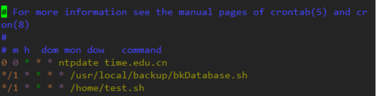
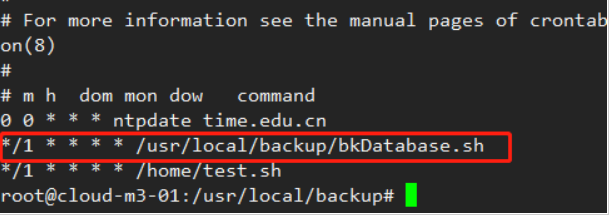
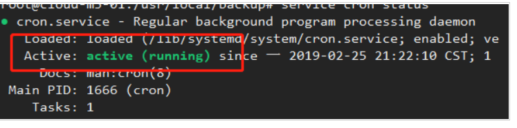

**clear** ：清除屏幕

**echo 'test content'**：往控制台输出信息 **echo 'test content' > test.txt**

**ll** ：将当前目录下的 子文件&子目录平铺在控制台

**find** **目录名**： 将对应目录下的子孙文件&子孙目录平铺在控制台

**find** **目录名** **-type f** ：将对应目录下的文件平铺在控制台

**rm** **文件名 ：** 删除文件

**mv** **源文件 重命名文件**: 重命名

**cat** **文件的** **url :** 查看对应文件的内容

删除目录

https://baijiahao.baidu.com/s?id=1726925779817385200&wfr=spider&for=pc

**vim** **文件的** url(在英文模式下)

 按 i 进插入模式 进行文件的编辑 

按 esc 键&按:键 进行命令的执行

 q! 强制退出（不保存）

 wq 保存退出

 set nu 设置行号

查找软件的安装：

方法一：使用which命令： `which Redis` 命令。

方法二：使用whereis命令:  输入 `whereis Redis` 命令。

方法三：使用find命令：输入 `find / -name redis `命令

**redis相关命令**

```shell
redis-server -v #查看redis版本
redis-server --version #查看redis版本
ps aux | grep redis #查看redi是否在运行
netstat -lntp #查看redi是否在运行
redis-server /etc/redis.conf #启动redis服务
/usr/bin/redis-cli shutdown #关闭redis服务
```

**查看当地时间**

```shell
timedatectl
```


#### linux暴露端口

查询指定端口是否已经开启

```shell
firewall-cmd --query-port=8091/tcp
```

查看开放端口列表

```shell
firewall-cmd --list-ports
```

2、查看防火墙状态

查看防火墙状态 systemctl status firewalld
开启防火墙 systemctl start firewalld
关闭防火墙 systemctl stop firewalld
开启防火墙 service firewalld start
若遇到无法开启
先用：systemctl unmask firewalld.service
然后：systemctl start firewalld.service

3、设置对外端口

添加指定需要开放的端口：

```shell
firewall-cmd --add-port=8091/tcp --permanent
```

重载入添加的端口：

```shell
firewall-cmd --reload
```

查询指定端口是否开启成功：

```shell
firewall-cmd --query-port=8091/tcp
```


 iptables -L -n  查看开放端口列表


#### Linux备份数据库

**1.首先确定备份脚本放置位置**

个人放置在  /usr/local/backup文件下，取名文件   bkDatabase.sh

**2.编写shell脚本**

```
# 需要注意几点``# 1. -password 如果密码出现括号或下划线请将password用双引号引用起来``# 2. 该脚本是将数据库course1进行备份，并进行压缩处理``# 3. 备份后的文件名称叫course，并附带时间戳``mysqldump ``-uroot` `-ppassword` `course1 | gzip > /usr/local/backup/course_$(date +%Y``%``m``%``d_``%``H``%``M``%``S).sql.gz
```

**3.给bash增加权限**

```
chmod u+x bkDatabase.sh
```

**4.测试看看脚本是否是正确可执行的**

```
./bkDatabase.sh
```

**5.打开定时任务**

```
# 第一次设置定时任务可能回让你输入编辑定时任务的vim，选择basic就可以``crontab ``-e
```

**6.编辑内容**

我这儿有三个定时任务 如图：

 

其中第二个

```
# 表示每分钟执行一次，执行的脚本为/usr/local/backup/bkDatabase.sh``
*/1 * * * * /usr/local/backup/bkDatabase.sh
```

**7.查看定时任务 crontab -l**

可以看到是否添加成功（如图）

 

在备份目录中查看是否成功

**8.踩坑**

有些定时任务是关闭的，使用命令查看`crond`是否正常`service` `crond status`

 

若正常不用管，若未启动，则重启一次。

针对不同的linux版本，发行版有这个service

```
重启服务命令：[root@centos6 /]``
# service crond restart``启动服务命令：[root@centos6 /]``
# service crond start``停止服务命令：[root@centos6 /]``
# service crond stop
```

发行版没有这个service

```
停止服务：[root@centos6 /]``# /etc/init.d/cron stop``启动服务：[root@centos6 /]``# /etc/init.d/cron start
```

**服务器数据实现还原**

这儿踩坑太多，注意解压gz文件方式！！！

**1. 首先对定时任务备份的数据进行解压**

注意，是对上面产生的course_20190511_214326.sql.gz进行解压

```
# 将gz文件进行解压，产生course_20190511_214326.sql文件``gunzip course_20190511_214326.sql.gz
```

**2.接着将数据导入到database中**

如果目标服务器没有你要的database，你需要create database 目标数据库；

```
# 将备份文件sql通过<符号送入到course表中 mysql -u root -p表示实用mysql数据库``mysql ``-u` `root ``-p` `course< course_20190511_214326.sql
```

接着会提示Enter Password，输入mysql密码即可实现导入

```shell
#!/bin/bash
 
#备份目录
BACKUP=/home/mysqlBackup/db_name
#获取当前时间
DATATIME=$(date +'%Y-%m-%d_%H%M%S')
#打印时间
echo $DATATIME
#数据库地址
HOST=localhost
#数据库用户名
DB_USER=root
#数据库密码
DB_PW=123456
#备份数据库名
DATABASE=db_name

#创建备份目录，如果不存在就创建
[ ! -d "${BACKUP}/${DATATIME}/${DATATIME}" ] && mkdir -p "${BACKUP}/${DATATIME}"

#备份数据库
mysqldump -u${DB_USER} -p${DB_PW}  --host=${HOST} -q -R --databases ${DATABASE} | gzip > ${BACKUP}/${DATETIME}/$DATABASE.sql.gz
# 备份表结构
mysqldump -u${DB_USER} -p${DB_PW}  --host=${HOST} -q -d -R --databases ${DATABASE} | gzip > ${BACKUP}/${DATETIME}/$DATABASE.sql.gz
#将文件处理成tar.gz
cd ${BACKUP}
tar -zcvf $DATABASE.tar.gz ${DATATIME}
#删除对应的备份目录
rm -rf ${BACKUP}/${DATATIME}

#删除10天前的备份文件
find ${BACKUP} -atime +30 -name "+.tar.gz" -exec rm -rf {} \;
echo "备份数据库${DATABASE} 成功~"
```

导出内容（表结构等）

内容	含义

databases	在备份的时候先是会创建表的,也就是说备份了整个db_name的 如果不加–databses的话,表明只是备份db_name中的数据表,而在还原的时候不会在创建db_name这个数据库,只是还原hellodb中的数据表而已
-q	不缓冲查询，直接导出至标准输出
-d	只导出表结构，不含数据
–add-locks	导出过程中锁定表，完成后回解锁。-q：不缓冲查询，直接导出至标准输出

```shell
输入命令 crontab -e / 路径地址
1.用数值表示 时间信息
00 02 *  *  *  备份文件

2.利用特殊符号表示时间信息
*     *    *   *    *   备份文件
/分钟 /小时 /天  /月  /周

=========================================
PS:定时任务最短执行的周期为 每分钟 
*/5       */ 6     */3      */1    */2
每隔5分钟  每隔6小时  每隔3日  每隔1月  每隔2周

=========================================
其它 写法：
01-05  02  * * *        每2日的01、02、03、04、05 执行一遍


指定不连续的时间范围：
00  14,20  *  *  *  *    每天14点，20点执行一次
```

