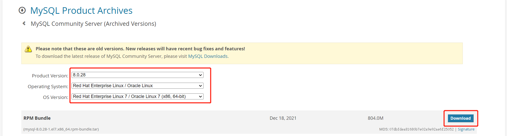
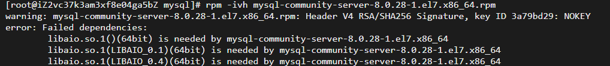
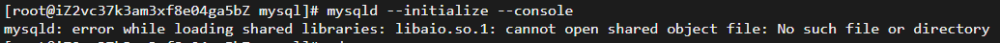
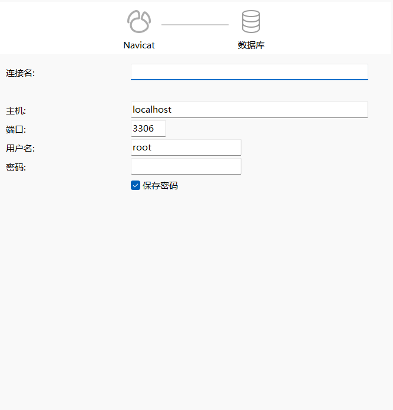
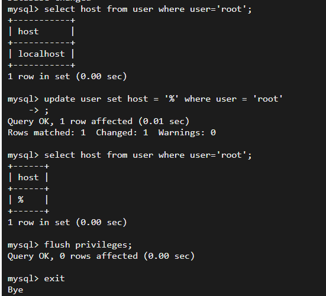

# centos7.9安装mysql

https://downloads.mysql.com/archives/community/

登录官网，下载RPM Bundle

 

下载到本地是一个压缩包，我们将这个压缩包上传到linux

```
scp mysql-8.0.28-1.el7.x86_64.rpm-bundle.tar root@47.108.155.108:/opt/mysql
```

在`/opt/mysql`下的文件中解压上传的安装包，

```
tar -xvf mysql-8.0.28-1.el7.x86_64.rpm-bundle.tar
```

查看新的服务器是否存在mariadb数据库，存在删除，避免和要安装的mysql产生冲突

```
查看
rpm -qa | grep mariadb
如果存在则 删除
rpm -e --nodeps mariadb-libs
```

按下面顺序安装mysql相对于的包

```shell
rpm -ivh mysql-community-common-8.0.28-1.el7.x86_64.rpm 
rpm -ivh mysql-community-client-plugins-8.0.28-1.el7.x86_64.rpm 
rpm -ivh mysql-community-libs-8.0.28-1.el7.x86_64.rpm 
rpm -ivh mysql-community-client-8.0.28-1.el7.x86_64.rpm 
rpm -ivh mysql-community-icu-data-files-8.0.28-1.el7.x86_64.rpm
```

安装下面的包时会报错

```shell
rpm -ivh mysql-community-server-8.0.28-1.el7.x86_64.rpm 
```

错误信息：



解决方案：

解决的方法就是在rpm 语句后面加上 --nodeps --force，安装时忽略依赖关系

```shell
rpm -ivh mysql-community-server-8.0.28-1.el7.x86_64.rpm --nodeps --force
```

上面的安装包安装完，我们要初始化mysql

```shell
mysql --initialize --console
```

执行上面的信息时会报错



解决办法：

根据报错信息看到缺少 libaio.so.1的依赖库，进行安装

```shell
 yum install -y libaio
```

再次尝试，便不会在报错了

接下来我们要给mysql目录受权，`/var/lib/mysql/`为mysql的安装目录

```shell
chown -R mysql:mysql /var/lib/mysql/
```

启动mysql服务

```shell
systemctl start mysqld
```

我们执行了上面的安装mysql脚本，会默认给我们初始一个密码，查看初始化的密码：

```shell
cat /var/log/mysqld.log | localhost
```

打印如下：

`2023-03-21T13:37:43.799372Z 6 [Note] [MY-010454] [Server] A temporary password is generated for root@localhost: fjJDOoT=.3r!`

修改密码：

我们使用初始密码进行登录mysql，修改初始密码：

```
mysql -uroot -p fjJDOoT=.3r!
```

进行修改

```mysql
alter user 'root'@'localhost' identified by '123456'
```

退出，然后使用修改后的密码进行登录，可以发现登录成功：

```shell
mysql -uroot -p 123456
```


本地Navicate连接服务的`mysql`

新建连接:

 

输入成功后，进行测试，发现报错：

错误信息是下面

```
1130 - Host ‘106.92.242.42‘is not allowed to connect to this MysQL server
```

产生的可能原因是远程的mysql服务当前连接账号只允许本地连接

我们去阿里云服务器放行3306端口

然后在服务器终端修改允许连接的ip

进入mysql数据库里，切换到mysql数据库：

```mysql
show databases

use mysql
```

查询数据库root用户host配置， 如果root用户的host是localhost或者127.0.0.1就需要进行修改

```mysql
select host from user where user='root';
```

查看到root用户的host配置是localhost，就将host修改为%；

```mysql
update user set host = '%' where user = 'root';
```

查看修改后的

```mysql
select host from user where user='root';
```

修改成功后出刷新配置

```mysql
flush privileges;
```

流程如下所示：

 

使用Navicate重新连接，可以看到连接成功的状态


