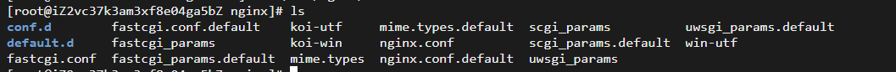
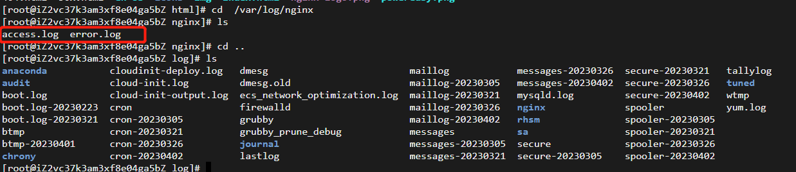

查看nginx修改是否成功

```shell
nginx -t
```

查看nginx是否启动成功

```shell
ps -ef | grep nginx
```

网站位置：

```shell
cd /usr/share/nginx/html
```

nginx安装位置

```shell
/etc/nginx
```

日志位置

```shell
cd /var/log/nginx
```

重启nginx

```shell
service nginx restart
```

新的服务器搭建后端服务

如果使用二级域名去请求后端服务，需要配nginx代理

我们安装完Nginx，会有一个默认的Nginx地址，位置在/etc/nginx下面，可以看到下面都存在什么

 

我们还存在另外一个目录在/usr/share/nginx/html下面，看看他存在什么

 

而日志，默认在 /var/log/nginx，下面去看看

/var/log是系统默认的日志输出的地方，nginx下代表nginx的日志输出的地方

 

nginx下有两个日志，分别代码成功和错误的日志，当我们程序正常，去请求内容的时候会走access.log，当程序出现错误，或请求出现意外，会走error.log的内容

现在通过图来介绍文件的具体描述

```shell
# For more information on configuration, see:
#   * Official English Documentation: http://nginx.org/en/docs/
#   * Official Russian Documentation: http://nginx.org/ru/docs/

user nginx;
worker_processes auto; # 默认为1  表示开启一个业务进程， 和cpu的内核数量有联系
error_log /var/log/nginx/error.log;
pid /run/nginx.pid;

# Load dynamic modules. See /usr/share/doc/nginx/README.dynamic.
include /usr/share/nginx/modules/*.conf; 

events {
    worker_connections 1024; # 单个进程可以接受的连接数 默认为1024
}

# 配置代理，缓存，日志，第三方模块等，可嵌套多个 server
http {
    # 下面代码为日志格式的设定，main为日志格式的名称，可自行设置，后面引用
    log_format  main  '$remote_addr - $remote_user [$time_local] "$request" '
                      '$status $body_bytes_sent "$http_referer" '
                      '"$http_user_agent" "$http_x_forwarded_for"';

    # 定位成功日志                  
    access_log  /var/log/nginx/access.log  main;

    # 使用linux的 sendfile(socket, file, len) 高效网络传输，也就是数据0拷贝, 可直接从不同的PC机传输，不需要中间层
    sendfile            on;

    #开启防止网络阻塞
    tcp_nopush          on;
    tcp_nodelay         on;

    # 置客户端连接保存活动的超时时间
    keepalive_timeout   65;
    types_hash_max_size 4096;

    #设置客户端请求读取header超时时间
    client_header_timeout 10;
    #设置客户端请求body读取超时时间
    client_body_timeout 10;


    #HttpGZip模块配置
    #开启gzip压缩
    gzip  on;
    #设置允许压缩的页面最小字节数
    gzip_min_length 1k;
    #申请4个单位为16K的内存作为压缩结果流缓存
    gzip_buffers 4 16k;
    #设置识别http协议的版本，默认为1.1
    gzip_http_version 1.1;
    #指定gzip压缩比，1-9数字越小，压缩比越小，速度越快
    gzip_comp_level 2;
    #指定压缩的类型
    gzip_types text/plain application/x-javascript text/css application/xml;
    #让前端的缓存服务器进过gzip压缩的页面
    gzip_vary on; 

    include             /etc/nginx/mime.types;  # 引入http mime类型
    # include 会把另外的一个配置文件引用到我们的当前的这个配置文件当中
    # mime.types 用来申明所返回或发送文件的类型 浏览器会根据服务器发送的http所标识的信息展示文本的类型 可以查看所支持的类型

    # 如果mime类型没匹配上，默认使用二进制流的方式传输。
    default_type        application/octet-stream;

    #设置允许客户端请求的最大的单个文件字节数
    client_max_body_size 20M;
    #指定来自客户端请求头的headebuffer大小
    client_header_buffer_size  32k;
    #指定连接请求试图写入缓存文件的目录路径
    client_body_temp_path /dev/shm/client_body_temp;
    #指定客户端请求中较大的消息头的缓存最大数量和大小，目前设置为4个32KB
    large client_header_buffers 4 32k;

    # Load modular configuration files from the /etc/nginx/conf.d directory.
    # See http://nginx.org/en/docs/ngx_core_module.html#include
    # 下面的目录下可以新建我们自己的主机，但监听端口时需要注意下面的内容
    include /etc/nginx/conf.d/*.conf;

    # nginx的主机 一个Nginx可以拥有多台这样的主机，通过不同的端口号来区分，
    # 端口号也可以相同，但需要通过server_name来区分
    # 开启多个主机的方式也叫作虚拟主机
    server {
        listen       80;
        listen       [::]:80;
        server_name  _;  # 一般为域名

        # 
        root         /usr/share/nginx/html;  # 项目部署的位置

        # Load configuration files for the default server block.
        include /etc/nginx/default.d/*.conf;

        # location 配置请求路由，页面处理
        error_page 404 /404.html;
        location = /404.html {
        }
        
        # 请求接口时可以通过代理  https://ip/abc/cc/xx   ---> https://abc/cc/xx
#        location /abc/ {
#            rewrite ^/abc/(.*)$ /$1 break;  # 修改请求地址
#            proxy_pass http://localhost:8084;  # 目标主机 + 端口
#        }
        # 出现报错，会进入50.html中
        error_page 500 502 503 504 /50x.html;
        location = /50x.html {
        }
    }

```

详细配置查看：

https://blog.csdn.net/u011262253/article/details/120941175

nginx.pid

能看出来这个文件跟上面的不一样啊，后缀为pid而不是log。这个文件是用来记录咱们Nginx主进程的ID号的。

内容也很简单，只有这一个数字。当然你们的ID跟我的不太可能会一致，咱们可以去系统里看看：

```
ps -ef | grep nginx
```

rewrite的语法

```
rewrite regex replacement [flag];
```

rewrite：固定关键字，表示开始进行rewrite匹配规则。

正则表达式^/(.*)：正则表达式，匹配完整的域名和后面的路径地址。

replacement为http://www.baidu.com/$1：其中$1是取regex部分()里面的内容。如果匹配成功后跳转到的URL。

flag为permanent：代表永久重定向，即跳转到 http://www.baidu.com/$1 地址上

redirect   #返回302临时重定向，浏览器地址会显示跳转新的URL地址。

permanent  #返回301永久重定向，浏览器地址会显示跳转新的URL地址

请求转发不要斜杠处理 ---break

请求： https://ip/abc/cc/xx

```
location /abc/ {

 proxy_pass http://localhost:8084/;

}
```

实际请求的  http://localhost:8084/cc/xx 

如何让配置proxy_pass http://localhost:8084/; 改为 proxy_pass http://localhost:8084 ;

 ```
location /abc/ {

  rewrite ^/abc/(.*)$ /$1 break;

 proxy_pass http://localhost:8084;

}
 ```

效果也是： http://localhost:8084/cc/xx

```shell
# Settings for a TLS enabled server.
#
#    server {
#        listen       443 ssl http2;
#        listen       [::]:443 ssl http2;
#        server_name  _;
#        root         /usr/share/nginx/html;
#
#        ssl_certificate "/etc/pki/nginx/server.crt";
#        ssl_certificate_key "/etc/pki/nginx/private/server.key";
#        ssl_session_cache shared:SSL:1m;
#        ssl_session_timeout  10m;
#        ssl_ciphers HIGH:!aNULL:!MD5;
#        ssl_prefer_server_ciphers on;
#
#        # Load configuration files for the default server block.
#        include /etc/nginx/default.d/*.conf;
#
#        error_page 404 /404.html;
#            location = /40x.html {
#        }
#
#        error_page 500 502 503 504 /50x.html;
#            location = /50x.html {
#        }
#    }

}

```

多端口需要复制多个server  每个server里面指定不同的端口

```shell
server {
#应用端口
  listen 80;
  server_name lanxin.cn,locahost;
｝

server {
#应用端口
  listen 8899;
  server_name locahost;

｝
```

一个端口多域名访问时  需要指定不同的server_name

```shell
server {
#应用端口
listen 80;
server_name xxx.com;
｝

server {
#应用端口
listen 80;
server_name api.xxx.com;
｝
```


禁止通过ip访问网站

```shell
server {

  listen 80; # 去掉这里的default_server

  listen [::]:80; # 去掉这里的default_server

  server_name www.domain.com; # 修改自己的域名

  root /path/to/www.domain.com; # 指向网站文件根目录

}
```

nginx配置前端项目

比如项目的路径是/www/gmgy/front

进入到nginx的/etc/nginx/conf.d目录，新增一个文件，命名为demo.conf，然后编辑这个文件，加入如下内容：

```shell

server {

    listen       80;
    server_name  www.gmgy.com;    #该域名为阿里云绑定服务器的域名

    location / {
        proxy_set_header Host $host;
        root /www/gmgy/front;             #项目路径
        index /index.html;                        
        try_files $uri $uri/ /index.html;        #匹配不到任何静态资源，跳到同一个index.html
    }

    #error_page  404              /404.html;

    # redirect server error pages to the static page /50x.html
    #
    error_page   500 502 503 504  /50x.html;
    location = /50x.html {
        root   /usr/share/nginx/html;
    }

}
```

保存，然后重启nginx

```shell
systemctl restart nginx
```

配置后端服务

进入到nginx的/etc/nginx/conf.d目录，新增一个文件，命名为demo-api.conf，然后编辑这个文件，加入如下内容

```shell

upstream api.gmgy.com{
    server 192.168.1.110:8090 weight=1;    #此处ip为服务器内网IP，端口号为tomcat端口号
}


server {

    listen       80;
    server_name  api.gmgy.com;

    location / {
        client_max_body_size 100M;
        proxy_set_header Host $host;
        proxy_pass http://api.demoProject.com;
    }

    #error_page  404              /404.html;

    # redirect server error pages to the static page /50x.html
    #
    error_page   500 502 503 504  /50x.html;
    location = /50x.html {
        root   /usr/share/nginx/html;
    }

}
```

保存后，重启nginx

```shell
systemctl restart nginx
```

