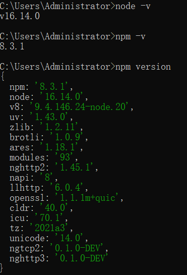
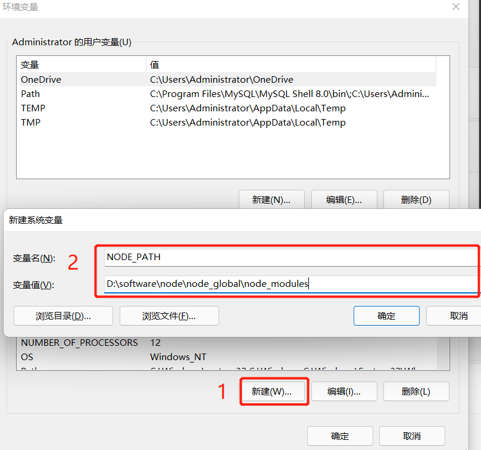
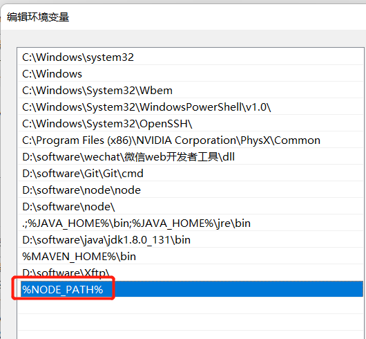
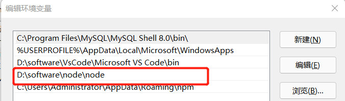

# 什么是Node

## Node的发展史

Node诞生于2009年，比起Python、Ruby这些显得是小老弟了，但比他们发展的更快，到现在已经发展到19的版本了

**发展时间线**

- 2009年的时候，Node有了一个名字，开始的时候叫做Web.js，后来因为API设计越来越庞大，最后取名为Nodejs，在这一年，Ryan Dahl（Node.js 的创建者）参加了很多演讲，包括在JSConf上的第一次演讲，也在同一年和Ryan Dahl的同事认为需要一个包管理器，于是就开始讨论起来了

  [1]: https://groups.google.com/g/nodejs/c/erDWyS4xPw8

- 在2010年的时候，Express框架出来了，Socket.io 初始版本发布，Node在在Heroku上得到了支持，创始人Ryan Dahl加入Joyent全职负责Node.js的发展，即Joyent 公司收购了 Node.js 原开发团队，同年发布了0.2.0的版本

- 2011年，Node指南发布，npm1.0发布，Ryan Dahl谈论了关于Node的历史，Node在Uber中使用Nodejs重新设计了他们的应用

- 2012年，Node0.8.0稳定版本发布，

- 2013年，Ghost使用Node开始写博客，Koa-Node的Web框架兴起， PayPal 发布了 Kraken，一个 Node.js 框架

- 2014年，多为重量级Node开发者不满 Joyent 对 Node 的管理，自立门户创建了 `io.js`

- 2015年，Node 与 io.js 合并，Node 的版本从 0.12.7 直接升级到了 4.0.0，合并后的 io.js 和 Node 在 Joyent 公司的维护下并行了两个版本：一个是4.x.x 还是原来的 Node，这个版本是稳定版，一个是5.x.x，目前已经更新到了 6.8.1，其实就是 io.js，最新特性版，不建议生产环境使用，

- 2016年，npm拥有2100000个用户，CJ Silverio成为npm首席技术官，Node6成了稳定版本

- 2017年，称为Node丰收的一年，Node进入了Node8，可以通过下图看到：

  
  根据 The Battery Ventures 开源软件指数，Node 是第四大最重要的开源项目，HTTP2 开始成为了Node的核心，

- 2018年，HTTP/2被push，宣布npm@6，在这一年，可以将Node应用程序部署App 引擎的标准环境，Node10进入了稳定版本

- 2019年，宣布新的实验性模块，介绍Node12，公布了Node12的新特性，

- [最新版本](https://nodejs.org/zh-cn)

## Node和Browser

Node和浏览器都是使用JavaScript作为编程语音，但在浏览器和Node应用程序上运行却是完全不同的，

在浏览器中，我们通常和浏览器的DOM、BOM或者一些浏览器平台的API经常打交道，但在Nodejs中，不存在这些，而使用Nodejs，我们可以和文件系统、网络等打交道

Node可以在任何平台上运行，只要Node的版本相同，相同的代码可以产生相同的效果，而浏览器则不同，不同的浏览器对所支持的API不同，我们必须写出兼容性大多数浏览器的代码才可以在不同的浏览器正常运行

我们可以在NodeJS上使用最新的ECMAScript标准，但浏览器却不一定支持，需要升级浏览器或者使用编辑工具，比如通过Babel将代码转换为ES5，

NodeJS可以支持CommonJS和ES模块系统，在浏览器里面只能使用import

## Node的使用场景

Node.js 可以说是一种轻量的、可模块化的开发工具，就目前而言，它适合作为以下场景的开发工具：

1. Web 后端服务
2. Web API 服务
3. CLI 工具开发 （vscode）
4. 简易的 Native 应用开发
5. 游戏

## Node的前景

知道Node的使用场景，在看看招聘要求，可以知道Node在以后的前端技术中是多重要了

参考资源：
https://blog.risingstack.com/history-of-node-js/
https://nodejs.dev/en/learn/

# Node安装

## Window的安装

进入Node.js官网：https://nodejs.org/zh-cn/download

根据自己电脑系统及位数选择，我这里选择windows64位.[msi](https://so.csdn.net/so/search?q=msi&spm=1001.2101.3001.7020)格式安装包

 .msi和.zip格式区别：
1、.msi是Windows installer开发出来的程序安装文件，它可以让你安装，修改，卸载你所安装的程序。说白了.msi就是Windows installer的数据包，把所有和安装文件相关的内容封装在一个包里。
2、.zip是一个压缩包，解压之后即可，不需要安装

我们进行安装，按照引导点击下一步，最后验证是否安装成功：

```shell
node -v
npm -v
```

 

配置nodejs

我们平时使用`npm install -g packagename` 安装包的时候，下载了一个全局包，我们可以来查看默认存放包的路径：

 

可以看到包都放在了C盘，我们需要将包默认的安装路径进行修改

在安装Node的目录下创建两个文件夹：

```shell
node_cache
node_global
```

然后通过命令修改安装路径

```shell
npm config set prefix "node_global的绝对路径"
npm config set cache "node_cache的绝对路径"
```

配置环境变量

在系统中新增NODE_PATH

```
变量名：NODE_PATH
变量值：D:\software\node\node_global\node_modules
```



将NODE_PATH 添加到PATH 中

 

更改用户变量path

 

测试：

安装express

```
npm install express -g
```

然后去node_global和node_cache文件夹里面，就能看到有我们安装的依赖包

至此，window中安装Node就已完成

参考资源：
https://blog.csdn.net/lijie0213/article/details/124521239

# 基于Node编写程序


## REPL介绍

1. REPL 全称: Read-Eval-Print-Loop（交互式解释器）

  - R 读取 - 读取用户输入，解析输入了Javascript 数据结构并存储在内存中。
  - E 执行 - 执行输入的数据结构
  - P 打印 - 输出结果
  - L 循环 - 循环操作以上步骤直到用户两次按下 ctrl-c 按钮退出。

2. 在REPL中编写程序 （类似于浏览器开发人员工具中的控制台功能）

  + 直接在控制台输入 `node` 命令进入 REPL 环境

3. 按两次 Control + C 退出REPL界面 或者 输入 `.exit` 退出 REPL 界面

  + 按住 control 键不要放开, 然后按两下 c 键


## 创建 JavaScript 文件编写程序

**JavaScript 文件名命名规则**

  + 不要用中文
  + 不要包含空格
  + 不要出现node关键字
  + 建议以 '-' 分割单词

## 案例

1. 案例1：编写一个简单的函数, 实现数字相加

```javascript
var n = 10;
var m = 100;

function add(x, y) {
  return x + y;
}

var result = add(m, n);

console.log('计算结果是：' + result);
```


2. 案例2：编写一个输出'三角形'的程序

```javascript
// process 对象是一个 global （全局变量），提供有关信息，控制当前 Node.js 进程。
// 作为一个对象，它对于 Node.js 应用程序始终是可用的，故无需使用 require()。

for (var i = 0; i < 10; i++) {
  for (var j = 0; j <= i; j++) {
    // 注意：console.log()输出完毕后是带换行的，所以这样做不可以
    // console.log('*');
    process.stdout.write('* ');
  }
  process.stdout.write('\n');
}
```


3. 案例3：文件读写案例（带同学们打开官方文档查阅）

  - 使用到的模块`var fs = require('fs');`

  - 1、写文件：`fs.writeFile(file, data[, options], callback);`
    + 参数1：要写入的文件路径，**必填**。
    + 参数2：要写入的数据，**必填**。
    + 参数3：写入文件时的选项，比如：文件编码，选填。
    + 参数4：文件写入完毕后的回调函数，**必填**。
    + 写文件注意：
      * 该操作采用异步执行
      * 如果文件已经存在则替换掉
      * 默认写入的文件编码为utf8
      * 回调函数有1个参数：err，表示在写入文件的操作过程中是否出错了。
        - 如果出错了`err != null`，否则 `err === null`

  - 2、读文件：`fs.readFile(file[, options], callback)`
    + 参数1：要读取的文件路径，**必填**。
    + 参数2：读取文件时的选项，比如：文件编码。选填。
    + 参数3：文件读取完毕后的回调函数，**必填**。
    + 读文件注意：
      - 该操作采用异步执行
      - 回调函数有两个参数，分别是err和data
      - 如果读取文件时没有指定编码，那么返回的将是原生的二进制数据；如果指定了编码，那么会根据指定的编码返回对应的字符串数据。
  - 注意：
    +  文件操作中的`./`表示当前路径，相对的是执行node命令的路径，而不是当前被执行的`*.js`文件的实际路径。
    +  `__dirname`才永远表示当前被执行的`*.js`文件的实际路径
    +  `/`表示根目录, 读取文件或写入文件的时候写`/`目录，在Windows下相当于当前磁盘根目录（比如：c:\ 或 d:\ 或 e:\  等，在Mac下相当于硬盘根目录 `/`）

```javascript
// --------------------------------- 写文件 -----------------------------
// 加载文件操作模块
var fs = require('fs');

// 创建要写入的文件的字符串
var msg = '你好，世界！你好 Node.js.';
// 执行文件写入操作
fs.writeFile('./data.txt', msg, 'utf8', function (err) {
  console.log('---' + err + '----');
  // /判断是否写入文件出错了
  if (err) {
    console.log('文件写入出错了，详细错误信息：' + err);
    // 把错误继续向上抛出
    throw err;
  } else {
    console.log('文件写入成功！');
  }
});


// --------------------------------- 读文件 -----------------------------
// 加载文件操作模块
var fs = require('fs');

// 执行文件读取操作
fs.readFile('./data.txt', 'utf8', function (err, data) {
  // 输出err  和 data
  // console.log('error: ' + err);
  // console.log('data: ' + data);

  if (err) {
    console.log('文件读取出错啦！详细信息: ' + err);
  } else {
    console.log('文件读取成功，以下是文件内容：');
    console.log(data);
  }
});
```

4. 案例4：创建目录案例

```javascript
// 创建一个文件夹


// 加载文件操作模块
var fs = require('fs');

// 创建一个目录
fs.mkdir('./test-mkdir', function (err) {
  if (err) {
    console.log('创建目录出错了，详细信息如下：');
    console.log(err);
  } else {
    console.log('目录创建成功！');
  }

});


// ----------------------------------------------------------

// 加载文件操作模块
var fs = require('fs');

// 1. 创建 '01-教学资料' 目录
fs.mkdir('./01-教学资料', function (err) {

  if (err) {
    throw err;
  }

  // 1.1 创建 '01-笔记大纲' 目录
  fs.mkdir('./01-教学资料/01-笔记大纲');

  // 1.2 创建 '02-作业任务' 目录
  fs.mkdir('./01-教学资料/02-作业任务');

  // 1.3 创建 '03-素材资料' 目录
  fs.mkdir('./01-教学资料/03-素材资料');

  // 1.4 创建 '04-随堂笔记' 目录
  fs.mkdir('./01-教学资料/04-随堂笔记');

});


// 2. 创建 '02-源代码' 目录
fs.mkdir('./02-源代码', function (err) {

  if (err) {
    throw err;
  }

  // 2.1 创建 '预习代码'目录
  fs.mkdir('./02-源代码/预习代码');

  // 2.2 创建 '课堂代码'目录
  fs.mkdir('./02-源代码/课堂代码');
});


// 3. 创建 '03-视频' 目录
fs.mkdir('./03-视频');


// 4. 创建 '04-其他资料' 目录
fs.mkdir('./04-其他资料');

```

**注意：**

1. 异步操作无法通过 try-catch 来捕获异常，要通过判断 error 来判断是否出错。
2. 同步操作可以通过 try-catch 来捕获异常。
3. 不要使用 `fs.exists(path, callback)` 来判断文件是否存在，直接判断 error 即可
4. 文件操作时的路径问题

  - 在读写文件的时候 './' 表示的是当前执行node命令的那个路径，不是被执行的js文件的路径
  - __dirname, 表示的永远是"当前被执行的js的目录"
  - __filename, 表示的是"被执行的js的文件名（含路径)"

5. error-first 介绍(错误优先)

5：通过 node.js 编写 http 服务程序 - 极简版本

步骤：

1. 加载http模块
2. 创建http服务
3. 为http服务对象添加 request 事件处理程序
4. 开启http服务监听，准备接收客户端请求


注意：

1. 浏览器显示可能是乱码，所以可以通过 `res.setHeader('Content-Type', 'text/plain; charset=utf-8');`设置浏览器显示时所使用的编码。

2. Chrome 浏览器默认无法手动设置编码，需要安装"Set Character Encoding"扩展。

3. 演示一下设置`Content-Type=text/html` 和 `Content-Type=text/plain`的区别。


参考代码：

```javascript
// 1. 加载http模块
var http = require('http');

// 2. 创建http服务
var server = http.createServer();

// 3. 开始监听'request'事件
// 详细解释一下request对象和response对象
server.on('request', function (req, res) {
  // body...
  console.log('有人请求了~~');
});

// 4. 启动服务，开始监听
server.listen(9000, function () {
  console.log('服务已经启动，请访问： http://localhost:9000');
});

```

6：通过 node.js 编写 http 服务程序 - 根据不同请求作出不同响应

说明：

- 根据不同请求，显示index页面、login页面、register页面、list页面。
- 请求 / 或 /index
- 请求 /login
- 请求 /register
- 请求 /list

**参考代码**

```javascript
// 加载http模块
var http = require('http');

// 创建http server
var server = http.createServer(function (req, res) {
  // body...
  console.log(req.url);


  if (req.url === '/' || req.url === '/index') {
    // 表示请求网站首页
    res.end('这是 index.html');

  } else if (req.url === '/login') {
    // 表示请求登录页面
    res.end('这是 login.html');

  } else if (req.url === '/register') {
    // 表示请求注册页面
    res.end('这是 register.html');
    
  } else if (req.url === '/list') {
    // 表示请求列表页面
    res.end('这是 list.html');
    
  } else {
    // 表示请求的页面不存在
    res.writeHead(404, 'Not Found');
    res.end('Sorry, page not found.');
  }
});

// 监听端口的网络请求
server.listen(9000, function () {
  console.log('http://localhost:9000');
});

```

7：通过 node.js 编写 http 服务程序 - 通过读取静态 HTML 文件来响应用户请求

步骤：

1. 创建index.html、login.html、register.html、list.html、404.html文件。 
2. 演示通过读取最简单的 HTML 文件来响应用户。
3. 演示通过读取"具有引入外部CSS样式表"的HTML文件来响应用户。
4. 演示通过读取"具有img标签"的HTML文件来响应用户。


注意：

- 1、注意在发送不同类型的文件时，要设置好对应的`Content-Type`
  + [Content-Type参考 OSChina](http://tool.oschina.net/commons)
  + [Content-Type参考 MDN](https://developer.mozilla.org/en-US/docs/Web/HTTP/Basics_of_HTTP/MIME_types)

- 2、HTTP状态码参考
  + [w3org参考](https://www.w3.org/Protocols/rfc2616/rfc2616-sec10.html)
  + [w3schools参考](https://www.w3schools.com/tags/ref_httpmessages.asp)

- 3、在html页面中写相对路径'./' 和 绝对路径 '/'的含义 。
  + 网页中的这个路径主要是告诉浏览器向哪个地址发起请求用的
  + './' 表示本次请求从相对于当前页面的请求路径（即服务器返回当前页面时的请求路径）开始
  + '/' 表示请求从根目录开始

补充知识点：

1. path 模块的 join() 方法


参考代码：

```javascript
// 1. 加载 http 模块
var http = require('http');
// 加载文件操作模块
var fs = require('fs');
// 加载path模块，这个模块主要用来处理各种路径。
var path = require('path');


// 2. 创建http server
var server = http.createServer(function (req, res) {
  // 1. 获取用户请求的URL
  var url = req.url.toLowerCase();

  // 2. 根据用户的不同请求，做出不同响应
  if (url === '/' || url === '/index') {
    // 读取index.html文件，把该文件响应给用户
    fs.readFile(path.join(__dirname, 'index.html'), function (err, data) {
      if (err) {
        throw err;
      }
      res.writeHead(200, 'OK', {
        'Content-Type': 'text/html; charset=utf-8'
      });
      // res.setHeader('Content-Type', 'text/html; charset=utf-8');
      res.end(data);

    });
  } else if (url === '/login') {
    // 读取login.html文件，把该文件响应给用户
    fs.readFile(path.join(__dirname, 'login.html'), function (err, data) {
      if (err) {
        throw err;
      }
      res.writeHead(200, 'OK', {
        'Content-Type': 'text/html; charset=utf-8'
      });
      // res.setHeader('Content-Type', 'text/html; charset=utf-8');
      res.end(data);

    });
  } else if (url === '/register') {
    // 读取register.html文件，把该文件响应给用户
    fs.readFile(path.join(__dirname, 'register.html'), function (err, data) {
      if (err) {
        throw err;
      }
      res.writeHead(200, 'OK', {
        'Content-Type': 'text/html; charset=utf-8'
      });
      // res.setHeader('Content-Type', 'text/html; charset=utf-8');
      res.end(data);

    });
  } else if (url === '/404') {
    // 读取register.html文件，把该文件响应给用户
    fs.readFile(path.join(__dirname, '404.html'), function (err, data) {
      if (err) {
        throw err;
      }
      res.writeHead(200, 'OK', {
        'Content-Type': 'text/html; charset=utf-8'
      });
      // res.setHeader('Content-Type', 'text/html; charset=utf-8');
      res.end(data);

    });
  }
  
});


// 3. 启动服务
server.listen(9090, function () {
  // body...
  console.log('please visit: http://localhost:9090');
});


```

8：模拟 Apache 实现静态资源服务器

步骤：

- 单独创建一个目录来实现，比如：创建一个"07-Apache"的目录。
- 在该目录下新建 `public` 目录，假设该目录为静态资源目录。
- 根据用户请求的路径在 public 目录下寻找对应路径下的资源。
- 如果找到了，那么将该资源返回给用户，如果没找到则返回404错误。
- 通过 mime 模块设置不同类型资源的Content-Type
- 实现完毕后把素材中的'An Ocean of Sky' 和 'Hacker News'分别拷贝到静态资源目录下, 测试是否成功

其他：

- 介绍 NPM
- 介绍 mime 第三方模块
  + `npm install mime`
  + 在代码中直接 `var mime = require('mime')`


参考代码：

```javascript
// 1. 加载对应模块
// 1.1 加载http模块
var http = require('http');
// 1.2 加载path模块，方便路径拼接
var path = require('path');
// 1.3 加载文件读取模块
var fs = require('fs');
// 1.4 加载判断文件MIME类型的模块
var mime = require('mime');


// 2. 创建http server
var server = http.createServer();


// 3. 监听用户request事件
server.on('request', function (req, res) {
  // 1. 获取用户的请求路径, 并转换为小写
  var url = req.url.toLowerCase();

  // 判断如果请求的路径是 '/' 那么等价于 '/index.html'
  url = (url === '/') ? '/index.html' : url;

  // 2. 根据用户请求的url路径, 去public目录下查找对应的静态资源文件。找到后读取该文件，并将结果返回给用户
  // 2.1 根据用户请求的url拼接本地资源文件的路径
  var filePath = path.join(__dirname, 'public', url);

  // 2.2 根据请求的文件路径设置Content-Type
  res.setHeader('Content-Type', mime.lookup(url));

  // 2.2 根据路径去读取对应的文件
  // 【注意】读取文件前无需判断文件是否已经存在，而是在读取文件的回调函数中根据error的错误信息来判断读取文件是否成功以及发生的错误
  fs.readFile(filePath, function (err, data) {
    // 判断是否有错误
    if (err) {

      if (err.code === 'ENOENT') { // 判断是否是请求的文件是否不存在

        res.setHeader('Content-Type', 'text/html; charset=utf8');
        res.statusCode = 404;
        res.statusMessage = 'Not Found';
        res.end('<h1>请求的资源不存在！</h1>');

      } else if (err.code === 'EACCES') { // 判断文件是否有访问权限

        res.setHeader('Content-Type', 'text/html; charset=utf8');
        res.statusCode = 403;
        res.statusMessage = 'Forbidden';
        res.end('<h1>Permission denied！</h1>');
      } else {

        throw err;  
      }

    } else {
      
      // 如果没有错误则将读取到的文件返回给用户
      res.statusCode = 200;
      res.statusMessage = 'OK';
      res.end(data);
    }
  })
});


// 4. 启动服务
server.listen(9000, function () {
  // body...
  console.log('server is running, please visit: http://localhost:9000');
});

```


## Common System Errors - 常见错误号

- EACCES (Permission denied)
  + An attempt was made to access a file in a way forbidden by its file access permissions.
  + 访问被拒绝

- EADDRINUSE (Address already in use)
  + An attempt to bind a server (net, http, or https) to a local address failed due to another server on the local system already occupying that address.
  + 地址正在被使用（比如：端口号备占用）

- EEXIST (File exists)
  + An existing file was the target of an operation that required that the target not exist.
  + 文件已经存在

- EISDIR (Is a directory)
  + An operation expected a file, but the given pathname was a directory.
  + 给定的路径是目录

- ENOENT (No such file or directory)
  + Commonly raised by fs operations to indicate that a component of the specified pathname does not exist -- no entity (file or directory) could be found by the given path.
  + 文件 或 目录不存在

- ENOTDIR (Not a directory)
  + A component of the given pathname existed, but was not a directory as expected. Commonly raised by fs.readdir.
  + 给定的路径不是目录


## 同步文件操作 和 异步文件操作

- `fs.readFile(file[, options], callback)`
- `fs.readFileSync(file[, options])`


## 通过设置 http 响应报文头实现弹框下载功能

1. 设置 `Content-Type: application/octet-stream`
2. 设置 `Content-Disposition: attachment; filename=demo.txt`

# 模块

介绍Node的模块时，我们先介绍一下Commonjs规范，这两者是不可分割的，不管缺少哪一个，就不能实现模块的引入；

## CommonJS规范

**JS标准的缺陷**

- JS是没有模块化系统（ES5）
- 模块化：就是将一个大的代码分成若干个小的代码，没有模块化的代码都是不可复用的。
- JS有模块化，即一个js文件就可以看作是一个模块，但是如果模块b依赖于模块a那么必须先引入模块a，否则就会报错，所以说JS有模块但是没有模块化系统。
- 标准库较少
  如jQuery就不是标准库，是由程序员自主开发的
- 没有标准的接口
- 缺乏管理系统

**没有模块化系统带来的影响**

- 依赖关系
  如果按两个js文件之间有依赖关系，必须保证引入的顺序。
- 命名空间的问题：
  当我们引入多个js文件，不同的js文件可能会有相同的变量名字，那么后引入的就会覆盖先引入的。
- 代码组织
  在js中不能直接定义内部变量，不能起到保护作用。
  即两个js文件可以通过html直接访问对方文件的变量（需要以html做中介，在浏览器端输出）

CommonJS规范的提出，主要是为了弥补当前JavaScript没有标准的缺陷，CommonJS规范分为模块引用、模块定义、模块标识

1. 模块引用

```js
var math = require('math');
```

在CommonJS规范中，`require`用于导入模块、JSON 和本地文件。模块也可以从 `node_modules` 导入，这个方法接受模块标识，以此引入一个模块的API到当前上下文中，

2. 模块定义

在模块中，上下文提供require()方法来引入外部模块。对应引入的功能，上下文提供了exports对象用于导出当前模块的方法或者变量，并且它是唯一导出的出口。在模块中，还存在一个module对象，它代表模块自身，而exports是module的属性。在Node中，一个文件就是一个模块，将方法挂载在`exports`对象上作为属性即可定义导出的方式

```js
function Module(id, parent) {
  this.id = id;
  this.exports = {};
  this.parent = parent;
  this.filename = null;
  this.loaded = false;
  this.children = [];
}

module.exports = Module;
var module = new Module(filename, parent);
```

每个模块内部，都有一个module对象，代表当前模块。它的属性如下：

- module.id 模块的识别符，通常是带有绝对路径的模块文件名。
- module.filename 模块的文件名，带有绝对路径。
- module.loaded 返回一个布尔值，表示模块是否已经完成加载。
- module.parent 返回一个对象，表示调用该模块的模块。
- module.children 返回一个数组，表示该模块要用到的其他模块。
- module.exports 初始值为一个空对象{}，表示模块对外输出的接口

**exports 属性**

exports 属性是module对象的一个属性，它向外提供接口

```js
// math.js
exports.add = function () {
    var sum = 0,
        i = 0,
        args = arguments,
        l = args.length;
    while (i < l) {
        sum += args[i++];
    }
    return sum;
};
```

在另一个文件中，我们通过require()方法引入模块后，就能调用定义的属性或方法了：

```js
// program.js
var math = require('math');
exports.increment = function (val) {
    return math.add(val, 1);
};
```

**exports和module.exports的区别**

两者着本质上是一个对象

- 通过exports只能使用`.`的方式来向外暴露内部变量`exports.XXX=XXX`
- module.exports既可以通过`.`的形式,也可以`直接赋值`
  `module.exports.XXX=XXX`    `module.exports = {}`

```js
// test.js
exports.name1 = 'lisi'
module.exports.name2 = 'zhangsan'
```

```js
// main.js
var hello = require('./test')
console.log(hello.name1)
console.log(hello.name2)
```

为什么我们不能直接给`exports`直接赋值呢，其原因在于，exports对象是通过形参的方式传入的，直接赋值形参会改变形参的引用，但并不能改变作用域外的值。测试代码如下：

```js
var change = function (a) {
    a = 100;
    console.log(a); // => 100
};

var a = 10;
change(a);
console.log(a); // => 10
```

3. 模块标识

模块标识其实就是传递给`require()`方法的参数，它必须是符合小驼峰命名的字符串，或者以`．`、`.．`开头的相对路径，或者绝对路径。它可以没有文件名后缀`．js`。

模块会根据不同的参数去寻找模块文件，加载规则如下：

（1）如果参数字符串以“/”开头，则表示加载的是一个位于绝对路径的模块文件。比如，`require('/home/marco/foo.js')`将加载`/home/marco/foo.js`。

（2）如果参数字符串以“./”开头，则表示加载的是一个位于相对路径（跟当前执行脚本的位置相比）的模块文件。比如，`require('./circle')`将加载当前脚本同一目录的`circle.js`。

> 以．、.．和/开始的标识符，这里都被当做文件模块来处理。在分析文件模块时，require()方法会将路径转为真实路径，并以真实路径作为索引，将编译执行后的结果存放到缓存中，以使二次加载时更快

（3）如果参数字符串不以“./“或”/“开头，则表示加载的是一个默认提供的核心模块（位于Node的系统安装目录中），或者一个位于各级`node_modules`目录的已安装模块（全局安装或局部安装）用户在编写模块的时候，不能命名为与Node核心模块中的名字相同，不然会加载失败。

（4）如果参数字符串不以“./“或”/“开头，而且是一个路径，比如require('example-module/path/to/file')，则将先找到example-module的位置，然后再以它为参数，找到后续路径。

（5）如果指定的模块文件没有发现，Node会尝试为文件名添加`.js`、`.json`、`.node`后，再去搜索。`.js`件会以文本格式的JavaScript脚本文件解析，`.json`文件会以JSON格式的文本文件解析，`.node`文件会以编译后的二进制文件解析。

通过上述查找到的文件，每一个编译成功的模块都会将其文件路径作为索引缓存在`Module._cache`对象上，以提高二次引入的性能

CommonJS是同步的，意味着你想调用模块里的方法，必须先用require加载模块。这对服务器端的Nodejs来说不是问题，因为模块的JS文件都在本地硬盘上，CPU的读取时间非常快，同步不是问题。但如果是浏览器环境，要从服务器加载模块。模块的加载将取决于网速，如果采用同步，网络情绪不稳定时，页面可能卡住,这就必须采用异步模式。所以，就有了 AMD解决方案。

**模块加载原理**

模块一般分为两类，一类是Node提供的模块，一类是用户编写的模块

在加载时两类模块的加载过程是不同的；

- 核心模块部分在Node源代码的编译过程中，编译进了二进制执行文件。在Node进程启动时，部分核心模块就被直接加载进内存中，所以这部分核心模块引入时，文件定位和编译执行这两个步骤可以省略掉，并且在路径分析中优先判断，所以它的加载速度是最快的
- 文件模块则是在运行时动态加载，需要完整的路径分析、文件定位、编译执行过程，速度比核心模块慢

Node在加载模块的时候会优先去缓存里面查找，如果找不到，然后在根据模块标识去按规则查找

加载速度

缓存的模块 > 核心模块  > 文件模块

**模块的加载流程**

比如创建文件`a.js`，里面的内容为`console.log(module.paths)`

然后执行`node a.js`会输出打印信息

在window下可以看到下面的输出

  

在Linux下可以看到下面的输出

由此而得，模块路径的生成规则如下所示。

- 当前文件目录下的node_modules目录。
- 父目录下的node_modules目录。
- 父目录的父目录下的node_modules目录。
- 沿路径向上逐级递归，直到根目录下的node_modules目录

和JavaScript的原型链或作用域链的查找方式类似，加载的时候会去逐个查找，直到找到目标文件，如果当前文件的路径越深，模块查找耗时会越多，这是自定义模块的加载速度是最慢的原因

**JavaScript文件模块的编译**

我们可以在文件内使用require、export、module、这3个变量，还可以使用__filename、`__dirname`，但这些变量是从哪来的呢

其实，Node对获取的JavaScript文件内容进行了头尾包装。在头部添加了`(function (exports, require, module, __filename, __dirname){\n，在尾部添加了\n});`。一个正常的JavaScript文件会被包装成如下的样子：

```js
(function (exports, require, module, __filename, __dirname) {
    var math = require('math');
    exports.area = function (radius) {
        return Math.PI * radius * radius;
    };
});
```

这样每个模块文件之间都进行了作用域隔离。包装之后的代码会通过vm原生模块的`runInThisContext()`方法执行（类似eval，只是具有明确上下文，不污染全局），返回一个具体的`function`对象。最后，将当前模块对象的`exports`属性、`require()`方法、`module`（模块对象自身），以及在文件定位中得到的完整文件路径和文件目录作为参数传递给这个`function()`执行。

在执行之后，模块的exports属性被返回给了调用方。exports属性上的任何方法和属性都可以被外部调用到，但是模块中的其余变量或属性则不可直接被调用。

## 系统模块

### nvm（Node Version Manager）

nvm (Linux、Unix、OS X)

  + https://github.com/creationix/nvm
  + 常用命令：
    - nvm install node （安装最新版本的node）
    - nvm use node （使用指定版本的node）


nvm-windows (Windows)

  + https://github.com/coreybutler/nvm-windows
  + 常用命令：
    - nvm version
    - nvm install latest
    - nvm install 版本号
    - nvm uninstall 版本号
    - nvm list
    - nvm use 版本号

### Buffer

思考：Buffer 类型产生的原因？主要用来解决什么问题？

看一下什么是 Buffer? 什么是 Stream?


一、类型介绍

1. JavaScript 语言没有读取或操作二进制数据流的机制。
2. Node.js 中引入了 Buffer 类型使我们可以操作 TCP流 或 文件流。
3. Buffer 类型的对象类似于整数数组，但 Buffer 的大小是固定的、且在 V8 堆外分配物理内存。 Buffer 的大小在被创建时确定，且无法调整。（ buf.length 是固定的，不允许修改 ）
4. Buffer 是全局的，所以使用的时候无需 require() 的方式来加载


二、如何创建一个 Buffer 对象


常见的 API 介绍

1. 创建一个 Buffer 对象

```javascript
// 1. 通过 Buffer.from() 创建一个 Buffer 对象

// 1.1 通过一个字节数组来创建一个 Buffer 对象
var array = [0x68, 0x65, 0x6c, 0x6c, 0x6f, 0x20, 0xe4, 0xb8, 0x96, 0xe7, 0x95, 0x8c];
var buf = Buffer.from(array);
console.log(buf.toString('utf8'));

// 1.2 通过字符串来创建一个 Buffer 对象
// Buffer.from(string[, encoding])
var buf = Buffer.from('你好世界！ Hello World!~');
console.log(buf);
console.log(buf.toString());

```


2. 拼接多个 Buffer 对象为一个对象

```javascript
// Buffer.concat(list[, totalLength])
var bufferList = [];
var buf = Buffer.concat(bufferList);
```


3. 获取字符串对应的字节个数

```javascript
// Buffer.byteLength(string[, encoding])

var len = Buffer.byteLength('你好世界Hello', 'utf8');
console.log(len);
```

4. 判断一个对象是否是 Buffer 类型对象

```javascript
// Buffer.isBuffer(obj)
// obj <Object>
// Returns: <boolean>
// Returns true if obj is a Buffer, false otherwise.

```


5. 获取 Buffer 中的某个字节

```javascript
// 根据索引获取 Buffer 中的某个字节（byte、octet）
// buf[index]

```


6、获取 Buffer 对象中的字节的个数

```javascript
// buf.length
// 注意：length 属性不可修改
```


7. 已过时的 API

```javascript
// 以下 API 已全部过时
new Buffer(array)
new Buffer(buffer)
new Buffer(arrayBuffer[, byteOffset [, length]])
new Buffer(size)
new Buffer(string[, encoding])

```


三、Buffer 对象与编码

Node.js 目前支持的编码如下：

1. ascii
2. utf8
3. utf16le

  - ucs2 是 utf16le 的别名 

4. base64
5. latin1

  - binary 是 latin1 的别名

6. hex

  - 用两位 16 进制来表示每个字节


示例代码：

```javascript
var buf = Buffer.from('你好世界，Hello World！', 'utf8');

console.log(buf.toString('hex'));
console.log(buf.toString('base64'));
console.log(buf.toString('utf8'));
```


四、思考：为什么会有 Buffer 类型？

1. Buffer 使用来临时存储一些数据（二进制数据）
2. 当我们要把一大块数据从一个地方传输到另外一个地方的时候可以通过 Buffer 对象进行传输
3. 通过 Buffer 每次可以传输小部分数据，直到所有数据都传输完毕。

# 资源

1. 图书

  + 《深入浅出Node.js》 作者：朴灵
  + 《node.js 实战 中国程序员6》

2. 网站资源

  + [CNODE社区](https://cnodejs.org/) 
  + [Node.js 简易教程](http://www.runoob.com/nodejs/nodejs-tutorial.html)
  + [Node入门](https://www.nodebeginner.org/index-zh-cn.html)
  + [Node.js包教不包会](https://github.com/ppker/node-lessons)
  + [CNODE-新手入门](http://cnodejs.org/getstart)
  + 其他参考链接
    - [Node.js 究竟是什么？](https://www.ibm.com/developerworks/cn/opensource/os-nodejs/index.html)
    - [Node.js是用来做什么的？](https://www.zhihu.com/question/33578075)
    - [什么是 node.js](http://www.infoq.com/cn/articles/what-is-nodejs)

3. Node.js 使用场景 & 实战

  - [Node.js雪球实战半年谈](http://www.undozen.com/slides/xueqiu2012a/#21.1)
  - [雪球上的 Node.js](http://mengxy.net/slides/nodejs-at-xueqiu/)
  - [国内有哪些网站使用了 Node.js](https://cnodejs.org/topic/50613e6601d0b8014822b6b9)
  - [Node.js & Uber](https://www.joyent.com/blog/node-js-office-hours-curtis-chambers-uber)
  - [Node.js 的优势和劣势](https://www.zhihu.com/question/19653241)
  - [node.js的15个应用场景](http://www.devstore.cn/essay/essayInfo/2199.html)
  - [How to decide when to use Node.js?](https://github.com/simongong/js-stackoverflow-highest-votes/blob/master/questions1-10/when-to-use-nodejs.md)
  - [优缺点及适用场景讨论](http://www.cnblogs.com/sysuys/p/3460614.html)
  - [Node.js 发展前景如何？适用于哪些场景？](https://www.zhihu.com/question/19587881)
  - [Node.js企业开发 一应用场景](http://n.thepana.com/2014/01/06/node-yingyong-changjing/)
  - [10个最佳Node.js企业应用案例：从Uber到LinkedIn](http://www.sohu.com/a/150175393_465223)
  - [极速Node.js：来自LinkedIn的10个性能提升秘籍](http://blog.jobbole.com/40135/)
  - 为分布式应用做中转
  - 前后端团队融合，节省成本
  - Node.js 简单高效
  - Node.js 是给前端用的，后端复杂的业务逻辑肯定不会用 Node.js

