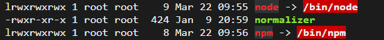

centos7安装node

下载软件，我一般是放到opt目录下的，所以在本次安装时，下载的目录是`/opt/node/`

下载

```shell
wget https://nodejs.org/dist/v16.18.1/node-v16.18.1-linux-x64.tar.xz
```

我们可以到这个文件下面找我们想要版本的包

```shell
https://nodejs.org/dist/
```

在这个目录下进行解压

```shell
tar -xvf node-v16.18.1-linux-x64.tar.xz
```

创建软连接

```shell
ln -s /opt/node/node-v16.18.1-linux-x64/bin/node /usr/local/bin/
ln -s /opt/node/node-v16.18.1-linux-x64/bin/npm /usr/local/bin/
```

测试：

```shell
node -v
npm -v
```

提示：

`/usr/bin`中装的是系统预装的可执行程序 
`/usr/local/bin`中是用户放置自己的可执行程序的地方

有人说测试`npm`失败的话要修改配置文件，目前我没有失败，上面就没有修改配置文件的那一步

```shell
vi /etc/profile

NODE_HOME=/opt/node/node-v16.18.1-linux-x64
PATH=$NODE_HOME/bin:$PATH
export NODE_HOME PATH
```

上面编辑完，让配置文件生效

```shell
source /etc/profile
```

然后在进行测试


如果软链接建立失败，我们去创建软链接的目录下查看以下`ls`

 

会发现创建软链接的那个名称是红色的

使用`ll`进行查看

 

可以看到路径不对，

所以在创建软链接的时候，我们需要使用绝对路径，如上面创建的过程，而不能进入某个目录下，使用相对路径

最后下面的指令都能通过

```shell
node -v
npm -v
```


