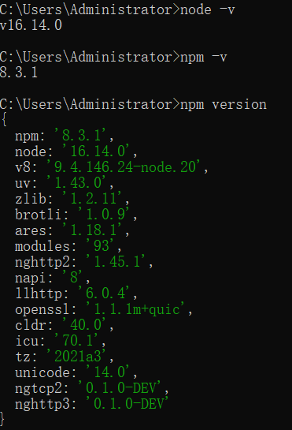

::: slot doclist
[[toc]]
:::


# 什么是Node

## Node的发展史

Node诞生于2009年，比起Python、Ruby这些显得是小老弟了，但比他们发展的更快，到现在已经发展到19的版本了

**发展时间线**

- 2009年的时候，Node有了一个名字，开始的时候叫做Web.js，后来因为API设计越来越庞大，最后取名为Nodejs，在这一年，Ryan Dahl（Node.js 的创建者）参加了很多演讲，包括在JSConf上的第一次演讲，也在同一年和Ryan Dahl的同事认为需要一个包管理器，于是就开始讨论起来了

  [1]: https://groups.google.com/g/nodejs/c/erDWyS4xPw8

- 在2010年的时候，Express框架出来了，Socket.io 初始版本发布，Node在在Heroku上得到了支持，创始人Ryan Dahl加入Joyent全职负责Node.js的发展，即Joyent 公司收购了 Node.js 原开发团队，同年发布了0.2.0的版本

- 2011年，Node指南发布，npm1.0发布，Ryan Dahl谈论了关于Node的历史，Node在Uber中使用Nodejs重新设计了他们的应用

- 2012年，Node0.8.0稳定版本发布，

- 2013年，Ghost使用Node开始写博客，Koa-Node的Web框架兴起， PayPal 发布了 Kraken，一个 Node.js 框架

- 2014年，多为重量级Node开发者不满 Joyent 对 Node 的管理，自立门户创建了 `io.js`

- 2015年，Node 与 io.js 合并，Node 的版本从 0.12.7 直接升级到了 4.0.0，合并后的 io.js 和 Node 在 Joyent 公司的维护下并行了两个版本：一个是4.x.x 还是原来的 Node，这个版本是稳定版，一个是5.x.x，目前已经更新到了 6.8.1，其实就是 io.js，最新特性版，不建议生产环境使用，

- 2016年，npm拥有2100000个用户，CJ Silverio成为npm首席技术官，Node6成了稳定版本

- 2017年，称为Node丰收的一年，Node进入了Node8，可以通过下图看到：

  
  根据 The Battery Ventures 开源软件指数，Node 是第四大最重要的开源项目，HTTP2 开始成为了Node的核心，

- 2018年，HTTP/2被push，宣布npm@6，在这一年，可以将Node应用程序部署App 引擎的标准环境，Node10进入了稳定版本

- 2019年，宣布新的实验性模块，介绍Node12，公布了Node12的新特性，

- [最新版本](https://nodejs.org/zh-cn)

## Node和Browser

Node和浏览器都是使用JavaScript作为编程语音，但在浏览器和Node应用程序上运行却是完全不同的，

在浏览器中，我们通常和浏览器的DOM、BOM或者一些浏览器平台的API经常打交道，但在Nodejs中，不存在这些，而使用Nodejs，我们可以和文件系统、网络等打交道

Node可以在任何平台上运行，只要Node的版本相同，相同的代码可以产生相同的效果，而浏览器则不同，不同的浏览器对所支持的API不同，我们必须写出兼容性大多数浏览器的代码才可以在不同的浏览器正常运行

我们可以在NodeJS上使用最新的ECMAScript标准，但浏览器却不一定支持，需要升级浏览器或者使用编辑工具，比如通过Babel将代码转换为ES5，

NodeJS可以支持CommonJS和ES模块系统，在浏览器里面只能使用import

## Node的使用场景

Node.js 可以说是一种轻量的、可模块化的开发工具，就目前而言，它适合作为以下场景的开发工具：

1. Web 后端服务
2. Web API 服务
3. CLI 工具开发 （vscode）
4. 简易的 Native 应用开发
5. 游戏

## Node的前景

知道Node的使用场景，在看看招聘要求，可以知道Node在以后的前端技术中是多重要了

参考资源：
https://blog.risingstack.com/history-of-node-js/
https://nodejs.dev/en/learn/

# Node安装

## Window的安装

进入Node.js官网：https://nodejs.org/zh-cn/download

根据自己电脑系统及位数选择，我这里选择windows64位.[msi](https://so.csdn.net/so/search?q=msi&spm=1001.2101.3001.7020)格式安装包

 .msi和.zip格式区别：
1、.msi是Windows installer开发出来的程序安装文件，它可以让你安装，修改，卸载你所安装的程序。说白了.msi就是Windows installer的数据包，把所有和安装文件相关的内容封装在一个包里。
2、.zip是一个压缩包，解压之后即可，不需要安装

我们进行安装，按照引导点击下一步，最后验证是否安装成功：

```shell
node -v
npm -v
```

 

配置nodejs

我们平时使用`npm install -g packagename` 安装包的时候，下载了一个全局包，我们可以来查看默认存放包的路径：

 

可以看到包都放在了C盘，我们需要将包默认的安装路径进行修改

在安装Node的目录下创建两个文件夹：

```shell
node_cache
node_global
```

然后通过命令修改安装路径

```shell
npm config set prefix "node_global的绝对路径"
npm config set cache "node_cache的绝对路径"
```

配置环境变量

在系统中新增NODE_PATH

```
变量名：NODE_PATH
变量值：D:\software\node\node_global\node_modules
```


将NODE_PATH 添加到PATH 中

 

更改用户变量path

 

## Linux安装Node

基于centos7的安装

下载软件，我一般是放到opt目录下的，所以在本次安装时，下载的目录是`/opt/node/`

下载

```shell
wget https://nodejs.org/dist/v16.18.1/node-v16.18.1-linux-x64.tar.xz
```

我们可以到这个文件下面找我们想要版本的包

```shell
https://nodejs.org/dist/
```

在这个目录下进行解压

```shell
tar -xvf node-v16.18.1-linux-x64.tar.xz
```

创建软连接

```shell
ln -s /opt/node/node-v16.18.1-linux-x64/bin/node /usr/local/bin/
ln -s /opt/node/node-v16.18.1-linux-x64/bin/npm /usr/local/bin/
```

验证：

```shell
node -v
npm -v
```

提示：

`/usr/bin`中装的是系统预装的可执行程序 
`/usr/local/bin`中是用户放置自己的可执行程序的地方

有人说测试`npm`失败的话要修改配置文件，目前我没有失败，上面就没有修改配置文件的那一步

```shell
vi /etc/profile

NODE_HOME=/opt/node/node-v16.18.1-linux-x64
PATH=$NODE_HOME/bin:$PATH
export NODE_HOME PATH
```

上面编辑完，让配置文件生效

```shell
source /etc/profile
```

如果软链接建立失败，我们去创建软链接的目录下查看以下`ls`

 

会发现创建软链接的那个名称是红色的

使用`ll`进行查看

 

可以看到路径不对，

所以在创建软链接的时候，我们需要使用绝对路径，如上面创建的过程，而不能进入某个目录下，使用相对路径

最后下面的指令都能通过

```shell
node -v
npm -v
```

测试安装express

```
npm install express -g
```

参考资源：
https://blog.csdn.net/lijie0213/article/details/124521239

# 基于Node编写程序


## REPL介绍

1. REPL 全称: Read-Eval-Print-Loop（交互式解释器）

  - R 读取 - 读取用户输入，解析输入了Javascript 数据结构并存储在内存中。
  - E 执行 - 执行输入的数据结构
  - P 打印 - 输出结果
  - L 循环 - 循环操作以上步骤直到用户两次按下 ctrl-c 按钮退出。

2. 在REPL中编写程序 （类似于浏览器开发人员工具中的控制台功能）

  + 直接在控制台输入 `node` 命令进入 REPL 环境

3. 按两次 Control + C 退出REPL界面 或者 输入 `.exit` 退出 REPL 界面

  + 按住 control 键不要放开, 然后按两下 c 键

node.js 的主要依赖的模块：

V8 引擎：主要是 JS 语法的解析，有了它才能识别 JS语法

libuv: c 语⾔实现的⼀个⾼性能异步⾮阻塞 IO 库，⽤来实现 node.js 的事件循环

http-parser/llhttp: 底层处理 http 请求，处理报⽂，解析请求包等内容

openssl: 处理加密算法，各种框架运⽤⼴泛 


## 创建 JavaScript 文件编写程序

**JavaScript 文件名命名规则**

  + 不要用中文
  + 不要包含空格
  + 不要出现node关键字
  + 建议以 '-' 分割单词

1. 案例：编写一个简单的函数, 实现数字相加

```javascript
var n = 10;
var m = 100;

function add(x, y) {
  return x + y;
}

var result = add(m, n);

console.log('计算结果是：' + result);
```

执行脚本： `node  filename.js`

2. 案例：编写一个输出'三角形'的程序

```javascript
// process 对象是一个 global （全局变量），提供有关信息，控制当前 Node.js 进程。
// 作为一个对象，它对于 Node.js 应用程序始终是可用的，故无需使用 require()。

for (var i = 0; i < 10; i++) {
  for (var j = 0; j <= i; j++) {
    // 注意：console.log()输出完毕后是带换行的，所以这样做不可以
    // console.log('*');
    process.stdout.write('* ');
  }
  process.stdout.write('\n');
}
```

3. 案例：文件读写案例（带同学们打开官方文档查阅）

  - 使用到的模块`var fs = require('fs');`

  - 1、写文件：`fs.writeFile(file, data[, options], callback);`
    + 参数1：要写入的文件路径，**必填**。
    + 参数2：要写入的数据，**必填**。
    + 参数3：写入文件时的选项，比如：文件编码，选填。
    + 参数4：文件写入完毕后的回调函数，**必填**。
    + 写文件注意：
      * 该操作采用异步执行
      * 如果文件已经存在则替换掉
      * 默认写入的文件编码为utf8
      * 回调函数有1个参数：err，表示在写入文件的操作过程中是否出错了。
        - 如果出错了`err != null`，否则 `err === null`

  - 2、读文件：`fs.readFile(file[, options], callback)`
    + 参数1：要读取的文件路径，**必填**。
    + 参数2：读取文件时的选项，比如：文件编码。选填。
    + 参数3：文件读取完毕后的回调函数，**必填**。
    + 读文件注意：
      - 该操作采用异步执行
      - 回调函数有两个参数，分别是err和data
      - 如果读取文件时没有指定编码，那么返回的将是原生的二进制数据；如果指定了编码，那么会根据指定的编码返回对应的字符串数据。
  - 注意：
    +  文件操作中的`./`表示当前路径，相对的是执行node命令的路径，而不是当前被执行的`*.js`文件的实际路径。
    +  `__dirname`才永远表示当前被执行的`*.js`文件的实际路径
    +  `/`表示根目录, 读取文件或写入文件的时候写`/`目录，在Windows下相当于当前磁盘根目录（比如：c:\ 或 d:\ 或 e:\  等，在Mac下相当于硬盘根目录 `/`）

```javascript
// --------------------------------- 写文件 -----------------------------
// 加载文件操作模块
var fs = require('fs');

// 创建要写入的文件的字符串
var msg = '你好，世界！你好 Node.js.';
// 执行文件写入操作
fs.writeFile('./data.txt', msg, 'utf8', function (err) {
  console.log('---' + err + '----');
  // /判断是否写入文件出错了
  if (err) {
    console.log('文件写入出错了，详细错误信息：' + err);
    // 把错误继续向上抛出
    throw err;
  } else {
    console.log('文件写入成功！');
  }
});


// --------------------------------- 读文件 -----------------------------
// 加载文件操作模块
var fs = require('fs');

// 执行文件读取操作
fs.readFile('./data.txt', 'utf8', function (err, data) {
  // 输出err  和 data
  // console.log('error: ' + err);
  // console.log('data: ' + data);

  if (err) {
    console.log('文件读取出错啦！详细信息: ' + err);
  } else {
    console.log('文件读取成功，以下是文件内容：');
    console.log(data);
  }
});
```

4. 案例4：创建目录案例

```javascript
// 创建一个文件夹


// 加载文件操作模块
var fs = require('fs');

// 创建一个目录
fs.mkdir('./test-mkdir', function (err) {
  if (err) {
    console.log('创建目录出错了，详细信息如下：');
    console.log(err);
  } else {
    console.log('目录创建成功！');
  }

});


// ----------------------------------------------------------

// 加载文件操作模块
var fs = require('fs');

// 1. 创建 '01-教学资料' 目录
fs.mkdir('./01-教学资料', function (err) {

  if (err) {
    throw err;
  }

  // 1.1 创建 '01-笔记大纲' 目录
  fs.mkdir('./01-教学资料/01-笔记大纲');

  // 1.2 创建 '02-作业任务' 目录
  fs.mkdir('./01-教学资料/02-作业任务');

  // 1.3 创建 '03-素材资料' 目录
  fs.mkdir('./01-教学资料/03-素材资料');

  // 1.4 创建 '04-随堂笔记' 目录
  fs.mkdir('./01-教学资料/04-随堂笔记');

});


// 2. 创建 '02-源代码' 目录
fs.mkdir('./02-源代码', function (err) {

  if (err) {
    throw err;
  }

  // 2.1 创建 '预习代码'目录
  fs.mkdir('./02-源代码/预习代码');

  // 2.2 创建 '课堂代码'目录
  fs.mkdir('./02-源代码/课堂代码');
});


// 3. 创建 '03-视频' 目录
fs.mkdir('./03-视频');


// 4. 创建 '04-其他资料' 目录
fs.mkdir('./04-其他资料');

```

**注意：**

1. 异步操作无法通过 try-catch 来捕获异常，要通过判断 error 来判断是否出错。
2. 同步操作可以通过 try-catch 来捕获异常。
3. 不要使用 `fs.exists(path, callback)` 来判断文件是否存在，直接判断 error 即可
4. 文件操作时的路径问题

  - 在读写文件的时候 `./`表示的是当前执行node命令的那个路径，不是被执行的`js`文件的路径
  - __dirname, 表示的永远是"当前被执行的js的目录"
  - __filename, 表示的是"被执行的js的文件名（含路径)"

5. error-first 介绍(错误优先)

5：通过 node.js 编写 http 服务程序 - 极简版本

步骤：

1. 加载http模块
2. 创建http服务
3. 为http服务对象添加 request 事件处理程序
4. 开启http服务监听，准备接收客户端请求


注意：

1. 浏览器显示可能是乱码，所以可以通过 `res.setHeader('Content-Type', 'text/plain; charset=utf-8');`设置浏览器显示时所使用的编码。

2. Chrome 浏览器默认无法手动设置编码，需要安装"Set Character Encoding"扩展。

3. 演示一下设置`Content-Type=text/html` 和 `Content-Type=text/plain`的区别。


参考代码：

```javascript
// 1. 加载http模块
var http = require('http');

// 2. 创建http服务
var server = http.createServer();

// 3. 开始监听'request'事件
// 详细解释一下request对象和response对象
server.on('request', function (req, res) {
  // body...
  console.log('有人请求了~~');
});

// 4. 启动服务，开始监听
server.listen(9000, function () {
  console.log('服务已经启动，请访问： http://localhost:9000');
});

```

6：通过 node.js 编写 http 服务程序 - 根据不同请求作出不同响应

说明：

- 根据不同请求，显示index页面、login页面、register页面、list页面。
- 请求 / 或 /index
- 请求 /login
- 请求 /register
- 请求 /list

**参考代码**

```javascript
// 加载http模块
var http = require('http');

// 创建http server
var server = http.createServer(function (req, res) {
  // body...
  console.log(req.url);


  if (req.url === '/' || req.url === '/index') {
    // 表示请求网站首页
    res.end('这是 index.html');

  } else if (req.url === '/login') {
    // 表示请求登录页面
    res.end('这是 login.html');

  } else if (req.url === '/register') {
    // 表示请求注册页面
    res.end('这是 register.html');
    
  } else if (req.url === '/list') {
    // 表示请求列表页面
    res.end('这是 list.html');
    
  } else {
    // 表示请求的页面不存在
    res.writeHead(404, 'Not Found');
    res.end('Sorry, page not found.');
  }
});

// 监听端口的网络请求
server.listen(9000, function () {
  console.log('http://localhost:9000');
});

```

7：通过 node.js 编写 http 服务程序 - 通过读取静态 HTML 文件来响应用户请求

步骤：

1. 创建index.html、login.html、register.html、list.html、404.html文件。 
2. 演示通过读取最简单的 HTML 文件来响应用户。
3. 演示通过读取"具有引入外部CSS样式表"的HTML文件来响应用户。
4. 演示通过读取"具有img标签"的HTML文件来响应用户。


注意：

- 1、注意在发送不同类型的文件时，要设置好对应的`Content-Type`
  + [Content-Type参考 OSChina](http://tool.oschina.net/commons)
  + [Content-Type参考 MDN](https://developer.mozilla.org/en-US/docs/Web/HTTP/Basics_of_HTTP/MIME_types)

- 2、HTTP状态码参考
  + [w3org参考](https://www.w3.org/Protocols/rfc2616/rfc2616-sec10.html)
  + [w3schools参考](https://www.w3schools.com/tags/ref_httpmessages.asp)

- 3、在html页面中写相对路径'./' 和 绝对路径 '/'的含义 。
  + 网页中的这个路径主要是告诉浏览器向哪个地址发起请求用的
  + './' 表示本次请求从相对于当前页面的请求路径（即服务器返回当前页面时的请求路径）开始
  + '/' 表示请求从根目录开始

补充知识点：

1. path 模块的 join() 方法


参考代码：

```javascript
// 1. 加载 http 模块
var http = require('http');
// 加载文件操作模块
var fs = require('fs');
// 加载path模块，这个模块主要用来处理各种路径。
var path = require('path');


// 2. 创建http server
var server = http.createServer(function (req, res) {
  // 1. 获取用户请求的URL
  var url = req.url.toLowerCase();

  // 2. 根据用户的不同请求，做出不同响应
  if (url === '/' || url === '/index') {
    // 读取index.html文件，把该文件响应给用户
    fs.readFile(path.join(__dirname, 'index.html'), function (err, data) {
      if (err) {
        throw err;
      }
      res.writeHead(200, 'OK', {
        'Content-Type': 'text/html; charset=utf-8'
      });
      // res.setHeader('Content-Type', 'text/html; charset=utf-8');
      res.end(data);

    });
  } else if (url === '/login') {
    // 读取login.html文件，把该文件响应给用户
    fs.readFile(path.join(__dirname, 'login.html'), function (err, data) {
      if (err) {
        throw err;
      }
      res.writeHead(200, 'OK', {
        'Content-Type': 'text/html; charset=utf-8'
      });
      // res.setHeader('Content-Type', 'text/html; charset=utf-8');
      res.end(data);

    });
  } else if (url === '/register') {
    // 读取register.html文件，把该文件响应给用户
    fs.readFile(path.join(__dirname, 'register.html'), function (err, data) {
      if (err) {
        throw err;
      }
      res.writeHead(200, 'OK', {
        'Content-Type': 'text/html; charset=utf-8'
      });
      // res.setHeader('Content-Type', 'text/html; charset=utf-8');
      res.end(data);

    });
  } else if (url === '/404') {
    // 读取register.html文件，把该文件响应给用户
    fs.readFile(path.join(__dirname, '404.html'), function (err, data) {
      if (err) {
        throw err;
      }
      res.writeHead(200, 'OK', {
        'Content-Type': 'text/html; charset=utf-8'
      });
      // res.setHeader('Content-Type', 'text/html; charset=utf-8');
      res.end(data);

    });
  }
  
});


// 3. 启动服务
server.listen(9090, function () {
  // body...
  console.log('please visit: http://localhost:9090');
});


```

8：模拟 Apache 实现静态资源服务器

步骤：

- 单独创建一个目录来实现，比如：创建一个"07-Apache"的目录。
- 在该目录下新建 `public` 目录，假设该目录为静态资源目录。
- 根据用户请求的路径在 public 目录下寻找对应路径下的资源。
- 如果找到了，那么将该资源返回给用户，如果没找到则返回404错误。
- 通过 mime 模块设置不同类型资源的Content-Type
- 实现完毕后把素材中的'An Ocean of Sky' 和 'Hacker News'分别拷贝到静态资源目录下, 测试是否成功

其他：

- 介绍 NPM
- 介绍 mime 第三方模块
  + `npm install mime`
  + 在代码中直接 `var mime = require('mime')`


参考代码：

```javascript
// 1. 加载对应模块
// 1.1 加载http模块
var http = require('http');
// 1.2 加载path模块，方便路径拼接
var path = require('path');
// 1.3 加载文件读取模块
var fs = require('fs');
// 1.4 加载判断文件MIME类型的模块
var mime = require('mime');


// 2. 创建http server
var server = http.createServer();


// 3. 监听用户request事件
server.on('request', function (req, res) {
  // 1. 获取用户的请求路径, 并转换为小写
  var url = req.url.toLowerCase();

  // 判断如果请求的路径是 '/' 那么等价于 '/index.html'
  url = (url === '/') ? '/index.html' : url;

  // 2. 根据用户请求的url路径, 去public目录下查找对应的静态资源文件。找到后读取该文件，并将结果返回给用户
  // 2.1 根据用户请求的url拼接本地资源文件的路径
  var filePath = path.join(__dirname, 'public', url);

  // 2.2 根据请求的文件路径设置Content-Type
  res.setHeader('Content-Type', mime.lookup(url));

  // 2.2 根据路径去读取对应的文件
  // 【注意】读取文件前无需判断文件是否已经存在，而是在读取文件的回调函数中根据error的错误信息来判断读取文件是否成功以及发生的错误
  fs.readFile(filePath, function (err, data) {
    // 判断是否有错误
    if (err) {

      if (err.code === 'ENOENT') { // 判断是否是请求的文件是否不存在

        res.setHeader('Content-Type', 'text/html; charset=utf8');
        res.statusCode = 404;
        res.statusMessage = 'Not Found';
        res.end('<h1>请求的资源不存在！</h1>');

      } else if (err.code === 'EACCES') { // 判断文件是否有访问权限

        res.setHeader('Content-Type', 'text/html; charset=utf8');
        res.statusCode = 403;
        res.statusMessage = 'Forbidden';
        res.end('<h1>Permission denied！</h1>');
      } else {

        throw err;  
      }

    } else {
      
      // 如果没有错误则将读取到的文件返回给用户
      res.statusCode = 200;
      res.statusMessage = 'OK';
      res.end(data);
    }
  })
});


// 4. 启动服务
server.listen(9000, function () {
  // body...
  console.log('server is running, please visit: http://localhost:9000');
});

```

## Common System Errors - 常见错误号

- EACCES (Permission denied)
  + An attempt was made to access a file in a way forbidden by its file access permissions.
  + 访问被拒绝

- EADDRINUSE (Address already in use)
  + An attempt to bind a server (net, http, or https) to a local address failed due to another server on the local system already occupying that address.
  + 地址正在被使用（比如：端口号备占用）

- EEXIST (File exists)
  + An existing file was the target of an operation that required that the target not exist.
  + 文件已经存在

- EISDIR (Is a directory)
  + An operation expected a file, but the given pathname was a directory.
  + 给定的路径是目录

- ENOENT (No such file or directory)
  + Commonly raised by fs operations to indicate that a component of the specified pathname does not exist -- no entity (file or directory) could be found by the given path.
  + 文件 或 目录不存在

- ENOTDIR (Not a directory)
  + A component of the given pathname existed, but was not a directory as expected. Commonly raised by fs.readdir.
  + 给定的路径不是目录


## 同步文件操作 和 异步文件操作

- `fs.readFile(file[, options], callback)`
- `fs.readFileSync(file[, options])`


## 通过设置 http 响应报文头实现弹框下载功能

1. 设置 `Content-Type: application/octet-stream`
2. 设置 `Content-Disposition: attachment; filename=demo.txt`

## NodeJS: Global

 在交互模式下，声明的变量和创建的函数都是全局对象下的，可以使用global来访问，例如 var a=1;  global.a

 在脚本模式下，文件中声明的变量和创建的函数不是全局对象下的，不能使用global来访问

 **JS: window**

 在浏览器下，文件中声明的变量和创建的函数是全局对象下的，可以使用window来访问，例如 `var a=1; window.a`

### console对象

```
global.console.log() 打印日志

global.console.info()  打印消息

global.console.warn()  打印警告

global.console.error()  打印错误

global.console.time('自定义字符串');  开始计时

global.console.timeEnd('自定义字符串');  结束计时
```

### 全局函数

`parseInt/parseFloat/encodeURI/decodeURI/isNaN/ isFinite/eval`

定时器 `let timer = setTimeout(callback, time)`、`let timer = setInterval(callback, time)`

清除定时器  `clearTimeout(timer)`、`clearInterval(timer)`

立即执行定时器： `process.nextTick(回调函数)`

看下列的执行顺序：

```js
setTimeout(() => {
    console.log('setTimeout')
},0)
//立即执行定时器
//后执行
console.log('1212')
var timer=setImmediate(()=>{
    console.log('立即执行');
});
//先执行
process.nextTick(()=>{
    console.log('tick');
});
console.log('33333')


结果：
1212
33333
tick
setTimeout
立即执行
```

# 模块

介绍Node的模块时，我们先介绍一下Commonjs规范，这两者是不可分割的，不管缺少哪一个，就不能实现模块的引入；

 在NodeJS下分为自定义模块、核心模块(官方提供)、第三方模块

## CommonJS规范

**JS标准的缺陷**

- JS是没有模块化系统（ES5）
- 模块化：就是将一个大的代码分成若干个小的代码，没有模块化的代码都是不可复用的。
- JS有模块化，即一个js文件就可以看作是一个模块，但是如果模块b依赖于模块a那么必须先引入模块a，否则就会报错，所以说JS有模块但是没有模块化系统。
- 标准库较少
  如jQuery就不是标准库，是由程序员自主开发的
- 没有标准的接口
- 缺乏管理系统

**没有模块化系统带来的影响**

- 依赖关系
  如果按两个js文件之间有依赖关系，必须保证引入的顺序。
- 命名空间的问题：
  当我们引入多个js文件，不同的js文件可能会有相同的变量名字，那么后引入的就会覆盖先引入的。
- 代码组织
  在js中不能直接定义内部变量，不能起到保护作用。
  即两个js文件可以通过html直接访问对方文件的变量（需要以html做中介，在浏览器端输出）

CommonJS规范的提出，主要是为了弥补当前JavaScript没有标准的缺陷，CommonJS规范分为模块引用、模块定义、模块标识

1. 模块引用

```js
var math = require('math');
```

在CommonJS规范中，`require`用于导入模块、JSON 和本地文件。模块也可以从 `node_modules` 导入，这个方法接受模块标识，以此引入一个模块的API到当前上下文中，

2. 模块定义

在模块中，上下文提供require()方法来引入外部模块。对应引入的功能，上下文提供了exports对象用于导出当前模块的方法或者变量，并且它是唯一导出的出口。在模块中，还存在一个module对象，它代表模块自身，而exports是module的属性。在Node中，一个文件就是一个模块，将方法挂载在`exports`对象上作为属性即可定义导出的方式

```js
function Module(id, parent) {
  this.id = id;
  this.exports = {};
  this.parent = parent;
  this.filename = null;
  this.loaded = false;
  this.children = [];
}

module.exports = Module;
var module = new Module(filename, parent);
```

每个模块内部，都有一个module对象，代表当前模块。它的属性如下：

- module.id 模块的识别符，通常是带有绝对路径的模块文件名。
- module.filename 模块的文件名，带有绝对路径。
- module.loaded 返回一个布尔值，表示模块是否已经完成加载。
- module.parent 返回一个对象，表示调用该模块的模块。
- module.children 返回一个数组，表示该模块要用到的其他模块。
- module.exports 初始值为一个空对象{}，表示模块对外输出的接口

**exports 属性**

exports 属性是module对象的一个属性，它向外提供接口

```js
// math.js
exports.add = function () {
    var sum = 0,
        i = 0,
        args = arguments,
        l = args.length;
    while (i < l) {
        sum += args[i++];
    }
    return sum;
};
```

在另一个文件中，我们通过require()方法引入模块后，就能调用定义的属性或方法了：

```js
// program.js
var math = require('math');
exports.increment = function (val) {
    return math.add(val, 1);
};
```

**exports和module.exports的区别**

两者着本质上是一个对象

- 通过exports只能使用`.`的方式来向外暴露内部变量`exports.XXX=XXX`
- module.exports既可以通过`.`的形式,也可以`直接赋值`
  `module.exports.XXX=XXX`    `module.exports = {}`

```js
// test.js
exports.name1 = 'lisi'
module.exports.name2 = 'zhangsan'
```

```js
// main.js
var hello = require('./test')
console.log(hello.name1)
console.log(hello.name2)
```

为什么我们不能直接给`exports`直接赋值呢，其原因在于，exports对象是通过形参的方式传入的，直接赋值形参会改变形参的引用，但并不能改变作用域外的值。测试代码如下：

```js
var change = function (a) {
    a = 100;
    console.log(a); // => 100
};

var a = 10;
change(a);
console.log(a); // => 10
```

3. 模块标识

模块标识其实就是传递给`require()`方法的参数，它必须是符合小驼峰命名的字符串，或者以`．`、`.．`开头的相对路径，或者绝对路径。它可以没有文件名后缀`．js`。

模块会根据不同的参数去寻找模块文件，加载规则如下：

（1）如果参数字符串以“/”开头，则表示加载的是一个位于绝对路径的模块文件。比如，`require('/home/marco/foo.js')`将加载`/home/marco/foo.js`。

（2）如果参数字符串以“./”开头，则表示加载的是一个位于相对路径（跟当前执行脚本的位置相比）的模块文件。比如，`require('./circle')`将加载当前脚本同一目录的`circle.js`。

> 以．、.．和/开始的标识符，这里都被当做文件模块来处理。在分析文件模块时，require()方法会将路径转为真实路径，并以真实路径作为索引，将编译执行后的结果存放到缓存中，以使二次加载时更快

（3）如果参数字符串不以“./“或”/“开头，则表示加载的是一个默认提供的核心模块（位于Node的系统安装目录中），或者一个位于各级`node_modules`目录的已安装模块（全局安装或局部安装）用户在编写模块的时候，不能命名为与Node核心模块中的名字相同，不然会加载失败。

（4）如果参数字符串不以“./“或”/“开头，而且是一个路径，比如require('example-module/path/to/file')，则将先找到example-module的位置，然后再以它为参数，找到后续路径。

（5）如果指定的模块文件没有发现，Node会尝试为文件名添加`.js`、`.json`、`.node`后，再去搜索。`.js`件会以文本格式的JavaScript脚本文件解析，`.json`文件会以JSON格式的文本文件解析，`.node`文件会以编译后的二进制文件解析。

通过上述查找到的文件，每一个编译成功的模块都会将其文件路径作为索引缓存在`Module._cache`对象上，以提高二次引入的性能

CommonJS是同步的，意味着你想调用模块里的方法，必须先用require加载模块。这对服务器端的Nodejs来说不是问题，因为模块的JS文件都在本地硬盘上，CPU的读取时间非常快，同步不是问题。但如果是浏览器环境，要从服务器加载模块。模块的加载将取决于网速，如果采用同步，网络情绪不稳定时，页面可能卡住,这就必须采用异步模式。所以，就有了 AMD解决方案。

**模块加载原理**

模块一般分为两类，一类是Node提供的模块，一类是用户编写的模块

在加载时两类模块的加载过程是不同的；

- 核心模块部分在Node源代码的编译过程中，编译进了二进制执行文件。在Node进程启动时，部分核心模块就被直接加载进内存中，所以这部分核心模块引入时，文件定位和编译执行这两个步骤可以省略掉，并且在路径分析中优先判断，所以它的加载速度是最快的
- 文件模块则是在运行时动态加载，需要完整的路径分析、文件定位、编译执行过程，速度比核心模块慢

Node在加载模块的时候会优先去缓存里面查找，如果找不到，然后在根据模块标识去按规则查找

加载速度

缓存的模块 > 核心模块  > 文件模块

**模块的加载流程**

比如创建文件`a.js`，里面的内容为`console.log(module.paths)`

然后执行`node a.js`会输出打印信息


在Linux下可以看到下面的输出

由此而得，模块路径的生成规则如下所示。

- 当前文件目录下的node_modules目录。
- 父目录下的node_modules目录。
- 父目录的父目录下的node_modules目录。
- 沿路径向上逐级递归，直到根目录下的node_modules目录

和JavaScript的原型链或作用域链的查找方式类似，加载的时候会去逐个查找，直到找到目标文件，如果当前文件的路径越深，模块查找耗时会越多，这是自定义模块的加载速度是最慢的原因

**JavaScript文件模块的编译**

我们可以在文件内使用require、export、module、这3个变量，还可以使用__filename、`__dirname`，但这些变量是从哪来的呢

其实，Node对获取的JavaScript文件内容进行了头尾包装。在头部添加了`(function (exports, require, module, __filename, __dirname){\n，在尾部添加了\n});`。一个正常的JavaScript文件会被包装成如下的样子：

```js
(function (exports, require, module, __filename, __dirname) {
    var math = require('math');
    exports.area = function (radius) {
        return Math.PI * radius * radius;
    };
});
```

这样每个模块文件之间都进行了作用域隔离。包装之后的代码会通过vm原生模块的`runInThisContext()`方法执行（类似eval，只是具有明确上下文，不污染全局），返回一个具体的`function`对象。最后，将当前模块对象的`exports`属性、`require()`方法、`module`（模块对象自身），以及在文件定位中得到的完整文件路径和文件目录作为参数传递给这个`function()`执行。

在执行之后，模块的exports属性被返回给了调用方。exports属性上的任何方法和属性都可以被外部调用到，但是模块中的其余变量或属性则不可直接被调用。

**总结：**

**路径分析和文件定位**

一、首先是**对标识符的分析**，标识符有多种形式，在分析路径的时候也会有差异

模块标识主要分为以下几类：

- 核心模块，http、fs、path等
- `.`或`..`开通的相对路径文件模块
- 以`/`开头的绝对路径模块
- 非路径形式的文件模块，如自定义的connect模块

1. 核心模块

核心模块的优先级**仅次于**缓存加载，它在Node的源代码编译过程中已被编译为二进制代码，加载过程最快

如果用户自定义模块和核心模块命名冲突，将加载失败，用户命名模块需要和核心模块不能重名

2. 路径形式的文件模块

以`．`、`.．`和/开始的标识符，这里都被当做文件模块来处理。在分析文件模块时，`require()`方法会将路径转为真实路径，并以真实路径作为索引，将编译执行后的结果存放到缓存中，以使二次加载时更快，速度慢于核心模块

3. 自定义模块

它是一种特殊的文件模块，可能是一个文件或者包的形式，这类模块的查找是最费时的，也是所有方式中最慢的一种；

模块路径是Node在定位文件模块的具体文件时制定的查找策略，具体表现为一个路径组成的数组

比如打印当前的文件路径

```js
// main.js
console.log(module.paths);
```

执行`node main.js`，打印如下

```shell
[
  'E:\\project\\knowledgebase\\node_modules',
  'E:\\project\\node_modules',
  'E:\\node_modules'
]
```

模块路径的生成规则如下所示。
当前文件目录下的node_modules目录。

 父目录下的node_modules目录。

父目录的父目录下的node_modules目录。

沿路径向上逐级递归，直到根目录下的node_modules目录。

它的生成方式与JavaScript的原型链或作用域链的查找方式十分类似。在加载的过程中，Node会逐个尝试模块路径中的路径，直到找到目标文件为止。可以看出，当前文件的路径越深，模块查找耗时会越多，这是自定义模块的加载速度是最慢的原因

二、对文件定位

从缓存加载的优化策略使得二次引入时不需要路径分析、文件定位和编译执行的过程，大大提高了再次加载模块时的效率

1. 文件扩展名分析

require()在分析标识符的过程中，会出现标识符中不包含文件扩展名的情况。

CommonJS模块规范也允许在标识符中不包含文件扩展名，这种情况下，Node会按`.js`、`.json`、`.node`的次序补足扩展名，依次尝试。在尝试的过程中，需要调用fs模块同步阻塞式地判断文件是否存在。因为Node是单线程的，所以这里是一个会引起性能问题的地方。小诀窍是：如果是`.node`和`．json`文件，在传递给`require()`的标识符中带上扩展名，会加快一点速度。另一个诀窍是：同步配合缓存，可以大幅度缓解Node单线程中阻塞式调用的缺陷

2. 目录分析和包

在分析标识符的过程中，require()通过分析文件扩展名之后，可能没有查找到对应文件，但却得到一个目录，这在引入自定义模块和逐个模块路径进行查找时经常会出现，此时Node会将目录当做一个包来处理。在这个过程中，Node对CommonJS包规范进行了一定程度的支持。

首先，Node在当前目录下查找`package.json`（CommonJS包规范定义的包描述文件），通过`JSON.parse()`解析出包描述对象，从中取出main属性指定的文件名进行定位。如果文件名缺少扩展名，将会进入扩展名分析的步骤。而如果main属性指定的文件名错误，或者压根没有`package.json`文件，Node会将`index`当做默认文件名，然后依次查找`index.js`、`index.json`、`index.node`。如果在目录分析的过程中没有定位成功任何文件，则自定义模块进入下一个模块路径进行查找。如果模块路径数组都被遍历完毕，依然没有查找到目标文件，则会抛出查找失败的异常。

## ES6模块规范

## 系统模块

### nvm

nvm 的全称就是 node version manager，意思就是能够管理 node 版本的⼀个⼯具，它提供了⼀种直接通过shell 执⾏的⽅式来进⾏安装。简单来说，就是通过将多个 node 版本安装在指定路径，然后通过 nvm 命令切换时，就会切换我们环境变量中 node 命令指定的实际⾏的软件路径。

nvm (Linux、Unix、OS X)

  + https://github.com/creationix/nvm
  + 常用命令：
    - nvm install node （安装最新版本的node）
    - nvm ls available (查看node版本)
    - nvm use node （使用指定版本的node）


nvm-windows (Windows)

  + https://github.com/coreybutler/nvm-windows
  + 常用命令：
    - nvm version
    - nvm install latest
    - nvm install 版本号
    - nvm uninstall 版本号
    - nvm list
    - nvm use 版本号

### Buffer


一、类型介绍

1. JavaScript 语言没有读取或操作二进制数据流的机制。
2. Node.js 中引入了 Buffer 类型使我们可以操作 TCP流 或 文件流。
3. Buffer 类型的对象类似于整数数组，但 Buffer 的大小是固定的、且在 V8 堆外分配物理内存。 Buffer 的大小在被创建时确定，且无法调整。（ buf.length 是固定的，不允许修改 ）
4. Buffer 是全局的，所以使用的时候无需 require() 的方式来加载


二、如何创建一个 Buffer 对象


常见的 API 介绍

1. 创建一个 Buffer 对象

```javascript
// 1. 通过 Buffer.from() 创建一个 Buffer 对象

// 1.1 通过一个字节数组来创建一个 Buffer 对象
var array = [0x68, 0x65, 0x6c, 0x6c, 0x6f, 0x20, 0xe4, 0xb8, 0x96, 0xe7, 0x95, 0x8c];
var buf = Buffer.from(array);
console.log(buf.toString('utf8'));

// 1.2 通过字符串来创建一个 Buffer 对象
// Buffer.from(string[, encoding])
var buf = Buffer.from('你好世界！ Hello World!~');
console.log(buf);
console.log(buf.toString());

// 1.3 通过Buffer.alloc创建一个Buffer
var buf=Buffer.alloc(5, 'abcde');
 // 将buffer数据转为普通字符串
buf.toString()

// 创建两个buffer区域，分别存储两个数字，计算两个数字相加。
var buf1=Buffer.alloc(2,'12');
var buf2=Buffer.alloc(1,'5');
console.log(buf1,buf2);
var num1=buf1.toString();
var num2=buf2.toString();
console.log(Number(num1)+Number(num2));
```


2. 拼接多个 Buffer 对象为一个对象

```javascript
// Buffer.concat(list[, totalLength])
var bufferList = [];
var buf = Buffer.concat(bufferList);
```


3. 获取字符串对应的字节个数

```javascript
// Buffer.byteLength(string[, encoding])

var len = Buffer.byteLength('你好世界Hello', 'utf8');
console.log(len);
```

4. 判断一个对象是否是 Buffer 类型对象

```javascript
// Buffer.isBuffer(obj)

obj <Object>
Returns: <boolean>
Returns true if obj is a Buffer, false otherwise.

```


5. 获取 Buffer 中的某个字节

```javascript
// 根据索引获取 Buffer 中的某个字节（byte、octet）

// buf[index]

```


6、获取 Buffer 对象中的字节的个数

```javascript
// buf.length
// 注意：length 属性不可修改
```

7. 已过时的 API

```javascript
// 以下 API 已全部过时
new Buffer(array)
new Buffer(buffer)
new Buffer(arrayBuffer[, byteOffset [, length]])
new Buffer(size)
new Buffer(string[, encoding])

```


三、Buffer 对象与编码

Node.js 目前支持的编码如下：

1. ascii
2. utf8
3. utf16le （ucs2 是 utf16le 的别名 ）

4. base64
5. latin1 （binary 是 latin1 的别名）

6. hex

用两位 16 进制来表示每个字节

示例代码：

```javascript
var buf = Buffer.from('你好世界，Hello World！', 'utf8');

console.log(buf.toString('hex'));
console.log(buf.toString('base64'));
console.log(buf.toString('utf8'));
```

**总结：**

1. Buffer 使用来临时存储一些数据（二进制数据）
2. 当我们要把一大块数据从一个地方传输到另外一个地方的时候可以通过 Buffer 对象进行传输
3. 通过 Buffer 每次可以传输小部分数据，直到所有数据都传输完毕。

### Stream

Node中很多对象都是Stream，HTTP请求，进程日志输出，文件的读写

Stream本身是一个EventEmitter

Stream内部含有Buffer

**类型**

可读Writable

可写Readble

双工 Duplex

转换 Transform

### Events

on 方法，注册事件回调

emit 方法，手动触发事件

```js
const EventEmitter = require('events');
class MyEventEmitter extends EventEmitter {}


const myEventEmitter = new MyEventEmitter();
myEventEmitter.on('ping', function() {
 console.log('pong');
})
myEventEmitter.emit('ping');

```


### fs

用于操作服务器的文件(目录)，创建目录、删除目录、读取目录、创建文件、删除文件、写入文件....

path: 路径
callback: 回调函数

 (1)创建目录

```js
fs.mkdir(path, callback)
fs.mkdirSync(path)
```

 (2)移除目录

```js
fs.rmdir(path, callback)
```

 (3)读取目录

 ```js
fs.readdir(path, callback)  —— 异步
fs.readdirSync(path)    —— 同步
 ```

1. 同步会阻止后续代码的执行，只有执行完以后才会执行后续代码；是通过返回值来获取结果；
2. 异步不会阻止后续代码的执行，在整个程序的最后执行，是通过回调函数来获取结果。常用于一些比较耗时的操作。

 (4)写入文件

```js
fs.writeFile(path, data, callback)
```

如果文件不存在，则会创建文件，然后写入数据；如果文件已经存在，则会清空文件的内容，然后写入

```js
fs.writeFile('文件路径/文件名称', '数据', err => {
    if(err ! === null) {
    	console.log(err)
        return
    }
    console.log('文件写入成功')
})

```

**callback的格式**

```js
(err, result) => {

}
```

在使用回调函数的时候，优先判断程序错误

 (5)删除文件

```js
fs.unlink(path, callback)/unlinkSync(path)
```

 (6)判断文件是否存在

```js
fs.existsSync(path)
```

 (7)追加写入数据

```js
fs.appendFile(path,data,callback)

fs.appendFileSync(path,data)
```

  如果文件不存在会创建文件，如果文件已经存在，会在末尾追加写入数据。

 (4)读取文件

```js
fs.readFile(path, 编目格式,callback)/fs.readFileSync(path)

// 默认读取的数据格式为buffer，通过buffer进行转换
```

额外的：

1. 路径拼接：

```js
path.join('路径1', '路径2', '路径3', ....)
```

```js
  // 导入path模块
 const path = require('path');
  // 路径拼接
 let finialPath = path.join('hao', 'a', 'b', 'c.css');
  // 输出结果 hao\a\b\c.css
 console.log(finialPath);

```

2. 相对路径 和 绝对路径

- 大多数情况下使用绝对路径，因为相对路径有时候相对的是命令行工具的当前工作目录
- 在读取文件或者设置文件路径时都会选择绝对路径
- 使用__dirname获取当前文件所在的绝对路径

### querystring

```js
const querystring=require('querystring');
```

查询字符串：浏览器向服务器发送请求，传递数据的一种方式

协议，域名(IP)，端口；比如

` http://www.baidu.com:880/map.html?lid=5&name=dell`

`parse() ` 将查询字符串解析为对象

`stringify()  `将对象转为查询字符串

```js
//引入查询字符串模块
const querystring=require('querystring');
var str='lid=5&name=dell';
//使用查询字符串模块解析为对象
var obj=querystring.parse(str);
console.log(obj);
// {
// 	lid:5,
// 	name:dell
// }

var emp={
  eid:1,
  ename:'tom',
  salary:8000
}
//将对象转为查询字符串，为了将数据发送给服务器端
var str2=querystring.stringify(emp);
console.log(str2);
// 'eid=1&ename=tom&salary=8000'

var str3='ie=utf-8&f=8&rsv_bp=0&rsv_idx=1&tn=baidu&wd=电脑';
var obj3=querystring.parse(str3);
console.log(obj3);
{
  ie: 'utf-8',
  f: '8',
  rsv_bp: '0',
  rsv_idx: '1',
  tn: 'baidu',
  wd: '电脑'
}

```

### url

统一资源定位符，又叫URL（Uniform Resource Locator），是专为标识Internet网上资源位置而设的一种编址方式，我们平时所说的网页地址指的即是URL。

平时我们使用的localhost是我们本地的域名，127.0.0.1是我们本地的ip

parse()  将URL解析为对象

protocol  协议

hostname  主机(域名/ip地址)

port  端口

pathname  文件在服务器上的路径

query 查询字符串

format()  将对象转换成url

query属性对应的是对象格式

```js
//引入url模块
const url=require('url');
var str='http://www.codeboy.com:80/web1811/index.html?name=tom&id=23';
//将url解析为对象
var obj=url.parse(str);
console.log(obj);
//协议，主机，端口，文件路径，查询字符串
var obj2={
    protocol:'http',
    hostname:'www.codeboy.com',
    port:80,
    pathname:'/web1811/index.html',
    query:{name:'tom',id:23} //使用对象
}

//将对象转换成url
var str2=url.format(obj2);
console.log(str2);
// http://www.codeboy.com:80/web1811/index.html?name=tom&id=23
```


```js
//引入url模块
const url=require('url');
//引入查询字符串模块
const querystring=require('querystring');
var str='https://www.tmooc.cn:3000/course/web.html?cname=js&price=5000';
//先获取到查询字符串
var obj=url.parse(str);
var query=obj.query;
//从查询字符串中获取数据
var obj2=querystring.parse(query);
console.log(obj2);
// { cname: 'js', price: '5000' }
```

### http协议

 是浏览器和web服务器之间的通信协议

 (1)通用头信息

  **Request URL**: 请求的URL，向服务器端获取的内容

  **Request Method**: 请求的方法  常用的有 get/post/put/delete  get获取内容，post常用于向服务器端传递安全较高数据，get用于请求数据

  **Status Code: 响应的状态码**

  ```
2**: 服务器成功的响应

3**: 响应的重定向，跳转到另一个URL

4**: 客户端错误

5**: 服务器错误
  ```

  Remote Address: 请求的服务器的IP地址和端口号

**内容类型**

```
text/html
text/css
application/javascript
image/jpeg
application/json


application/x-www-form-urlencoded
multipart/form-data  表单上传时，指定的类型
```

```js
 app.on('request', (req, res) => {
     // 设置响应报文
     res.writeHead(200, {  
         'Content-Type': 'text/html;charset=utf8‘
     });
 });
```


 (2)响应头信息

  Connection: keep-alive; 连接的方式：持续连接

  Content-Type: 响应的文件类型

  Transfer-Encoding: 响应时的传输方式，chunked（分段传输）

 (3)请求头信息

  Accpet: 客户端接受的文件类型有哪些

  Connection: 客户端和服务器端的连接方式

  User-Agent: 客户端使用的浏览器

 (4)请求主体

  可有可无，浏览器端向服务器端传递的数据

**http模块**

 可以模拟浏览器向服务器端发送请求；也可以创建web服务器

 (1)模拟浏览器

```
 http.get( url, callback ) 
 url 请求的url 
 callback  是回调函数，用来获取服务器端的响应  
 res 响应的对象  
 res.statusCode  响应的状态码  
 res.on('data', (buf)=>{    
 通过事件来获取服务器端响应的数据，当有数据传递的时候，自动调用回调函数，把数据放入到buf中，格式为buffer  
 })
```

```JS
const http=require('http');
http.get('http://www.weather.com.cn/data/sk/101010100.html',(res)=>{
    console.log(res);
    console.log(res.statusCode);
    res.on('data',(buf)=>{
        console.log(buf.toString());
    });
});
```

 (2)创建web服务器

```
 var server=http.createServer()  //创建web服务器 
 server.listen(3000)  //分配端口，监听3000端口的变化 
 server.on('request', (req,res)=>{   }) 
 接收浏览器的请求，是事件的形式，一旦有请求，自动执行  
 req  请求的对象   
 url 请求的URL，用于告诉服务器要获取的内容   
 method  请求的方法，直接在地址栏输入默认都是get   
 headers  请求的头信息  
 res 响应的对象   
 writeHead(状态码, { }) 设置响应的状态码和头信息；如果要跳转需要设置Location属性。  
 write() 将响应的数据发送到浏览器中   
 end() 结束响应 
```

```JS
const http=require('http');
//创建web服务器
var server=http.createServer();
//监听端口
server.listen(3000);
//接收浏览器的请求
server.on('request',(req,res)=>{
  //根据请求的URL，来获取响应的内容
  var url=req.url;
  console.log(url);
  switch(url){
    case '/login':
	  res.write('this is login page');
	  break;
	case '/member':
      res.write('this is member page');
	  break;
	case '/':
	  res.writeHead(302,{
	    Location:'/member'
	  });
	  break;
	default:
      res.write('404 not founbd');
  }
  //以上所有的响应，最终都需要结束响应
  res.end();
});
```

创建GET请求:

参数被放置在浏览器地址栏中，例如：http://localhost:3000/?name=zhangsan&age=20
参数获取需要借助系统模块url，url模块用来处理url地址

```js
 const http = require('http');
 // 导入url系统模块 用于处理url地址
 const url = require('url');
 const app = http.createServer();
 app.on('request', (req, res) => {
     // 将url路径的各个部分解析出来并返回对象
         // true 代表将参数解析为对象格式
     let {query} = url.parse(req.url, true);
     console.log(query);
 });
 app.listen(3000);

```


创建post请求：

参数被放置在请求体中进行传输
获取POST参数需要使用data事件和end事件
使用querystring系统模块将参数转换为对象格式

```js
 // 导入系统模块querystring 用于将HTTP参数转换为对象格式
 const querystring = require('querystring');
 app.on('request', (req, res) => {
     let postData = '';
     // 监听参数传输事件
     req.on('data', (chunk) => postData += chunk;);
     // 监听参数传输完毕事件
     req.on('end', () => { 
         console.log(querystring.parse(postData)); 
     }); 
 });

```


### process

```
process.arch  查看当前CPU的架构  X64

process.platform  查看当前的操作系统  win32

process.env  查看当前的环境变量有哪些

process.version  查看当前nodejs的版本号

process.pid 查看当前的进程编号

process.kill(编号)  杀死某个编号的进程
```

3. **child_process**

https://zhuanlan.zhihu.com/p/36678971

### path路径系统，

能够处理路径之间的问题

### os操作系统层

例如告诉你当前系统类型及⼀些参数

### crypto加密模块，

能够以标准的加密⽅式对我们的内容进⾏加解密

### 其他模块

 在NodeJS下，一个文件就是一个模块，文件中的代码默认是被一个构造函数所包含。文件中的函数和变量都不能被直接使用

下面的代码都是NodeJS自动为每个文件添加的

```js
(function(exports,require,module,__filename,__dirname){ 程序编写的代码})
```

**__filename** 当前文件的完整路径和文件名称

**__dirname** 当前文件的完整路径

**require** 是一个函数，用于引入模块  `require('./index.js')`

**module** 指代当前的模块 module.exports  当前模块导出的对象（公开的内容），可以供其它的模块使用的属性和方法。

**exports** 等价于module.exports

|          | 以路径开头                                                   | 不以路径开头                                                 |
| -------- | ------------------------------------------------------------ | ------------------------------------------------------------ |
| 文件模块 | require('./circle.js')常用于用户自定义模块，如果后缀名是js是可以省略的 | require('url')常用于引入官方提供的核心模块                   |
| 目录模块 | require('./Animal')会在当前目录下的Animal中寻找package.json文件中的main属性对应的值，如果不存在该文件，则自动寻找index.js | require('Animal')要求引入的目录出现在node_modules中，如果找不到，则会到上一级目录查找，直到顶层。常用于第三方模块。 |

### 常用全局对象和模块

```
clearInterval
setInterval
clearTimeout
setTimeout
console
process
```

```
__filename
__dirname
exports
module
require
```

他们在模块加载的时候进行入注入程序


## 第三方模块

npm 是node的第三方模块管理工具

关于npm的一些命令：

```js
npm install  
npm uninstall 

```


安装方式：

```js
npm install package
```

1. nodemon

nodemon 用来替代node命令执行的一个包，在每次修改完代码之后，能够监听文件的变化，从而重新编译项目

全局安装

```
npm install nodemon -g
```

使用

```js
nodemon app.js
```

2. package.json

项目描述文件，记录了当前项目信息，例如项目名称、版本、作者、github地址、当前项目依赖了哪些第三方模块等。
通过使用`npm init -y`命令生成。

项目依赖：

在项目的开发阶段和线上运营阶段，都需要依赖的第三方包，称为项目依赖
使用npm install 包名命令下载的文件会默认被添加到 package.json 文件的 dependencies 字段中

```js
{
    "dependencies": {
        "jquery": "^3.3.1“
    }
 } 
```

开发依赖：

在项目的开发阶段需要依赖，线上运营阶段不需要依赖的第三方包，称为开发依赖
使用npm install 包名 --save-dev命令将包添加到package.json文件的devDependencies字段中

```js
 {
    "devDependencies": {
        "gulp": "^3.9.1“
    }
 } 
```

package-lock.json文件的作用

 锁定包的版本，确保再次下载时不会因为包版本不同而产生问题
 加快下载速度，因为该文件中已经记录了项目所依赖第三方包的树状结构和包的下载地址，重新安装时只需下载即可，不需要做额外的工作

# 异步编程

同步和异步API

```JS
 // 路径拼接
 const public = path.join(__dirname, 'public');
 // 请求地址解析
 const urlObj = url.parse(req.url);
 // 读取文件
 fs.readFile('./demo.txt', 'utf8', (err, result) => {
     console.log(result);
 });

```

同步API可以从返回值中拿到API执行的结果, 但是异步API是不可以的

```JS
    // 同步
  function sum (n1, n2) { 
      return n1 + n2;
  } 
  const result = sum (10, 20);

```

```JS
    // 异步
  function getMsg () { 
      setTimeout(function () { 
          return { msg: 'Hello Node.js' }
      }, 2000);
  }
  const msg = getMsg ();

// ----------------------- 代码不回安装顺序输出
console.log('代码开始执行'); 
setTimeout(() => { console.log('2秒后执行的代码')}, 2000);
setTimeout(() => { console.log('"0秒"后执行的代码')}, 0); 
console.log('代码结束执行');


```

 

回调函数

```js
  // getData函数定义
 function getData (callback) {}
  // getData函数调用
 getData (() => {});

```

```js
const fs = require('fs');

fs.readFile('./1.txt', 'utf8', (err, result1) => {
	console.log(result1)
	fs.readFile('./2.txt', 'utf8', (err, result2) => {
		console.log(result2)
		fs.readFile('./3.txt', 'utf8', (err, result3) => {
			console.log(result3)
		})
	})
});
```


使用回调函数获取异步API的结果

```js
function getMsg (callback) {
    setTimeout(function () {
        callback ({ msg: 'Hello Node.js' })
    }, 2000);
}
getMsg (function (msg) { 
    console.log(msg);
});

```

Node中的异步API

```js
 fs.readFile('./demo.txt', (err, result) => {});

 var server = http.createServer();
 server.on('request', (req, res) => {});

```

Promise

Promise出现的目的是解决Node.js异步编程中回调地狱的问题。

```js
let promise = new Promise((resolve, reject) => {
    setTimeout(() => {
        if (true) {
            resolve({name: '张三'})
        }else {
            reject('失败了') 
        } 
    }, 2000);
});
promise.then(result => console.log(result); // {name: '张三'})
       .catch(error => console.log(error); // 失败了)

```

二、

```js
const fs = require('fs');
let promise = new Promise((resolve, reject) => {
	fs.readFile('./100.txt', 'utf8', (err, result) => {
		if (err != null) {
			reject(err);
		}else {
			resolve(result);
		}
	});
});

promise.then((result) => {
	 console.log(result);
})
.catch((err)=> {
	console.log(err);
})
```

三、

```js
const fs = require('fs');

// fs.readFile('./1.txt', 'utf8', (err, result1) => {
// 	console.log(result1)
// 	fs.readFile('./2.txt', 'utf8', (err, result2) => {
// 		console.log(result2)
// 		fs.readFile('./3.txt', 'utf8', (err, result3) => {
// 			console.log(result3)
// 		})
// 	})
// });

function p1 () {
	return new Promise ((resolve, reject) => {
		fs.readFile('./1.txt', 'utf8', (err, result) => {
			resolve(result)
		})
	});
}

function p2 () {
	return new Promise ((resolve, reject) => {
		fs.readFile('./2.txt', 'utf8', (err, result) => {
			resolve(result)
		})
	});
}

function p3 () {
	return new Promise ((resolve, reject) => {
		fs.readFile('./3.txt', 'utf8', (err, result) => {
			resolve(result)
		})
	});
}

p1().then((r1)=> {
	console.log(r1);
	return p2();
})
.then((r2)=> {
	console.log(r2);
	return p3();
})
.then((r3) => {
	console.log(r3)
})
```


异步函数

异步函数是异步编程语法的终极解决方案，它可以让我们将异步代码写成同步的形式，让代码不再有回调函数嵌套，使代码变得清晰明了。

```js
// 一
const fn = async () => {};

// 二
async function fn () {}

```

**async**

1. 普通函数定义前加async关键字 普通函数变成异步函数
2. 异步函数默认返回promise对象
3. 在异步函数内部使用return关键字进行结果返回 结果会被包裹的promise对象中 return关键字代替了resolve方法
4. 在异步函数内部使用throw关键字抛出程序异常
5. 调用异步函数再链式调用then方法获取异步函数执行结果
6. 调用异步函数再链式调用catch方法获取异步函数执行的错误信息

**await**

1. await关键字只能出现在异步函数中
2. await promise await后面只能写promise对象 写其他类型的API是不不可以的
3. await关键字可是暂停异步函数向下执行 直到promise返回结果

一、

```js
async function p1 () {
	return 'p1';
}

async function p2 () {
	return 'p2';
}

async function p3 () {
	return 'p3';
}

async function run () {
	let r1 = await p1()
	let r2 = await p2()
	let r3 = await p3()
	console.log(r1)
	console.log(r2)
	console.log(r3)
}

run();
```

二、

```js
const fs = require('fs');
// 改造现有异步函数api 让其返回promise对象 从而支持异步函数语法
const promisify = require('util').promisify;
// 调用promisify方法改造现有异步API 让其返回promise对象
const readFile = promisify(fs.readFile);

async function run () {
	let r1 = await readFile('./1.txt', 'utf8')
	let r2 = await readFile('./2.txt', 'utf8')
	let r3 = await readFile('./3.txt', 'utf8')
	console.log(r1)
	console.log(r2)
	console.log(r3)
}

run();
```


# 资源

1. 图书

  + 《深入浅出Node.js》 作者：朴灵
  + 《node.js 实战 中国程序员6》

2. 网站资源

  + [CNODE社区](https://cnodejs.org/) 
  + [Node.js 简易教程](http://www.runoob.com/nodejs/nodejs-tutorial.html)
  + [Node入门](https://www.nodebeginner.org/index-zh-cn.html)
  + [Node.js包教不包会](https://github.com/ppker/node-lessons)
  + [CNODE-新手入门](http://cnodejs.org/getstart)
  + 其他参考链接
    - [Node.js 究竟是什么？](https://www.ibm.com/developerworks/cn/opensource/os-nodejs/index.html)
    - [Node.js是用来做什么的？](https://www.zhihu.com/question/33578075)
    - [什么是 node.js](http://www.infoq.com/cn/articles/what-is-nodejs)

3. Node.js 使用场景 & 实战

  - [Node.js雪球实战半年谈](http://www.undozen.com/slides/xueqiu2012a/#21.1)
  - [雪球上的 Node.js](http://mengxy.net/slides/nodejs-at-xueqiu/)
  - [国内有哪些网站使用了 Node.js](https://cnodejs.org/topic/50613e6601d0b8014822b6b9)
  - [Node.js & Uber](https://www.joyent.com/blog/node-js-office-hours-curtis-chambers-uber)
  - [Node.js 的优势和劣势](https://www.zhihu.com/question/19653241)
  - [node.js的15个应用场景](http://www.devstore.cn/essay/essayInfo/2199.html)
  - [How to decide when to use Node.js?](https://github.com/simongong/js-stackoverflow-highest-votes/blob/master/questions1-10/when-to-use-nodejs.md)
  - [优缺点及适用场景讨论](http://www.cnblogs.com/sysuys/p/3460614.html)
  - [Node.js 发展前景如何？适用于哪些场景？](https://www.zhihu.com/question/19587881)
  - [Node.js企业开发 一应用场景](http://n.thepana.com/2014/01/06/node-yingyong-changjing/)
  - [10个最佳Node.js企业应用案例：从Uber到LinkedIn](http://www.sohu.com/a/150175393_465223)
  - [极速Node.js：来自LinkedIn的10个性能提升秘籍](http://blog.jobbole.com/40135/)
  - 为分布式应用做中转
  - 前后端团队融合，节省成本
  - Node.js 简单高效
  - Node.js 是给前端用的，后端复杂的业务逻辑肯定不会用 Node.js

