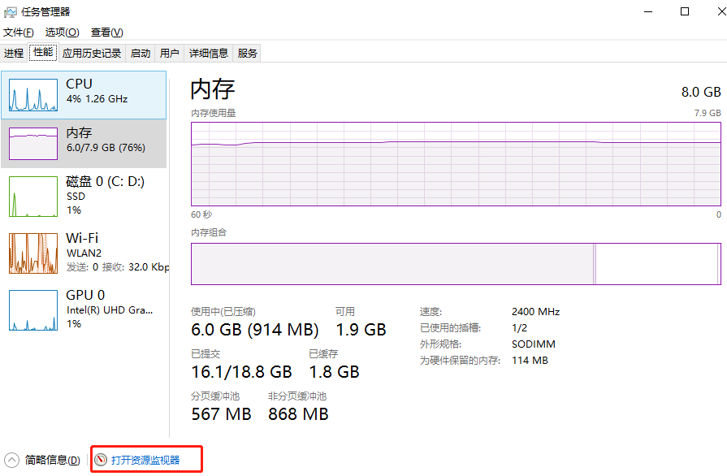
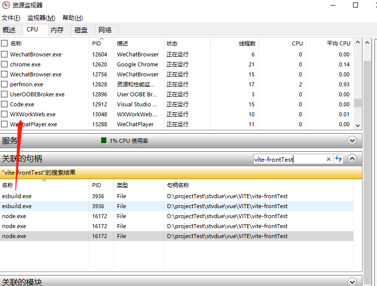

# windows删除文件时提示 操作无法完成

打开任务管理器，依次点击打开：性能 - 打开资源监视器- CPU, 关联的句柄 里输入部分/全部 文件名，搜索完就可在下面的搜索结果。

 

 

将关联的句柄名称 右击结束进程    就可以删除文件了

# windows查看端口号

```
  # 查看端口的使用情况
  netstat -aon|findstr 8080
  #根据端口对应的pid删除端口的进场
  taskkill /T /F /PID 12484
```

VS code

VSCode 同时选中多个相同字符 编辑Ctrl+D,Ctrl+Shift+L