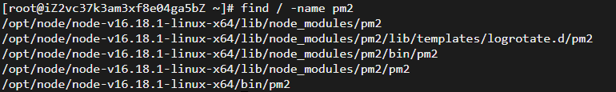
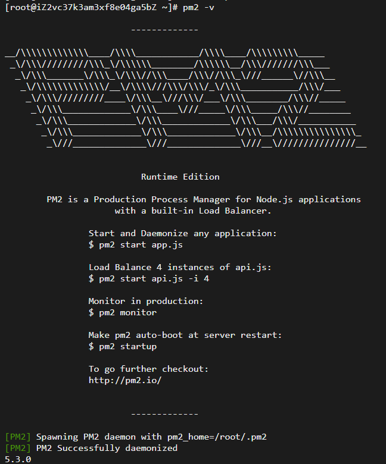

使用`npm`安装`pm2`

```shell
npm install pm2 -g
```

检查

```shell
pm2 -v
```

会发现报错：

```shell
-bash: pm2: command not found
```

使用软链接的方式解决

```shell
find / -name pm2
```

 

选择`/opt/node/node-v16.18.1-linux-x64/lib/node_modules/pm2/bin/pm2`作为软链接的路径

```shell
ln -s /opt/node/node-v16.18.1-linux-x64/lib/node_modules/pm2/bin/pm2 /usr/local/bin
```

查看是否生效：

```
pm2 -v
```

执行完上面的命令，会打印出下面的内容说明安装成功：

 