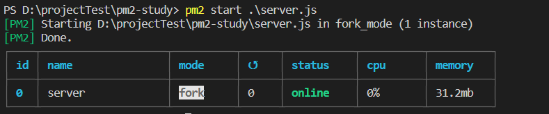
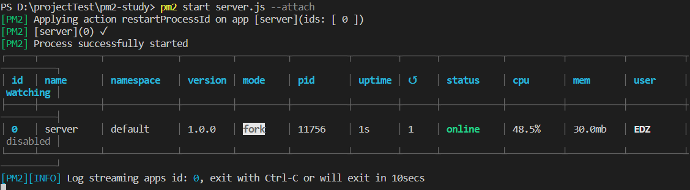
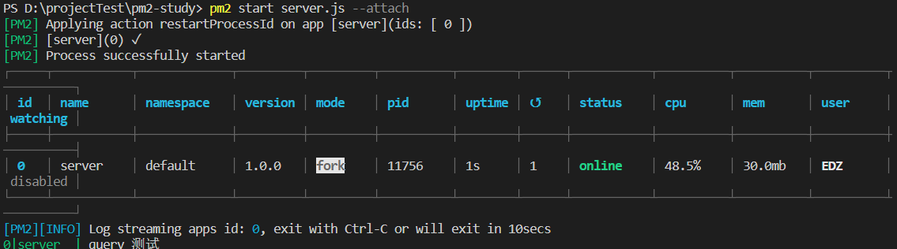
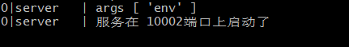
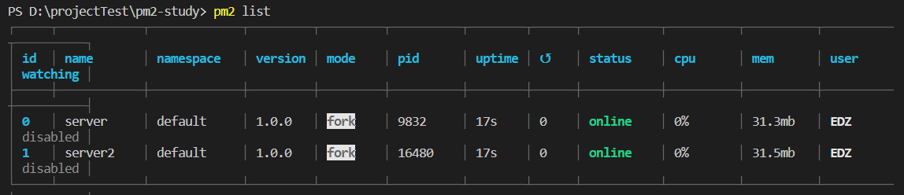
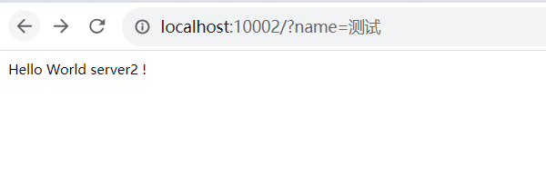
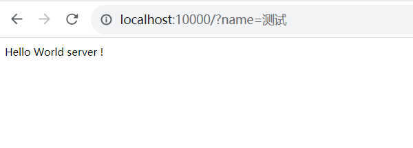
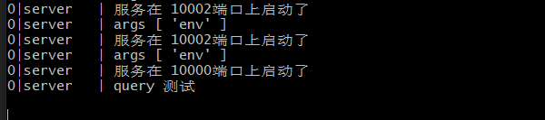
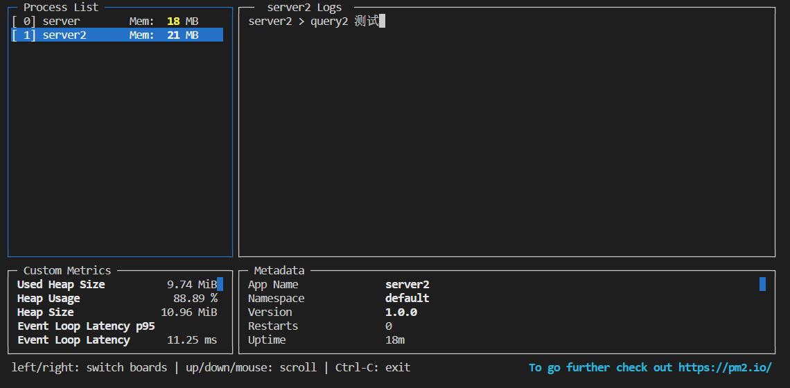
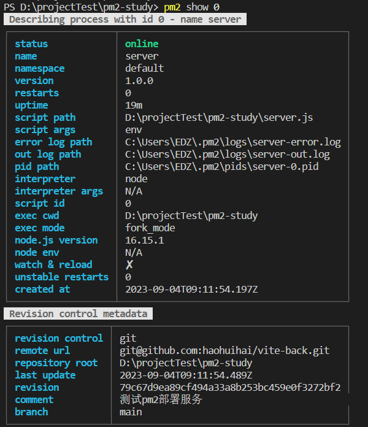

这里介绍基本的使用；通过node+express  或者http 搭建一个简单的服务；window电脑，在本地可以完全使用；

## 基本使用

一、通过`express`搭建服务

初始化`package.json`

```shell
npm init -y
```

安装`express`

```shell
npm install express --save
```

搭建`server`

```js
// server.js
const express = require('express');
const app = express();
const port = 10002

app.get('/', (req, res) => {
  console.log('query', req.query.name)
  res.send('Hello World!');
});

app.listen(port, () => {
  console.log(`服务在 ${port}端口上启动了`);
})
```

二、通过`http`搭建

搭建`server`

```js
// server.js
let http = require('http');
let users = [{id:1111,name:'zhufeng1'},{id:2222,name:'zhufeng2'},{id:3333,name:'zhufeng3'}];
let port = 10002;
let server = http.createServer(function(req,res){
  console.log(req.method,req.url);
  if(req.url == '/api/users'){
    res.setHeader('Access-Control-Allow-Origin','*');
    res.end(JSON.stringify(users));
  }else{
    res.end('Now Found!');
  }
});
server.listen(port, ()=>{
  console.log(`服务在 ${port} 端口上启动了`);
});
```

以第一种方式来演示pm2的使用；

### 启动服务

**最简单的启动方式**

```shell
pm2 start server.js
```

 

**以查看日志的方式在后台启动**

```shell
pm2 start server.js --attach
```

 

当用http://localhost:10002/?name=测试进行访问时；

 

**通过传参的方式启动服务**

使用 `--` 来分隔PM2命令和Node.js应用程序的参数

```shell
pm2 start api.js -- arg1 arg2
```

在server.js下添加如下内容

```js
const port = 10002
const args = process.argv.slice(2); // +
console.log("args", args)  // + 
app.get('/', (req, res) => {
  console.log('query', req.query.name)
  res.send('Hello World!');
});
```

通过上述命令重新启动，通过`pm2 log` 查看日志

 

```shell
nodemon .\server.js -- name=123
```

  

**通过配置文件来启动多个服务**

配置文件的名字默认为`ecosystem.config.js`，

```js
//ecosystem.config.js

module.exports = {
  apps : [{
    name   : "server",
    script : "./server.js",
    args   : "env"
  },{
    name   : "server2",
    script : "./server2.js",
    args   : "env2"
  }]
}
```

新增`server2.js`文件

```js
const express = require('express');
const app = express();
const port = 10002
const args = process.argv.slice(2);
console.log("args2", args)
app.get('/', (req, res) => {
  console.log('query2', req.query.name)
  res.send('Hello World  server2!');
});

app.listen(port, () => {
  console.log(`服务在 ${port}端口上启动了`);
})
```

修改`server.js`文件为下面代码

```js
const express = require('express');
const app = express();
const port = 10000
const args = process.argv.slice(2);
console.log("args", args)
app.get('/', (req, res) => {
  console.log('query', req.query.name)
  res.send('Hello World server !');
});

app.listen(port, () => {
  console.log(`服务在 ${port}端口上启动了`);
})
```


通过命令来启动这两个服务，通过`pm2 list` 来查看服务列表

 

进行访问：

  

  

查看日志：

 

### 查看应用程序

查看所有应用程序

```shell
pm2 list
```

通过排序的方式查看应用程序

```shell
pm2 list --sort [name|id|pid|memory|cpu|status|uptime][:asc|desc]
```

通过监控面板查看更为细致信息的应用程序

```shell
pm2 monit
```

 

查看应用程序数据

```shell
pm2 show [id | name]
```

 

### 重启应用程序

重启单个应用程序

```shell
pm2 restart server.js
```

重启所有应用程序：

```shell
pm2 restart all
```

重启多个应用程序：

```shell
pm2 restart app1 app3 app4
```

### 停止应用程序

停止单个应用程序

```shell
pm2 stop  [id | name]
```

停止所有

```shell
pm2 stop all
```

停止多个应用程序

```shell
pm2 stop app1 app3 app4
```

### 删除应用程序

删除单个应用程序

```shell
pm2 delete [id | name]
```

删除全部

```shell
pm2 delete all
```

### 重置进程计数器

```shell
pm2 reset all
```

## 重启策略

使用 `PM2` 启动应用程序时，应用程序会在自动退出、事件循环为空 (node.js) 或应用程序崩溃时自动重启

可以自己指定额外的重启策略：

**定时重启**

```shell
pm2 start server.js --cron-restart="0 0 * * *"

# 或者在重新启动应用程序时
$ pm2 restart app --cron-restart="0 0 * * *"
```

[Linux crontab命令](https://www.runoob.com/linux/linux-comm-crontab.html) 

配置文件中使用重启策略；

```js
module.exports = {
  apps : [{
    name: 'Business News Watcher',
    script: 'server.js',
    instances: 1,
    cron_restart: '0 0 * * *',
    env: {
      NODE_ENV: 'development'
    },
    env_production: {
      NODE_ENV: 'production'
    }
  }]
}
```

**文件更改时重启**

```shell
pm2 start server.js --watch
```

检测到当前目录或子目录的文件被修改时，PM2会自动重启

> 如果使用该`--watch`选项启动应用程序，停止应用程序不会阻止它在文件更改时重启。要完全禁用监听功能，请执行：`pm2 stop app --watch`或通过切换应用程序重启时的监听选项`pm2 restart app --watch`

在配置文件中使用

```js
module.exports = {
  script: "server.js",
  watch: true
}
```

您可以使用以下选项指定要监听更改的文件夹、忽略文件夹和监听文件间隔：

```js
module.exports = {
  script: "server.js",
  // 需要监听的目录
  watch: ["server", "client"],
  // 监听延迟
  watch_delay: 1000,
  // 忽略监听的目录
  ignore_watch : ["node_modules", "client/img"],
}
```

**基于内存的重启策略**

PM2 允许基于内存限制重新加载（如果不在集群中自动回退重启）应用程序，请注意 `PM2` 内部工作过程（检查内存）每 `30` 秒启动一次，因此您可能需要稍等片刻达到内存阈值后，进程会自动重启。

```shell
pm2 start server.js --max-memory-restart 300M
```

配置文件

```js
module.exports = {
  script: 'aserver.js',
  max_memory_restart: '300M'
}
```

> 单位可以是 `K(ilobyte)` (eg 512K)、`M(egabyte)` (eg 128M)、`G(igabyte)` (eg 1G)。

**延迟重启**

```shell
pm2 start server.js --restart-delay=3000
```

**不自动重启**

如果我们希望只运行 `1` 次脚本并且不希望进程管理器在脚本完成运行时重启我们的脚本。

```shell
pm2 start server.js --no-autorestart
```

配置文件

```js
module.exports = {
  script: 'app.js',
  autorestart: false
}
```

**故障重启**

有时您可能希望应用程序在出现故障时自动重启（即非零退出代码），而不希望进程管理器在其正常关闭时重启它（即退出代码等于 `0`）

将 `stop_exit_codes` 选项设置为退出应跳过自动重启的代码

```shell
pm2 start app.js --stop-exit-codes 0
```

配置文件

```js
module.exports = [{
  script: 'app.js',
  stop_exit_codes: [0]
}]
```

**指数式延迟重启**

在 `PM2` Runtime 上实施了新的重启模式，使您的应用程序以更智能的方式重启。当异常发生（例如数据库关闭）时，重启将增加重启之间的时间，减少您的数据库或外部供应商的压力，而不是疯狂地重新启动应用程序

```shell
pm2 start app.js --exp-backoff-restart-delay=100
```

配置文件

```js
module.exports = {
  script: 'app.js',
  exp_backoff_restart_delay: 100
}
```

当应用程序意外崩溃并`--exp-backoff-restart-delay`激活该选项时，您将能够看到一个新的应用程序状态等待重启。

通过运行，`pm2 logs`您还将看到重启延迟增加

```
PM2      | App [throw:0] will restart in 100ms
PM2      | App [throw:0] exited with code [1] via signal [SIGINT]
PM2      | App [throw:0] will restart in 150ms
PM2      | App [throw:0] exited with code [1] via signal [SIGINT]
PM2      | App [throw:0] will restart in 225ms
```

如您所见，重启之间的重启延迟将以指数移动平均线增加，直到达到重启之间的最大值 `15000` 毫秒。

当应用程序返回到稳定模式（正常运行时间不超过 `30` 秒）时，重启延迟将自动重置为 `0` 毫秒。