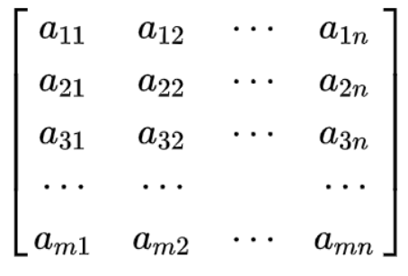
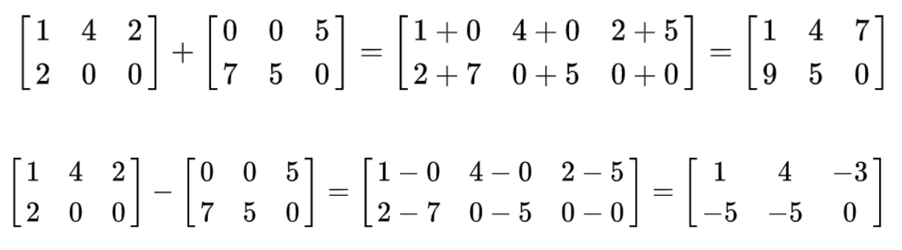
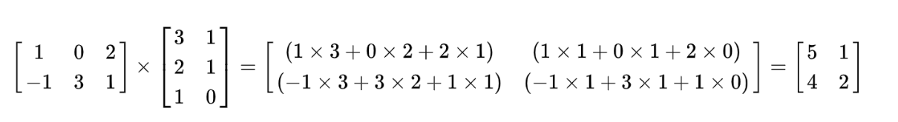

## 数组和矩阵

矩阵：矩阵（Matrix）是一个按照长方阵列排列的复数或实数集合。 (二维数组)
这 m×n 个数称为矩阵A的元素，简称为元，数aij 位于矩阵的第i行第j列

 

数组：不仅能表示1维、2维，还能表示多维数据，运算速度也更快，矩阵的扩展

**基本运算**

对于 加、减： 
1.矩阵  --> 必须要有相同的行数与列数
2.数组  --> 必须要有相同的行数与列数

对于 乘法：
1.数组 --> 必须要有相同的行数与列数
2.矩阵 --> 矩阵 A 的列数，必须与 矩阵B的行数 一致

矩阵A: 2 * 3
矩阵B: 3 * 2   --> 2 * 2

 

 

### 创建数组

在`python`中，操作数组需要引入`numpy` 包

有以下方法可以创建数组：

```
1.通过numpy array 函数，从python list中创建数组
2.通过numpy zeros 函数，创建全0数组
3.通过numpy ones 函数， 创建全1数组
4.通过numpy eye  函数， 创建单位数组
5.通过numpy arange函数，创建等间隔的数字数组
6.通过numpy random 函数，创建随机数组
```

```python
# numpy array
list_array = [1,2,3,4]
np.array(list_array)
#p array([1, 2, 3, 4])
np.array([list_array,list_array])
# array([[1, 2, 3, 4],
#        [1, 2, 3, 4]])
```

```python
# numpy zeros 全0数组
np.zeros(shape=(3,4))
# array([[0., 0., 0., 0.],
#        [0., 0., 0., 0.],
#        [0., 0., 0., 0.]])
```

```python
# numpy ones 全1数组
np.ones(shape=(3,4))
# array([[1., 1., 1., 1.],
#        [1., 1., 1., 1.],
#        [1., 1., 1., 1.]])
```

```python
# numpy eye 单位矩阵
np.eye(3,4)
#	array([[1., 0., 0., 0.],
#      	   [0., 1., 0., 0.],
#     	   [0., 0., 1., 0.]])
```

```python
# numpy arange
# np.arange step 支持浮点数
# python range   只支持整数
np.arange(1,10,0.5)
# array([1. , 1.5, 2. , 2.5, 3. , 3.5, 4. , 4.5, 5. , 5.5, 6. , 6.5, 7. , 7.5, 8. , 8.5, 9. , 9.5])
range(1,10,2)
# range(1, 10, 2)
```

```python
# numpy random 
# np.random.rand(10)    返回10个 0-1 之间的数据 [0,1)
# np.random.randn(10)   返回10个服从标准正态分布的数据
# np.random.randint(10) 返回0-9之间任意整数
np.random.rand(10)
# array([0.05795118, 0.16181434, 0.34243091, 0.78752398, 0.71465695,  0.69154032, 0.54064147, 0.67279132, 0.87984569, 0.15866257])

np.random.randn(10)
# array([-1.61939393,  0.33678362,  0.55901046, -0.02045677,  1.26378589,  0.52961214, -1.40742252, -0.72684933, -0.33783868,  1.15614354])

np.random.randint(10)
# 8
```

### 数组属性

```
ndim  ，查看数组维度 (一维、二维....)
shape ，查看数组的大小
size  ，查看数组元素的总数
dtype ，查看数据类型
```

```python
list_array = [1,2,3,4]
array_test = np.array([list_array,list_array])
array_test
# array([[1, 2, 3, 4],
#        [1, 2, 3, 4]])

array_test.ndim
# 2

array_test.shape
# (2, 4)

array_test.size
# 8

array_test.dtype
# dtype('int64')

np.array([1,2,3,4]).dtype
# dtype('int32')

np.array([1,2,3,4.0]).dtype
# dtype('float64')

a = np.arange(1,10).reshape(3,3)
# array([[1, 2, 3],
#        [4, 5, 6],
#        [7, 8, 9]])
```

访问数组

```python
b = np.array([[1,2,3]
             ,[4,5,6]
             ,[7,8,9]])
b[0][0]
# 1

b[0, 0]
# 1

b[1][1]
# 5

b[1:,1:]
# array([[5, 6],
#        [8, 9]])
```

### 基本操作

加减操作

```python
a = np.arange(1,10).reshape(3,3)
b = np.arange(1,10).reshape(3,3)
c = np.arange(1,13).reshape(3,4)

# a
array([[1, 2, 3],
       [4, 5, 6],
       [7, 8, 9]])
# b
array([[1, 2, 3],
       [4, 5, 6],
       [7, 8, 9]])
# c
array([[ 1,  2,  3,  4],
       [ 5,  6,  7,  8],
       [ 9, 10, 11, 12]])

# a + b
array([[ 2,  4,  6],
       [ 8, 10, 12],
       [14, 16, 18]])

# a - b
array([[0, 0, 0],
       [0, 0, 0],
       [0, 0, 0]])

# a - c
operands could not be broadcast together with shapes (3,3) (3,4) 
```

乘除操作

两数组对应的位相乘相除，数组之间的操作，维度需要一致

```python
# a * b
array([[ 1,  4,  9],
       [16, 25, 36],
       [49, 64, 81]])
```

```python
# a / b
array([[1., 1., 1.],
       [1., 1., 1.],
       [1., 1., 1.]])
```

矩阵之间的运算

矩阵 只能是二维
数组 可以是多个维度
矩阵是数组的子集

```python
matrix_a = np.matrix(a)
matrix_b = np.matrix(b)
```

```python
# matrix_a
matrix([[1, 2, 3],
        [4, 5, 6],
        [7, 8, 9]])

# matrix_b
matrix([[1, 2, 3],
        [4, 5, 6],
        [7, 8, 9]])
```

```python
# matrix_a + matrix_b
matrix([[ 2,  4,  6],
        [ 8, 10, 12],
        [14, 16, 18]])

# matrix_a - matrix_b 
matrix([[0, 0, 0],
        [0, 0, 0],
        [0, 0, 0]])

# 矩阵之间的乘法， d.dot(e)  其中d 的列数，必须与 e 的行数一致 
# 得到的结果是：d的行数的行 e的列数的列


d = np.matrix(np.arange(12).reshape(3,4))
e = np.matrix(np.arange(12).reshape(4,3))

# d
matrix([[ 0,  1,  2,  3],
        [ 4,  5,  6,  7],
        [ 8,  9, 10, 11]])

# e
matrix([[ 0,  1,  2],
        [ 3,  4,  5],
        [ 6,  7,  8],
        [ 9, 10, 11]])

# d.dot(e)
matrix([[ 42,  48,  54],
        [114, 136, 158],
        [186, 224, 262]])

```

如果违反“d 的列数，必须与 e 的行数一致”的规则，则会报下列错误：

```
shapes (3,4) and (3,4) not aligned: 4 (dim 1) != 3 (dim 0)
```

### 数组合并与分割

**数组合并**

```
np.concatenate 连接数组
axis = 0 垂直方向堆叠数组 所以列数需要一致
axis = 1 水平方向堆叠数组 所以行数需要一致
```

```python
a = np.arange(6).reshape(2,3)
b = np.arange(3).reshape(1,3)
c = np.arange(10).reshape(2,5)

# a
array([[0, 1, 2],
       [3, 4, 5]])
# b
array([[0, 1, 2]])
# c
array([[0, 1, 2, 3, 4],
       [5, 6, 7, 8, 9]])

np.concatenate([a,b], axis = 0)
array([[0, 1, 2],
       [3, 4, 5],
       [0, 1, 2]])

np.concatenate([a,c], axis = 1)
array([[0, 1, 2, 0, 1, 2, 3, 4],
       [3, 4, 5, 5, 6, 7, 8, 9]])

```

```
np.vstack()
vertical
垂直方向堆叠数组
两个数组，需要有相同的列数
```

```python
np.vstack([a,b])
array([[0, 1, 2],
       [3, 4, 5],
       [0, 1, 2]])
```

```
np.hstack()
Horizontal
水平方向堆叠数组
注意：两个数组，需要有相同的行数
```

```python
np.hstack([a,c])
array([[0, 1, 2, 0, 1, 2, 3, 4],
       [3, 4, 5, 5, 6, 7, 8, 9]])

```

**数组分割**

```
np.split()
indices_or_sections 

1.如果“索引或区段”是整数N，则数组将沿着“轴”被分成N个相等的数组。如果N无法整除，则会引发一个错误
 2. [2, 5]

  # ary[:2]
  # ary[2:5]
  # ary[5:]
    
axis 分割的轴，axis 默认为0
```

```python
ary = np.arange(9)
# array([0, 1, 2, 3, 4, 5, 6, 7, 8])
np.split(ary,[2,5])
# [array([0, 1]), array([2, 3, 4]), array([5, 6, 7, 8])]

```

```python
X = np.arange(16).reshape(4,4)

# X
array([[ 0,  1,  2,  3],
       [ 4,  5,  6,  7],
       [ 8,  9, 10, 11],
       [12, 13, 14, 15]])

np.split(X,2, axis=0)

[array([[0, 1, 2, 3],
        [4, 5, 6, 7]]),
 array([[ 8,  9, 10, 11],
        [12, 13, 14, 15]])]
np.split(X,2, axis=1)

[array([[ 0,  1],
        [ 4,  5],
        [ 8,  9],
        [12, 13]]),
 array([[ 2,  3],
        [ 6,  7],
        [10, 11],
        [14, 15]])]
```

### Numpy聚合运算

**单一聚合**

**多维度聚合**

**其他聚合**