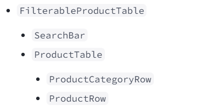

# React哲学中，讲了什么？

> 不谈详细的内容实现，总结以下开发过程中我们需要注意的事情

## 从原型到组件设计

拿到一个原型，我们不需要立刻去开发功能，而需要分析如何设计一个高质量的代码结构，即**高内聚，低耦合**，

将一个页面展示的内容可划分为不同的组件，通过组件来实现页面中的详细内容，即**用组件来创建界面**，

### 如何设计组件

React官方说：` a component should ideally only do one thing` 但也说了，` If it ends up growing, it should be decomposed into smaller subcomponents`  我们可以根据这个去设计组件，但是更细粒度应该到什么程度呢？这时候就看你的代码有多细了。

React官方给了一个例子，将一个功能划分为了有层次的组件，相同的结构放在了一起，组成了下面的组件树，

 

拆分为这种结构，我们不需要写出很多冗余的代码，而组件之间也不存在很强的依赖，也就实现了高内聚，低耦合的设计思路。

## 静态代码实现

有了组件结构，我们就需要去实现静态功能了，在开发前期我们可以MOCK来达到和线上环境类似的效果。

那么从哪下手呢？React给了一个小建议，` In simpler examples, it’s usually easier to go top-down, and on larger projects, it’s easier to go bottom-up.`


而在这一步，不需要实现交互功能，所以暂时不使用state

## 什么时候需要state

state是什么，不是这里需要说的，我们只需要知道`state`应该在什么情况下出现，以下均是指`hooks`中的`state`。

React官方说：

- 随着时间推移保持不变的，它不是`state`。 可以是常量.
- 可通过父组件传递的 `props`，它不是`state`。`props`实现父子组件的通信.
- 如果是基于state或者props计算得到的，它不是`state`.
- 如果不需要变量实时变化反馈到页面上的，它不是state(这是我加的🤭)

在这里案例里面，搜索文本是state，复选框的值是state，他们两都会通过时间的推移而变化并且无法从任何东西中计算出来。

## state在哪里声明

React官方说：

- 基于state验证渲染内容的每一个组件
- 寻找共有state组件的父组件，并在他们的父组件上定义state

我们在第一步已经将一个页面拆分为不同的组件，可以看到`ProductCategoryRow`和`ProductRow`这两个组件中都使用到了input关键字，那么对input中的值可以提取为一个`state`，而这又是这两组件共有的`state`，因此可以将它提到父组件（`ProductTable`）中去，通过props来传递它。

## React数据流向

React数据流向通常是由父组件到子组件，子组件依赖父组件的状态，通过子组件调用父组件的方法去修改状态，然后再传递给子组件，这便是React组件的数据流向。

在这个例子这，state是定义在了`ProductTable`组件里面，直接修改内容也应该在这个组件中，但是我们需要操作修改的事件又在`SearchBar`组件中，所以需要定义一个方法去修改父组件state，然后在传递给其他需要的子组件里面，完成页面的渲染。

## React组件

当一个页面中有相似结构的UI时，我们可以将这一部分抽出来，以便其他地方引用，抽出来的内容重新组合成一个整体，可以抽象为组件。

### 定义和使用组件

在React的函数中，我们定义一个函数，这个函数返回DOM元素，最后我们将这个函数导出，导出的内容就是一个组件。

```jsx
export default function Profile() {
    return <h1>我是h1标签</h1>
}
```

`Profile`函数返回了DOM元素，我们将`h1`元素抽象为了组件，可以在其他地方使用

**注意：**

我们发现上面定义的函数，是以大写字母`P`开头的；我们可以设置为小写字母开头吗？

React官方：

React components are regular JavaScript functions, but **their names must start with a capital letter** or they won’t work!

验证发现：

1. 我们在定义一个函数组件时，函数名约定使用首字母大写来表示一个组件。
2. 使用函数组件时，我们必须使用首字母大写来表示一个组件，否则不生效

```jsx
export default function Profile() {
    return <h1>我是h1标签</h1>
}
```

```jsx
import Profile from './Profile' // 正确写法
import profile from './Profile' // 错误写法
function App() {
  return (
    <div className="App">
     	<Profile />  // 正确
     	<profile />  // 错误
    </div>
  );
}

export default App;
```

在React中，编译时将首字母大写的表示为自定义组件，而首字母小写代表是标签

一个函数组件，若返回多个元素，则需要使用空标签或者`<fragment > `进行包裹，`return`始终返回一个元素

当返回的元素和`return`不在同一行时，我们可以使用`()` 包裹起来，以免`return`的下一行代码被忽略

```jsx
export default function Profile() {
  // 错误写法
  return 
  <h1>h1标题</h1>
  // 下面两种均为正确写法
   return <h1>h1标题</h1>
   
   return (
    <h1>h1标题</h1>
   )
}
```


### 嵌套组件

对于函数组件中，不要在函数组件中定义新的组件。

```jsx
export default function Gallery() {
  // 🔴 永远不要在组件中定义组件
  function Profile() {
    // ...
  }
  // ...
}
```

React官方说，这种写法会很慢，并且导致产生bug，应该将新定义的组件放在顶层

```jsx
export default function Gallery() {
  // ...
}

// ✅ 在顶层声明组件
function Profile() {
  // ...
}
```

在同一个文件里面，我们可以存放多个组件，在导出时也可以使用具名导出和默认导出，在导入时也可以使用具名导入和默认导入；

在React中提到了默认导出和具名导出的区别：

通过React官方提供的图来说明：

 

即：

| 语法 | 导出语句                              | 导入语句                                |
| ---- | ------------------------------------- | --------------------------------------- |
| 默认 | `export default function Button() {}` | `import Button from './Button.js';`     |
| 具名 | `export function Button() {}`         | `import { Button } from './Button.js';` |

通常，文件中仅包含一个组件时，人们会选择默认导出，而当文件中包含多个组件或某个值需要导出时，则会选择具名导出。我们在定义组件的时候，应该和项目的规范一致使用导出方式；

## 纯函数

相同的输入，得到相同的输入；这便是一个组件的设计原则

为什么需要这样做：

组件会在我们不确定的情况下重新渲染，我们输入相同的数据，他总会得到相同的结果，但是存在另外的干扰因素，会导致我们的页面出现意想不到的bug。即变化的都应该是我们所操作的结果；

## state

当我们在一个组件里面定义普通变量时：

1. **局部变量无法在多次渲染中持久保存。** 当 React 再次渲染这个组件时，它会从头开始渲染——不会考虑之前对局部变量的任何更改。
2. **更改局部变量不会触发渲染。** React 没有意识到它需要使用新数据再次渲染组件

如果我们需要更新数据后渲染页面，则需要使用到`state`，有以下原因：

1. 每次组件渲染后，总是能保留渲染之间的数据
2. 修改`state`变量时，可以触发组件重新渲染

以下时使用`state`的方法

```js
const [index, setIndex] = useState(0)
```

在这里，`useState`总是返回两项，变量和修改变量值的方法名

> **以 `use` 开头的函数——只能在组件或[自定义 Hook](https://react.docschina.org/learn/reusing-logic-with-custom-hooks) 的最顶层调用**

你不能在条件语句、循环语句或其他嵌套函数内调用 Hook

为什么时`state`，上面已说，初始化和更新`state`时发生了什么？

```js
const [index, setIndex] = useState(0)
```

1. **组件进行第一次渲染。** 因为你将 `0` 作为 `index` 的初始值传递给 `useState`，它将返回 `[0, setIndex]`。 React 记住 `0` 是最新的 state 值。

2. **更新了 state**。当用户点击按钮时，它会调用 `setIndex(index + 1)`。 `index` 是 `0`，所以它是 `setIndex(1)`。这告诉 React 现在记住 `index` 是 `1` 并触发下一次渲染。

3. **组件进行第二次渲染**。React 仍然看到 `useState(0)`，但是因为 React *记住* 了你将 `index` 设置为了 `1`，它将返回 `[1, setIndex]`。

## props

`props`作为父子组件的一个通道，来传递方法、变量给子组件；
props不只是接收了父组件传递的方法、变量，还传递了浏览器相关的API；

子组件传递一个方法给父组件：让父组件去做一些事情；
上面的做法是有前提的；我们在页面上看到的是数据；可以将一个页面分为看见的数据，看不见的操作内部逻辑

我们定义变量时，在父子组件都可以定义，我们针对数据的共享来判断变量定义的位置

如果有父  子1， 子2 组件树结构的组件，在子1，子2中存在共有的数据，可以将数据放到父组件，从父组件通过props传播到需要的组件中

如果在子1组件上定义事件，来操作子1和子2共享的数据，那么也是通过父组件传递事件到子组件中，让子组件触发父组件的事件去改变数据；


父组件

```jsx
import Son from './Son.js'
function Perosn() {
  const [count, setCount] = useState(0)
  handleAdd() {
    setCount(count + 1)
  }
  return (
    <SonFirst count={count}/>
    <Son handleAdd="handleAdd" count={count}/>

  )
}
```

子组件

```jsx
function Son(props) {
  const { handleAdd, count } = props;
  return(<>
    <button onClick="handleAdd">加1</button>
    <span>Son组件 {count}</span>
  </>)
}
```

```jsx
function SonFirst(props) {
  const { count } = props;
  return(<>
    <span>SonFirst组件{count}</span>
  </>)
}
```

