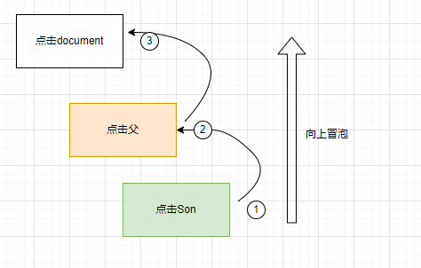
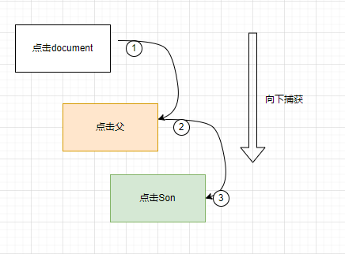

## React事件

#### react支持的事件

#### 事件捕获与冒泡

**事件冒泡**

```js
import { useEffect } from 'react'
import './index.less';
function Test() {
  useEffect(() => {
    document.addEventListener('click', (e) => {
      console.log(`document`);
    })
    return () => {
      document.removeEventListener('click', () => { })
    }
  }, [])
  function handleFather(e) {
    console.log(`handleFather`)
  }
  function handdleSon(e) {
    console.log(`handdleSon`)
  }

  return (
    <div onClick={handleFather} className="fatherStyle">
      <div onClick={handdleSon} className="sonStyle">点击Son</div>
    </div>
  );
}
export default Test
```

点击handdleSon事件，依次打印一下：

```
handdleSon
handleFather
document
```

由此可以看出，事件执行过程是从子--->父--->根 

这就出现了事件流的概念：

事件流也被称为IE事件流，简单来说，最先触发被点击的那个，然后，点击事件然后沿DOM一路向上，在经过的每个节点上依次触发，直至道达document对象，现代浏览器可达window对象

 

官方的解释：

 

**事件捕获**

事件捕获的意思是最不具体的节点应该最先收到事件，而最具体的节点应该最后收到事件;

对于上面的例子使用事件捕获，则执行顺序是
document
handleFather
handdleSon

在事件捕获过程种，事件首先由document元素捕获，然后沿DOM树依次向下传播。直至到达目标元素

 

这里还有一个官方**事件流的概念**：

DOM2 Events规范规定事件流分为3个阶段：事件捕获、到达目标和事件冒泡。事件捕获最先发生，为提前拦截事件提供了可能。然后，实际的目标元素接收到事件。最后一个阶段是冒泡，最迟要在这个阶段响应事件（也就是上面说的判断是否注册了事件）

 


在DOM事件流中，实际的目标（`<div>`元素）在捕获阶段不会接收到事件。这是因为捕获阶段从document到`<html>`再到`<body>`就结束了。下一阶段，即会在`<div>`元素上触发事件的“到达目标”阶段，然后，冒泡阶段开始，事件反向传播至文档。

### 在react中阻止冒泡的三种方式

- e.stopPropagation()
- e.nativeEvent.stopImmediatePropagation()
- 通过e.target来判断

先来看react的合成事件和原生事件

原生事件：类似通过`addEventListener`来监听的这种

```js
document.addEventListener('click', () => {
    console.log(`document`);
})
```

合成事件：直接写在dom标签内的

```html
 <div onClick={handdleSon} className="sonStyle">点击Son</div>
```

参考代码：

```javascript
import { useEffect } from 'react'
import './index.less';
function Test() {
  useEffect(() => {
    document.addEventListener('click', (e) => {
      console.log(`document`);
    })
    return () => {
      document.removeEventListener('click', () => { })
    }
  }, [])
    
  function handleFather(e) {
    console.log(`handleFather`)
  }
    
  function handdleSon(e) {
    e.stopPropagation()
    console.log(`handdleSon`)
  }

  return (
    <div onClick={handleFather} className="fatherStyle">
      <div onClick={handdleSon} className="sonStyle">点击Son</div>
    </div>
  );
}
export default Test
```

（1）当子事件这样写：

```js
function handdleSon(e) {
    e.stopPropagation()
    console.log(`handdleSon`)
}
```

打印输出的是：
handdleSon

（2）当子事件这样写：

```js
function handdleSon(e) {
   e.nativeEvent.stopImmediatePropagation();
    console.log(`handdleSon`)
}
```

打印输出的是：
handdleSon
handleFather

**总结：**

` e.stopPropagation()`能阻止两个合成事件冒泡、合成和原生事件冒泡

`e.nativeEvent.stopImmediatePropagation()`能阻止合成和原生事件间的冒泡，不能阻止两个合成事件之间的冒泡

要想阻止<u>合成事件</u>和<u>原生事件</u>，可以用`e.stopPropagation()`或`e.nativeEvent.stopImmediatePropagation()`

要阻止<u>两个合成事件</u>的冒泡。可以用`e.stopPropagation()`

阻事件冒泡，也可以用e.target来判断

点击事件的子元素可以修改为

```html
 <a onClick={handdleSon} className="sonStyle">点击Son</a>
```

上面的`useEffect`里面的代码可以写为

```js
useEffect(() => {
    document.addEventListener('click', (e) => {
        // 这里匹配的标签名
        if(e.target && e.target.matchs('a')) return;
        console.log('document')
    })
    return () => {
        document.removeEventListener('click', () => { })
    }
}, [])
```

这样就可以阻止打印出document

### 在react中阻止事件捕获

给需要捕获的元素将`onClick`改为`onClickCapture`

其中代码修改为以下：

```js
import { useEffect } from 'react'
import './index.less';
function Test() {
    useEffect(() => {
        document.addEventListener('click', () => {
            console.log(`document`);
        })
        return () => {
            document.removeEventListener('click', () => { })
        }
    }, [])
    function handleFather(e) {
        console.log(`handleFather`)
    }
    function handdleSon(e) {
        console.log(`handdleSon`)

    }

    return (
        <div onClickCapture={handleFather} className="fatherStyle">
        <div onClick={handdleSon} className="sonStyle">点击Son</div>
</div>
);
}
export default Test
```

一步步来看，先将父onClick修改为onClickCapture

```html
<div onClickCapture={handleFather} className="fatherStyle">
    <div onClick={handdleSon} className="sonStyle">点击Son</div>
</div>
```

点击子元素节点，打印：

```
handleFather
handdleSon
document
```

根据上面说的捕获与冒泡分析以下

点击了子元素，最先触发了document，然后父元素，在父元素这里进行了捕获，那么先触发父元素，然后子元素，在到document，如果这里只触发父元素改怎么做，只需要在父元素这里加上阻止事件冒泡即可：

```js
 function handleFather(e) {
    e.stopPropagation() 
    console.log(`handleFather`)
 }
```

此时打印出来：

```
handleFather
```

如果向在document这里拦截，这么做：

```js
useEffect(() => {
    document.addEventListener('click', (e) => {
        e.stopPropagation() // 阻止冒泡
    }, true) // 第三个参数，阻止捕获
    return () => {
        document.removeEventListener('click', () => { })
    }
}, [])

 function handleFather(e) {
    console.log(`handleFather`)
  }

  function handdleSon(e) {
    console.log(`handdleSon`)
  }
```

## React生命周期

生命周期用在类组件里面，函数组件里面可以使用`useEffect`，主要介绍常用的生命周期

按照创建，更新，销毁来调用

**创建时**

```
constructor
render
componentDidMount
```

**更新时**

```
shouldComponentUpdate
render
componentDidUpdate
```

**销毁时**

```
componentWillUnmount
```

