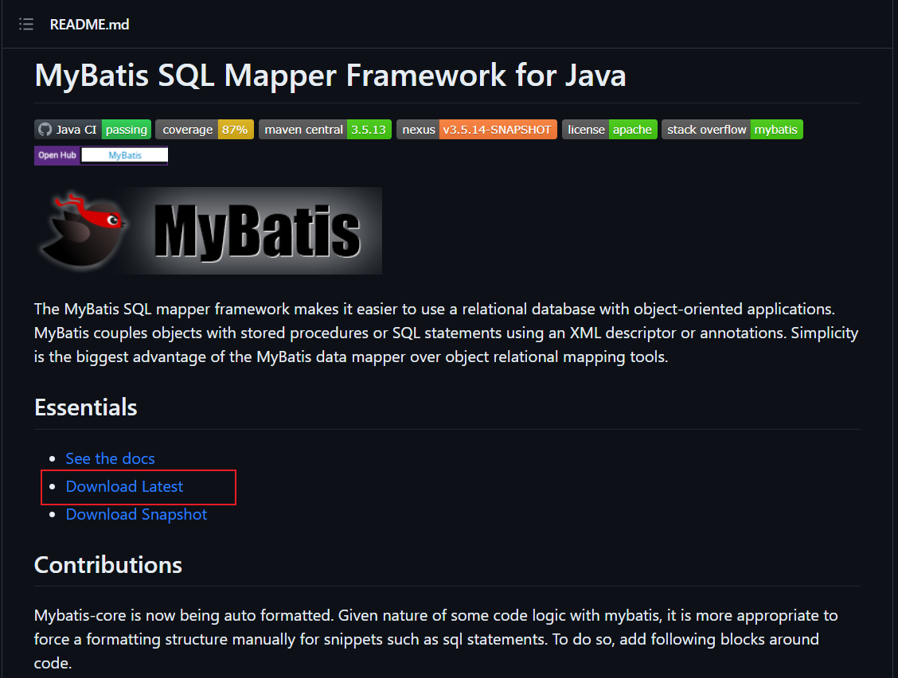
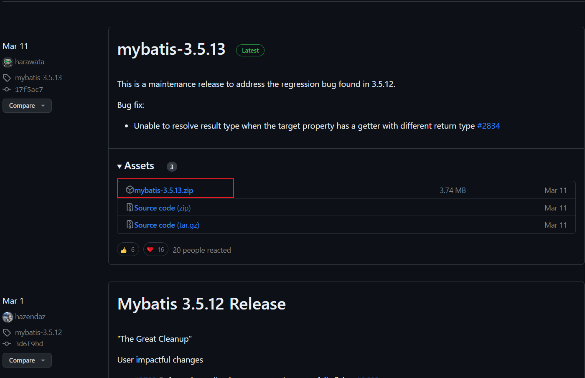
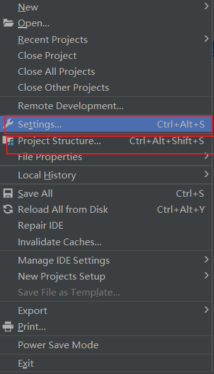
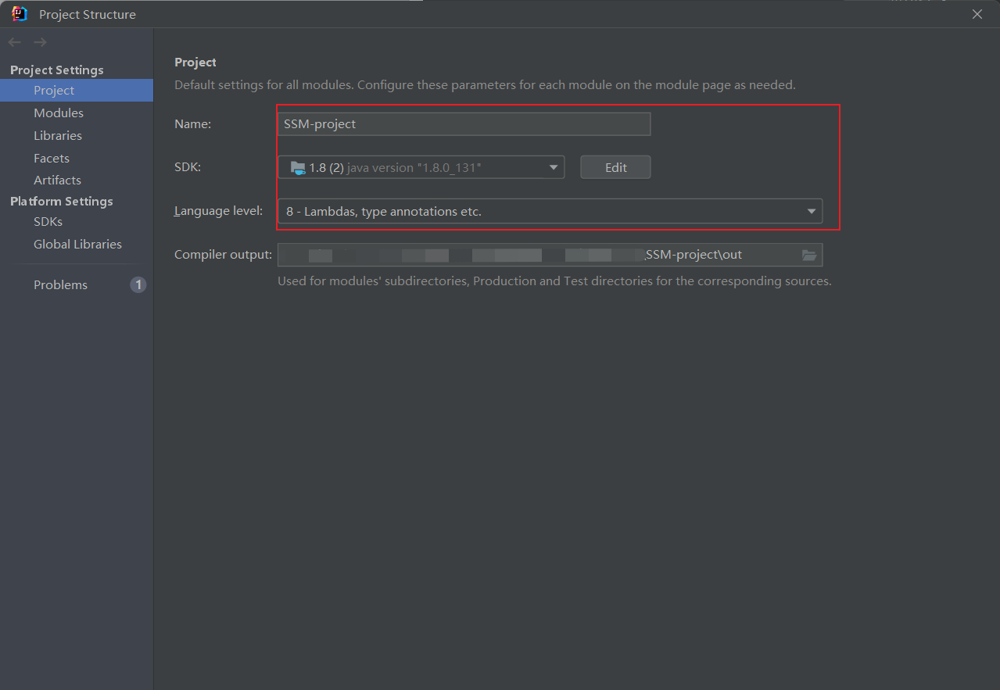
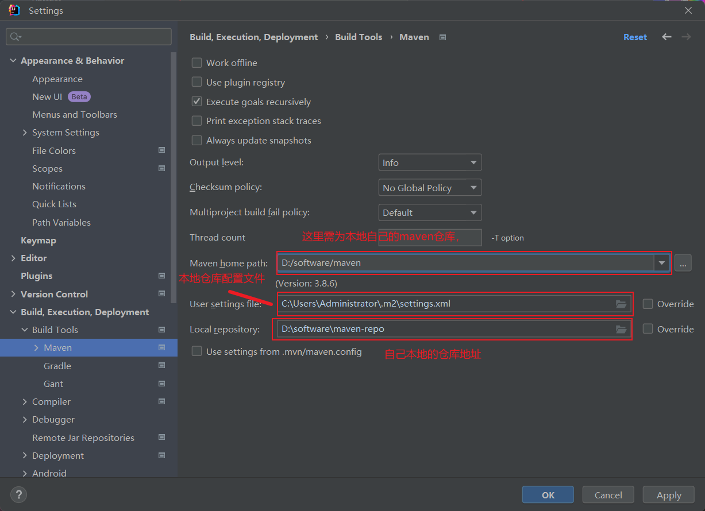
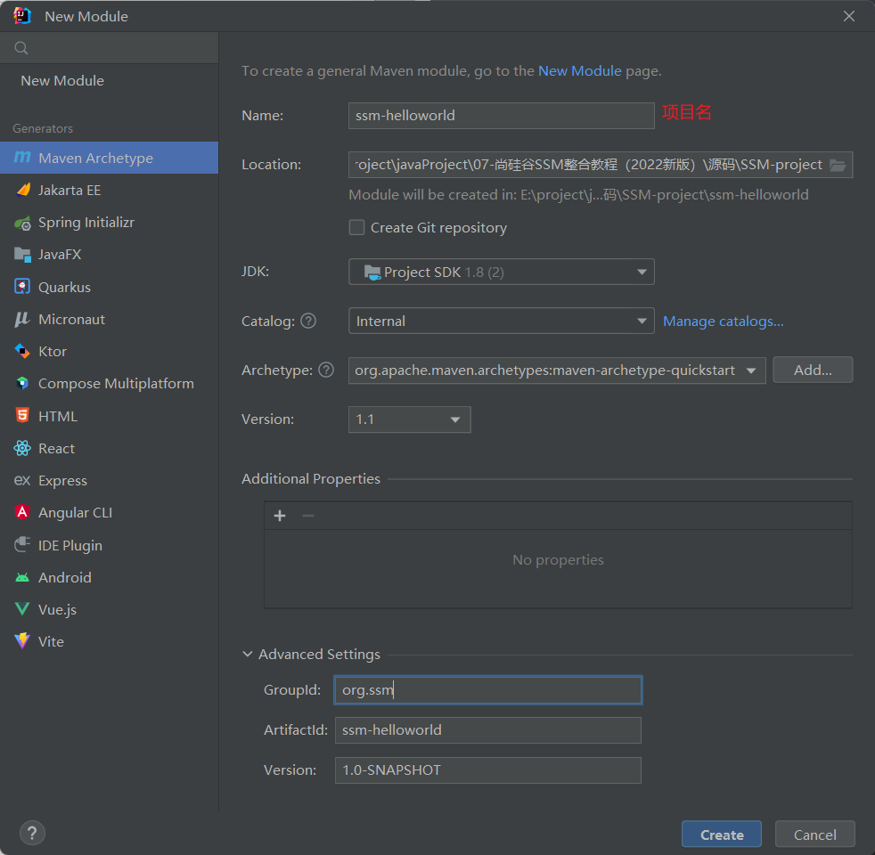
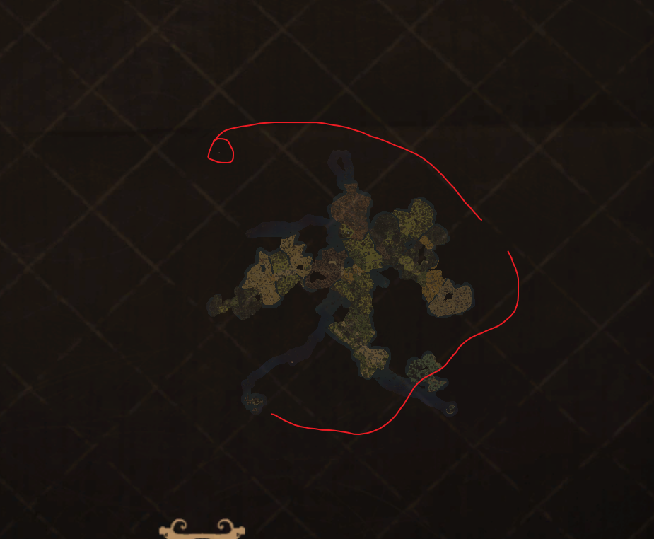

**MyBatis下载**

MyBatis下载地址：https://github.com/mybatis/mybatis-3

 

 

创建Maven工程

新建SSM目录，在此目录下创建maven工程

创建之前分别检查配置

 

 

 

 

点击Create创建后，在pom.xml中引入依赖

```xml
<dependencies>
<!-- Mybatis核心 -->
    <dependency>
        <groupId>org.mybatis</groupId>
        <artifactId>mybatis</artifactId>
        <version>3.5.7</version>
    </dependency>
<!-- junit测试 -->
    <dependency>
        <groupId>junit</groupId>
        <artifactId>junit</artifactId>
        <version>4.12</version>
        <scope>test</scope>
    </dependency>
<!-- MySQL驱动 -->
	<dependency>
        <groupId>mysql</groupId>
        <artifactId>mysql-connector-java</artifactId>
        <version>8.0.16</version>
    </dependency>
</dependencies>
```

**1、创建MyBatis的核心配置文件**

mybatis配置文件的命名可以随意起，但建议名字能够一眼看出来是做什么的，这个配置文件项目不会自动的引入，我们在运行代码的时候自己引入的，所以随意起都可以。

配置文件的内容主要是配置连接数据库的环境以及MyBatis的全局配置信息

核心配置文件存放的位置是src/main/resources目录下

**2、创建mapper接口**

MyBatis中的mapper接口相当于以前的dao。但是区别在于，mapper仅仅是接口，我们不需要提供实现类。

```java
public interface UserMapper {
    /**
    * 添加用户信息
    */
    int insertUser();
}
```

**3、创建MyBatis的映射文件**

相关概念：**ORM**（**O**bject **R**elationship **M**apping）对象关系映射。

对象：Java的实体类对象

关系：关系型数据库

映射：二者之间的对应关系

| Java | 数据库  |
| ---- | ------- |
| 类   | 表      |
| 属性 | 字段    |
| 对象 | 行/记录 |

映射文件命名规则

1、映射文件的命名规则：

表所对应的实体类的类名+Mapper.xml

例如：表t_user，映射的实体类为User，所对应的映射文件为UserMapper.xml

因此一个映射文件对应一个实体类，对应一张表的操作

MyBatis映射文件用于编写SQL，访问以及操作表中的数据

MyBatis映射文件存放的位置是src/main/resources/mappers目录下

2、 MyBatis中可以面向接口操作数据，要保证两个一致：

a>mapper接口的全类名和映射文件的命名空间（namespace）保持一致

b>mapper接口中方法的方法名和映射文件中编写SQL的标签的id属性保持一致

```xml
<?xml version="1.0" encoding="UTF-8" ?>
<!DOCTYPE mapper
        PUBLIC "-//mybatis.org//DTD Mapper 3.0//EN"
        "http://mybatis.org/dtd/mybatis-3-mapper.dtd">
<mapper namespace="com.hhh.mybatis.mapper.UserMapper">
    <!--int insertUser();-->
    <insert id="insertUser">
        insert into t_user values(null,'admin','123456',23,'男','12345@qq.com')
    </insert>
</mapper>
```

在核心配置文件中引入映射文件

```xml
<!--引入mybatis的映射文件-->
<mappers>
    <package name="com.hhh.mybatis.mapper"/>
</mappers>
```


**4、通过junit测试功能**

```java
@Test
public void testInsert() throws IOException {
    //获取核心配置文件的输入流
    InputStream is = Resources.getResourceAsStream("mybatis-config.xml");
    //获取SqlSessionFactoryBuilder对象
    SqlSessionFactoryBuilder sqlSessionFactoryBuilder = new SqlSessionFactoryBuilder();
    //获取SqlSessionFactory对象
    SqlSessionFactory sqlSessionFactory = sqlSessionFactoryBuilder.build(is);
    //获取sql的会话对象SqlSession(不会自动提交事务)，是MyBatis提供的操作数据库的对象
    //SqlSession sqlSession = sqlSessionFactory.openSession();
    //获取sql的会话对象SqlSession(会自动提交事务)，是MyBatis提供的操作数据库的对象
    SqlSession sqlSession = sqlSessionFactory.openSession(true);
    //获取UserMapper的代理实现类对象
    UserMapper mapper = sqlSession.getMapper(UserMapper.class);
    //调用mapper接口中的方法，实现添加用户信息的功能
    int result = mapper.insertUser();
    //提供sql以及的唯一标识找到sql并执行，唯一标识是namespace.sqlId
    /*int result = sqlSession.insert("com.hhh.mybatis.mapper.UserMapper.insertUser");*/
    System.out.println("结果："+result);
    //提交事务
    //sqlSession.commit();
    //关闭SqlSession
    sqlSession.close();
}
```

**5、关系配置表**


**MyBatis的无参增删改查**

**新增**

```java
UserMapper 接口
init insertUser()
```

```xml
 UserMapper.xml
<insert id="insertUser">
    insert into t_user values(null,'admin','123456',23,'男','12345@qq.com')
</insert>
```

```java
测试文件...
int result = mapper.insertUser();
```

删除

```java
int deleteUser();
```

```xml
<delete id="deleteUser">
	delete from t_user where id=7
</delete>
```

```java
mapper.deleteUser()
```

修改

```java
int updateUser();
```

```xml
<update>
	update t_user set username='ceshi', password='123' where id = 1
</update>
```

```java
mapper.updateUser()
```

查询实体类对象

```java
import org.ssm.batis.model.User;
User getUserById();
```

```xml
<select id="getUserById" resultType="org.ssm.batis.model.User">
	select * from t_user where id = 2
</select>
```

```java
import org.ssm.batis.model.User;
User user = mapper.getUserById();
```

查询list集合

```java
import org.ssm.batis.model.User;
List<User> getUserList();
```

```xml
<select id="getUserList" resultType="org.ssm.batis.model.User">
	select * from t_user
</select>
```

注意：

1、查询的标签select必须设置属性resultType或resultMap，用于设置实体类和数据库表的映射关系

resultType：自动映射，用于属性名和表中字段名一致的情况

resultMap：自定义映射，用于一对多或多对一或字段名和属性名不一致的情况

**MyBatis获取参数值的两种方式**

MyBatis获取参数值的两种方式：**${}**和**#{}**

${}的本质就是字符串拼接，#{}的本质就是占位符赋值

${}使用字符串拼接的方式拼接sql，若为字符串类型或日期类型的字段进行赋值时，需要手动加单引号；但是#{}使用占位符赋值的方式拼接sql，此时为字符串类型或日期类型的字段进行赋值时，可以自动添加单引号

1**、若**mapper**接口方法的参数为单个的字面量类型**

此时可以通过**#{}**和**${}**以任意的内容获取参数值，一定要注意**${}**的单引号问题

```java
User getUserByUsername(String username);
```

```xml
<select id="getUserByUsername" resultType="User">
    <!--select * from t_user where username = #{username}-->
    select * from t_user where username = '${username}'
</select>
```

```java
  User user = mapper.getUserByUsername("admin");
```


**2、若**mapper**接口方法的参数为多个的字面量类型
此时**MyBatis**会将参数放在**map集合中，以两种方式存储数据

a > 以**arg0,arg1...**为键，以参数为值
 b>**以**param1,param2...**为键，以参数为值
因此，只需要通过**#{}**和**${}**访问**map**集合的键，就可以获取相对应的值**,**一定要注意**${}**的单引号问题**

```java
 User checkLogin(String username, String password);
```

```xml
<select id="checkLogin" resultType="User">
    <!--select * from t_user where username = #{param1} and password = #{param2}-->
    select * from t_user where username = '${param1}' and password = '${param2}'
</select>
```

```java
User user = mapper.checkLogin("admin", "123456");
```

 3**、若**mapper**接口方法的参数为**map集合类型的参数
只需要通过#{}和${}访问map集合的键，就可以获取相对应的值,一定要注意${}的单引号问题

```java
User checkLoginByMap(Map<String, Object> map);
```

```xml
<select id="checkLoginByMap" resultType="User">
	select * from t_user where username=#{username} amd password=#{password}
</select>
```

```java
Map<String, Object> map=new HashMap<>();
map.put("username", "admin");
map.put("password", "123");
User user = mappper.checkLoginByMap(map);
```

 4**、若**mapper接口方法的参数为实体类类型的参数

只需要通过**#{}**和**${}**访问实体类中的属性名，就可以获取相对应的属性值，一定要注意**${}**的单引号问题

```java
void insertUser(User user);
```

```xml
<insert id="insertUser">
	insert into t_user values(null, #{username}, #{password}, #{age}, #{gender}, #{email})
</insert>
```

```java
User user = new User(null, "root", "123456", 33, "女", "123@qq.com")
mapper.insertUser(user)
```

5**、可以在**mapper**接口方法的参数上设置**@Param**注解
此时MyBatis**会将这些参数放在map中，以两种方式进行存储
 a>以@Param**注解的**value属性值为键，以参数为值
 b>以param1,param2...为键，以参数为值
只需要通过**#{}**和**${}**访问**map**集合的键，就可以获取相对应的值**,**一定要注意**${}**的单引号问题

```java
User checkLoginByParam(@Param("username") String username, @Param("password") String password);
```

```xml
<select id="checkLoginByParam" resultType="User">
    select * from t_user where username = #{username} and password = #{password}
</select>
```

```java
User user = mapper.checkLoginByParam("admin", "123456");
```


**MyBatis****的各种查询功能**

**查询一个实体类对象**

```java
/**
* 根据用户id查询用户信息
* @param id
* @return
*/
User getUserById(@Param("id") int id);
```

```xml
<!--User getUserById(@Param("id") int id);-->
<select id="getUserById" resultType="User">
	select * from t_user where id = #{id}
</select>
```

```java
User user = mapper.getUserById(1);
```

**查询一个list集合**

```java
/**
* 查询所有用户信息
* @return
*/
List<User> getUserList();
```

```xml
<select id="getUserList" resultType="User">
	select * from t_user
</select>
```

```java
List<User> list = mapper.getAllUser();
```


当查询的数据为多条时，不能使用实体类作为返回值，否则会抛出异常TooManyResultsException；

但是若查询的数据只有一条，可以使用实体类或集合作为返回值

**查询单个数据**

```java
/**
* 查询用户的总记录数
* @return
* 在MyBatis中，对于Java中常用的类型都设置了类型别名
* 例如： java.lang.Integer-->int|integer
* 例如： int-->_int|_integer
* 例如： Map-->map,List-->list
*/
int getCount();
```

```xml
<select id="getCount" resultType="_integer">
	select count(id) from t_user
</select>
```

```java
Integer count = mapper.getCount();
```

**查询一条数据为map集合**

```java
/**
* 根据用户id查询用户信息为map集合
* @param id
* @return
*/
Map<String, Object> getUserToMap(@Param("id") int id);
```

```xml
<!--结果： {password=123456, sex=男 , id=1, age=23, username=admin}-->
<select id="getUserToMap" resultType="map">
	select * from t_user where id = #{id}
</select>
```

```java
Map<String, Object> map = mapper.getUserToMap(4);
```

**查询多条数据为map集合**

方式一

```java
/**
* 查询所有用户信息为map集合
* @return
* 将表中的数据以map集合的方式查询，一条数据对应一个map；若有多条数据，就会产生多个map集合，此
时可以将这些map放在一个list集合中获取
*/
List<Map<String, Object>> getAllUserToMap();
```

```xml
<!--Map<String, Object> getAllUserToMap();-->
<select id="getAllUserToMap" resultType="map">
select * from t_user
</select>
```

```java
List<Map<String, Object>> list = mapper.getAllUserToMap();
```

方式二

```java
/**
* 查询所有用户信息为map集合
* @return
* 将表中的数据以map集合的方式查询，一条数据对应一个map；若有多条数据，就会产生多个map集合，并
且最终要以一个map的方式返回数据，此时需要通过@MapKey注解设置map集合的键，值是每条数据所对应的
map集合
*/
@MapKey("id")
Map<String, Object> getAllUserToMap();
```

```xml
<select id="getAllUserToMap" resultType="map">
	select * from t_user
</select>
```

```java
Map<String, Object> map = mapper.getAllUserToMap();
/**
         * {
         * 1={password=123456, gender=男, id=1, age=23, email=12345@qq.com, username=admin},
         * 2={password=123, gender=男, id=2, age=23, email=12345@qq.com, username=zhangsan},
         * 3={password=123456, gender=女, id=3, age=33, email=123@qq.com, username=root},
         * 4={password=123, id=4, username=lisi}
         * }
*/

```


 	

 


