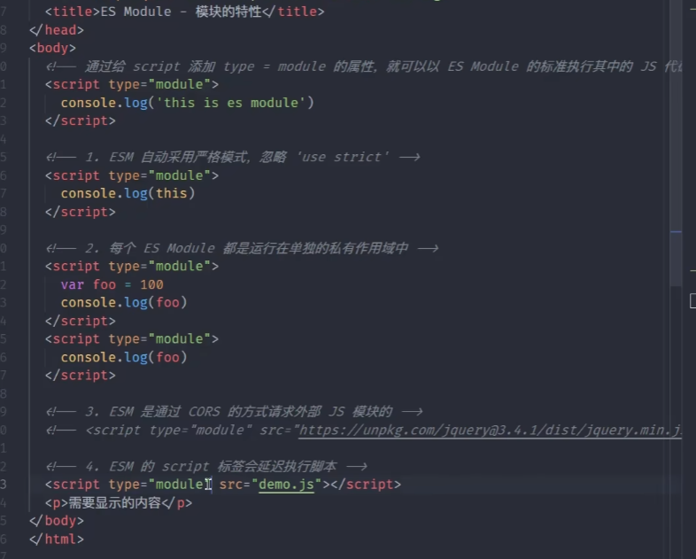
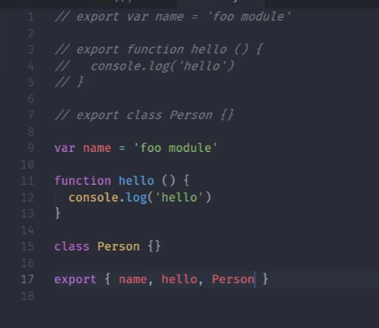
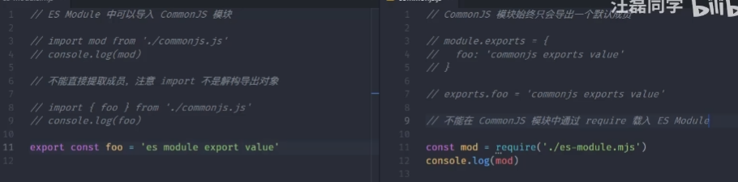
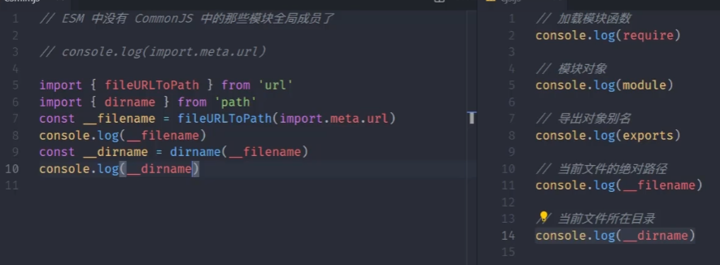
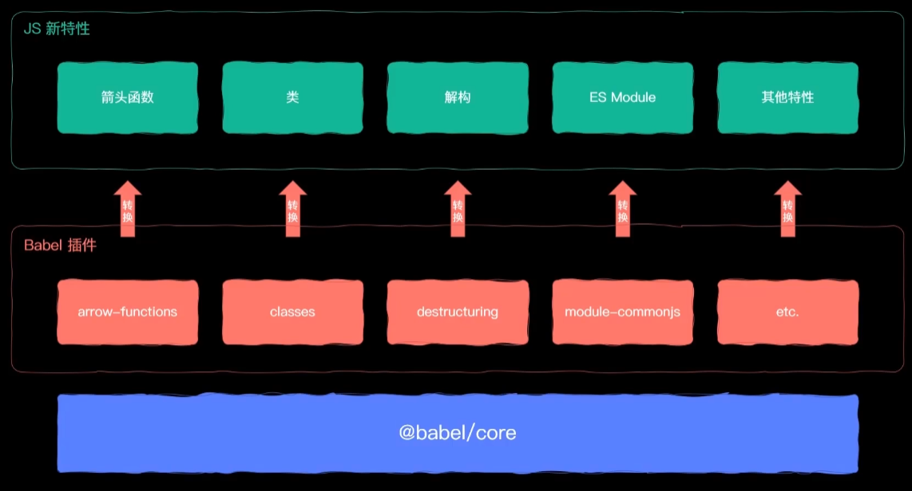
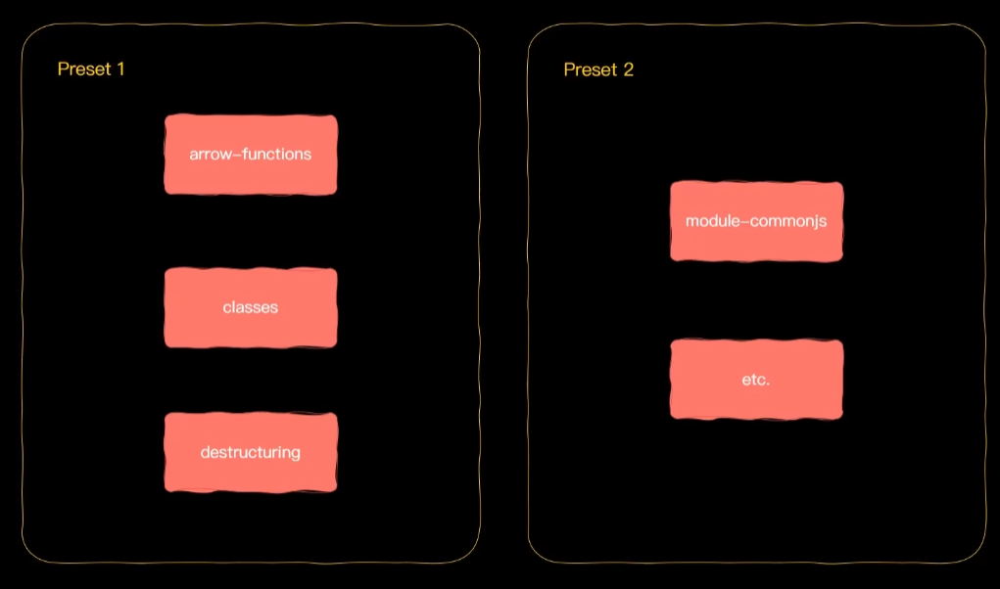

 

导出

```
export //
export { XXX } 
```


`browser-sync . --files **/*.js`

  

可以重命名

```js
export {name as name1, hello, Person}
```

导入： `import { name } from './index'`

导出的不是字面量对象；

导入时是引用关系的，导入和定义时是同一个内存地址，

对外暴露值的时候暴露的是引用关系，暴露出来的引用变量是只读的


默认导出

`export default 任何类型的变量`

默认导入

`import name from './index.js'`

import 中导入文件的时候，不能省略.js扩展名

导入时相对路径`./`不能省略，会被当做导入第三方模块

也可以使用`/`绝对路径来写`import { name } '/src/utils/index'`

要是加载模块，不需要导出任何变量时使用下面的方法：

```js
import {} from './index.js'
import './module.js'
```

若一个模块导入的成员特别多，可以使用下面的方法

```js
import * as module from './index.js'
```

拿的时候使用`module.name `等


`import`这个名称智能出现在代码的最顶层，不能在块作用域里面

**动态导入模块**

```js
import ('./module.js').then(function(module) {
    console.log(module)
    //打印出的时导出的变量集合
})
```

**导出时既有默认成员又有到导出成员时**

导出

```js
export {name, age}
export default 'default export'
```

导入

```js
import abc, { name, age } from './index.js'
```

**将导入的结果，直接作为当前模块的导出成员**

```js
export {foo, age } from './index'
```

这样来组织导入成员时很方便

button.js

```js
export const button = 'button'
```

avatar.js

```js
export const avatar = 'avatar'
```

index.js

```js
export { button } from './button.js'
export { avatar } from './avatar.js'
```

app.js

```js
import { Button, avatar } from './component/index.js'
```

上面的使用方式不适用于默认导出的方式，必须使用的时候使用下面的方法

```js
const Button = 'button'
export default Button
```

index.js

```js
export { default as Button } from './button.js'
```

对default进行重命名为Button

**Node中使用ES Module**

1. 将文件的扩展名改为`.mjs`，引入时也要改
2. 启动时加入参数`node --experimental-modules index.mjs`

 使用系统模块

```js
import fs from 'fs'
fs.writeFileSync('./foo.txt', 'es Module working')
```

运行

```
node --experimental-modules index.mjs
```

兼容默认导入，这种方式只适用于系统模块，不适用于第三方模块

```js
import { writeFileSync } from 'fs'
writeFileSync("./bar.txt",es module working~')
```

**Node中使用CommonJS交互**

 

ES Module 中可以导入 CommonJS 模块
CommonJS 中不能导入 ES Module 模块
CommonJS 始终只会导出一个默认成员
注意import 不是解构导出对象

**使用ES Module时在代码中不能找到全局变量的解决办法**



**Node版本升级**

前面的代码都是Node版本低的情况下，将文件名后缀改为`.mjs`，才运行文件，现在版本升级后，可以在package.json中的对象定义type属性，值为'module'

```json
{
    type: 'module'
}
```

这样文件名后缀可以为`.js`，然后执行也不会有什么错误

但是如果我们要在module类型的文件中使用Commonjs规范，那么在使用的文件名后缀改为`.cjs`，这样才可以在这个文件里面使用commonjs规范

**使用Babel实现在ESModule中的代码**

安装

```js
yarn add @babel/node @babel/core @babel/preset-env --dev
```

运行

```js
yarn babel-node 要执行的文件
```

如果出现报错，需要转换代码中的新特性，则需要安装插件来转换

 

 

preset-env是所有ES6的新特性

可以执行下面的代码进行转

```js
yarn babel-node 要执行的文件 --presets=@babel/preset-env
```

可以放到配置文件中

.babelrc

```js
{
    "presets": ["babel/preset-env"]
}
```

就可以执行

```js
yarn babel-node 要执行的文件
```

---- 另一种方法

之前说是通过一个插件来转换ES Module的新特性，可以安装一个插件

```js
@babel/plugin-transform-modules-commonjs
```

修改.babelrc文件

```js
{
    "plugins": [
        "@babel/plugin-transform-modules-commonjs"
    ]
}
```

运行代码

```js
yarn babel-node 要执行的文件
```

## 前端模块打包工具

对不兼容的可以使用loader加载器在编译的时候去配置，可以实现代码拆分