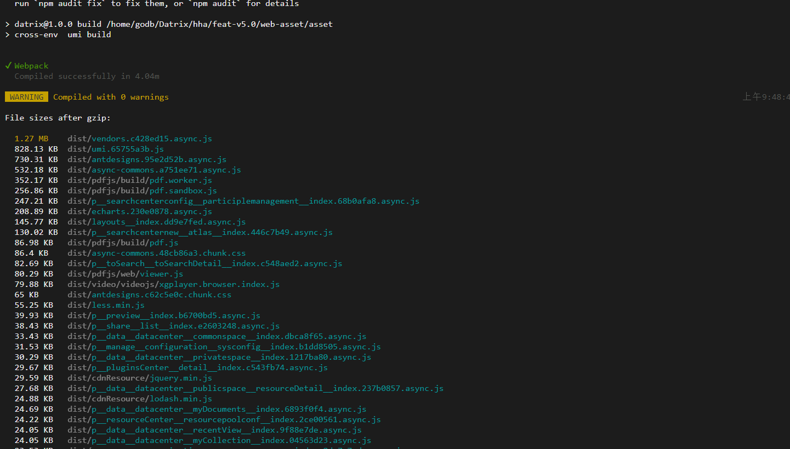

## 存在的问题：

- [ ] 体积大


- [ ] 构建速度慢


- [ ] 静态资源没优化


cacheGroups: 

开始的文件大小


第二次修改：


可以看到vendors的体积很大，我们需要对vendors的依赖包进行抽离，将多次引入的包抽离，

## 检测不使用的依赖

使用depcheck检测项目中不用的依赖：

```
npm install -g depcheck
depcheck 项目路径
```


> Unused 表示没有使用的依赖包，Missing 表示使用到了但是没有在 json 文件中声明的依赖包

有一些特殊乱入的包也会被检测出来的，比如：babel、eslint、husky、prettier、lint-staged、types、webpack的loaders等相关的包。

https://github.com/depcheck/depcheck/blob/master/doc/pluggable-design.md

检测出没用到的依赖，根据项目使用，判断是否再用后在删除下列包

node-plop、clone、qrcode-react、react-highlight-words、react-infinite-scroller、react-pdf-js、uglifyjs-webpack-plugin、umi-plugin-dva、babel-plugin-react-intl、eslint-config-airbnb、eslint-plugin-markdown，lrz，

```
base: "/",  也称访问的基本路径
// 构建完  生成 asset目录下的dist文件  访问方式ip/...  本地构建的时候需要注释 
// base: "/asset/",
// 构建完  生成 asset目录下的dist文件  访问方式ip/asset/...  本地构建的时候需要注释 
// 本地开发的时候，不存在asset  注释就可以了  不然存在  index.html下的资源都需要asset这样去引用 


publicPath: "/asset/",  也称静态资源的基本路径
// 构建好的资源，访问静态目录时的位置
```

换之前：

vendors.js


加载文件大小：


**换完之后：**


代码打包：




<hr/ >


打包时长

 

 

 


遗留问题，externals在排除ant  ant-design-pro时没排除

chunk分的时候，是不是可以将排除在外的不用在进行chunk了

卸载了一些依赖包：

treeShinking:

倒数第二次打包：


目前最终结果


## 卸载的包：

clone、qrcode-react、react-highlight-words、  react-infinite-scroller、react-pdf-js、uglifyjs-webpack-plugin

umi-plugin-dva、babel-plugin-react-intl、eslint-config-airbnb、eslint-plugin-markdown、node-plop、lrz

umi.js之前的代码

```js
import { resolve } from 'path';

const COMMAND = process.env.npm_lifecycle_event;

const buildObj = {
  chainWebpack: function (config, { webpack }) {
    config.merge({
      optimization: {
        minimize: true,
        splitChunks: {
          chunks: 'all',
          minSize: 30000,
          minChunks: 3,
          automaticNameDelimiter: '.',
          cacheGroups: {
            vendor: {
              name: 'vendors',
              test({ resource }) {
                return /[\\/]node_modules[\\/]/.test(resource);
              },
              priority: 10,
            },
          },
        },
      }
    });
  },
}

const normalObj = {
  // base: "/",
  base: "/asset/",
  plugins: [

    ['umi-plugin-react', {
      dva: true,
      antd: true,
      dynamicImport: {
        webpackChunkName: true,
      },
      locale: {
        enable: true, // default false
        default: 'zh-CN', // default zh-CN
        baseNavigator: true, // default true, when it is true, will use `navigator.language` overwrite default
      },
      rotest: {
        exclude: [/models\//, /services\//, /components\//, /common\//, /assets\//],
      },
      chunks: ['vendors', 'umi']
    }],

  ],
  // exportStatic: {
  //   // htmlSuffix: true,
  // },

  history: 'hash',
  hash: true,

  // proxy: {
  //   '/account-service/v1': {
  //     target: 'http://192.168.51.205:30805/',
  //     changeOrigin: true,
  //   },
  //   '/plugins/datatom': {
  //     target: 'http://192.168.51.206:30907',
  //     changeOrigin: true,
  //   },
  // },
  alias: {
    "@":resolve(__dirname, 'src'),
    src: resolve(__dirname, 'src'),
    assets: resolve(__dirname, 'src/assets'),
    common: resolve(__dirname, 'src/common'),
    components: resolve(__dirname, 'src/components'),
    containers: resolve(__dirname, 'src/containers'),
    layouts: resolve(__dirname, 'src/layouts'),
    models: resolve(__dirname, 'src/models'),
    pages: resolve(__dirname, 'src/pages'),
    services: resolve(__dirname, 'src/services'),
    utils: resolve(__dirname, 'src/utils'),
  },
  ignoreMomentLocale: true,
  "theme": "./theme.js",
  // publicPath: "/",
  publicPath: "/asset/",

  targets: {
    ie: 11,
  },
  /*
  externals: {
    '@antv/data-set': 'DataSet',
    // 'd3': 'd3',
  },
  */
}

const exportObj = COMMAND === 'start' ? normalObj : {
  ...normalObj,
  ...buildObj,
}

export default exportObj;

```

修改后的代码

```js
import { resolve } from 'path';

const COMMAND = process.env.npm_lifecycle_event;

const buildObj = {
  chainWebpack: function (config, { webpack }) {
    config.merge({
      optimization: {
        minimize: true,
        splitChunks: {
          chunks: 'all',
          minSize: 30000,
          minChunks: 3,
          automaticNameDelimiter: '.',
          cacheGroups: {
            vendor: {
              name: 'vendors',
              test({ resource }) {
                return /[\\/]node_modules[\\/]/.test(resource);
              },
              priority: 10,
            },
            lodash: {
              name: "lodash",
              test: /[\\/]node_modules[\\/]lodash[\\/]/,
              chunks: "all",
              priority: -2
            },
            bizcharts: {
              name: "bizcharts",
              test: /[\\/]node_modules[\\/]bizcharts[\\/]/,
              chunks: "all",
              priority: 10
            },
            antd: {
              name: "antd",
              test: /[\\/]node_modules[\\/](@ant-design|antd|antd-mobile)[\\/]/,
              priority: -10,
              enforce: true,
            },
            'async-commons': { // 异步加载公共包、组件等
              chunks: 'async',
              minChunks: 2,
              name: 'async-commons',
              priority: 90,
            },
            commons: { // 其他同步加载公共包
              chunks: 'all',
              minChunks: 2,
              name: 'commons',
              priority: 80,
            },
            // react: {
            //   name: "react",
            //   test: /[\\/]node_modules[\\/](react)[\\/]/,
            //   priority: -9,
            //   enforce: true,
            // },
            // reactDom: {
            //   name: "react-dom",
            //   test: /[\\/]node_modules[\\/](react-dom)[\\/]/,
            //   priority: -9,
            //   enforce: true,
            // },
            echarts: {
              name: "echarts",
              test: /[\\/]node_modules[\\/](echarts)[\\/]/,
              priority: -9,
              enforce: true,
            },
            antdesigns: {
              name: 'antdesigns',
              chunks: 'all',
              test: /[\\/]node_modules[\\/](@ant-design|antd)[\\/]/,
              priority: 11,
            },
          },
        },
      }
    });
    //过滤掉momnet的那些不使用的国际化文件
    config.plugin("replace").use(require("webpack").ContextReplacementPlugin).tap(() => {
      return [/moment[/\\]locale$/, /zh-cn/];
  });
  },
}

const normalObj = {
  // base: "/",
  base: "/asset/",
  plugins: [

    ['umi-plugin-react', {
      dva: true,
      antd: true,
      dynamicImport: {
        webpackChunkName: true,
      },
      locale: {
        enable: false, // default false
        default: 'zh-CN', // default zh-CN
        baseNavigator: true, // default true, when it is true, will use `navigator.language` overwrite default
      },
      routes: {
        exclude: [/models\//, /services\//, /components\//, /common\//, /assets\//],
      },
      // chunks: ['vendors', 'umi', 'antd', 'async-commons', 'commons'],
    }],

  ],
  treeShaking: true,
  externals: {
    'echarts': 'window.echarts',
    'ant-design-pro': 'ant-design-pro',
    'moment': 'moment',
    '@antv/data-set': 'DataSet',
    'jquery': 'jQuery',
    'd3': 'd3',
    'loadsh': 'lodash',
  },
  // uglifyJSOptions: {
  //   parallel: false,
  // },

  // exportStatic: {
  //   // htmlSuffix: true,
  // },
  history: 'hash',
  hash: true,

  // proxy: {
  //   '/account-service/v1': {
  //     target: 'http://192.168.51.205:30805/',
  //     changeOrigin: true,
  //   },
  //   '/plugins/datatom': {
  //     target: 'http://192.168.51.206:30907',
  //     changeOrigin: true,
  //   },
  // },
  alias: {
    "@": resolve(__dirname, 'src'),
    src: resolve(__dirname, 'src'),
    assets: resolve(__dirname, 'src/assets'),
    common: resolve(__dirname, 'src/common'),
    components: resolve(__dirname, 'src/components'),
    containers: resolve(__dirname, 'src/containers'),
    layouts: resolve(__dirname, 'src/layouts'),
    models: resolve(__dirname, 'src/models'),
    pages: resolve(__dirname, 'src/pages'),
    services: resolve(__dirname, 'src/services'),
    utils: resolve(__dirname, 'src/utils'),
  },
  ignoreMomentLocale: true,
  "theme": "./theme.js",
  // publicPath: "/dist/",
  publicPath: "/asset/",

  targets: {
    ie: 11,
  },
  /*
  externals: {
    '@antv/data-set': 'DataSet',
    // 'd3': 'd3',
  },
  */
}

const exportObj = COMMAND === 'start' ? normalObj : {
  ...normalObj,
  ...buildObj,
}
export default exportObj;
```


第二次修改：

```js
cacheGroups: {
            vendor: {
              name: 'vendors',
              // test({ resource }) {
              //   return /[\\/]node_modules[\\/]/.test(resource);
              // },
              test: /[\\/]node_modules[\\/](react|react-dom | @ant-design|antd)[\\/]/,
              priority: 22,
            },
            // antdesigns: {
            //   name: 'antdesigns',
            //   chunks: 'all',
            //   test: /[\\/]node_modules[\\/](@ant-design|antd)[\\/]/,
            //   priority: 20,
            // },
            lodash: {
              name: "lodash",
              test: /[\\/]node_modules[\\/]lodash[\\/]/,
              chunks: "all",
              priority: 20
            },
            // 不用提，因为不是公共的
            // bizcharts: {
            //   name: "bizcharts",
            //   test: /[\\/]node_modules[\\/]bizcharts[\\/]/,
            //   chunks: "all",
            //   priority: 10
            // },
            echarts: {
              name: "echarts",
              test: /[\\/]node_modules[\\/](echarts)[\\/]/,
              priority: 20,
              enforce: true,
            },
            'async-commons': { // 异步加载公共包、组件等
              chunks: 'async',
              minChunks: 2,
              name: 'async-commons',
              priority: 9,
            },
            commons: { // 其他同步加载公共包
              chunks: 'all',
              minChunks: 2,
              name: 'commons',
              priority: 8,
            },
          },
```

这里要对排除在打包进node_modules的代码引入到documentjs文件里面

document.js的代码

```js
<!DOCTYPE html>
<html lang="en">
<head>
  <meta content="webkit" name="renderer" />
  <meta charset="UTF-8">
  <meta name="viewport" content="width=device-width, initial-scale=1.0">
  <meta http-equiv='X-UA-Compatible' content='IE=Edge, chrome=1' >
  <meta name="description" content="">
<!--不显示默认图标-->
<!--  <link rel="icon" href="favicon.png" type="image/x-icon">-->
  <link rel="stylesheet" href="./fontface/quartz/stylesheet.css" type="text/css">
  <title></title>
  <style>
    .bg {
      position: fixed;
      top: 0;
      right: 0;
      bottom: 0;
      left: 0;
      z-index: 1000;
      height: 100%;
      }
      .point {
        position: absolute;
        width: 520px;
        height: 255px;
        left: 32%;
        top: 32%;
        background: #fff;
        border-radius:5px;
      }
      .xl-chrome-ext-bar{
        opacity: 0;
      }
  </style>

  <script>
    (function (doc, win) {
      var docEl = doc.documentElement;
      var recalc = function () {
          var deviceWidth = docEl.clientWidth;
          // console.log(deviceWidth);
                //if (deviceWidth > 960) deviceWidth = 960;
          docEl.style.fontSize = 1366 / 9.6 + 'px';
      };
      recalc();
      window.removeEventListener('resize', recalc);

    })(document, window);
  </script>
</head>
<body>
  <link rel="stylesheet/less" href='./color.less' />
  <script>
    window.less = {
      async: false,
      env: 'production',
      logLevel: 2,
      javascriptEnabled: true,
    };
  </script>
  <script type="text/javascript" src="./less.min.js"></script>
  <div id="root"></div>
    <div id="bg" style="display: none">
      <div class="point">
        <div style="padding: 16px 24px; text-align: left; color: #4a4a4a; font-size: 15px; font-weight: 500; margin: 0; border-bottom: 1px solid #e8e8e8;">
          提示信息
          
        </div>
        <div style="padding: 24px">
          <p style="font-size: 14px">为保证功能正常使用，请将浏览器切换至极速模式或使用Chrome浏览器</p>
          <p>
            
            <span
              style="margin-left: 10px; color: #395AC5; cursor: pointer"
              onclick="downMac()"
            >Mac版Chrome浏览器下载
          </span>
          </p>
          <p>
            
            <span style="margin-left: 10px; cursor: pointer; color: #395AC5" onclick="downWin32()">Windows版Chrome浏览器下载（32位）</span>
          </p>
          <p>
            
            <span style="margin-left: 10px; cursor: pointer; color: #395AC5" onclick="downWin64()">Windows版Chrome浏览器下载（64位）</span>
          </p>
        </div>
      </div>
    </div>
</body>
<script>

    var ua = navigator.userAgent.toLocaleLowerCase();
    // let isChrome = ua.match(/chrome/) != null

    var el = document.getElementById("bg");
    var isIE = ua.match(/msie/) != null || ua.match(/trident/) != null || ua.match(/edge/) != null;
    var ieLogined = localStorage.getItem('ieLogined') === 'true' // 判断之前是否登录过ie浏览器
    if (isIE && !ieLogined) {
      el.style.display = 'block';
      localStorage.setItem('ieLogined', 'true')
    }

    function closeModal() {
      el.style.display = 'none';
    }

    function downWin32() {
      var a = document.createElement('a') // 先创建a标签
      a.href = './chromeDown/chrome32.exe' // base是后端返回的数据
      a.download = '下载.exe' // 下载的图片名
      if (navigator.msSaveBlob) {
      // 兼容IE
      var url32 = 'http://' + window.location.host + window.location.pathname + 'chromeDown/chrome32.exe';
      fetchBlob(url32);
      }
      a.click(); // 开始下载
    }
    function downWin64() {
      var a = document.createElement('a') // 先创建a标签
      a.href = './chromeDown/chrome64.exe' // base是后端返回的数据
      a.download = '下载.exe' // 下载的图片名
      if (navigator.msSaveBlob) {
      // 兼容IE
      var url64 = 'http://' + window.location.host + window.location.pathname + 'chromeDown/chrome64.exe'; // window.location.origin(IE11及以上)
      fetchBlob(url64);
      }
      a.click(); // 开始下载


    }
    function downMac() {
      var a = document.createElement('a') // 先创建a标签
      a.href = './chromeDown/chrome.dmg' // base是后端返回的数据
      a.download = '下载.dmg' // 下载的图片名
      if (navigator.msSaveBlob) {
      // 兼容IE
      var blob = Blob(['./chromeDown/chrome.dmg'], { type: 'image/jpg'});
      return navigator.msSaveBlob(blob, 'chrome.dmg');
      }
      a.click(); // 开始下载
    }

    // 获取浏览器安装包文件
    function fetchBlob(url) {
      var xhr = new XMLHttpRequest();
      xhr.open('GET', url);
      xhr.responseType = 'blob';

      xhr.onload = function() {
        if (xhr.status === 200) {
          var blob = Blob([xhr.response], { type: 'image/jpg'});
          return navigator.msSaveBlob(blob, 'chrome.exe');
        }
      };
      xhr.send();
    }
    // 将迅雷节点移除本网站，防止迅雷下载
    let count = 0;
    const time = setInterval(() => {
      count++
      // 有迅雷插件
      if (document.getElementById('xl_chrome_ext_download') && document.getElementById('xl_chrome_ext_download').parentNode) {
        try {
          document.getElementsByTagName('video') && document.getElementsByTagName('video')[0].addEventListener("mouseover", function(){
            setTimeout(() => {
              document.getElementById('xl_chrome_ext_download').parentNode.style.display = 'none'
            })
          })
        } catch (error) {}
        document.getElementsByTagName('body')[0].removeChild(document.getElementById('xl_chrome_ext_download').parentNode)
        clearInterval(time)
      }
      // 没有迅雷插件的情况下，最多执行6次
      if (count > 5) {
        clearInterval(time)
      }
    }, 1000)
  </script>
</html>

```

修改后的代码

```js
<!DOCTYPE html>
<html lang="en">

<head>
  <meta content="webkit" name="renderer" />
  <meta charset="UTF-8">
  <meta name="viewport" content="width=device-width, initial-scale=1.0">
  <meta http-equiv='X-UA-Compatible' content='IE=Edge, chrome=1'>
  <meta name="description" content="">
  <!--不显示默认图标-->
  <!--  <link rel="icon" href="favicon.png" type="image/x-icon">-->
  <link rel="stylesheet" href="/fontface/quartz/stylesheet.css" type="text/css">
  <title></title>
  
  <script>
    
  </script>
  <% if(context.env==='production' ) { %>
    <link href="https://cdn.bootcdn.net/ajax/libs/antd/4.19.5/antd.min.css" rel="stylesheet">
    <link href="https://cdn.bootcdn.net/ajax/libs/antv-x6/1.25.0/x6.min.css" rel="stylesheet">
    <link href="https://cdn.bootcdn.net/ajax/libs/ant-design-pro/2.3.1/ant-design-pro.min.css" rel="stylesheet">

    <script src="https://cdn.bootcdn.net/ajax/libs/jquery/3.3.1/jquery.min.js"></script>
    <script src="https://cdn.bootcdn.net/ajax/libs/echarts/4.1.0/echarts.min.js"></script>
    <script src="https://gw.alipayobjects.com/os/lib/react/16.13.1/umd/react.production.min.js"></script>
    <script src="https://cdn.bootcdn.net/ajax/libs/moment.js/2.24.0/moment.min.js"></script>
    <script src="https://gw.alipayobjects.com/os/lib/react-dom/16.13.1/umd/react-dom.production.min.js"></script>
    <script src="https://cdn.bootcdn.net/ajax/libs/antd/4.19.5/antd-with-locales.min.js"></script>
    <script src="https://cdn.bootcdn.net/ajax/libs/d3/4.0.0/d3.min.js"></script>
    <script src="https://cdn.bootcdn.net/ajax/libs/ant-design-pro/2.3.1/ant-design-pro.min.js"></script>

    <script src="https://cdn.bootcdn.net/ajax/libs/antv-x6/1.25.0/x6.min.js"></script>

    <% } else { %>
      <link href="https://cdn.bootcdn.net/ajax/libs/antd/4.19.5/antd.css" rel="stylesheet">
      <link href="https://cdn.bootcdn.net/ajax/libs/antv-x6/1.25.0/x6.css" rel="stylesheet">
      <link href="https://cdn.bootcdn.net/ajax/libs/ant-design-pro/2.3.1/ant-design-pro.css" rel="stylesheet">

      <script src="https://cdn.bootcdn.net/ajax/libs/antv-x6/1.25.0/x6.js"></script>
      <script src="https://unpkg.com/@antv/data-set"></script>
      <script src="https://cdn.bootcdn.net/ajax/libs/jquery/3.3.1/jquery.js"></script>
      <script src="https://gw.alipayobjects.com/os/lib/react/16.13.1/umd/react.development.js"></script>
      <script src="https://gw.alipayobjects.com/os/lib/react-dom/16.13.1/umd/react-dom.development.js"></script>
      <script src="https://cdn.bootcdn.net/ajax/libs/moment.js/2.24.0/moment.js"></script>
      <script src="https://cdn.bootcdn.net/ajax/libs/echarts/4.1.0/echarts.js"></script>
      <script src="https://cdn.bootcdn.net/ajax/libs/antd/4.19.5/antd.js"></script>
      <script src="https://cdn.bootcdn.net/ajax/libs/d3/4.0.0/d3.js"></script>
      <script src="https://cdn.bootcdn.net/ajax/libs/ant-design-pro/2.3.1/ant-design-pro.js"></script>

      <% } %>
</head>

<body>
  <link rel="stylesheet/less" href='/color.less' />
  <script>
    window.less = {
      async: false,
      env: 'production',
      logLevel: 2,
      javascriptEnabled: true,
    };
  </script>
  <script type="text/javascript" src="/less.min.js"></script>
  <div id="root"></div>
</body>
<script>

</script>

</html>
```


## 找新项目试试：


项目中的目录结构：

 


不配任何optimization的效果：在不配optimization，webpack会按照默认的方式来构建；所有的依赖，入口文件，node_module都会打进一个文件里面；

 


comment，preview，table都引入了antd，jquery，也就是说3个地方引入了jquery，至少3个地方引入了antd，jquery、antd就是公用模块

限制没配splitChunk，打包出来全部在1个文件里面，umi.js，下面配置默认的splitChunks

```js
splitChunks: {
    chunks: 'all',
    minSize: 20000,
    minChunks: 2,
    automaticNameDelimiter: '.',
    cacheGroups: {
       vendors: {
          test: /[\\/]node_modules[\\/]/,
          priority: -10
        },
        default: {
          minChunks: 2,
          priority: -20,
          reuseExistingChunk: true
        }
    },
}
```

### 解释下术语：

**chunks：** 有效值为 `all`，`async` 和 `initial`， 表明将选择哪些 chunk 进行优化；默认为`all`

简书上的一个解释：

```tsx
// 被引用的次数,如果chunks为:
// 'initial',则判断通过静态加载 (import ... from ...) 和 require('....')等 的文件次数; 
// 'async': 判断通过动态加载: import ('...') 的文件次数
// 'all': 计算 'initial' 和 'async '共同的次数
```

**minSize：**生成 chunk 的最小体积（以 bytes 为单位）也就是说出来的chunk至少有20000bytes，否则不生成；即 // 20000,大于这个值的文件会被提取成单独文件；

比如说某个项目下有三个入口文件，a.js和b.js和c.js都是100byte，当我们将minSize设置为301,那么webpack就会将他们打包成一个包，不会将他们拆分成为多个包。

**minChunks：** 

**automaticNameDelimiter：** webpack 将使用 chunk 的来源和名称生成新的chunk名称，比如`automaticNameDelimiter:'~';`（例如 `vendors~main.js`）。此选项使你可以指定用于生成名称的分隔符。

splitChunks就是根据cacheGroups去拆分模块的，splitChunks默认有两个缓存组：vender和default

**maxInitialRequests 入口点处的最大并行请求数，默认为3**

如果我们设置为1，那么每个入口文件就只会打包成为一个文件

**maxAsyncRequests 最大异步请求数量，默认5**

如果我们设置为1，那么每个入口文件就只会打包成为一个文件

**优先级关系**

maxInitialRequest / maxAsyncRequests <maxSize <minSize

简书上的重要说明：
1、entry中每个入口点都会输出一个bundle文件
2、optimization.splitChunks.chunks的默认值为 "async",optimization.splitChunks.cacheGroup.chunks的默认值为"initial"
3、cacheGroups中的default分组是默认存在的,即使不进行任何配置

 **重要**: 实测发现`chunks/minChunks/minSize/maxInitialRequests`这几个规则,**只要有一个不满足,就不会进行提取**

splitChunks下的chunks、minSize、minChunks会在cacheGroups里的配置继承，不过cacheGroups里的配置，如minChunks:1参数的话会覆盖splitChunks下的minChunks: 2配置，优先级高于splitChunks，其他也是一样的

**minChunks**

最少引入的次数

**priority：**

- 设置包的打包优先级，这里解释一下，基本是在两个包同时包含一个插件会用到，priority大的会打包到这个里面。

**cacheGroups: 缓存组**。缓存组的属性除上面所有属性外，还有test, priority, reuseExistingChunk

- test: 用于控制哪些模块被这个缓存组匹配到
- priority: 缓存组打包的先后优先级
- reuseExistingChunk: 如果当前代码块包含的模块已经有了，就不在产生一个新的代码块

reuseExistingChunk

**现在有个问题，**

我引入jquery在每个页面都有引，其中一个文件大小95kb，根据上面的配置，构建完依旧是下面的文件格式

 


找不到办法，现在将minChunks设为1，发现提取出来的多了两个：

 


根据这两个名子可以看出，是提取了css，js的内容，新生成了一个文件

为什么叫vendors？

试着将vendors改为vendors1，

 


可以看到构建出来的文件名也发生变化，看看当minchunk为1时，提取出来的文件大小是否大于20000bytes


可以看到很大；

但是我还是没搞懂为什么minChunks为2的时候不构建出来；

退回到minChunks为1的代码，文件名也为vendors

虽然上面介绍了什么情况下会生成chunks，但看看官方解释：

webpack 将根据以下条件自动拆分 chunks：

1. 新的 chunk 可以被共享，或者模块来自于 `node_modules` 文件夹

2. 新的 chunk 体积大于 20kb（在进行 min+gz 之前的体积）

3. 当按需加载 chunks 时，并行请求的最大数量小于或等于 30

4. 当加载初始化页面时，并发请求的最大数量小于或等于 30

当尝试满足最后两个条件时，最好使用较大的 chunks。

一个个分析：

1、 chunk被共享是什么意思？

生成的chunk能被共享？现在我的comment组件里面的文件大小为95kb，我引用到preview和table组件里面看看，通过打包没改变，还是两个文件，其中jquery也有被共享，antd也是

不改动上面的代码。看看2

2、新的 chunk 体积大于 20kb（在进行 min+gz 之前的体积）<span style="color: green">满足</span>

3、当按需加载 chunks 时，并行请求的最大数量小于或等于 30

4、当加载初始化页面时，并发请求的最大数量小于或等于 30

最后两个我没写进配置里面；主要涉及到的代码是：

```js
maxAsyncRequests: 30,
maxInitialRequests: 30,
```

先加进去试试；

没变，删除不要了

最终定位在了minChunks上，因为他变了才会发生变化，加大代码量试试

**研究了半天，没研究到，那就默认按1来**

我新install 了lodash，然后在给写在配置里面，如下

```js
cacheGroups: {
            vendors: {
              test: /[\\/]node_modules[\\/]/,
              priority: -10
            },
            lodash: {
              name: "lodash",
              test: /[\\/]node_modules[\\/]lodash[\\/]/,
              chunks: "all",
              priority: -2
            },
            default: {
              minChunks: 2,
              priority: -20,
              reuseExistingChunk: true
            }
},
```

这里的 default配置中的`reuseExistingChunk: true` 复用其他chunk内已拥有的模块，当chunks引用了已经存在的被抽离的chunks时不会新创建一个chunk而是复用chunk。reuseExistingChunk详细解释

而default是指，我有多个依赖，其他重复的依赖会因为reuseExistingChunk而不会被重复打包

```css
 cacheGroups: {
      Chunk 1 : {
        test: / A, B, C三个模块/,
        name: 'Chunk 1',
      },
      Chunk 2: {
        test: / B, C/,
        name: 'Chunk 2'
      }
    }
```

Chunk 1 (named one): modules A, B, C
Chunk 2 (named two): modules B, C

第一种配置：

```dts
{
  minChunks: 2,
  reuseExistingChunk: false // default
}
```

它将创建一个包含公共模块B和C的新块：

Chunk 1 (named one): modules A
~~Chunk 2 (named two): no modules (removed by optimization)~~
Chunk 3 (named one~two): modules B, C

第二种配置：

```yaml
{
  minChunks: 2,
  reuseExistingChunk: true
}
```

它将重用现有块2，因为它匹配由cacheGroup选择的模块

Chunk 1 (named one): modules A
Chunk 2 (named two): modules B, C

结论：reuseExistingChunk: true, 复用其他chunk内已拥有的模块 当chunks引用了已经存在的被抽离的chunks时不会新创建一个chunk而是复用chunk
设置与否的结果名称有区别。如果你没有名字，也没有区别。

还有一个关于他的解释`reuseExistingChunk `

```js
// a.js
import b from './b';
// index.js`
import a from './a';
import b from './b';
```

在上述代码中，index.js 在执行 import a from './a' 时引入 a 模块，由于 a 模块中使用了 b 模块，所以同时也引入了 b 模块。再执行 import b from './b' 时，由于 b 模块已经被打包过了，所以就会忽略掉这个 b 模块，这就是 reuseExistingChunk: true 的作用

在比如a模块引入了jquery，b也引用了jquery，reuseExistingChunk是开启的，所以a引入之后会生成一个chunk，而b会直接使用jquery生成的那个chunk，而不会继续打包出来一个jquey的chunk

<hr />

好了，继续介绍打包

优先级比venders高；

构建出来的文件可以看到；

 


分析里面的文件，umi.js是打包之后的入口文件，webpack会把入口文件拆分成一个chunk，这样说好像很矛盾

打包之后的入口文件，这个入口文件会拆分成1个chunk?

不是这样的，我暂时理解为这个入口文件是我们webpack里面定义的入口文件；

在umi的基础上，把lodash文件抽出来了，产生lodash.async.js文件

vendors.umi.async.js是什么呢？一个className，jquery，antd

是时候利用利器来分析了

这样：

```
npm install --save-dev umi-webpack-bundle-analyzer
```

然后这样：

 


然后：


再次尝试：

安装`cross-env `，下面是我的版本；

```
 "cross-env": "~5.1.5",
```

然后：

 


运行：`npm run build`

可以好好分析了；

 


lodash.async里面包含lodash这没什么要说的；

vendors里面包含了好多东西；

umi.js里面全部是页面的文件，其中moment文件最大，这也能理解，上面说过了，

发现vendors还是挺大的，比如jquery，@ant-design，antd/es

**可以继续拆分；**

先看看上面那样拆分后的时间；


好了，下面拆分该怎么拆分，继续看概念的东西：

上面讲了**chunks的概念：现在分别修改chunks，看看构建后的产物；**

**`chunks: 'initial'`的时候；**


两次的对比，发现文件个数没变化，体积没变化，倒是速度变快了；

**第三次修改chunks为'async'后;**


lodash是提取出来的，现在还在，可是vendors.umi.async.js、vendors.umi.async.css那，哪去了，看看官方解释；

```js
// 被引用的次数,如果chunks为:
// 'initial',则判断通过静态加载 (import ... from ...) 和 require('....')等 的文件次数; 
// 'async': 判断通过动态加载: import ('...') 的文件次数
// 'all': 计算 'initial' 和 'async '共同的次数
```

根据上面的解释，那么项目中没有动态加载的文件，所有`all`和`async`构建完的文件数量是一样的

好了，现在回到chunks为: 'all'，也就是计算`initial`和`async`之和。计算他干什么，<span style="color: blue">我才是用到了chunks的个数上，但是好像不对</span>

在提取下jquery

```js
cacheGroups: {
            vendors: {
              test: /[\\/]node_modules[\\/]/,
              priority: -10
            },
            lodash: {
              name: "lodash",
              test: /[\\/]node_modules[\\/]lodash[\\/]/,
              chunks: "all",
              priority: -2
            },
            jquery: {
              name: "jquery",
              test: /[\\/]node_modules[\\/]jquery[\\/]/,
              chunks: "all",
              priority: -3
            },
            default: {
              minChunks: 2,
              priority: -20,
              reuseExistingChunk: true
            }
},
```


vendors呢？

难道剩下的不足20000？看了下分析图，也不是啊

```js
vendors: {
    name: "vendors",
    test: /[\\/]node_modules[\\/]/,
    priority: -10
},
```

这样设置，讲node_modules下面的所有包打到vendors文件里面

我们可以修改，将公用的基本包打进去就可以了；

```jsx
 vendors: {
   name: "vendors",
   test: /[\\/]node_modules[\\/](?!react|react-dom|antd)/,
   priority: 10
},
```

优先级设为10，先讲基本包打进去

这里既然这样设置了，就在将其他的除了lodash，jquery的异步和同步包打进去

```js
'async-commons': {
    // 其余异步加载包
    chunks: 'async',
    minChunks: 2,
    name: 'async-commons',
    priority: 5,
},
 commons: {
    // 其余同步加载包
    chunks: 'all',
    minChunks: 2,
    name: 'commons',
    priority: 4,
},
```

优先级应该低于lodash和jquery，这样才能将jquery和lodash提取出来；

```js
lodash: {
              name: "lodash",
              test: /[\\/]node_modules[\\/]lodash[\\/]/,
              chunks: "all",
              priority: -2
            },
jquery: {
              name: "jquery",
              test: /[\\/]node_modules[\\/]jquery[\\/]/,
              chunks: "all",
              priority: -1
},
```

搞了半天，在执行上述所有命令的时候，要开启动态加载的配置；

```js
 ['umi-plugin-react', {
      antd: true,
      dva: true,
      dynamicImport: {
        webpackChunkName: true,
      },
      title: 'umi2-dva-user-dashboard',
      dll: false,
      pwa: false,
      routes: {
        exclude: [],
      },
      hardSource: true,
}],
```

上述改变splickChunk为：

```js
cacheGroups: {
            vendors: {
              name: "vendors",
              test: /[\\/]node_modules[\\/](react|react-dom|antd)[\\/]/,
              priority: 10
            },
            lodash: {
              name: "lodash",
              test: /[\\/]node_modules[\\/]lodash[\\/]/,
              // chunks: "all",
              priority: 9
            },
            jquery: {
              name: "jquery",
              test: /[\\/]node_modules[\\/]jquery[\\/]/,
              // chunks: "all",
              priority: 8
            },
            'async-commons': {
              // 其余异步加载包
              chunks: 'async',
              // minChunks: 2,
              name: 'async-commons',
              priority: 7,
            },
            commons: {
              // 其余同步加载包
              // chunks: 'all',
              minChunks: 2,
              name: 'commons',
              priority: 6,
            },
            default: {
              minChunks: 2,
              priority: -20,
              reuseExistingChunk: true
            }
          },
```

拿上面的结果和图进行比较；


根据上面配置完，控制台会报错，说找不到构建的包

rror parsing bundle asset "D:\projectTest\umi3\umi2-dva-user-dashboard\dist\p__table__index.async.js": no 
such file
Error parsing bundle asset "D:\projectTest\umi3\umi2-dva-user-dashboard\dist\p__users__index.async.js": no 
such file
Error parsing bundle asset "D:\projectTest\umi3\umi2-dva-user-dashboard\dist\p__users__model.async.js": no 
such file
Error parsing bundle asset "D:\projectTest\umi3\umi2-dva-user-dashboard\dist\umi.js": no such file
Error parsing bundle asset "D:\projectTest\umi3\umi2-dva-user-dashboard\dist\vendors.async.js": no such file

然后我注释调vendors发现好了

分析了async-commons、commons、vendors、

我优先加载了async-commons、commons，即同步/异步模块，那vendors加载什么？

好像没的做了，然后我把vendos的优先级调到低于async-commons、commons，发现没有构建出vendos，这样做也不对，

## 目的：

文件过大，单独提取重复构建的内容，

可以用下面的方法去配置


```js
rcomponent: {
    chunks: 'all',
    test: /re-[a-zA-Z]/,
    name: 'rcomponent',
    enforce: true,
}
```

 


虽然说antd是按需引入的，其实并没有，可以自行的抽离到一个文件里面，按照antd那样引入

 


简单介绍一下上面3中size：

- **Stat**：压缩转换之前的文件大小
- **Parsed**：最终输出的尺寸大小（`我们真正的就是看这个`）
- **Gzip**：经过gzip压缩之后的大小

这几个页面里面我都引入了comment，我可以将这个拆成一个单独的文件出来


<span style="color:red">拆分的时候一定要注意优先级问题，不然会出现有的文件没被拆出来，导致文件体积过大；或者输出的文件由于找不到而报错</span>

我想把所有的能拆的都拆出来，发现越拆，越报错，而且体积还会更大，索性拆成下面的方式，发现体积小了很多，不能理解，

最后改成了下列的形式；而且包的总体积小了；

```js
cacheGroups: {
            vendors: {
              name: "vendors",
              test: /[\\/]node_modules[\\/](@ant-design|antd|react|react-dom|react-dom-router)[\\/]/,
              priority: 55
            },
            // lodash: {
            //   name: "lodash",
            //   chunks: 'async',
            //   test: /[\\/]node_modules[\\/]lodash[\\/]/,
            //   priority: 50
            // },
            // jquery: {
            //   name: "jquery",
            //   chunks: 'async',
            //   test: /[\\/]node_modules[\\/]jquery[\\/]/,
            //   priority: 50
            // },
            // comment: {
            //   name: "comment",
            //   priority: 45,
            //   test: /[\\/]src[\\/]pages[\\/]comment[\\/]/
            // },
            // coreJs: {
            //   name: "coreJs",
            //   priority: 50,
            //   chunks: 'async',
            //   test: /[\\/]node_modules[\\/]core-js[\\/]/
            // },
            // rcomponent: {
            //   test: /[\\/]node_modules[\\/]rc-[a-zA-Z]/,
            //   name: 'rcomponent',
            //   priority: 12
            // }
            // coreJs: {
            //   name: "coreJs",
            //   test: /[\\/]node_modules[\\/]core-js[\\/]/,
            //   priority: 13
            // },
            'async-commons': {// 其余异步加载包
              chunks: 'async',
              minChunks: 2,
              name: 'async-commons',
              priority: 28,
            },
            commons: { // 其余同步加载包
              chunks: 'all',
              minChunks: 2,
              name: 'commons',
              priority: 26,
             },
          },
```


现在的结果就是上面的那样，其实也没必要拆lodash，jquery，

好了，不拆了就这样了；

下面把一些重要的。重复的东西复制粘贴上去；

我们需要指定项目中的框架结构是怎样的

下一步需要梳理一下专业术语：上面已经说 过了

- 其实当我们进入网站，一般第一步都是进入一个登陆页面，需要的只是项目的基本框架代码，例如react,react-dom.antd等，我们可以用all(或者initial)将它们单独打包，作为首页必须载入的包
- 我们打包的公共包，首次加载页面的时候，只想把同步加载的加载进来，所以需要一个同步的Common包
- 像echarts,d3,以及一些src下面一些异步加载的包，将它们利用async将打包成一个独立异步加载包

- async-common中包含了自己写的src组件和第三方组件
- async-common中比较大是echarts，zrender(echarts引入)和d3，结合项目来说，只有部分页面我们需要echarts（d3同），所以我们可以考虑将d3和echarts这两个比较大的包提取出来，等到某个页面需要的时候，再让其异步加载，这样就大大减小了async-common的体积了。

当然也不建议拆的特别小，因为浏览器http1可能一次性支持6次下载文件，太多可能会适得其反


### 前端使用`gzip`进行压缩

项目安装plugin依赖

```js
yarn add compression-webpack-plugin -D
```

在config/config.js目录下进行配置

```js
const CompressionWebpackPlugin = require('compression-webpack-plugin');
const prodGzipList = ['js', 'css'];
	
chainWebpack: config => {
  if (process.env.NODE_ENV === 'production') {  // 生产模式开启
    config.plugin('compression-webpack-plugin').use(
      new CompressionWebpackPlugin({
        // filename: 文件名称，这里我们不设置，让它保持和未压缩的文件同一个名称
        algorithm: 'gzip', // 指定生成gzip格式
        test: new RegExp('\\.(' + prodGzipList.join('|') + ')$'), // 匹配哪些格式文件需要压缩
        threshold: 10240, //对超过10k的数据进行压缩
        minRatio: 0.6 // 压缩比例，值为0 ~ 1
      })
    );
  }
}

```

进行打包

yarn build

打包之后可以发现dist目录下会出现压缩之后的文件

注意：不是将整个dist进行打包了，而是将每一个dist中的文件打包了，所以文件数量变成了原来的两倍

https://www.jb51.net/article/254321.htm

不拆了不拆了，用了一天半时间就先这样了；


尚硅谷总结optimize

```js
optimization: {
    splitChunks: {
        chunks: 'all',.png')"
        minSize: 30 * 1024,  // 分割chunk最小为30kb，在小就不会分割了
        maxSize: 0, // 最大没有限制，
        minChunks: // 要提取的chunks最少被引用1次，小于1次不被提取出来
        maxAsyncRequest: 5,
        maxInitialRequests: 3,// 
    }
}
```

 


打包后chunk的名字；

index引入了a，a文件内容变化，文件名变化了，b文件引入a的文件的名称也发生，a也会重新打包，没起到缓存作用

解决：将index文件里面a的文件名给提取出来，

```js
// 将当前模块的记录其他模块的hash单独打包为一个文件runtime
optimization: {
	runtimeChunk: {
		name: entrypoint=> `runtime-${entrypoint.name}`
    }
}}
```

打包后会生成一个runtime文件，在main文件里面不会有hash值

此时在改a文件，a文件内容变了，文件名变了，而main文件不会在发生变化，只改变了a文件和runtime文件发生变化

解决了修改a文件导致mian文件的contentHash变化

**minimizer:**

配置生产环境的压缩方案： js、css

terser将在webpack 4.26以上生效，unglify不在生效

```js
引入
const terserWebpackPlugin = require('terser-webpack-plugin')
```

默认配置不够出色，可以去修改他

```js
minimizer: {
    new terserWebpackPlugin({
        // 开启缓存，压缩之和走缓存
        cache: true,
        // 开启多进程打包，优化速度
        parallel: true,
        // 启动source-map
        sourceMap: true
    })
}
```


------


2023 8 15

vendors包还是很大，试着将不用的包不打

 


本地打包

 

2

 