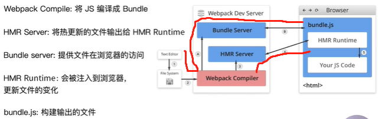
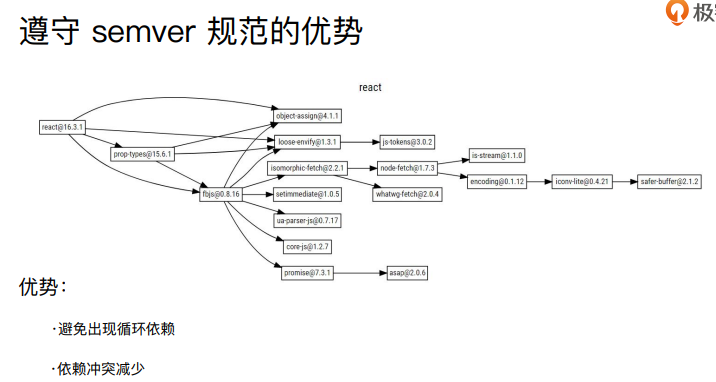

# 前置知识

## ES6模块化

导出导入

```js
// 分别暴露
// 导出
export function aaa() {

}
// 导入
import { aaa } from './xxx'

```

```js
// 统一暴露
function foo() {
    console.log('foo')
}
function bar() {
    console.log('bar')
}
export {
	foo,bar
}
// 导入
import { foo } from './xxx'
```

```js
// 导出
export default {
    name: 'zs',
    setName: function(name) {
        this.name = name
    }
}
// 导入
import person from './xxx'
```

## Node

#### path

**`const path=require('path')`**

- `__dirname` 文件目录绝对路径

```js
__dirname // E:\foo\bar
```

- `__filename` 文件绝对路径

```js
__pathname // E:\foo\bar\index.js
```

- `path.join([...paths])` 多参数路径拼接

```js
path.join(__dirname,"..","src") //E:\foo\src
path.join('/bbb/aaa','./test/index.js') //\bbb\aaa\test\index.js
```

- `path.resolve([...paths])` 相对路径转绝对路径，类似于cmd中cd命令，对每一级path都进行`cd path`处理

```js
path.resolve(__dirname,"../") //E:\foo\src
path.resolve('/bbb/aaa','./test/index.js') //E:\bbb\aaa\test\index.js
path.resolve('/bbb/aaa','test/index.js') //E:\bbb\aaa\test\index.js
path.resolve('/bbb/aaa','/test/index.js') //E:\test\index.js
path.resolve('/bbb/aaa','..','/test/index.js') //E:\bbb\test\index.js
```

- path.dirname(path) 返回path的目录名

```js
path.dirname(__filename) === __dirname  //true
```

- path.extname(path) 返回文件的扩展名

```js
path.extname('/foo/bar/baz/asdf/index.html');  //return '.html'
path.extname('/foo/bar/baz/asdf/index.');  //return '.'
path.extname('/foo/bar/baz/asdf/index');  //return ''
path.extname('.index');  //return ''
```

- path.basename(path[,ext]) 返回path的最后一部分，如果加了扩展名（区分大小写）则是剔除掉扩展名的部分

```js
path.basename('/foo/bar/baz/asdf/index.html');  //return 'index.html'
path.basename('/foo/bar/baz/asdf/index.html','.html');  //return 'index'
path.basename('/foo/bar/baz/asdf/index.HTML','.html');  //return 'index.HTML'
```

- path.isAbsolute(path) 判断路径是否是绝对路径

```js
path.isAbsolute(".")  //false
path.isAbsolute("/")  //true
path.isAbsolute("./foo/baz")  //false
path.isAbsolute("/foo/baz")  //true
```

## 准备工作

### 安装webpack

安装版本是以下版本

```
"webpack": "^4.41.6",
"webpack-cli": "^3.3.11"
```

文件目录结构

```
src
|--data.json
|--index.css
|--index.html
|--index.js
```

data.json

```js
{
  "name": "jack",
  "age": 18
}
```

index.css

```css
html,
body {
  height: 100%;
  background-color: pink;
}
#title {
  color: red;
  font-size: 32px;
}
```

index.html

```html
<!DOCTYPE html>
<html lang="en">
<head>
    <meta charset="UTF-8">
    <meta http-equiv="X-UA-Compatible" content="IE=edge">
    <meta name="viewport" content="width=device-width, initial-scale=1.0">
    <title>Document</title>
</head>
<body>
    <div id="title">你好</div>
</body>
</html>
```

index.js

```js
// import './index.css';
// 如果引入css进行打包，会报错
import data from './data.json';
console.log(data);

function add(x, y) {
  return x + y;
}

console.log(add(1, 2));
```

 index.js: webpack入口起点文件

**运行指令：**

**开发环境**：`webpack ./src/index.js -o ./build/built.js --mode=development`

-o：表示输出路径
--mode：指定构建环境

webpack会以` ./src/index.js` 为入口文件开始打包，打包后输出到` ./build/built.js`

**整体打包环境，是开发环境**

**生产环境：**`webpack ./src/index.js -o ./build/built.js --mode=production`

 webpack会以` ./src/index.js `为入口文件开始打包，打包后输出到 `./build/built.js`

**整体打包环境，是生产环境**

为什么按照了webpack，还需要安装别的loader或者plugin？

webpack提供了一些默认的配置，有些插件会随着社区的完善，webpack会作为默认的已安装的配置，但也存在很多webpack自己做不到的地方，这时候就需要开发者自己编写插件，引入到webpack里面；

比如：

1. webpack能处理js/json资源，不能处理css/img等其他资源

2. 生产环境和开发环境将ES6模块化编译成浏览器能识别的模块化~

3. 生产环境比开发环境多一个压缩js代码。

使用时需要编译，ES6编译为ES5代码

在这里built.js就是编译后的文件，也可以说mian.js就是**bundle**文件

上述是单入口文件的介绍，在来看多入口文件的介绍：

```
src
|--index.js
|--utils.js
|--index.html
|--index.css
|--common.js
webpack.config.js
```

index.js

```js
import './index.css';
const { log } = require('./common');

log('webpack');
```

utils.js

```js
function move() {
	console.log()
}
```

common.js

```js
module.exports = {
  log: (msg) => {
    console.log('hello ', msg)
  }
}
```

webpack.config.js

```js
{
    // index 和utils两个入口文件
    entry: {
        index: "../src/index.js",  // 依赖common.js  、 index.css
        utils: '../src/utils.js', // 不依赖任何模块
    },
    output: {
        filename: "[name].bundle.js", // 输出 index.bundle.js 和 utils.bundle.js
    },
    module: {
        // lodaer使用
        rules: [
            {
                test: /\.css$/,
                use: [
                    MiniCssExtractPlugin.loader, // 创建一个 link 标签 用于将外部css插入到head标签里面
                    'css-loader', // css-loader 负责解析 CSS 代码, 处理 CSS 中的依赖
                ],
            },
        ]
    }
    plugins: [
        // 用 MiniCssExtractPlugin 抽离出 css 文件，以 link 标签的形式引入样式文件
        new MiniCssExtractPlugin({
            filename: 'index.bundle.css' // 输出的 css 文件名为 index.bundle.css
        }),
    ]
}
```

运行webpack之后

  

我们可以看出，index.css 和 common.js 在 index.js 中被引入，打包生成的 index.bundle.css 和 index.bundle.js 都属于 chunk 0，既同一个，utils.js 因为是独立打包的，它生成的 utils.bundle.js 属于 chunk 1。chunk属于一个标记，同一类，也是一个序号，表示谁先构建


bundle、chunk、module之间的区别：

1、对于一份同逻辑的代码，当我们手写下一个个的文件，它们无论是 ESM 还是 commonJS 或是 AMD，他们都是 module ；

 2、当我们写的 module 源文件传到 webpack 进行打包时，webpack 会根据文件引用关系生成 chunk 文件，比如上面的index.js文件，引用了index.css、common.js ； common并入到了index.js文件里面了，index.css则单独提取出来了，因为配置了`MiniCssExtractPlugin` 插件，将css单独提取出来了，为一个chunk，所以index文件有两个chunk
webpack 会对这个 chunk 文件进行一些操作；(个人理解：一个打包入口一个chunk)，上面的例子是两个打包入口，两个chunk（index.bundle.css，index.bundle.js属于同一个chunk）

 3、webpack 处理好 chunk 文件后，最后会输出 bundle 文件，这个 bundle 文件包含了经过加载和编译的最终源文件，所以它可以直接在浏览器中运行。

个人理解：一个入口文件下的所有引入都属于同一个chunk，而入口文件下引入的那些文件，可以说是bundle

 一般来说一个 chunk 对应一个 bundle，比如上图中的 index.js -> chunks -> index.bumdle.js；

**一句话总结：**
 module，chunk 和 bundle 其实就是同一份逻辑代码在不同转换场景下的取了三个名字：

我们直接写出来的是 module，webpack 处理时是 chunk，最后生成浏览器可以直接运行的 bundle。

module ---> chunk --->  bundle

<span style="color: red">bundle</span>：打包最终生成的文件 

chunk：每个chunk是由多个module组成（引用关系），可以通过代码分割成多个chunk。 运行过程中的代码块

module：webpack中的模块（js、css、图片等等）

通俗来说，module 即每一个资源文件的模块对应，如js / css / 图片等，由NormalModule实例化而来，存在compilations.modules中；它可以理解为是源文件到chunk的一个中间态，便于编译过程中进行各种操作。

[最全webpack和chunk以及bundle的区别](https://jishuin.proginn.com/p/763bfbd3b63c)

`npm run build`运行构建

执行npm run 的时候，会去到`package.json`的`script`脚本下去找匹配的属性，然后自执行属性对应的值

调用的是script 里面build，执行的是build后面的命令

原理：模块局部安装会在node_module/.bin目录创建软链接

```js
// package.json
{
    "script": {
        "build": "webpack"
    }
}
```

**[webpack entry](https://webpack.docschina.org/concepts/#entry)**

依赖入口文件，多入口多页面`entry：{}`，单入口单页面`entry: ''`

**[webpack output](https://webpack.docschina.org/concepts/#output)**

在哪里输出它所创建的 *bundle*，以及如何命名这些文件

通过占位符确保文件名称的唯一`[name]`，name表示源文件的名称

## [**Loaders**](https://webpack.docschina.org/concepts/loaders/)

webpack只支持js、json

通过loader去支持其他文件类型并转换成有效的模块，并添加到依赖图中

常见的loader:

| 名称          | 描述                       |
| ------------- | -------------------------- |
| babel-loader  | 转换ES6  ES7等JS新特性语法 |
| css-loader    | 支持.css文件的加载和解析   |
| less-loader   | 将less文件转换成css        |
| ts-loader     | 将TS转换成JS               |
| file-loader   | 图片、字体等的打包         |
| raw-loader    | 将文件以字符串的形式导入   |
| thread-loader | 多进程打包JS和CSS          |

用法：

```js
module: {
    rules: [
        {
            test: /\.txt$/,
            use: 'raw-loader'
        }，
    ]
}
```

`test` 指定匹配规则

`use`指定使用的loader名称

loader 从右到左（或从下到上）地取值(evaluate)/执行(execute)

## [**plugins**](https://webpack.docschina.org/concepts/plugins/)

插件用于bundle文件的优化，资源管理和环境注入

作用域整个构建过程，loader无法做的plugin去完成 

常见的plugin

| 名称                     | 描述                                       |
| ------------------------ | ------------------------------------------ |
| CommonsChunkPlugin       | 将chunks相同的模块代码提取成公共js         |
| CleanWebpackPlugin       | 清理构建目录                               |
| ExtractTextWebpackPlugin | 将CSS从bundle文件里提取成一个单独的css文件 |
| CopyWebpackPlugin        | 将文件或者文件夹拷贝到构建的输出目录       |
| HtmlWebpackPlugin        | 创建html文件去承载输出的bundle             |
| UglifyWebpackPlugin      | 压缩JS                                     |
| ZipWebpackPlugin         | 将打包出的资源生成一个zip包                |

用法：

```js
plugin:[] // 数组里面就是plugin插件
```

## **[Mode](https://webpack.docschina.org/configuration/mode/)**

提供 `mode` 配置选项，告知 webpack 使用相应模式的内置优化。

所选的有`development`，`production`

development: 
设置 process.env.NODE_ENV 的值为 development ，开启NamedChunksPlugin 和 NamedModulesPlugin .

production
设置 process.env.NODE_ENV 的值为 production，开启FlagDependencyUsagePlugin ，FlagIncludedChunksPlugin，ModuleConcatenationPlugin ，NoEmitOnErrorsPluginOccurrenceOrderPlugin ，SideEffectsFlagPlugin 和TerserPlugin

nonde
不开启任何优化选项 

## 资源解析

**解析ES6**

使用babel-loader解析

增加ES6的babel preset配置

babel的配置文件：.babelrc

```json
{
    "pressets":[],
    "plugins": []
}
```

安装：

```
npm i @babel/core @babel/preset-env babel-loader -D
```

新建文 .babelrc 件并修改：

```
{
  "presets": [
    "@babel/preset-env"
  ]
}
```

修改webpack.config.js

```js
module: {
    rules: [
        {
            use: /.js$/,
            use: 'babel-loader'
        }
    ]
}
```

解析React JSX

 .babelrc 件增加解析插件：

```js
 "presets": [
    "@babel/preset-react" // 增加React presets配置
  ]
```


安装react ，react-dom，@babel/preset-react

```
npm i react react-dom @babel/preset-react -D
```

注意：

react18不支持下面的写法

```jsx
'use strict';

import React from 'react';
import ReactDOM from 'react-dom';

class Index1 extends React.Component {

  render() {
    return <div>
      搜索文字的内容
    </div>;
  }
}

ReactDOM.render(
  <Index1 />,
  document.getElementById('root')
);
```

将打包后的文件引入到`.html`

`model`必须为`development`

**解析css，less，sass**

**（1）解析css**

时机：加载并转换

css-loader用于加载.css文件，并且转换成commonjs对象

style-loader将样式通过`<style>` 标签插入到head中

使用：

```js
module: {
    rules: [
        {
            test: /\.css$/,
            use: [
                'style-loader',
                'css-loader'
            ]
        }
    ]
}
```

安装

```
npm install css-loader style-loader -D
```

jsx文件引入

```
import './index1.css'
```

**（2）解析less**

安装less-loader

```
npm install less less-loader -D
```

在rules规则里面添加.less规则

```js
module: {
    rules: [
        {
            test: /\.less$/,
            use: [
                'style-loader',
                'css-loader',
                'less-loader'// 先将less解析为css
            ]
        }
    ]
}
```

**（3）图片和字体**

1. file-loader

安装

```
npm install file-loader -D
```

规则里面添加文件规则

```
module: {
    rules: [
        {
            test: /\.(png|svg|jpg|gif)$/,
            use: [
                'file-loader',
            ]
        }
    ]
}
```

- 字体：

```js
module: {
    rules: [
        {
            test: /\.(woff|woff2|eot|ttf|otf)$/,
            use: [
                'file-loader',
            ]
        }
    ]
}
```

在css文件里面引入字体

2. url-loader

使用url-loader也可以处理图片和字体

可以设置较小资源自动base64，内部也是使用的file-loader

```js
module: {
    rules: [
        {
            test: /\.(woff|woff2|eot|ttf|otf)$/,
            use: [
                {
                    loader: 'url-loader',
                    options: {
                        limit: 10240 // 图片大小，小于10240自动转换base64
                    }
                }
            ]
        }
    ]
}
```

## 文件的监听

文件监听是在发现源码发生变化时，自动重新构建出新的输出文件

webpack开启监听模式，有两种方式：

- 启动webpack命令时，带上--watch参数

- 在配置webpack.config.js中设置watch:true

```js
// package.json
"script": {
    "watch": "webpack --watch"
}
```

缺陷：每次需要手动刷新浏览器；

文件监听的原理分析：

轮询监听文件的最后编辑时间是否变化

某个文件发生了变化，并不会立刻告诉监听者，而是先缓存起来，等aggregateTimeout

```js
module.export = {
    watch: true,  // 默认是false  不开启
    // 只有开启监听模式，watchOptions才有意义
    watchOptions: {
        ignored: /node_modules/, // 排除掉node_modules文件
        aggregateTimeout: 300,  // 监听倒文件变化后300ms之后再去执行
        // 判断文件是否变化是通过不停讯问系统指定文件有没有发生变化来实现，默认每秒1000次
        poll: 1000   
	}
}
```

## 热更新及原理解析

WDS不刷新浏览器

WDS不输出文件，放在内存中

需要安装webpack-dev-server

```
npm i webpack-dev-server -D
```

使用`HotModelReplacementPlugin`插件，是webpack自带的插件

```js
//package.json
"script" : {
    "dev": "webpack-dev-server --open"
}
```

```js
// webpack.config.js
plugins: [
    new webpack.HotModuleReplacementPlugin()
],
devServer: {
  contentBase: './dist',
  hot:true
}
```

这里面的热更新有最核心的是 HMR Server 和 HMR runtime。 

HMR Server 是服务端，用来将变化的 js 模块通过 websocket 的消息通知给浏览器端。 

HMR Runtime是浏览器端，用于接受  HMR Server 传递的模块数据，浏览器端可以看到 .hot-update.json 的文件过来。 

HotModuleReplacementPlugin是做什么用的？ webpack 构建出来的 bundle.js 本身是不具备热更新的能力的，HotModuleReplacementPlugin 的作用就是将 HMR runtime 注入到 bundle.js，使得bundle.js可以和HMR Server建立websocket的通信连接，一旦磁盘里面的文件修改，那么 HMR server 会将有修改的 js module 信息发送给 HMR runtime，然后 HMR runtime 去局部更新页面的代码。因此这种方式可以不用刷新浏览器。 

webpack-dev-server的功能提供 bundle server的能力，就是生成的 bundle.js 文件可以通过 localhost://xxx 的方式去访问，另外 WDS 也提供 livereload(浏览器的自动刷新)。 

单独写两个包也是出于功能的解耦来考虑的。简单来说就是：hot-module-replacement-plugin 包给 webpack-dev-server 提供了热更新的能力。

另一种方式：

webpack-dev-middleware

可以新建一个文件

WDM 将 webpack 输出的文件传输给服务器
适用于灵活的定制场景

```js
const express = require('express);
const webpack = require('webpack);
const webpackDevMiddleware = require( webpack-dev-middleware);

const app = express();
const config = require("/webpack.config,js");
const compiler = webpack(config);
app.use(webpackDevMiddleware(compiler,{
    publicPath: config.output.publicPath
});
app.listen(3000, function () {
    console.log('Example app listening on port 30001');
}) 
```

热更新原理：

 

Webpack Compile: 将JS编译成Bundle

HMR Server：将热更新的文件输出给HMR Runtime

Bundle Server： 提供文件在浏览器的访问

HMR Runtime：会被注入到浏览器，更新文件的变化

bundle.js：构建输出的文件


开始启动会走上面的路线

当文件发生变化webpack重新编译，走下面路线

监听构建的文进行热更新

## 文件指纹策略

打包后输出的文件名后缀

  

做版本管理，

hash默认是32位

文件指纹如何生成：
Hash：和整个项目构建相关，只要项目有文件修改，整个项目构建的hash值就会更改
Chunkhash：和wenpack打包的chunk相关，不同的entry会生成不同的chunkhash值
Contenthash：根据文件内容来定义hash，文件内容不变，则contenthash不变

js文件指纹设置

设置output的filename使用[Chunkhash]

```
output: {
	filename: '[name][chunkhash:8].js'
}
```

css文件指纹设置，

设置`MiniCssExtractPlugin`的`filename`，使用`[contenthash]`

```js
plugins: [
    new MiniCssExtractPlugin({
        filename: `[name][contenthash:8].css`
    })
]
```

使用style-loader或css-loader并没有将css提取为独立的文件，可以使用`MiniCssExtractPlugin`将css提取为独立的文件

css使用时需要先将css文件单独提取出来 

安装`min-css-extract-plugin`

```
npm i mini-css-extract-plugin -D
```

使用这个插件

```js
// webpack.pro.js
const MinCssExtractPlugin = require('mini-css-extract-plugin')
```

这个插件无法和`style-loader`一起使用，`style-loader`将样式放入Html文档的head标签中

而`MinCssExtractPlugin`是将css单独提取出为一个文件

所以修改rules匹配的`.less`和`.css`规则

```js
{
    test: /.css$/,
        use: [
            MinCssExtractPlugin.loader,
            'css-laoder'
        ]
}
```

图片或其他的文件设置

| 占位符名称    | 含义                          |
| ------------- | ----------------------------- |
| [ext]         | 资源后缀名                    |
| [name]        | 问件名称                      |
| [folder]      | 文件所在的文件夹              |
| [contenthash] | 文件内容的hash，默认是md5生成 |
| [path]        | 文件的相对路径                |

```js
module: {
    rules: [
        {
            test: /.(png | svg | jpg | gig)$/,
            use: [
                {
                    loader: 'file-loader',
                    options: {
                        name: 'img/[name][hash:8].[ext]'
                    }
                }
            ]
        }
    ]
}
```

## 代码压缩 

**js文件的压缩**

webpack4内置了`uglifyjs-webpack-plugin`默认的js压缩，可以设置并行压缩

**css文件的压缩**

安装`optimize-css-assets-webpack-plugin`，`cssnano`

```
npm install optimize-css-assets-webpack-plugin cssnano -D
```

使用：

```js
const OptimizeCSSAssetsPlugin = require('optimize-css-assets-webpack-plugin');

plugin:[
    new OptimizeCSSAssetsPlugin({
        assetNameRegExp: /\.css$/g,
        cssProcessor: require('cssnano')
    }),
]
```

运行

```
npm run build
```

**注：**css这里 在webpack5已经不支持`optimize-css-assets-webpack-plugin`来进行压缩，要使用新的`css-minimizer-webpack-plugin `

webpack5的  使用方式

安装

```
npm install css-minimizer-webpack-plugin --save-dev
```

使用

```js
const CssMinimizerPlugin = require("css-minimizer-webpack-plugin");
 optimization: {
    minimizer: [
      new CssMinimizerPlugin(),
    ],
  },
```

**HTML压缩**

html压缩使用html-webpack-plugin压缩插件

安装

```
npm i html-webpack-plugin -D
```

压缩内容：空格，换行，注释在minify传入，可都处理掉

```js
const HtmlWebpackPlugin = require('html-webpack-plugin');

new HtmlWebpackPlugin({
      template: path.join(__dirname, 'src/index2.html'),
      filename: 'index2.html',
      chunks: ['index2'],
      inject: true,
    // 生成指定的变量
      title: 'Webpack Demo',
      minify: {
        html5: true,
        collapseWhitespace: true,// 空格
        preserveLineBreaks: false,// 换行
        minifyCSS: true, // 压缩内联在html的css
        minifyJS: true,// 压缩内联在html的js
        removeComments: true // 移除掉注释
      }
    })
```

```js
// 对模板文件中的title用Ejs语法进行配置
<title><%= htmlWebpackPlugin.options.title %></title>
```

可以多个页面的情况下使用多个htmlplugin

## 清理构建目录

清理构建目录顾名思义就是在每次构建前清理掉构建目录dist

使用`clean-webpack-plugin`插件，他默认会删除output指定的输出目录

安装

```
npm install clean-webpack-plugin -D
```

使用：

```js
const CleanWebpackPlugin = require('clean-webpack-plugin');
plugins:[
	new CleanWebpackPlugin()
]
```

## PostCss插件autoprefixer自动补齐CSS3前缀

查看浏览器支持版本（ https://caniuse.com/）

安装

```
npm install postcss-loader -D
```

使用

```js
module: {
    rules: [
        {
            test: /.less$/,
            use: [
                'css-loader',
                'less-loader',
                // 自动补齐代码开始
                {
                    loader: 'postcss-loader',
                    options: {
                        plugins: () => [
                            require('autoprefixer')({
                                browsers: ['last 2 version', '>1%', 'ios 7']
                            })
                        ]
                    }
                }
            ]
        },
    ]
}
```

css文件结果

```css
.box{
    -moz-border-radius: 10px;
    -webkit-border-radius: 10px;
    -o-border-radius: 10px;
    border-radius: 10px;
}
```

## 移动端实现CSSpx自动转换为rem

使用`px2rem -loader`

在使用这个loader的时候，需要设置根元素`font-size`的大小

推荐使用的库(https://github.com/amfe/lib-flexible)

安装loader

```
npm install px2rem-loader -D
```

使用

```js
module: {
    rules: [
        {
            test: /.less$/,
            use: [
                'css-loader',
                // px转换rem开始部分
                {
                    loader: 'px2rem-loader',
                    options: {
                        remUnit: 75,  // 这里是1rem代表75px
                        remPrecision: 8// rem值为小数点后8位
                    }
                }
                'less-loader',
            ]
        },
    ]
}
```

## 资源内联

代码内联的意义

- 页面框架的初始化脚本

- css内联避免页面闪动

请求层面：减少HTTP网络请求数

- ⼩图⽚或者字体内联 (url-loader)

**html和js内联**

raw-loader内联html

```
<script>${require(' raw-loader!babel-loader!. /meta.html')}</script>
```

raw-loader 内联 JS

```
<script>${require('raw-loader!babel-loader!../node_modules/lib-flexible')}</script>
```

css内联

使用style-loader

```js
module: {
    rules: [
        {
            test: /\.scss$/,
            use: [
                {
                    loader: 'style-loader',
                    options: {
                        insertAt: 'top', // 样式插入到 <head>
                        singleton: true, //将所有的style标签合并成一个
                    }
                },
                "css-loader",
            ],
        }
    ]
}
```

## 使用source map

http://www.ruanyifeng.com/blog/2013/01/javascript_source_map.html

 

 source-map: 一种 提供源代码到构建后代码映射 技术 （如果构建后代码出错了，通过映射可以追踪源代码错误）

source-map：外部错误代码准确信息 和 源代码的错误位置

inline-source-map：内联

   只生成一个内联source-map

   错误代码准确信息 和 源代码的错误位置

hidden-source-map：外部

   错误代码错误原因，但是没有错误位置

   不能追踪源代码错误，只能提示到构建后代码的错误位置

  eval-source-map：内联

   每一个文件都生成对应的source-map，都在eval

   错误代码准确信息 和 源代码的错误位置

  nosources-source-map：外部

   错误代码准确信息, 但是没有任何源代码信息

  cheap-source-map：外部

   错误代码准确信息 和 源代码的错误位置 

   只能精确的行

  cheap-module-source-map：外部

   错误代码准确信息 和 源代码的错误位置 

   module会将loader的source map加入


  内联 和 外部的区别：1. 外部生成了文件，内联没有 2. 内联构建速度更快


  开发环境：速度快，调试更友好

   速度快(eval>inline>cheap>...)

​    eval-cheap-souce-map

​    eval-source-map

   调试更友好 

​    souce-map

​    cheap-module-souce-map

​    cheap-souce-map

   --> eval-source-map / eval-cheap-module-souce-map


  生产环境：源代码要不要隐藏? 调试要不要更友好

   内联会让代码体积变大，所以在生产环境不用内联

   nosources-source-map 全部隐藏

   hidden-source-map 只隐藏源代码，会提示构建后代码错误信息

   --> source-map / cheap-module-souce-map

```js
devtool: 'cheap-source-map'
```

## 基础库的分离

用于生产环境

将react、react-dom基础包通过cdn引入，不打入bundle中

1. 使用`html-webpack-externals-plugin`

```js
plugins: [
    new HtmlWebpackExternalsPlugin({
        externals: [
            {
                module: 'react',
                entry: 'https://11.url.cn/now/lib/16.2.0/react.min.js',
                global: 'React',
            },
            {
                module: 'react-dom',
                entry: 'https://11.url.cn/now/lib/16.2.0/react-dom.min.js',
                global: 'ReactDOM',
            },
        ]
    }),   
] 
```

2. 在默认配置里面配置，在index.html里面引入

```js
module.exports = {
  externals: {
    // 拒绝jQuery被打包进来
    react: 'React' // jquery是jquery包导出时的名称，jQuery是使用是的名称
  }
};

```

index.html

```html
<!DOCTYPE html>
<html lang="en">

<head>
  <meta charset="UTF-8">
  <meta name="viewport" content="width=device-width, initial-scale=1.0">
  <title>webpack</title>
</head>

<body>
  <h1 id="title">hello html</h1>
    < !--->可以区分生产和开发环境使用不同的CDN链接</!--->
  <script src="https://cdn.bootcss.com/jquery/1.12.4/jquery.min.js"></script>
</body>

</html>
```

**利⽤ SplitChunksPlugin 进⾏公共脚本分离**

**利⽤ SplitChunksPlugin 分离基础包**

**利⽤ SplitChunksPlugin 分离⻚⾯公共⽂件**

## PWA

PWA: 渐进式网络开发应用程序(离线可访问)

```
workbox --> workbox-webpack-plugin
```

webpack.config.js

```js
const WorkboxWebpackPlugin = require('workbox-webpack-plugin');
plugins: [
	new WorkboxWebpackPlugin.GenerateSW({
      /*
        1. 帮助serviceworker快速启动
        2. 删除旧的 serviceworker

        生成一个 serviceworker 配置文件~
      */
      clientsClaim: true,
      skipWaiting: true
    })
]
mode: 'production'
```

index.js

```js
import { mul } from './test';

function sum(...args) {
  return args.reduce((p, c) => p + c, 0);
}

// eslint-disable-next-line
console.log(mul(2, 3));
// eslint-disable-next-line
console.log(sum(1, 2, 3, 4));

/*
  1. eslint不认识 window、navigator全局变量
    解决：需要修改package.json中eslintConfig配置
      "env": {
        "browser": true // 支持浏览器端全局变量
      }
   2. sw代码必须运行在服务器上
      --> nodejs
      -->
        npm i serve -g
        serve -s build 启动服务器，将build目录下所有资源作为静态资源暴露出去
*/
// 注册serviceWorker
// 处理兼容性问题
if ('serviceWorker' in navigator) {
  window.addEventListener('load', () => {
    navigator.serviceWorker
      .register('/service-worker.js')
      .then(() => {
        console.log('sw注册成功了~');
      })
      .catch(() => {
        console.log('sw注册失败了~');
      });
  });
}
```

test.js

```js
export function mul(x, y) {
  return x * y;
}

export function count(x, y) {
  return x - y;
}

```

## Tree Shaking

概念：1 个模块可能有多个⽅法，只要其中的某个⽅法使⽤到了，则整个⽂件都会被打到 bundle ⾥⾯去

Tree Shaking 就是只把⽤到的⽅法打⼊ bundle ，没⽤到的⽅法会在 uglify 阶段被擦除掉。

使⽤：webpack 默认⽀持，在 .babelrc ⾥设置 modules: false 即可，production mode的情况下默认开启

要求：必须是 ES6 的语法，CJS 的⽅式不⽀持 

开启production环境

作用: 减少代码体积

- 在package.json中配置 

`"sideEffects": false `所有代码都没有副作用（都可以进行tree shaking）

问题：可能会把css / @babel/polyfill （副作用）文件干掉

`"sideEffects": ["*.css", "*.less"]`

- 在.babelrc ⾥设置

.babelrc ⾥设置，production mode的情况下默认开启

**构建后的代码存在⼤量闭包代码**

  

⼤量作⽤域包裹代码，导致体积增⼤（模块越多越明显）

运⾏代码时创建的函数作⽤域变多，内存开销变⼤

**模块转换分析**

  

  

 

**Scope hoisting的使用**

webpack mode为production时默认开启

```js
module.export = {
    plugins: [
        new webpack.optimize.ModuleConcatenationPlugin()
    ]
}
```

**代码分割的意义**

- 对于大的Web应用来讲，将所有的代码都放在一个文件中显然是不够有效的，特别是当你的某些代码块是在某些特殊的时候才会被用到。
- webpack有一个功能就是将你的代码库分割成chunks语块，当代码运行到需要它们的时候再进行加载。 适用的场景
- 抽离相同代码到一个共享块
- 脚本懒加载，使得初始下载的代码更小

**如何使用动态import**

- 用户当前需要用什么功能就只加载这个功能对应的代码，也就是所谓的按需加载 在给单页应用做按需加载优化时，一般采用以下原则：
  - 对网站功能进行划分，每一类一个chunk
  - 对于首次打开页面需要的功能直接加载，尽快展示给用户,某些依赖大量代码的功能点可以按需加载
  - 被分割出去的代码需要一个按需加载的时机
- 动态import 目前并没有原生支持，需要babel

安装babel插件

```shell
npm install @babel/plugin-syntax-dynamic-import --save-dev
```

webpack-config.pro.js

```js
{
    "plugin": ["@babel/plugin-syntax-dynamic-import"]
}
```

```js
document.querySelector('#clickBtn').addEventListener('click',() => {
    import('./hello').then(result => {
        console.log(result.default);
    });
});
```

```html
<button id="clickBtn">点我</button>
```


## webpack打包库和组件

rollup也可以使用打包库组件

- 包含压缩版（线上打包）的和非压缩版（开发使用）
- 支持AMD/CJS/ESM模块的引入

#### 库的⽬录结构和打包要求

 

支持的使用方式

支持ES module  

```js
import * as largeNumber from 'large-number';

largeNumber.add('999', '1');
```

支持CJS

```js
const largeNumbers = require('large-number');
largeNumber.add('999', '1');
```

支持AMD

```js
require(['large-number'], function (large-number) {
	largeNumber.add('999', '1');
});
```

可以直接通过 script 引⼊

```
<script src="https://unpkg.com/large-number"></script>
```


如何暴露出去librrary库名称

library: 指定库的全局变量

libraryTarget: ⽀持库引⼊的⽅式

```js
module.exports = {
    mode: "production",
    entry: {
        "large-number": "./src/index.js",
        "large-number.min": "./src/index.js"
    },
    output: {
        filename: "[name].js",
        library: "largeNumber",
        libryExport: "default",
        libraryTarget: "umd"
    },
};
```


如何只对.min压缩

通过 include 设置只压缩 min.js 结尾的⽂件

```js
module.exports = {
    mode: "none",
    entry: {
        "large-number": "./src/index.js",
        "large-number.min": "./src/index.js"
    },
    output: {
        filename: "[name].js",
        library: "largeNumber",
        libraryTarget: "umd"
    },
    optimization: {
        minimize: true,
        minimizer: [
            new TerserPlugin({
                include: /\.min\.js$/,
            }),
        ],
    }
};

```


打包输出的库名称

- 未压缩版large-number.js

- 压缩版large-number.min.js

**实现一个大整数加法库的打包**

目录结构

```
+ |- /dist
    + |- large-number.js
    + |- large-number.min.js
+ |- webpack.config.js
+ |- package.json
+ |- index.js
+ |- /src
	+ |- index.js
```

```js
index.js

export default function add(a, b) {
    let i = a.length - 1;
    let j = b.length - 1;

    let carry = 0;
    let ret = '';
    while (i >= 0 || j >= 0) {
        let x = 0;
        let y = 0;
        let sum;

        if (i >= 0) {
            x = a[i] - '0';
            i--;
        }

        if (j >= 0) {
            y = b[j] - '0';
            j--;
        }

        sum = x + y + carry;

        if (sum >= 10) {
            carry = 1;
            sum -= 10;
        } else {
            carry = 0;
        }
        // 0 + ''
        ret = sum + ret;
    }

    if (carry) {
        ret = carry + ret;
    }

    return ret;
}

// add('999', '1');
// add('1', '999');
// add('123', '321');

```

```js
webpack.config.js

const TerserPlugin = require('terser-webpack-plugin');

module.exports = {
    entry: {
        'large-number': './src/index.js',
        'large-number.min': './src/index.js'
    },
    output: {
        filename: '[name].js',
        library: 'largeNumber',// 库的名字
        libraryTarget: 'umd',// AMD,CJS CMD去引用库的方式
        libraryExport: 'default'
    },
    mode: 'none', // 对所有的都不进行压缩
    optimization: {
        minimize: true,// 开启压缩
        minimizer: [
            // 压缩插件  遇到ES6的语法会去转换 ，mode为production的时候，默认这种压缩TerserPlugin
            // 安装 terser-webpack-plugin
            new TerserPlugin({
                include: /\.min\.js$/, // 针对匹配到的才进行压缩
            })
        ]
    }

}
```

上面的打包出来的代码，只正对min.js文件的进行了压缩

设置入口文件

```js
// package.json 的 main 字段为 index.js
// 生产环境使用的是压缩版的
if (process.env.NODE_ENV === "production") { 
module.exports = require("./dist/large-number.min.js");
} else {
// 开发环境使用的是非压缩版的
module.exports = require("./dist/large-number.js");
}
//  process.env.NODE_ENV的值是根据webpack.config.js里面的mode来设置的
```

在package.json里面设置一个狗子

```
"prepublish": "webpack"
每次在发布的时候重新进行打包
```

在项目中安装

```
npm i large-number -S
```

项目中引用

```
import largeNumber from 'large-number'
// largeNumber是打包前output中library中的名字
```

项目中使用

```js
var addNumber = largeNumber('1','999')
// 这里这样引用的方式是因为output里面libraryExport的值为"default"，不写则需要加default
```

#### 服务的渲染（SSR）是什么？

渲染流程： HTML + CSS + JS + Data -> 渲染后的 HTML

服务端渲染流程：

​	所有模板等资源都存储在服务端 

​	内⽹机器拉取数据更快 

​	⼀个 HTML 返回所有数据

浏览器和服务器交互流程

 

 

#### SSR 的优势

​	减少⽩屏时间 

​	对于 SEO 友好

服务端

- 使⽤ react-dom/server 的 renderToString ⽅法将 React 组件渲染成字符串 
- 服务端路由返回对应的模板

客户端

- 打包出针对服务端的组件

webpack ssr 打包存在的问题 

浏览器的全局变量 (Node.js 中没有 document, window) 样式问题 (Node.js ⽆法解析 css) 

- 组件适配：将不兼容的组件根据打包环境进⾏适配 
- 请求适配：将 fetch 或者 ajax 发送请求的写法改成 isomorphic-fetch 或者 axios 

样式问题 (Node.js ⽆法解析 css)

- ⽅案⼀：服务端打包通过 ignore-loader 忽略掉 CSS 的解析 ·

- ⽅案⼆：将 style-loader 替换成 isomorphic-style-loader

如何解决样式不显示的问题？

使⽤打包出来的浏览器端 html 为模板

设置占位符，动态插⼊组件

 

⾸屏数据如何处理？

服务端获取数据

替换占位符

 

开始代码

package.json配置运行脚本

```js
"script": {
	"build:ssr": "webpack --config webpack.ssr.js"
}
```

#### 如何优化命令⾏的构建⽇志

统计信息stats

 

可以同时使⽤ friendly-errors-webpack-plugin插件

success构建成功的日志提示

warning构建警告的日志提示

error构建报错的日志提示 

安装 

```
npm install friendly-errors-webpack-plugin -D
```

使用

```js
// 生产环境
// 引入
const FriendlyErrorsWebpackPlugin = require('friendly-errors-webpack-plugin');
// 使用
plugins:[
   new FriendlyErrorsWebpackPlugin(),
]
state: 'errors-only'
```

报错会把详细信息暴露出来

 

devServer开发环境时，将state放到devServer里面

production环境时，直接放到后面

#### 如何让判断构建成功是否成功

在CI/CD的pipline或者发布系统需要知道当前构建状态

每次构建完成后输入`echo $?`获取错误码

webpack4里面会抛出错误码

可以捕获报错

**Node.js中的process.exit规范**

0表示成功完成，回调函数中err为null

非0表示执行失败，回调函数中err不为null，err.code就是传给exit的数字

**如何主动捕获并处理构建错误？**

compiler 在每次构建结束后会触发 done 这 个 hook

process.exit 主动处理构建报错 

```js
plugins : [
    function () {
        // 这里的this就是compiler 对象，里面有hooks
        // 如果是webpack3 就this.plugin('done',() => {})
        // done表示构建完成
        this.hooks.done.tap('done', (stats) => {
            if (stats.compilation.errors && stats.compilation.errors.length && process.argv.indexOf('--watch') == -1) {
                console.log('build error');
                process.exit(1);
            }
        })
    }
]
```

结果：

 

### 编写可维护的webpack构建配置

#### 构建配置包设计

**通用性**

- 业务开发者无需关注构建配置

- 统一团队构建脚本

**可维护性**

构建配置抽成npm 包的意义

放一个文件影响其他环境

补齐相关说明文档，

构建配置合理的拆分，

README 文档、ChangeLog 文档等

**质量**

冒烟测试、单元测试、测试覆盖率 ·持续集成

高质量的构建配置

发起prerequest这次提交对功能是否有影响，可以使用冒烟测试

持续继承

**构建配置管理的可选方案**

（1）通过多个配置文件管理不同环境的构建，webpack --config 参数进行控

比如webpack.prod  webpack.dev  webpack.base --config做成不同环境的配置

将构建配置设计成一个库，比如：hjs-webpack、Neutrino、webpack-blocks

抽成一个工具进行管理，比如：create-react-app, kyt, nw

开发阶段dev，显示build等通过命令行来

将所有的配置放在一个文件，通过 --env 参数控制分支选择

团队比较大的时候可以：一般抽成一个统一的工具

**构建配置包设计**

（1）通过多个配置文件管理不同环境的 webpack 配置 

·基础配置：webpack.base.js

·开发环境：webpack.dev.js

·生产环境：webpack.prod.js

·SSR环境：webpack.ssr.js …… 

其他环境也可以用基础配置

PWA构建，便于后面的扩展

（2）抽离成一个 npm 包统一管理 

·规范：Git commit日志、README、ESLint 规范、Semver 规范 

·质量：冒烟测试、单元测试、测试覆盖率和 CI 


保证长期的维护性和质量保证

**将配置进行有效的组合**

通过 webpack-merge 组合配

```
merge = require("webpack-merge")
... > merge(
... { a: [1], b: 5, c: 20 },
... { a: [2], b: 10, d: 421 }
... )
{ a: [ 1, 2 ], b: 10, c: 20, d: 421 }
```


数组进行合并，相同取第二个，没有就会合并进去；

合并配置：module.exports = merge(baseConfig, devConfig);

#### 构建包功能模块设计和目录结构

功能模块设计

 

构建包目录结构设计

```
+ |- /test 测试用例  单元测试，冒烟测试等
+ |- /lib  放置源码
	+ |- webpack.dev.js 
	+ |- webpack.prod.js 
	+ |- webpack.ssr.js 
	+ |- webpack.base.js 
+ |- README.md  构建包目录结构的设计等
+ |- CHANGELOG.md 
+ |- .eslinrc.js 
+ |- package.json 
+ |- index.j
```

安装`webpack-merge`

**webpack.base.js** 

资源解析--> 目录清理和多页面的打包--> 命令行显示优化，错误捕获，css提取单独的文件

**webpack.dev.js** 

合并dev.config和bse.config

配置sourcemap和代码热更新

设置mode：'production'


**webpack.prod.js** 

合并prod.config和base.config

代码压缩，提取公共的资源包，提取包的文件大小--->文件指纹

设置mode：'production'

**webpack.ssr.js** 

合并prod.config和base.config

代码压缩，提取公共的资源包，提取包的文件大小--->文件指纹

设置mode：'production'

#### 使用exlint规范构建脚本

```
npm eslint eslint-config-airbnb-base babel-eslint -D
```

配置eslint

```
module.exports = {
    "parser": "babel-eslint",
    "extends": "airbnb-base",
    "env": {
        "browser": true,
        "node": true
    }
};
```

运行检查

```js
"script": {
    "eslint": "eslint --fix" // 运行检查并自动修复
}
// 执行
npm run eslint
```


将package相关的配置放到新建的package.json里面

安装依赖npm install

执行`npm run eslint`

#### 冒烟测试

冒烟测试是指对提交测试的软件在进行详细深入的测试之前而进行的预测试，这种 预测试的主要**目的**是暴露导致软件需重新发布的基本功能失效等严重问题。

**冒烟测试执行**


每次构建完成 build 目录是否有内容输出

- 是否有 JS、CSS 等静态资源文件 

- 是否有 HTML 

**判断构建是否成功**

在示例项目里面运行构建，看看是否有报错

 

**判断基本功能是否正常**

**编写 mocha 测试用例**

·是否有 JS、CSS 等静态资源文件

是否有 HTML 文件

 

 

 

 

最流行的CI

 

 

#### 发布到npm

 

删除dist node_module等

登录

npm login

报错


解决： npm config set registry https://registry.npmjs.org

发布

npm publish

修改 npm version patch

npm version minor

每次发布前需要打tag

git tag v1.0.1


npm version patch(自动会打tag)

 

 

 

 

  


 

 

 

### 初级分析：使用 webpack 内置的 stats

在vue项目中直接build

 

方法一

stats: 构建的统计信息 在package.json 中使用 stats

```js
"script": {
	"build:state":"webpack --env production --json > stats.json"
}
```

统计构建的时间信息，输出资源的大小，构建统计信息，

会输出一个`stats.json`

注释掉

```js
devServer: {
    contentBase: './dist',
    hot: true,
    // stats: 'errors-only'
},
```

在控制台能输出详细信息

方法二

#### Node.js中使用

```js
const webpack = require('webpack')
const config = require("./webpack.config.js")("production")
// 输出stats
webpack(config,(err,stats) => {
    if(err) {
        return console.error(err)
    }
    if(stats.hasErrors()) {
        return console.error(stats.toString("errors-only"))
    }
    console.log(stats)
})
```

颗粒度太粗，看不出问题

构建时间，文件大小，对文件大的原因不能看出，只能看出最终的大小，对组件，模块的大小不能分析出来


#### 速度分析：使用speed-measure-webpack-plugin

```js
const SpeedMeasurePlugin = require("speed-measure-webpack")
const smp = new SpeedMeasurePlugin()
moudle.exports = smp.wrap({
})
```

在vue-cli 3.x的版本中主要包裹configureWebpack

```js
const SpeedMeasurePlugin = require("speed-measure-webpack")
const smp = new SpeedMeasurePlugin()
{
   	configureWebpack: smp.wrap({
		plugins: [],
	}) 
}
```

可以看到每个loader和插件执行耗时

 

速度分析插件作用

- 分析整个打包总耗时

- 每个插件和loader的耗时情况


#### 体积分析：webpack-bundle-analyzer

```js
const BundleAnalyzePlugin = require("webpack-bundle-analyzer").BundleAnalyzerPlugin;
module.exports = {
    plugins:[
		// ...
        new BundleAnalyzerPlugin()
    ]
}
```

vue-cli > 3.x在configureWebpack中配置

```js
const BundleAnalyzePlugin = require("webpack-bundle-analyzer").BundleAnalyzerPlugin;
{
   	configureWebpack: {
		plugins: [
            //...
            new BundleAnalyzePlugin(),
        ],
	} 
}
```

构建完成会在8888端口展示大小

 

**可以分析哪些问题**

- 依赖的第三方模块文件大小

- 业务里面的组件代码大小

将体积大的node_module可以通过CDN方式引入等

项目大没引用到某些函数的文件，有什么办法不引用整个文件


#### 使用高版本的 webpack 和Node.js性能优化

#### 使用 webpack4：优化原因

V8 带来的优化（for of 替代 forEach、Map 和 Set 替代 Object、includes 替代 indexOf

默认使用更快的 md4 hash 算法替代md5

webpacks AST 可以直接从 loader 传递给 AST，减少解析时间

使用字符串方法替代正则表达式

#### 多进程/多实例  构建：资源并行解析可选方案

##### 使用 HappyPack 解析

原理：每次 webapck 解析一个模块，HappyPack 会将它及它的依赖分配给 worker线程中

安装

```
npm install happypack  -D
```

使用

```js
const Haaaypack = require('happypack')
rules: [
    {
        test: '/.js$/',
        include:path.resolve('src'),
        use:['happypack/loader']
    }
]
// 替换loader
// 增加happypack插件
new HappyPack({
    loaders:['babel-loader']
})
```

**注：**在使用的时候可以先注释掉分析速度，分析体积的插件，会提升构建速度

<span style='color:red'>这个不怎么维护了</span>

##### 使用 thread-load

原理：每次 webpack 解析一个模块，thread-loader 会将它及它的依赖分配给 worker线程中

安装

```
npm install thread-loader -D
```

使用

```js
rules: [
    {
        test: '/.js$/',
        include:path.resolve('src'),
        use:[
            loader: 'thread-loader',
            options: {
            	worders:3 // 采用3个worker进程
            }，
    		'happypack/loader'
		]	
	}
]
```

执行

```
npm run build
```

vue-cli 3配置：

```js
 chainWebpack: config => {
     config.module
         .rule('js')
         .test(/\.js$/)
         .use('thread-loader')
         .options({
         	workers: 3
     	 })
     	 .end()
 }
```

##### 并行压缩

方法一：使用 parallel-uglify-plugin插件 （支持ES6）

传递参数，可以开启并行压缩

方法二：uglifyjs-webpack-plugin 开启 parallel参数（不支持ES6）

方法三：terser-webpack-plugin 开启 paralle参数（推荐）

安装

```
npm install terser-webpack-plugin -D
```

使用

```js
const TerserPlugin = require('terser-webpack-plugin')
// 加到optimization里面
optimization : {
    minimizer: [
        new TerserPlugin({
            parallel: true// 是否开启并行压缩
        })
    ]
}
```

#### 分包： 设置 Externals

思路：将 react、react-dom 基础包通过 cdn 引入，不打入 bundle

方法：使用 html-webpack-externals-plugin

分离基础包

设置externals，打包的时候不分析他们。直接使用CDN的方式，比如react

缺点，一个基础库的需要一个CDN，框架基础包，业务基础包等，会打出很多script，采用splitchunk会对基础包进行分析

webpack.config.js下的配置

```js
externals: {
    // 拒绝jQuery被打包进来
    jquery: 'jQuery'
}
```

vue.config.js 发布模式下的配置

```js
chainWebpack: config => {
    config.when(process.env.NODE_ENV === 'production', config => {
        config.set('externals', {
            vue: 'Vue',
            'vue-router': 'VueRouter',
            axios: 'axios',
            'element-ui': 'ELEMENT',
            vuex: 'Vuex',
            moment: 'moment'
        })
   )}
}
```

 

##### （error）进一步分包：预编译资源模块

思路：将 react、react-dom、redux、react-redux 基础包和业务基础包打包成一个文件，生成包的文件和manifest.json 文件，manifest.json对分离出来包的描述，

方法：使用 DLLPlugin 进行分包，DllReferencePlugin 对 manifest.json 引用自动关联DLLPlugin

**使用 DLLPlugin 进行分包**

<span style="color:white;background: red">[webpack-cli] Error: DllPlugin: supply an Array as entry</span>

在vue配置中报错，暂时不分析

**使用 DllReferencePlugin 引用manifest.json**

在webpack.config.js 引入

#### 缓存

目的：提升二次构建速度

1. babel-loader 开启缓存（下次提升速度）

2. terser-webpack-plugin 开启缓存 

3. hard-source-webpack-plugin（模块转换阶段）

无缓存的构建时间   

1- 开启babel-loader

```js
chainWebpack: config => {
    config.module
        .use('babel-loader')
        .options({
        cacheDirectory: true
    })
        .end()
}
```

2- 开启压缩缓存

```js
optimization: {
	minimizer:[
		new TerserPlugin({
			cache: true,
			parallerl: true
		})
	]
}
```

3-  hard-source-webpack-plugin开启模块缓存

安装

```js
npm install hard-source-webpack-plugin -D
```

引用

```js
plugins: [
	new HardSourceWeboackPlugin()
]
```

#### 缩小构建目标

目的：尽可能的少构建模块

比如 babel-loader 不解析node_modules

```js
module.exports = {
    rules: {
        test: /\.js$/,
        exclude: 'node_modules'
    }
}
```

@vue/cli配置

```js
chainWebpack: config => {
    config.module
          .rule('js')
          .test(/\.js$/)
          .exclude
            .add('/node_modules/')
            .end()
}
```


#### 减少文件搜索范围

优化 resolve.modules 配置（减少模块搜索层级）直接指定在什么地方查找

优化 resolve.mainFields 配置 找入口文件，减少不必要分析的过程

优化 resolve.extensions 配置 模块路径的查找 

合理使用 alias

```js
module.exports = {
    resolve: {
        alias: {
			'react': path.resolve(__dirname,'./node_modules/react/react.min.js'),
            'react-dom'
        },
        modules: [path.resolve(__dirname,'node_modules')],
        extension:['.js'],
        mainFields: ['main']
    }
}
```

@vue/cli中的配置

```js
config.resolve.alias // 添加别名
      .set('@', resolve('src'))
      .set('@assets', resolve('src/assets'))
      .set('@components', resolve('src/components'))
      .set('@views', resolve('src/views'))
      .set('@store', resolve('src/store'));
```

#### CSS中的tree shaking

概念：1 个模块可能有多个方法，只要其中的某个方法使用到了，则整个文件都会被打到bundle 里面去，tree shaking 就是只把用到的方法打入 bundle ，没用到的方法会在uglify 阶段被擦除掉。

使用：webpack 默认支持，在 .babelrc 里设置 modules: false 即可

production mode的情况下默认

要求：必须是 ES6 的语法，CJS 的方式不支持

#### 删除无用的 CSS

PurifyCSS: 遍历代码，识别已经用到的 CSS class

uncss: HTML 需要通过 jsdom 加载，所有的样式通过PostCSS解析，通过 document.querySelector 来识别在 html 文件里面不存在的选择器

1. 在 webpack 中如何使用 PurifyCSS?**

PurifyCSS: 遍历代码，识别已经用到的 CSS class（不维护了）

2. [使用 purgecss-webpack-plugin](https://github.com/FullHuman/purgecss-webpack-plugin)和 mini-css-extract-plugin 配合使用

uncss: HTML 需要通过 jsdom 加载，所有的样式通过PostCSS解析，通过 document.querySelector 来识别在 html 文件里面不存在的选择器

**purgecss-webpack-plugin 和 mini-css-extract-plugin 配合使用**

在css文件里面

```css
.unsed-css {
	color: red;
}
```

 对于unsed-css没有用到，也会被打包进去

安装后具体使用查看官网

```
npm install purgecss-webpack-plugin -D
npm install mini-css-extract-plugin -D
```

glob匹配路径下的所有文件

```js
const PATHS = {
    src: path.join(__dirname,'src')
}
plugins: [
    new MiniCssExtractPlugin({
    filename: "[name].css",
}),
    new PurgecssPlugin({
        paths: glob.sync(`${PATHS.src}/**/*`,  { nodir: true }),
}),
]

```

> 有时候构建不成功，可能是因为版本问题，可以使用下面的版本

```
"mini-css-extract-plugin": "^0.6.0",
"purgecss-webpack-plugin": "^1.5.0",
```


<span style="color: red">优化阶段，一般都是在已经构建完成，生成构建文件之后去优化的</span>

根据官方插件去修改

插件的路径是绝对路径

多路径

#### 图片压缩

要求：基于 Node 库的 imagemin 或者 tinypng API

使用：配置 image-webpack-loader

##### Imagemin的优点分析

有很多定制选项

可以引入更多第三方优化插件，例如pngquant

可以处理多种图片格式

##### Imagemin的压缩原理

pngquant: 是一款PNG压缩器，通过将图像转换为具有alpha通道（通常比24/32位PNG文件小60-80％）的更高效的8位PNG格式，可显著减小文件大小。
pngcrush:其主要目的是通过尝试不同的压缩级别和PNG过滤方法来降低PNG IDAT数据流的大小。
optipng:其设计灵感来自于pngcrush。optipng可将图像文件重新压缩为更小尺寸，而不会丢失任何信息。
tinypng:也是将24位png文件转化为更小有索引的8位图片，同时所有非必要的metadata也会被剥离掉

```
npm i image-webpack-loader -D
```

```js
 config.module
      .rule("images")
      .use("image-webpack-loader")
      .loader("image-webpack-loader")
      .options({
        mozjpeg: { progressive: true, quality: 65 },
        optipng: { enabled: false },
        pngquant: { quality: [0.65, 0.9], speed: 4 },
        gifsicle: { interlaced: false },
        webp: { quality: 75 }
      });
```

#### 构建体积优化：动态 Polyfill

babel-polyfill 打包后体积：88.49k，占比 29.6%

 

##### Promise 的浏览器支持情况

 

##### 构建体积优化：动态 Polyfill

 

##### Polyfill Service原理 

识别 User Agent，下发不同的 Polyfill

 

##### 构建体积优化：如何使用动态 Polyfill service

polyfill.io 官方提供的服务

**基于官方自建 polyfill 服务**

//huayang.qq.com/polyfill_service/v2/polyfill.min.js?unknown=polyfill&features=Promise,Map,Set

#### devServer的配置

```js
devServer: {
  overlay: { // 让浏览器 overlay 同时显示警告和错误
    warnings: true,
    errors: true
  },
  host: "localhost",
  port: 8080, // 端口号
  https: false, // https:{type:Boolean}
  open: false, //配置自动启动浏览器
  hotOnly: true, // 热更新
  // proxy: 'http://localhost:8080'  // 配置跨域处理,只有一个代理
  proxy: { //配置多个跨域
    "/api": {
      target: "http://172.11.11.11:7071",
      changeOrigin: true,
      // ws: true,//websocket支持
      secure: false,
      pathRewrite: {
        "^/api": "/"
      }
    },
    "/api2": {
      target: "http://172.12.12.12:2018",
      changeOrigin: true,
      //ws: true,//websocket支持
      secure: false,
      pathRewrite: {
        "^/api2": "/"
      }
    },
  }
}
```


#### 体积优化策略总结

Scope Hoisting

Tree-shaking

公共资源分类

图片压缩

动态Polyfill


# webpack源码

平时我们运行了npm run dev或者 npm run build或者webpack entry.js bundle.js，这时webpack都做了什么呢？

webpack在整个过程中，必须要实现四件事情；

- 基于acorn搜集模块依赖；

- 将所有文件基于loader转成浏览器可以运行的js

- 在打包整个声明周期过长中做了很多事情（基于plugin）

- 最后打包（tree-shaking等）成多个bundle.js

## Webpack的启动

### 查找webpack入口文件

在运行以上命令后，npm会让命令行工具进入`node_modules\.bin`目录查找是否存在webpack.sh或者webpack.md文件，如果存在就执行，不存在就抛出错误

实际的入口文件是：node_modules\webpack\bin\webpack.js

查找机制是全局安装或者局部安装，然后就去局部找或者全局找

 

进入webpack安装包的package.json 找到bin命令 ， 能够看到执行文件

 

所以webpack的入口文件，就是webpack.js

webpack-cli也是一样

**为什么是bin呢？**

运行webpack过程中需要提前知道的；

```js
process.exitCode = 0  //正常执行返回 ，1表示报错
const runCommand = (command,args) => {}  //运行某个命令
const executedCommand = cp.spawn(command, args, {
			stdio: "inherit",
			shell: true
		});


const isInstalled = packageName => {} //判断某个包是否安装
// 查找的核心代码
fs.statSync(path.join(dir, "node_modules", packageName)).isDirectory() // 返回true表示已安装

const CLIs = []  // webpack可用CLI: webpack-cli   webpack-command 
// 在版本5中，好像只支持webpack-cli
const installedClis = CLIs.filter(cli => cli.installed);  //判断两个Cli是否安装了
if(installedClis.length === 1) {} else if(installedClis.length === 1) {} else {}
// 根据安装cli的数量进行不同的处理
```

**启动后的结果**

webpack最终找到webpack-cli这个npm包，并且执行CLI

**webpack-cli所做的事情**

引入yargs，对命令行进行定制

分析命令行参数，对各个参数进行转换，组成编译配置项

引用webpack，根据配置项进行编译和 构建 

  

**webpack-cli提供不需要编译的命令：**

文件位于webpack-cli/utils/constants.js

```js
const NON_COMPILATION_ARGS = [
	"init", // 创建一份webpack配置文件  webpack.config.js
	"migrate",// 运行webpack版本迁移
	"add",// 往webpack配置文件中增加属性
	"remove",// 删除webpack配置文件中的属性
	"serve",  // 运行webpack-serve
	"generate-loader", // 生成webpack loader代码
	"generate-plugin",// 生成webpack plugin代码
	"info"  // 返回与本地环境相关的一些信息  cpu node版本  等
];
```

运行命令 ./node_modules/.bin/webpack help，会看到webpack的很多信息

 

 

 

Webpack 的本质

Webpack可以将其理解是一种基于事件流的编程范例，一系列的插件运行。

处理完options后，开始执行下面代码：

```js
// 引入webpack
const webpack = require("webpack");
compiler = webpack(options); // 返回compiler
```

去找到webpack的位置，
node_modules\webpack\lib\webpack.js

在这个文件里面，引入了Compiler，在Compiler这个文件里面，又引入了Compilation，他们都继承了Tapable

```js
// 核心对象Compiler继承Tapable
class Compiler extends Tapable {
}
// 核心对象Compilation继承Tapable
class Compilation extends Tapable {
}
```

## 手写webpack
webpack允许了一个run函数，开始执行构建，


## Tapable是什么？

Tapable是一个类似Node.js的EventEmitter的库，主要是控制钩子函数的发布与订阅，控制着webpack的插件系统。监听compiler和Compilation的一些事件节点

Tapable库暴露了很多Hooks类，为插件提供挂载的钩子

```js
const {
    // 同步钩子
	SyncHook,
	SyncBailHook,// 可以通过return 终止
	SyncWaterfallHook, //  执行的结果可以传递给下一个插件
	SyncLoopHook,// 同步循环的钩子
    // 异步并行钩子
	AsyncParallelHook,
	AsyncParallelBailHook,
    // 异步串行钩子
	AsyncSeriesHook,// 异步串行钩子
	AsyncSeriesBailHook, // 异步串行熔断的钩子
	AsyncSeriesWaterfallHook,// 异步串行流水钩子
} = require("tapable")
```

### Tapable hooks类型

| type          | function                                                     |
| ------------- | ------------------------------------------------------------ |
| Hook          | 所有钩子的后缀                                               |
| Waterfall     | 同步方法，调用tap传入的函数，并将每个函数的返回值传给下一个函数 |
| Bail          | 当某个tap的函数有任何返回值，就会停止其他函数的执行          |
| Loop          | 监听函数返回true表示继续循环，返回undefined表示结束循环      |
| Sync          | 同步方法                                                     |
| AsyncSeries   | 异步串行钩子                                                 |
| AsyncParallel | 异步并行执行钩子                                             |

### Tapable 的使用  

**使用new Hook新建钩子**

Tapable 暴露出来的都是类方法，new一个类方法获得我们需要的钩子

class接受数组参数options，非必传，类方法会根据传参，接受同样数量的参数

```
// 比如新建一个同步方法的钩子
const hook = new SyncHook(["arg1","arg2","arg3"])
```

**钩子的绑定与执行**

Tabpack提供了同步&异步绑定钩子的方法，并且他们都有绑定事件和执行事件对应的方法

| Async                         | Sync        |
| ----------------------------- | ----------- |
| 绑定：tapAsync/tapPromise/tap | 绑定：tap   |
| 执行：callAsync/promise/call  | 执行： call |

Tapable的基本用法：

```js
// 引用
const {SyncHook } = require('tapable')
// 新建
const hook = new SyncHook(['arg1','arg2','arg3'])
 // 注册。参数最多3个
hook.tap('hook1', (arg1,arg2,arg3) => {
  console.log(arg1,arg2,arg3);
})
// 调用
hook.call(1,2,3)
```

**实际案例演示**

## acorn

acorn是一个库，实现对js的解析，将其转换成ast, 转换后实现对依赖搜集

```
const ast = acorn.parse(code,options)
```


 


 


 

 

 


 


 

 

 

 

普通模块通过import或require

加路径的导入


 

都继承Module

 

依赖添加完则执行完make阶段了

make到seal


 

 

 

 

 

 

 

**webpack执行时，命令行交互案例：**

```js
const readLine = require("readline");
const questionInterface = readLine.createInterface({
    input: process.stdin,
    output: process.stdout
});
let question = "请问要按照install 吗?"
questionInterface.question(question, answer => {
    questionInterface.close();
    switch (answer.toLowerCase()) {
        case "y":
        case "yes":
        case "1": {
            runCommand('start install')
            break;
        }
        default: {
            console.error(`退出安装 needs to be installed in order to run the command.`);
            process.exitCode = 1;
            break;
        }
    }
});

function runCommand(text) {
    console.log(`object`, text)
}
```

**node yargs**

yargs模块能够解决如何处理命令行参数。

```bash
npm install yargs --save
```

二、读取命令行参数

```js
const yargs = require('yargs');
let argv = yargs.argv;
console.log(argv);
```

argv 对象用来保存命令行参数，传递参数时，参数名以 -- 开头，中间使用 = 或 空格，然后接上值 。

argv 有一个 下划线 属性，该属性用来获取非连词线开头的参数

```js
const yargs = require('yargs');
let argv = yargs.argv;
console.log(argv._);
```

还可以给参数名取一个别名。

```js
const yargs = require('yargs');
let argv = yargs
  .alias('n', 'name')
  .alias('s', 'save')
  .alias('w', 'width')
  .argv;
console.log(argv);
```

.demandOption(key, msg) 是否必须填写

.default(key, value, [description]) 设置默认值

.describe(key, desc) 命令描述信息

```js
const yargs = require('yargs');
let argv = yargs
  .alias('s', 'src')
  .alias('d', 'dst')
  .demandOption(['s', 'd'], 's 与 d 必须填写')
  .default('s', 'a.txt')
  .default('d', 'b.txt')
  .describe('s', '源文件')
  .describe('d', '目标文件')
  .argv;
console.log(argv);
```

我们可以通过 .option(key, [opt]) 配置所有设置

```js
const yargs = require('yargs');
let argv = yargs
  .option('s', {
    alias: 'src',
    demandOption: true,
    default: 'a.txt',
    describe: '源文件',
    type: 'string'
  })
  .option('d', {
    alias: 'dst',
    demandOption: true,
    default: 'b.txt',
    describe: '目标文件',
    type: 'string'
  })
  .argv;
console.log(argv);
```

有些时候我们只想知道某些参数有没有设置，是 true 或是 false。

通过 .boolean(key) 解析参数为布尔值。

```js
const yargs = require('yargs');
let argv = yargs
  .alias('s', 'save')
  .boolean(['s'])
  .argv;
console.log(argv);

```

.usage() 用法格式

.example(cmd, desc) 提供例子

.help() 帮助信息

.epilog(str) 在帮助信息尾部显示

```js
const yargs = require('yargs');
let argv = yargs
  .alias('s', 'save')
  .usage('Usage: --s <filename>')
  .example('--s a.txt', '设置源文件')
  .epilog('copyright')
  .help('info')
  .argv;
console.log(argv);
```

**node chmod**

在Node.js中，可以调用fs模块，有一个方法chmod，可以用来修改文件或目录的读写权限。方法chmod有三个参数，文件路径、读写权限和回调函数，其中读写权限是用代号表示的，

（1）0600：所有者可读写，其他的用户不行

（2）0644：所有者可读写，其他的用户只读

（3）0740：所有者可读写，所有者所在的组只读

（4）0755：所有者可读写，其他用户可读可执行

例如

```js
var fs = require('fs')
fs.chmod("./111.js",0600, function(err) {
    if(!err) {
        console.log('成功');
    } else {
        console.log('失败');
    }
})
```

**#!/usr/bin/env node**

在写npm包的时候需要在脚本的第一行写上`#!/usr/bin/env node` ，用于指明该脚本文件要使用[node](https://so.csdn.net/so/search?q=node&spm=1001.2101.3001.7020)来执行。

`/usr/bin/env` 用来告诉用户到path目录下去寻找node，`#!/usr/bin/env node` 可以让系统动态的去查找node，已解决不同机器不同用户设置不一致问题。

PS： 该命令必须放在第一行， 否者不会生效

https://www.jb51.net/article/161987.htm
