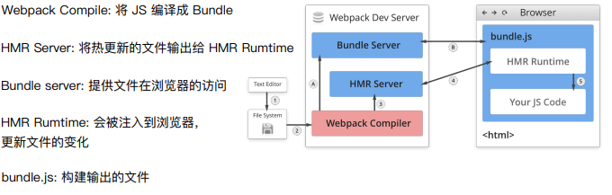

# 谈谈对webpack的看法

webpack是一个静态模块打包工具。使用他管理项目中的模块依赖，并编译输出模块所需要的静态文件

对不同类型的依赖，webpack有很多模块加载器，能分析模块之间的依赖，类型之间的转换，最后合并生成优化后的静态资源，静态资源就是项目中所需要的每一个模块组合成一个或多个bundles。

# bundle，chunk，module是什么

bundle：webpack打包出来的文件

chunk：代码块，一个chunk由多个模块组合而成

module：开发中的单个模块

webpack中，一切都是模块，一个模块对应一个文件，webpack从配置的entry中递归开始查找所有模块

# Webpack的基本功能有哪些

（一）

代码压缩： css兼容性处理，压缩css，js语法检查，js兼容性处理，js压缩，html压缩

优化代码：HMR  、source-map、  oneOf  、缓存 、 tree shaking 、 lazy loading  、pwa、多进程打包、externals、dll、speed-measure

多页面打包 代码分割  eslint  优化构建命令

代码热更新

（二）

**代码转换：**ts转js，scss编译成css，es6+转换为es5等

**文件优化：**压缩js，css，html，压缩合并图片

**代码分割：**提取多个页面的公共代码，提取首屏不需要执行部分的代码让其异步加载

**模块合并：**再采用模块化的项目中有很多模块和文件，需要构建功能把模块分类合并成一个文件

**自动刷新：**监听本地源代码的变化，自动构建，刷新浏览器（<u>流程</u>）

**代码校验：**提交到仓库前检测代码是否符合规范

**自动发布：**更新完代码后，自动构建出线上发布代码并传输给发布系统

# 如何监听源码变化--->自动构建------>刷新浏览器的

（一）

再项目中使用webpack-dev-server启动项目

https://baijiahao.baidu.com/s?id=1694983941359355818&wfr=spider&for=pc

# webpack构建过程

（一）

找entry，解析文件中的模块

通过loader加载器处理，

通过各种插件处理

输出到output文件里面

（二）

从entry里配置的文件开始递归解析该文件依赖的所有模块

每找一个模块，就会根据配置的loader去找对应的转换规则

对通过转换后的模块，再解析这个模块所依赖的其他模块

这些模块以entry为单位分组，一个entry和其他所有依赖的模块被分到一个组Chunk

最后webpack会把所有chunk转换成文件输出，在整个流程中Webpack会在恰当的时机（这里的是事件监听）执行plugin里定义的逻辑

# 有哪些常见的loader

- file-loader: 把文件输出到一个文件夹中，在代码中通过相对URL去引用输出的文件（处理图片和字体）
- url-loader：功能和file-loader类似，区别是用户可以设置一个阈值，大于阈值会交给url-loader处理，小于阈值时返回文件base64形式编码（处理图片和字体）
- css-loader：用于加载.css，支持模块化、压缩、文件导入，=
- style-loader：将样式通过style标签插入到head中
- less-loader：将less文件转换为css文件
- babel-loader：解析ES6，需要配置文件.babelrc
- ts-loader：将ts转为js
- eslint-loader：通过eslint检查js代码
- vue-loader：加载Vue单文件组件

# 有哪些常见的Plugin

| 名称                     | 描述                                    |
| ------------------------ | --------------------------------------- |
| commonsChunkPlugin       | 将chunk相同的模块提取成公共js           |
| CleanWebpackPlugin       | 在构建前清理构建目录                    |
| ExtractTextWebpackPlugin | 将css从bundle文件里提取成一个单独的文件 |
| HtmlwebpackPlugin        | 创建html文件去承载输出的bundle          |
| UglifyjsWebpackPlugin    | 压缩JS                                  |
| copyWebpackPlugin        | 拷贝文件                                |
| webpack-bundle-analyzer  | 可视化webpack输出文件的体积             |

# Loader和Plugin的区别

Loader 本质就是一个函数，在该函数中对接收到的内容进行转换，返回转换后的结果。 因为 Webpack 只认识 JavaScript，所以 Loader 就成了翻译官，对其他类型的资源进行转译的预处理工作。

Plugin 就是插件，基于事件流框架 Tapable，插件可以扩展 Webpack 的功能，在 Webpack 运行的生命周期中会广播出许多事件，Plugin 可以监听这些事件，在合适的时机通过 Webpack 提供的 API 改变输出结果。

Loader 在 module.rules 中配置，作为模块的解析规则，类型为数组。每一项都是一个 Object，内部包含了 test(类型文件)、loader、options (参数)等属性。

Plugin 在 plugins 中单独配置，类型为数组，每一项是一个 Plugin 的实例，参数都通过构造函数传入。

# Webpack热更新原理

## 文件监听的原理分析

轮询判断文件的最后编辑时间是否变化

某个文件发生了变化，并不会立刻告诉监听者，而是先缓存起来，等aggregateTimeout

```js
module.export = {
	watch: true // 是否开启监听文件变化
    // 只有开启监听模式，watchOption才有意义
	watchcOptions: {
    	// 默认为空，不见他的文件或者文件夹，支持正则匹配
    	ignored:/node_modules/,
    	// 监听到变化后会等300ms再去执行，默认300ms
    	aggregateTimeout: 300,
    	// 判断文件是否变化是通过不停询问系统指定文件有没有变化实现的，默认每秒询问1000次
    	poll:1000
	}
}
```

## 热更新

热更新 webpack-dev-server

wds不刷新浏览器，不输出文件，而是放在内存中，使用的是HotModuleReplacementPlugin插件

### 模块热替换(hot module replacement)是如何运行的

（一）

热更新又称热替换，基于 webpack-dev-server。

1. webpack 对文件系统进行 **watch 打包**到内存中 
2. devServer 通知浏览器端文件发生改变，在这一阶段，sockjs 是服务端和浏览器端之间的桥梁，在**启动 devServer 的时候**，sockjs 在服务端和浏览器端建立了一个 **webSocket 长连接**，以便将 webpack 编译和打包的各个阶段状态告知浏览器 
3. webpack-dev-server/client 接收到服务端消息做出响应 
4. webpack 接收到**最新 hash 值**验证并请求模块代码 
5. HotModuleReplacement.runtime 对模块进行热更新 
6. 调用 accept 方法，及时将新后的内容插入到页面中

（二）

1. 每当文件发生变更时，`webpack` 将会重新编译，`webpack-dev-server` 将会监控到此时文件变更事件，

并找到对应的module。这里使用的是[chokidar](https://github.com/paulmillr/chokidar)监控文件变更

2. `webpack-dev-server` 将会把变更模块通知到浏览器端，此时使用 `websocket` 与浏览器进行交流。此时使用的是 [ws](https://github.com/websockets/ws)

3. 浏览器根据 `websocket` 接收到 hash，并通过 hash 以 **JSONP 的方式请求更新**模块的 chunk

4. **浏览器加载 chunk**，并使用新的模块对旧模块进行热替换，并删除其缓存


在 webpack 的运行时中 `__webpack__modules__` 用以维护所有的模块。

而热模块替换的原理，即通过 `chunk` 的方式加载最新的 `modules`，找到 `__webpack__modules__` 中对应的模块逐一替换，并删除其上下缓存。

其精简数据结构用以下代码表示:

```js
// webpack 运行时代码
const __webpack_modules = [
  (module, exports, __webpack_require__) => {
    __webpack_require__(0);
  },
  () => {
    console.log("这是一号模块");
  },
];

// HMR Chunk 代码
// JSONP 异步加载的所需要更新的 modules，并在 __webpack_modules__ 中进行替换
self["webpackHotUpdate"](0, {
  1: () => {
    console.log("这是最新的一号模块");
  },
});
```

（三）

HMR的核心就是客户端从服务端拉去更新后的文件，准确地说是 chunk diff (chunk 需要更新的部分)

实际上 WDS 与浏览器之间维护了一个 Websocket，当**本地资源发生变化时**，WDS 会向浏览器推送更新，并带上构建时的 hash，让客户端与上一次资源进行对比。

客户端对比出差异后会向 WDS 发起 Ajax 请求来获取更改内容(文件列表、hash)，这样客户端就可以再借助这些信息继续向 WDS 发起 jsonp 请求获取该chunk的增量更新。

后续的部分(拿到增量更新之后如何处理？哪些状态该保留？哪些又需要更新？)由 HotModulePlugin 来完成，提供了相关 API 以供开发者针对自身场景进行处理，像react-hot-loader 和 vue-loader 都是借助这些 API 实现 HMR。

（四）

 

### 模块热替换

在应用程序运行过程中，替换，添加，删除模块，而无需加载整个页面

- 保留在完全重新加载期间丢失的应用程序状态
- 只更新变更内容，节省时间
- 在源代码中css/js产生修改时，会立刻在浏览器中进行更新

#### 如何运行的

**在compiler中，**

除了普通资源，compiler 需要发出 "update"，将之前的版本更新到新的版本。"update" 由两部分组成：

1. 更新后的 [manifest](https://webpack.docschina.org/concepts/manifest) (JSON)
2. 一个或多个 updated chunk (JavaScript)

manifest 包括新的 compilation hash 和所有的 updated chunk 列表。每个 chunk 都包含着全部更新模块的最新代码（或一个 flag 用于表明此模块需要被移除）。

compiler 会确保在这些构建之间的模块 ID 和 chunk ID 保持一致。通常将这些 ID 存储在内存中（例如，使用 [webpack-dev-server](https://webpack.docschina.org/configuration/dev-server/) 时），但是也可能会将它们存储在一个 JSON 文件中

# 如何优化构建速度

1. 使用高版本的webpack和nodejs

2. 压缩代码
   1）通过uglifyjs-webpack-plugin压缩js代码
   2）通过 mini-css-extract-plugin 提取 chunk 中的 CSS 代码到单独文件，通过 css-loader 的 minimize 选项开启 cssnano 压缩 CSS。

3. 多线程/多进程构建：thread-loader, HappyPack

4. 压缩图片: image-webpack-loader

5. 缩小打包作用域
   exclude/include(确定loader规范范围)；
   resolve.modules指明第三方模块的绝对路径（减少不必要的查找）；
   resolve.mainFields只采用main字段作为入口文件描述字段(减少搜索步骤，需要考虑到所有运行时依赖的第三方模块的入口文件描述字段)；
   合理使用alias；

6. 提取页面公共资源，基础包分离
   1）使用html-webpack-externals-plugin，将基础包通过 CDN 引入，不打入 bundle 中。
   2）使用 SplitChunksPlugin 进行(公共脚本、基础包、页面公共文件)分离(Webpack4内置) ，替代了 CommonsChunkPlugin 插件

7. 充分利用缓存提升二次构建速度：
   babel-loader 开启缓存
   terser-webpack-plugin 开启缓存
   使用 cache-loader 或者hard-source-webpack-plugin

8. Tree shaking

   打包过程中检测工程中没有引用过的模块并进行标记，在资源压缩时将它们从最终的bundle中去掉(只能对ES6 Modlue生效) 开发中尽可能使用ES6 Module的模块，提高tree shaking效率

   禁用 babel-loader 的模块依赖解析，否则 Webpack 接收到的就都是转换过的 CommonJS 形式的模块，无法进行 tree-shaking

   使用 PurifyCSS(不在维护) 或者 uncss 去除无用 CSS 代码

   purgecss-webpack-plugin 和 mini-css-extract-plugin配合使用(建议)

9. Scope hoisting
   构建后的代码会存在大量闭包，造成体积增大，运行代码时创建的函数作用域变多，内存开销变大。Scope hoisting 将所有模块的代码按照引用顺序放在一个函数作用域里，然后适当地重命名一些变量以防止变量名冲突。

# 优化前端性能

使用cdn加速

在构建过程中，将引用的**静态资源路径**修改为**CDN上对应的路径**。可以利用webpack对于**output参数**和**各loader的publicPath参数**来修改资源路径

将代码中永远不会走到的片段删除掉。可以通过在启动webpack时追加参数**--optimize-minimize**来实现

提取公共代码


# 说以下webpack的依赖图

当一个文件依赖另一个文件时，webpack 都会将文件视为直接存在 *依赖关系*。这使得 webpack 可以获取非代码资源，如 images 或 web 字体等。并会把它们作为 *依赖* 提供给应用程序。

当 webpack 处理应用程序时，它会根据命令行参数中或配置文件中定义的模块列表开始处理。 从 [*入口*](https://webpack.docschina.org/concepts/entry-points/) 开始，webpack 会递归的构建一个 *依赖关系图*，这个依赖图包含着应用程序中所需的每个模块，然后将所有模块打包为少量的 *bundle* —— 通常只有一个 —— 可由浏览器加载


